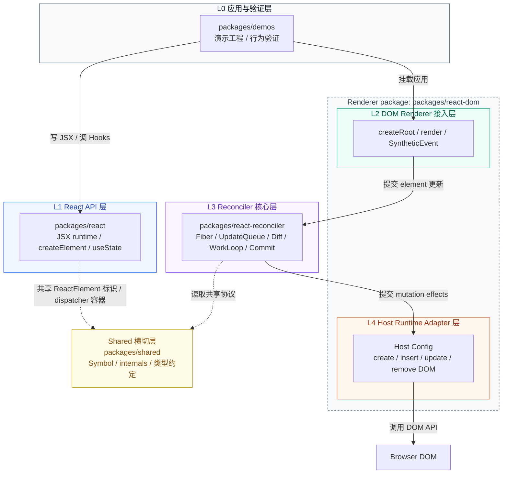
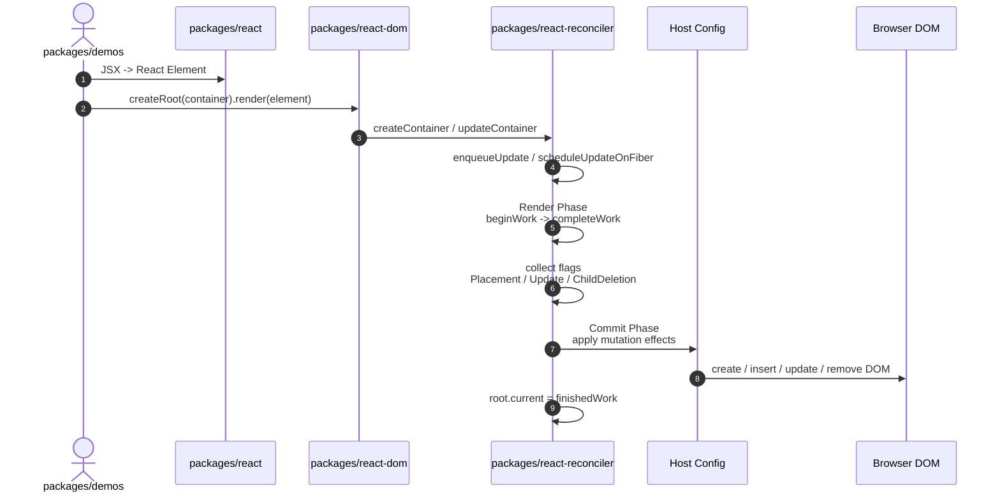

# big-react 技术架构说明

## 文档定位

本文档说明 `big-react` 的架构边界、包职责、核心数据流与当前实现状态，用于：

- 新成员快速理解项目如何从 JSX 渲染到 DOM。
- 功能开发前判断改动应落在哪一层。
- 排查渲染、更新、事件、Hooks 等问题时建立阅读顺序。

协作规范、目录约定与提交要求维护在 `AGENTS.md`；功能规格维护在 `.ai/specs/`。

## 分层结论

`big-react` 的架构可以看成一条自上而下的渲染流水线：

| 层级 | 名称 | 对应包 / 模块 | 这一层回答的问题 |
|------|------|----------------|------------------|
| L0 | 应用与验证层 | `packages/demos` | 应用如何使用 React 能力？ |
| L1 | React API 层 | `packages/react` | 开发者写的 JSX、Hooks 如何变成内部描述？ |
| L2 | DOM Renderer 接入层 | `packages/react-dom` | 浏览器环境如何发起一次渲染？ |
| L3 | Reconciler 核心层 | `packages/react-reconciler` | 如何计算新旧 UI 的差异，并组织更新？ |
| L4 | Host Runtime Adapter 层 | `packages/react-dom` | 如何把提交结果落到真实 DOM？ |
| Shared | 横切共享层 | `packages/shared` | 多个包之间共享哪些内部协议？ |

核心分层原则是：**上层描述意图，下层执行细节；React API 不关心 DOM，Reconciler 不直接散落 DOM 操作，DOM Renderer 负责把通用协调结果接到浏览器。**

## 架构总览

`big-react` 以 pnpm workspace 拆分 React 的最小核心链路：应用示例使用 `react` 创建 Element，通过 `react-dom` 发起渲染，由 `react-reconciler` 构建 Fiber 树并在提交阶段调用宿主能力，最终修改浏览器 DOM。



读图方式：

1. 主链路是 `L0 -> L1/L2 -> L3 -> L4 -> Browser DOM`。
2. `packages/react` 负责把开发者代码变成内部描述，不负责 DOM。
3. `packages/react-dom` 同时包含 L2 和 L4：L2 暴露渲染入口，L4 提供 DOM 宿主适配。
4. `packages/react-reconciler` 是核心计算层，负责 Fiber、更新队列、Diff、提交编排。
5. Host Config 属于 `react-dom` 的宿主适配职责，把 reconciler 的提交意图翻译成 DOM 操作。
6. `packages/shared` 是横切协议层，只放共享约定，不承载渲染主流程。

### 当前实现口径

- 渲染入口：`packages/react-dom/src/root.js` 的 `createRoot(container).render(element)`。
- 协调入口：`packages/react-reconciler/src/fiberReconciler.js` 的 `updateContainer`。
- 工作循环：`packages/react-reconciler/src/workLoop.js`，当前为同步调度。
- Render Phase：`beginWork -> completeWork`，生成或复用 Fiber，并收集副作用标记。
- Commit Phase：`commitMutationEffects`，处理 `Placement`、`Update`、`ChildDeletion` 等 mutation。
- 宿主操作：DOM Host Config 属于 `packages/react-dom` 的 renderer 职责，负责把提交阶段的宿主操作落到浏览器 DOM。
- 事件系统：`packages/react-dom/src/SyntheticEvent.js`，当前支持 `click` 的捕获与冒泡回调。

## 分层设计

### L0 应用与验证层

对应目录：`packages/demos`

职责：

- 提供本地演示工程与行为回归入口。
- 以真实 JSX、组件和交互驱动核心包联调。

不承担：

- Fiber、调度、Diff、DOM mutation 细节。

### L1 React API 层

对应目录：`packages/react`

职责：

- 暴露 `createElement`、`useState` 等开发者 API。
- 提供 `jsx-runtime`，生成 React Element。
- 通过 `currentDispatcher` 将 Hooks 调用转发给当前 reconciler dispatcher。

关键文件：

- `packages/react/src/jsx.js`
- `packages/react/src/currentDispatcher.js`
- `packages/react/index.js`
- `packages/react/jsx-runtime.js`

不承担：

- DOM 节点创建与插入。
- Fiber 树遍历与调度主流程。

### L2 DOM Renderer 接入层

对应目录：`packages/react-dom`

职责：

- 提供浏览器渲染入口 `createRoot`。
- 创建 FiberRoot，并把应用传入的 Element 更新提交给 reconciler。
- 初始化当前支持的合成事件委托。

关键文件：

- `packages/react-dom/src/root.js`
- `packages/react-dom/src/SyntheticEvent.js`

不承担：

- Fiber 内部结构的构建策略。
- 通用 Diff 与 commit 遍历算法。

### L3 Reconciler 核心层

对应目录：`packages/react-reconciler`

职责：

- 定义 Fiber、FiberRoot、WorkTag、Flags 等核心结构。
- 维护更新队列并调度根节点同步工作。
- 在 Render Phase 中执行组件、协调子节点、创建/复用 Fiber。
- 在 Commit Phase 中遍历副作用并调用 Host Config。
- 实现函数组件和最小 Hooks 更新链路。

关键文件：

- `packages/react-reconciler/src/fiber.js`
- `packages/react-reconciler/src/fiberReconciler.js`
- `packages/react-reconciler/src/workLoop.js`
- `packages/react-reconciler/src/beginWork.js`
- `packages/react-reconciler/src/completeWork.js`
- `packages/react-reconciler/src/childFiber.js`
- `packages/react-reconciler/src/commitWork.js`
- `packages/react-reconciler/src/fiberHook.js`

不承担：

- 浏览器 DOM API 的直接业务封装。
- 应用层状态语义。

### L4 Host Runtime Adapter 层

对应包：`packages/react-dom`

职责：

- 把 reconciler 的宿主操作请求映射为 DOM API。
- 创建元素和文本节点。
- 插入、删除、更新 DOM 节点。
- 将事件 props 写入 DOM 节点上的内部属性，供合成事件系统读取。

主要接口：

- `createInstance`
- `createTextInstance`
- `appendInitialChild`
- `appendChildToContainer`
- `insertChildToContainer`
- `removeChild`
- `commitUpdate`
- `commitTextUpdate`

说明：L2 与 L4 同属 `react-dom` 这个 renderer 包。二者职责不同：L2 面向应用暴露渲染入口，L4 面向 reconciler 提供宿主环境能力。

### Shared 横切层

对应目录：`packages/shared`

职责：

- 存放跨包共享的 Symbol、内部共享对象与类型约定。
- 支撑 `react` 与 `react-reconciler` 在不直接耦合实现细节的情况下共享协议。

不承担：

- 任一业务主流程。
- 调度、渲染、事件、DOM 操作实现。

## 依赖约束

- 应用入口依赖 `react` 和 `react-dom`。
- `react-dom` 依赖 `react-reconciler` 发起更新。
- `react-reconciler` 可依赖 `shared` 与 renderer 提供的 Host Config。
- `react` 可依赖 `shared`，并通过 internals 暴露 dispatcher 容器。
- `shared` 不应反向依赖任何业务包。
- Reconciler 不应散落浏览器 DOM API；DOM 操作应集中在 Host Config。

## 为什么这样分层

这套分层的核心价值是把“开发者 API、渲染入口、协调算法、宿主环境”拆开，让每类变化只影响它真正应该影响的地方。

| 分层原因 | 带来的好处 | 具体体现 |
|----------|------------|----------|
| API 与运行时分离 | `react` 可以保持轻量，只表达 Element 与 Hooks 门面 | `useState` 在 `react` 暴露，实际 mount/update dispatcher 在 `react-reconciler` |
| Renderer 与 Reconciler 分离 | 同一套协调算法理论上可接不同宿主环境 | `react-dom` 提供浏览器入口与 DOM Host Config，Fiber/Diff/Commit 主流程在 `react-reconciler` |
| Reconciler 与 DOM 操作分离 | 核心算法不被浏览器 API 污染，后续更容易迁移或测试 | `commitWork` 调 Host Config，而不是到处直接 `document.createElement` |
| Render Phase 与 Commit Phase 分离 | 先计算变化，再统一提交，便于后续扩展调度与副作用控制 | `beginWork/completeWork` 标记 flags，`commitMutationEffects` 统一处理 |
| Shared 单独收口 | 跨包协议有固定位置，减少重复定义和隐式耦合 | `ReactSymbols`、`internals.currentDispatcher` 放在 `packages/shared` |
| Demos 独立 | 用真实应用方式验证核心包，避免核心实现混入演示逻辑 | `packages/demos` 只消费 `react` / `react-dom` |

### 对开发的直接帮助

- 改 JSX 或新增 React API：优先看 L1，再看 L3 是否需要运行时支持。
- 改渲染入口或事件：优先看 L2 和 L4。
- 改 Diff、更新队列、Hooks 执行、调度：优先看 L3。
- 改 DOM 创建、插入、删除、属性更新：优先看 L4。
- 写验证场景：放在 L0，不把调试代码塞回核心包。

### 对演进的帮助

- 后续做可中断调度，主要演进 L3，外部 `createRoot(...).render(...)` 可以保持稳定。
- 后续补 DOM 属性 diff，主要演进 L4 和 Commit 的连接点，不需要改 JSX API。
- 后续扩展事件系统，主要演进 L2/L4，不需要改 Fiber 树结构。
- 后续支持更多 Hooks，主要演进 L1 API 暴露和 L3 Hooks 运行时。

## 一次更新的运行链路



### Render Phase

Render Phase 负责“算出下一棵树”和“标记需要提交的变化”：

1. `updateContainer` 将 Element 包装为 Update，放入 HostRoot 的更新队列。
2. `scheduleUpdateOnFiber` 从触发更新的 Fiber 向上找到 FiberRoot。
3. `performSyncWorkOnRoot` 创建 workInProgress 树。
4. `beginWork` 根据 Fiber tag 处理 HostRoot、HostComponent、FunctionComponent、HostText。
5. `reconcileChildFibers` 对比旧 Fiber 与新 children，复用、创建或删除 Fiber。
6. `completeWork` 创建宿主实例、冒泡 flags，并在文本变化时标记 `Update`。

### Commit Phase

Commit Phase 负责“把变化落到宿主环境”：

1. `commitRoot` 判断根节点或子树是否存在 mutation flags。
2. `commitMutationEffects` 深度遍历带副作用的 Fiber。
3. `Placement`：找到宿主父节点和稳定兄弟节点，插入或追加 DOM。
4. `ChildDeletion`：遍历待删子树，找到首个宿主节点并从父节点移除。
5. `Update`：对 HostText 更新文本；对 HostComponent 更新事件 props。
6. 提交完成后切换 `root.current`。

## 核心数据结构

### React Element

由 `packages/react/src/jsx.js` 创建，是应用描述 UI 的不可变输入。关键字段包括：

- `$$typeof`：标识 React Element。
- `type`：宿主标签名或函数组件。
- `key` / `ref`：用于身份与引用。
- `props`：组件或宿主节点属性。

### FiberNode

Fiber 是 reconciler 的工作单元和运行时树节点。它承载：

- 节点身份：`tag`、`type`、`key`、`stateNode`。
- 树结构：`return`、`child`、`sibling`。
- 双缓存：`alternate`。
- 输入与结果：`pendingProps`、`memoizedProps`、`memoizedState`。
- 更新与副作用：`updateQueue`、`flags`、`subtreeFlags`、`deletions`。

### FiberRootNode

FiberRoot 代表一个渲染根，连接容器 DOM 与 HostRoot Fiber。它保存：

- `container`：宿主容器。
- `current`：当前已提交 Fiber 树。
- `finishedWork`：Render Phase 完成后等待提交的树。

### UpdateQueue

更新队列用于把 `render(element)` 或 `setState(action)` 变成可处理的更新单元。当前实现支持：

- HostRoot 的 Element 更新。
- Hooks 中 `useState` 的 action 更新。
- 在 render 阶段通过 `processUpdateQueue` 计算新状态。

### Hooks 链表

函数组件通过 `fiberHook.js` 管理 Hooks：

- mount 阶段创建 Hook 链表并绑定 dispatch。
- update 阶段复用旧 Hook 的状态和队列。
- `dispatchSetState` 入队更新并调度所属 Fiber。

## 包级职责速查

| 包 | 定位 | 主要入口 | 适合放置的改动 |
|----|------|----------|----------------|
| `packages/react` | API 与 Element 模型 | `index.js`、`jsx-runtime.js` | JSX、Element、Hooks 门面、dispatcher 共享 |
| `packages/react-dom` | DOM renderer | `src/root.js`、`src/SyntheticEvent.js`、Host Config | 渲染入口、事件系统、DOM 宿主适配 |
| `packages/react-reconciler` | 协调核心 | `src/workLoop.js`、`src/childFiber.js`、`src/commitWork.js` | Fiber、Diff、Flags、调度、commit、Hooks 执行 |
| `packages/shared` | 跨包协议 | `ReactSymbols.js`、`internals.js` | Symbol、内部共享对象、轻量类型约定 |
| `packages/demos` | 演示验证 | `src/main.jsx`、`src/App.jsx` | 行为样例、调试场景、回归入口 |

## 典型改动落点

### 新增或调整 React API

优先阅读：

1. `packages/react/index.js`
2. `packages/react/src/currentDispatcher.js`
3. `packages/react-reconciler/src/fiberHook.js`

原则：API 门面只负责暴露与转发，真正的运行时语义放在 reconciler。

### 调整子节点 Diff

优先阅读：

1. `packages/react-reconciler/src/beginWork.js`
2. `packages/react-reconciler/src/childFiber.js`
3. `packages/react-reconciler/src/fiberFlags.js`
4. `packages/react-reconciler/src/commitWork.js`

原则：Render Phase 只标记意图，DOM mutation 仍放到 Commit Phase。

### 调整 DOM 属性或事件

优先阅读：

1. `packages/react-dom` 中的 Host Config / DOM 操作模块
2. `packages/react-dom/src/SyntheticEvent.js`
3. `packages/react-reconciler/src/commitWork.js`

原则：DOM API 和事件属性存储集中在 Host Config / react-dom，不向 reconciler 主流程扩散。

### 调整调度模型

优先阅读：

1. `packages/react-reconciler/src/workLoop.js`
2. `packages/react-reconciler/src/fiberReconciler.js`
3. `packages/react-reconciler/src/updateQueue.js`

原则：外部入口保持 `createRoot(...).render(...)` 与 `setState(...)` 语义稳定，调度策略在 reconciler 内演进。

## 当前能力与限制

已具备：

- JSX automatic runtime 接入。
- HostRoot、HostComponent、HostText、FunctionComponent 基础渲染。
- 最小 `useState` mount/update 链路。
- 基于 key/index 的数组 children 协调雏形。
- Placement、文本 Update、ChildDeletion 的提交路径。
- click 合成事件的捕获与冒泡路径。

仍需演进：

- 调度仍为同步工作循环，尚未支持时间切片或可中断渲染。
- HostComponent 属性更新目前主要覆盖事件 props，普通 DOM 属性 diff 还需补齐。
- 文本与 children 的边界场景需要更多回归样例。
- 删除与移动路径已有基础实现，但仍需要系统测试覆盖。
- Host Config 应保持在 renderer 边界内，避免 DOM 细节扩散到 `react` 或 reconciler 主流程。
- 代码中仍存在调试日志，可随里程碑收敛。

## 工程与验证

常用命令：

```bash
pnpm install
pnpm lint
pnpm build:dev
```

演示工程：

```bash
cd packages/demos
pnpm dev
```

建议验证顺序：

1. 修改核心逻辑后运行 `pnpm lint`。
2. 涉及打包产物时运行 `pnpm build:dev`。
3. 涉及用户可见行为时启动 `packages/demos` 手动验证。
4. 对全局性发现与跨模块约束，同步更新 `AGENTS.md` 或对应 `.ai/specs/` 文档。

## 演进路线

短期优先级：

- 补齐 HostComponent 普通属性更新与属性删除。
- 为数组 Diff、删除、移动、文本更新增加 demo 或测试样例。
- 收敛核心流程中的调试日志。
- 持续收敛 Host Config 边界，确保 DOM 宿主适配稳定归属 `react-dom`。

中期方向：

- 引入更完整的调度模型，为可中断渲染预留结构。
- 扩展 Hooks 能力，例如 `useEffect`、`useReducer`。
- 将事件系统从单一 `click` 扩展为可配置事件表。
- 建立最小测试基建，覆盖 render/commit/Hooks/事件主链路。
