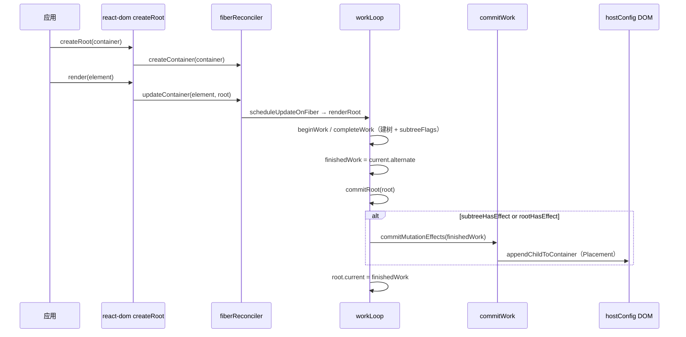

# Spec: Commit 阶段与 react-dom Host Config（big-react L3/L4 第六课）
type: utility

> **对齐参考**：[BetaSu/big-react@467bb071](https://github.com/BetaSu/big-react/commit/467bb0713e0feb450fdfad87dcbf4623267224f8)（`feat: 第六课`，2022-11-25）。本 spec 以该 commit 的实现语义为准，并补充与当前 JS 代码库的演进差异说明。
>
> **前置依赖**：[`mount-phase.md`](./mount-phase.md)（第五课：`beginWork` / `completeWork` Mount 建树、`subtreeFlags`、`renderRoot` 末尾 `finishedWork` + `commitRoot` 调用）。第四课 FiberRoot / UpdateQueue 见 [`fiber-root-update.md`](./fiber-root-update.md)。
>
> **后续依赖**：`Update` / `ChildDeletion` 的 commit 分支、props diff、`createInstance(type, props)`、FunctionComponent、Lane 调度细化、Effect 等在后续课程 commit 中补齐。

## 1. 需求定义

### 1.1 背景与目标

- **解决什么问题**：第五课在 Render Phase 用 reconciler 内 **stub `hostConfig`** 组装「假 DOM」，且 `commitRoot` 仅被调用、无实现，浏览器看不到真实 UI。本课将 **Host Config 迁至 `react-dom`**，实现 **Commit Mutation 子阶段的最小 Placement 路径**，并通过 `createRoot().render()` 对外暴露渲染入口。
- **使用方**：
  - 应用 / demos：`ReactDOM.createRoot(container).render(element)`
  - `packages/react-reconciler`：经 `hostConfig` 路径别名（或显式 import）调用 DOM API
- **本课目标（最小闭环）**：
  - 新建 `packages/react-dom` workspace 包：`createRoot`、`hostConfig` 真实 DOM 操作
  - 删除 `react-reconciler` 内 stub `hostConfig`，统一由 `react-dom/src/hostConfig` 提供能力
  - 新增 `commitWork`：`commitMutationEffects` + `Placement` 的 `commitPlacement`
  - 实现 `workLoop.commitRoot`：根据 `flags` / `subtreeFlags` 与 `MutationMask` 决定是否执行 mutation，并切换 `root.current`
  - `fiberFlags` 导出 `MutationMask`
  - `completeWork`：`createInstance` 暂不接 props；`appendAllChildren` 父节点类型为 `Container`
  - Rollup：`dev.config.js` 合并 react + react-dom 构建；`react-dom.config.js` 用 alias 将 `hostConfig` 指向 `react-dom/src/hostConfig`
  - `tsconfig` / ESLint：`hostConfig` 路径映射到 `react-dom`
- **明确不在本 spec 范围**：
  - `commitMutaitonEffectsOnFiber` 中 `Update` / `ChildDeletion` 分支（仅注释占位）
  - `beforeMutation` / `layout` 子阶段（`commitRoot` 内注释占位）
  - `createInstance` 的 props 处理（TODO）
  - HostComponent / HostText **Update** 的 completeWork 分支（第五课已留空，本课未补）
  - FunctionComponent、Hooks、Lane、异步调度
  - `react-dom/client` 分包导出（本课 UMD 产出 `index.js` + `client.js` 双文件，client 与 index 同源入口）

### 1.2 能力范围（Capability Scope）

- **提供的能力：**
  - [ ] `react-dom` 包：`createRoot(container)` → `{ render(element) }`
  - [ ] `hostConfig`（react-dom）：`Container` / `Instance` 类型；`createInstance`、`createTextInstance`、`appendInitialChild`、`appendChildToContainer`
  - [ ] `commitMutationEffects(finishedWork)`：基于 `subtreeFlags & MutationMask` 的 DFS 遍历
  - [ ] `commitPlacement`：`getHostParent` + `appendPlacementNodeIntoContainer`
  - [ ] `commitRoot`：`finishedWork` 判空、重置、`subtreeHasEffect || rootHasEffect` 时调用 mutation 并 `root.current = finishedWork`
  - [ ] reconciler 通过 `hostConfig` 别名解析到 react-dom（构建期）
  - [ ] `MutationMask = Placement | Update | ChildDeletion`
  - [ ] `pnpm build:dev` 产出 `dist/node_modules/react-dom/index.js`（及 client UMD）
- **明确不提供的能力：**
  - [ ] props 更新、文本更新、节点删除的 commit
  - [ ] 事件系统、`flushSync`、hydration
  - [ ] 生产环境 `__DEV__ === false` 的完整打包策略（本课 dev 默认真）

### 1.3 待确认项

| 问题 | 当前假设 | 优先级 |
|------|----------|--------|
| 语言 | 参考为 TS，本地为 JS（`.js` + JSDoc） | 已确认 |
| hostConfig 解析 | 参考：Rollup alias + tsconfig paths；本地：reconciler 直接 `import from 'react-dom/src/hostConfig.js'` | 语义等价 |
| `commitMutaitonEffectsOnFiber` 拼写 | 参考 commit 保留笔误 | 本地可对齐或修正拼写 |
| Placement 与 complete 阶段建树 | 第五课 complete 已 `appendAllChildren` 建子树；第六课 Placement 将 Host 节点挂到 container | 两阶段并存（课程渐进） |
| 自动化单测 | `getHostParent`、commitRoot 分支、hostConfig DOM | 已确认 |
| demos 验收 | `createRoot` + 简单 JSX 在浏览器可见 DOM | 推荐手工 |

---

## 2. 项目资产对齐（Project Asset Alignment）

### 2.1 复用性审查（Reusability Audit）

| 检查项 | 现有资产 | 状态 | 本次策略 |
|--------|----------|------|----------|
| Render + Mount | mount-phase.md | ✅ 复用 | 不改 Diff 核心，补 commit |
| fiberReconciler | 第四课 | ✅ 复用 | createContainer / updateContainer 由 react-dom 调用 |
| stub hostConfig | reconciler 内 | ❌ 删除 | 迁至 react-dom |
| commitRoot 钩子 | 第五课 renderRoot 末尾 | ✅ 实现 | 本课填充函数体 |
| commitWork | 无 | ❌ 新增 | Placement 最小集 |
| react-dom 包 | 无 / 仅后续规划 | ❌ 新增 | index + root + hostConfig |
| 参考实现 | BetaSu/big-react@467bb071 | ✅ 外部 | 逐文件对照 |
| 本地已扩展 | Lane、Update/Deletion commit、SyntheticEvent | ⚠️ 超范围 | 本 spec 描述第六课；本地保留扩展 |

### 2.2 规范对齐（Standard Compliance）

| 规范类别 | 项目规范要求 | 本次应用方式 |
|----------|--------------|--------------|
| **代码规范** | ESLint + Prettier | 改动文件必须通过 lint |
| **目录规范** | Host Config 属 L4 `react-dom` | `packages/react-dom/src/hostConfig` |
| **架构边界** | reconciler 不实现 DOM | 仅 import hostConfig 接口 |
| **ESM 导入** | 显式 `.js` 扩展名 | 本地 JS 遵循 |
| **依赖方向** | `react-dom` → `react-reconciler` → `shared`；`react` 为 peer | 对齐参考 package.json |
| **循环依赖** | workspace 允许 reconciler ↔ react-dom | 注意 import 方向：DOM 能力只在 react-dom |

---

## 3. API 设计（API Design）

### 3.1 `packages/react-dom` 对外 API

#### 3.1.1 `createRoot(container)`

```javascript
import { createContainer, updateContainer } from 'react-reconciler/src/fiberReconciler';
import { Container } from './hostConfig.js';

export function createRoot(container) {
  const root = createContainer(container);
  return {
    render(element) {
      updateContainer(element, root);
    },
  };
}
```

| 参数 | 类型 | 说明 |
|------|------|------|
| `container` | `Container`（`Element`） | 挂载 DOM 容器 |
| 返回 | `{ render(element) }` | `element` 为 `ReactElement` |

| 行为 | 说明 |
|------|------|
| `createContainer` | 创建 `FiberRootNode`，绑定 container |
| `updateContainer` | 入队 HostRoot update 并触发 reconciler 调度 |

#### 3.1.2 包导出（index）

```javascript
import * as ReactDOM from './src/root.js';
export default ReactDOM;
// 或 named export createRoot，本地演进可对齐 demos
```

### 3.2 Host Config（packages/react-dom/src/hostConfig）

| 导出 | 签名（参考 commit） | 行为 |
|------|---------------------|------|
| `Container` | `Element` | 根容器类型 |
| `Instance` | `Element` | Host 组件 DOM 节点 |
| `createInstance` | `(type: string) => Instance` | `document.createElement(type)`，props TODO |
| `createTextInstance` | `(content: string) => Text` | `document.createTextNode(content)` |
| `appendInitialChild` | `(parent, child) => void` | `parent.appendChild(child)` |
| `appendChildToContainer` | 同 `appendInitialChild` | Placement 时挂到 container |

```javascript
export const appendChildToContainer = appendInitialChild;
```

> reconciler 的 `completeWork` 使用 `appendInitialChild` 在 Render 阶段组装子树；`commitPlacement` 使用 `appendChildToContainer` 将带 `Placement` 的 Host 节点挂到 **宿主父节点**（含 `FiberRoot.container`）。

### 3.3 `MutationMask`（fiberFlags）

```javascript
export const MutationMask = Placement | Update | ChildDeletion;
```

| 常量 | 本课 commit 值 | 用途 |
|------|----------------|------|
| `Placement` | `0b0000010` | commitPlacement |
| `Update` | `0b0000100` | 本课未处理 |
| `ChildDeletion` | `0b0001000` | 本课未处理 |
| `MutationMask` | 三者按位或 | `commitRoot` / `commitMutationEffects` 判断 |

### 3.4 `commitRoot(root)`（workLoop）

```javascript
function commitRoot(root) {
  const finishedWork = root.finishedWork;
  if (finishedWork === null) return;

  if (__DEV__) console.warn('commit阶段开始', finishedWork);

  root.finishedWork = null;

  const subtreeHasEffect =
    (finishedWork.subtreeFlags & MutationMask) !== NoFlags;
  const rootHasEffect = (finishedWork.flags & MutationMask) !== NoFlags;

  if (subtreeHasEffect || rootHasEffect) {
    // beforeMutation（占位）
    commitMutationEffects(finishedWork);
    root.current = finishedWork;
    // layout（占位）
  } else {
    root.current = finishedWork;
  }
}
```

| 步骤 | 说明 |
|------|------|
| 1 | 读取第五课设置的 `finishedWork`（一般为 `root.current.alternate`） |
| 2 | 无 finishedWork 则直接返回 |
| 3 | 清空 `root.finishedWork` |
| 4 | 检查 finishedWork 自身或子树的 mutation flags |
| 5 | 有副作用则 `commitMutationEffects`，然后 `root.current = finishedWork`（切换已提交树） |
| 6 | 无副作用仍切换 `current`，避免双缓冲指针落后 |

### 3.5 `commitMutationEffects`（commitWork）

#### 3.5.1 遍历算法

```
nextEffect = finishedWork
while nextEffect !== null:
  if (nextEffect.subtreeFlags & MutationMask) !== NoFlags && nextEffect.child !== null:
    nextEffect = nextEffect.child          // 向下
  else:
    loop:                                   // 向上 + 兄弟
      commitMutationEffectsOnFiber(nextEffect)
      if nextEffect.sibling !== null:
        nextEffect = nextEffect.sibling
        break
      nextEffect = nextEffect.return
```

与 React 官方 **depth-first effect list** 思路一致：有 mutation 子树则先深入，否则在当前节点执行 effect 再扫兄弟/父。

#### 3.5.2 `commitMutationEffectsOnFiber`

| flags | 行为 |
|-------|------|
| `Placement` | `commitPlacement` → 清除 `Placement` 位 |
| `Update` | 注释占位 |
| `ChildDeletion` | 注释占位 |

#### 3.5.3 `getHostParent(fiber)`

沿 `return` 向上查找：

| `parent.tag` | 返回 |
|--------------|------|
| `HostComponent` | `parent.stateNode`（DOM 元素） |
| `HostRoot` | `(parent.stateNode as FiberRootNode).container` |
| 其他 | 继续向上 |
| 未找到 | `null`（DEV warn） |

#### 3.5.4 `appendPlacementNodeIntoContainer(finishedWork, hostParent)`

| `finishedWork.tag` | 行为 |
|--------------------|------|
| `HostComponent` / `HostText` | `appendChildToContainer(hostParent, stateNode)` |
| 其他 | 递归 `child` 及 `sibling` 链上的 Host 节点 |

> 用于 Placement flag 落在 **非 Host 父 fiber**（如 Fragment 占位、或仅子树 Host 需挂接）时，向下收集 Host DOM。

### 3.6 `completeWork` 本课增量

| 变更 | 说明 |
|------|------|
| `createInstance(wip.type)` | 去掉 `newProps` 参数（与 hostConfig 签名一致） |
| `appendAllChildren(parent, wip)` | `parent` 类型由 `FiberNode` 改为 `Container`（DOM 元素） |

Render 阶段仍在 HostComponent mount 分支创建 DOM 并 `appendAllChildren`；Commit 阶段对带 `Placement` 的节点再执行一次挂接逻辑（第五课 Update 路径已打 Placement）。

### 3.7 端到端数据流



### 3.8 错误契约

| 场景 | 行为 | 调用方处理 |
|------|------|------------|
| `finishedWork === null` | `commitRoot` 直接 return | 正常无更新 |
| `getHostParent` 失败 | `commitPlacement` 不 append | 检查 Fiber 树 return 链 |
| `container` 非 Element | `createElement` / `appendChild` 可能抛错 | 传入合法 DOM 节点 |
| reconciler 无 hostConfig | 构建/运行 import 失败 | 配置 alias 或显式路径 |

---

## 4. 使用示例（Usage Examples）

### 4.1 最小挂载

```javascript
import { createRoot } from 'react-dom';
import { jsxDEV } from 'react/jsx-dev-runtime';

const root = createRoot(document.getElementById('root'));
root.render(jsxDEV('div', { children: 'hello' }, undefined, false, undefined, undefined));
// 预期：container 内出现 <div>hello</div>
```

### 4.2 hostConfig 直接创建节点

```javascript
import { createInstance, appendInitialChild } from 'react-dom/src/hostConfig.js';

const parent = createInstance('div');
const text = createTextInstance('hi');
appendInitialChild(parent, text);
```

### 4.3 DEV 日志观察 commit

`__DEV__ === true` 时：

- `commitRoot`：`commit阶段开始`
- `commitPlacement`：`执行Placement操作`

---

## 5. 技术方案（Technical Design）

### 5.1 交付物清单（文件级，对齐 467bb071）

| # | 文件 | 改动摘要 |
|---|------|----------|
| D1 | `packages/react-dom/package.json` | 新建；依赖 shared、react-reconciler；peer react |
| D2 | `packages/react-dom/index.js` | 导出 ReactDOM / createRoot |
| D3 | `packages/react-dom/src/root.js` | createRoot + render |
| D4 | `packages/react-dom/src/hostConfig.js` | 真实 DOM API |
| D5 | `packages/react-reconciler/src/commitWork.js` | commitMutationEffects + Placement |
| D6 | `packages/react-reconciler/src/workLoop.js` | commitRoot 实现 |
| D7 | `packages/react-reconciler/src/fiberFlags.js` | +MutationMask |
| D8 | `packages/react-reconciler/src/completeWork.js` | createInstance 签名、Container 类型 |
| D9 | `packages/react-reconciler/src/hostConfig.js` | **删除** stub |
| D10 | `scripts/rollup/dev.config.js` | 合并 react + react-dom 配置 |
| D11 | `scripts/rollup/react-dom.config.js` | UMD + hostConfig alias |
| D12 | `scripts/rollup/utils.js` | replace `preventAssignment: true` |
| D13 | 根 `package.json` | build:dev → dev.config.js；+@rollup/plugin-alias |
| D14 | `tsconfig.json` | paths：`hostConfig` → react-dom |
| D15 | `.eslintrc` | 放宽 unused-vars（课程调试） |

### 5.2 架构位置

```
demos / 应用
  createRoot(container).render(element)     ← L2 react-dom
       │
       ▼
  fiberReconciler.updateContainer           ← L3 reconciler
       │
       ▼
  renderRoot → workLoop → commitRoot        ← L3
       │                        │
       │                        ▼
       │                 commitMutationEffects
       │                        │
       ▼                        ▼
  completeWork ──hostConfig──► react-dom L4（DOM API）
```

**hostConfig 解析（参考 commit）**：

| 环境 | 机制 |
|------|------|
| TypeScript | `tsconfig.paths`: `"hostConfig"` → `./react-dom/src/hostConfig.ts` |
| Rollup | `@rollup/plugin-alias`: `hostConfig` → `react-dom/src/hostConfig.ts` |
| 本地 JS | 可直接 `import from 'react-dom/src/hostConfig.js'`（效果等价） |

### 5.3 Commit 子阶段（本课 vs 完整 React）

| 子阶段 | 本课 | 说明 |
|--------|------|------|
| beforeMutation | 注释占位 | 后续 snapshot / getSnapshotBeforeUpdate |
| mutation | ✅ `commitMutationEffects` | 仅 Placement |
| layout | 注释占位 | 后续 useLayoutEffect |
| passive | 无 | useEffect 课 |

### 5.4 异常兜底

| 输入 | 处理方式 |
|------|----------|
| 无 Placement flags | `commitRoot` 只切换 `current`，不调 mutation |
| Host 子树已在 complete 挂载 | Placement 可能重复 append（课程阶段可接受；后续 Diff 优化） |
| `__DEV__` 未定义 | 构建必须注入 replace，否则 DEV 分支 ReferenceError |

---

## 6. 非功能需求（Non-Functional）

| 指标 | 目标值 | 测试方法 |
|------|--------|----------|
| Lint | `pnpm lint` 无新增 error | 本地 lint |
| 构建 | `pnpm build:dev` 含 react-dom 产物 | 检查 dist |
| 浏览器 | 简单 JSX 可见 DOM | demos 手工 |
| 对齐度 | 与 467bb071 核心路径一致 | PR diff 对照 |
| alias | reconciler 构建可解析 hostConfig | rollup 构建成功 |

---

## 7. 测试策略与覆盖率矩阵（Testing Strategy）

### 7.1 测试分层

| 测试类型 | 覆盖目标 | 工具 | 通过标准 |
|----------|----------|------|----------|
| 单元测试 | commitRoot 分支、MutationMask 判断 | Vitest + jsdom | AC 通过 |
| 集成 | createRoot → render → DOM 结构 | Vitest / demos | container 含预期节点 |
| 构建 smoke | react-dom UMD | build:dev | 文件存在 |
| 参考对照 | 与 467bb071 | 逐文件 diff | 核心一致 |

### 7.2 功能覆盖率矩阵

| 功能点 | 测试用例 | 场景 | 状态 |
|--------|----------|------|------|
| createRoot | 返回 render 函数 | 1/1 | ⬜ |
| hostConfig createInstance | 创建 div 元素 | 1/1 | ⬜ |
| hostConfig createTextInstance | 文本节点 content | 1/1 | ⬜ |
| MutationMask | 含 Placement | 1/1 | ⬜ |
| commitRoot 无 effect | 只切换 current | 1/1 | ⬜ |
| commitRoot 有 subtreeFlags | 调用 commitMutationEffects | 1/1 | ⬜ |
| commitPlacement | HostRoot container 下有子节点 | 1/1 | ⬜ |
| getHostParent HostComponent | 返回父 DOM | 1/1 | ⬜ |
| getHostParent HostRoot | 返回 container | 1/1 | ⬜ |
| render 端到端 | div + text | 1/1 | ⬜ |

### 7.3 复杂场景拆解

| 编号 | 输入 | 预期 | 对齐参考 |
|------|------|------|----------|
| SC-01 | `createRoot(div#root).render(<p/>)` | root 内存在 `<p>` | 467bb071 |
| SC-02 | 嵌套 HostComponent | container 内层级正确 | appendPlacement 递归 |
| SC-03 | finishedWork 无 MutationMask | 不调用 commitMutationEffects | commitRoot |
| SC-04 | Placement on HostText | 文本节点在 container 下 | commitWork |
| SC-05 | `pnpm build:dev` | dist/react-dom/index.js 存在 | rollup |
| SC-06 | import hostConfig from reconciler | 解析到 react-dom | alias / 路径 |

### 7.4 建议单测（Vitest）

| 测试文件 | 覆盖点 |
|----------|--------|
| `packages/react-dom/src/__tests__/hostConfig.test.js` | createInstance、appendChild |
| `packages/react-reconciler/src/__tests__/commitWork.test.js` | getHostParent、Placement（mock hostConfig） |
| `packages/react-reconciler/src/__tests__/commitRoot.test.js` | finishedWork 分支 |

运行：`pnpm test`。

---

## 8. 任务拆分与并行计划（Task Breakdown）

### 8.1 任务卡片

#### 模块 A：react-dom 包（Agent-1）

| ID | 任务 | 输出 | 对齐 commit |
|----|------|------|-------------|
| T-A1 | package.json + index | react-dom 包 | package.json, index.ts |
| T-A2 | hostConfig DOM API | hostConfig.js | hostConfig.ts |
| T-A3 | createRoot | root.js | root.ts |

**CK-1 冻结**：Host Config 四类 API；createRoot 调用 createContainer / updateContainer。

#### 模块 B：Commit 逻辑（Agent-2）

| ID | 任务 | 输出 | 对齐 commit |
|----|------|------|-------------|
| T-B1 | MutationMask | fiberFlags.js | fiberFlags.ts |
| T-B2 | commitWork | commitWork.js | commitWork.ts |
| T-B3 | commitRoot | workLoop.js | workLoop.ts |
| T-B4 | 删除 reconciler stub hostConfig | 移除文件 | hostConfig.ts 删除 |

**CK-2 冻结**：commitMutationEffects 遍历；Placement 执行路径。

#### 模块 C：工程化与验收（Agent-3）

| ID | 任务 | 输出 |
|----|------|------|
| T-C1 | rollup dev.config + react-dom.config | scripts/rollup |
| T-C2 | tsconfig paths + completeWork 微调 | 配置 / completeWork.js |
| T-C3 | demos 挂载验证 + lint + test | 全绿 |

### 8.2 并行时序

```
T-A1 → T-A2 → CK-1
         ↓
    T-B1 → T-B2 → T-B3 → T-B4 → CK-2
         ↓
    T-C1 ∥ T-C2 → T-C3
```

---

## 9. 验收标准（Given-When-Then）

| ID | Given | When | Then |
|----|-------|------|------|
| AC-01 | 合法 `container` 元素 | `createRoot(container).render(el)` | `updateContainer` 被调用且无 throw |
| AC-02 | AC-01 且 Mount 路径带 Placement | render 完成 | `container` 内存在与 JSX 对应的 DOM 子树 |
| AC-03 | `finishedWork.subtreeFlags` 无 MutationMask | `commitRoot` | 不调用 `commitMutationEffects`，`root.current` 仍更新 |
| AC-04 | `finishedWork` 含 Placement | `commitMutationEffects` | 对应 Host 节点 `appendChild` 到正确 parent |
| AC-05 | HostRoot 下 Host 子节点 | `getHostParent` | 返回 `root.container` |
| AC-06 | HostComponent 下 Host 子节点 | `getHostParent` | 返回父 `stateNode` |
| AC-07 | `MutationMask` | 按位或含 Placement/Update/ChildDeletion | 与 fiberFlags 导出一致 |
| AC-08 | reconciler 构建 | import `hostConfig` | 解析到 react-dom 实现，非空 stub |
| AC-09 | `pnpm build:dev` | 检查 dist | `react-dom/index.js` 存在 |
| AC-10 | 全部改动 | `pnpm lint` + `pnpm test` | 无 error |

---

## 10. 验收注意点与重点场景

### 10.1 必验（P0）

| 场景 | 验证点 |
|------|--------|
| 浏览器可见 DOM | AC-02 |
| commitRoot 切换 current | AC-03、AC-04 |
| hostConfig 迁移 | AC-08 |
| createRoot API | AC-01 |

### 10.2 易遗漏

| 风险 | 原因 | 验收 |
|------|------|------|
| reconciler 仍用 stub hostConfig | 未删旧文件 / alias 未配 | AC-08、SC-06 |
| commitRoot 未清 finishedWork | 重复 commit | AC-03 |
| 只实现 Render 未跑 commit | 第五课只调用了空 commitRoot | AC-02 |
| `getHostParent` return 链断裂 | Fiber 父指针错误 | AC-05、AC-06 |
| complete 与 commit 双重 append | 课程设计 | 以可见 DOM 为准，后续课优化 |
| `NoFlags` 与 `MutationMask` 比较 | 参考 commit `NoFlags=0b1` | 对齐 467bb071 或文档注明本地修正 |

### 10.3 回归

[`mount-phase.md`](./mount-phase.md) 的 beginWork / childFibers / bubbleProperties 行为不破坏；[`fiber-root-update.md`](./fiber-root-update.md) updateContainer 链仍有效。

---

## 11. 风险与依赖

| 风险 | 缓解 |
|------|------|
| reconciler ↔ react-dom 循环依赖 | 仅 DOM 侧实现 hostConfig；reconciler 只 import 接口 |
| Placement 与 complete 建树重复 | 文档标明；后续 Update/Deletion 课统一 |
| hostConfig alias 在 Vitest 与 Rollup 不一致 | vitest alias 对齐 demos/vite.config |
| 无 Update commit | 本课仅 Mount+Placement；props 变更后续课 |
| TS → JS | 逻辑对齐 467bb071，JSDoc 补 Container/Instance |

---

## 12. 参考 commit 文件对照表

| 参考文件（467bb071） | 本地目标文件 | 变更类型 |
|---------------------|--------------|----------|
| `packages/react-dom/package.json` | `package.json` | 新增 |
| `packages/react-dom/index.ts` | `index.js` | 新增 |
| `packages/react-dom/src/root.ts` | `src/root.js` | 新增 |
| `packages/react-dom/src/hostConfig.ts` | `src/hostConfig.js` | 新增 |
| `packages/react-reconciler/src/commitWork.ts` | `commitWork.js` | 新增 |
| `packages/react-reconciler/src/workLoop.ts` | `workLoop.js` | 修改 |
| `packages/react-reconciler/src/fiberFlags.ts` | `fiberFlags.js` | 修改 |
| `packages/react-reconciler/src/completeWork.ts` | `completeWork.js` | 修改 |
| `packages/react-reconciler/src/hostConfig.ts` | — | 删除 |
| `scripts/rollup/dev.config.js` | `dev.config.js` | 新增 |
| `scripts/rollup/react-dom.config.js` | `react-dom.config.js` | 新增 |
| `scripts/rollup/utils.js` | `utils.js` | 修改 |
| 根 `package.json` / `tsconfig.json` | 同路径 | 修改 |

---

## 13. 与当前代码库差异摘要

| 维度 | 467bb071 | 当前 big-react |
|------|----------|----------------|
| hostConfig import | `hostConfig` 别名 | 显式 `react-dom/src/hostConfig.js` |
| commitWork | 仅 Placement | +Update、ChildDeletion、commitDeletion、commitUpdate |
| commitRoot | 无 Lane | +finishedLane、markRootFinished |
| createRoot | 仅 render | +SyntheticEvent initEvent |
| fiberFlags NoFlags | `0b1` 占位 | 常为 `0` + 更完整 Mask |
| scheduleUpdateOnFiber | 同步 renderRoot | Lane + 微任务 |
| dev 构建 | rollup dev.config | 可能含 Vite demos 直连 workspace |
| completeWork props | 未传 props | 本地可能已支持 props diff |

实现或审查时：**react-dom 包、commitRoot、commitMutationEffects(Placement)、hostConfig 迁移以 467bb071 为准**；本地 Lane / 多 mutation 类型 / 事件为后续课程叠加。

---

**修订记录**

| 版本 | 日期 | 说明 |
|------|------|------|
| v1.0 | 2026-05-31 | 初稿，对齐 BetaSu/big-react@467bb071（第六课 Commit + react-dom） |
