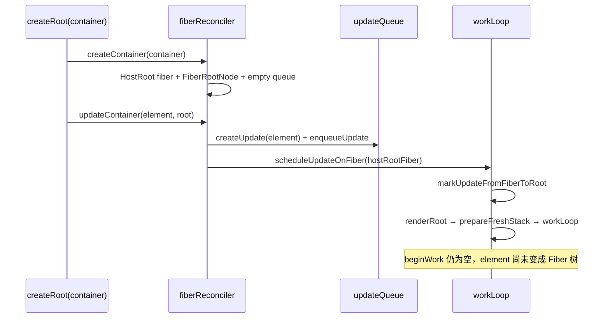

# Spec: FiberRoot 与 UpdateQueue（big-react L3 第四课）
type: utility

> **对齐参考**：[BetaSu/big-react@25caea04](https://github.com/BetaSu/big-react/commit/25caea0432b10c60b602fbb126269684438ef1c5)（`feat: 第四课`，2022-11-17）。本 spec 以该 commit 的实现语义为准，并补充与当前 JS 代码库的演进差异说明。
>
> **前置依赖**：[`reconciler-scaffold.md`](./reconciler-scaffold.md)（FiberNode、workLoop 骨架）。本课在其上补 **FiberRoot**、**UpdateQueue**、**双缓冲入口** 与 **updateContainer 调度链**。
>
> **后续依赖**：`beginWork` 中 HostRoot 消费 `processUpdateQueue`、Element → Fiber、`react-dom` Host Config 真实 DOM 操作等均在后续课程 commit 中补齐。

## 1. 需求定义

### 1.1 背景与目标

- **解决什么问题**：骨架阶段 `renderRoot` 直接传入 Fiber，无法表达「应用挂载点 + 多次 render(element)」；也缺少把 **ReactElement 作为一次更新** 入队的机制。
- **使用方**：
  - `packages/react-dom` 后续通过 `createContainer` / `updateContainer` 驱动渲染（本课 reconciler 内可先单测）
  - `packages/react-reconciler` 内部 `workLoop` 调度
- **本课目标（最小闭环）**：
  - 扩展 `FiberNode`：`memoizedState`、`updateQueue`；修正 `NoFlags` 拼写
  - 新增 `FiberRootNode`（container + current + finishedWork）
  - 实现 `createWorkInProgress`（mount / update 双缓冲雏形）
  - 新增 `updateQueue`：`createUpdate` / `createUpdateQueue` / `enqueueUpdate` / `processUpdateQueue`
  - 新增 `fiberReconciler`：`createContainer` / `updateContainer`
  - 新增 reconciler 内 `hostConfig` 占位：`Container` 类型
  - 改造 `workLoop`：`prepareFreshStack(root)`、`scheduleUpdateOnFiber` 同步触发 `renderRoot`
- **明确不在本 spec 范围**：
  - Update 环形链表、Lane 优先级（本地已扩展）
  - `beginWork` HostRoot 分支处理 updateQueue（下一课）
  - `commitRoot`、DOM Placement
  - `react-dom` 真实 `hostConfig.js`（本课 reconciler 内仅为类型占位）
  - Hooks / `useState` update

### 1.2 能力范围（Capability Scope）

- **提供的能力：**
  - [ ] `FiberRootNode` 绑定 `container` 与 `HostRoot` fiber
  - [ ] `HostRoot.stateNode` 指向 `FiberRootNode`
  - [ ] `createWorkInProgress(current, pendingProps)` mount/update 分支
  - [ ] `UpdateQueue.shared.pending` 单槽入队（覆盖式 `enqueueUpdate`）
  - [ ] `processUpdateQueue` 支持 action 为 **值** 或 **函数**
  - [ ] `createContainer(container)` 初始化 root fiber + 空 updateQueue
  - [ ] `updateContainer(element, root)` 入队 element 并 `scheduleUpdateOnFiber`
  - [ ] `markUpdateFromFiberToRoot` 沿 return 链找 `FiberRootNode`
  - [ ] `prepareFreshStack` 通过 `createWorkInProgress(root.current, {})` 创建 wip
- **明确不提供的能力：**
  - [ ] 多 update 批处理环形链表
  - [ ] 异步 / 可中断调度（`scheduleUpdateOnFiber` 内 TODO）
  - [ ] `finishedWork` 赋值与 commit
  - [ ] HostRoot `memoizedState` 存 element 并在 beginWork 展开（下一课）

### 1.3 待确认项

| 问题 | 当前假设 | 优先级 |
|------|----------|--------|
| 语言 | 参考 TS，本地 JS | 已确认 |
| `Action` 类型 | 参考 `updateQueue.ts` import `shared/ReactTypes.Action`，**该 commit 的 ReactTypes 未导出 Action** | 本地用 JSDoc 或 `shared` 补 `Action` |
| hostConfig 位置 | 参考 commit 在 `react-reconciler/src/hostConfig.ts` 仅占位 | 本地 DOM 能力在 `react-dom/src/hostConfig.js` |
| `enqueueUpdate` 语义 | 单 pending 覆盖，非环 | 已确认（对齐 25caea04） |
| 自动化单测 | `processUpdateQueue`、createWorkInProgress、markUpdateFromFiberToRoot | 已确认 |

---

## 2. 项目资产对齐（Project Asset Alignment）

### 2.1 复用性审查（Reusability Audit）

| 检查项 | 现有资产 | 状态 | 本次策略 |
|--------|----------|------|----------|
| FiberNode 骨架 | reconciler-scaffold | ✅ 扩展 | +memoizedState、updateQueue、NoFlags 修正 |
| workLoop DFS | reconciler-scaffold | ✅ 改造 | renderRoot 入参改为 FiberRootNode |
| ReactElement | jsx.md | ✅ 已有 | update 的 action 即为 element |
| FiberRoot / UpdateQueue | 无 | ❌ 新增 | 本课核心 |
| createContainer | 无 | ❌ 新增 | fiberReconciler |
| 参考实现 | BetaSu/big-react@25caea04 | ✅ 外部 | 逐文件对照 |
| 本地已扩展 | Lanes、环形 enqueue、commitRoot | ⚠️ 超范围 | 本 spec 描述第四课；本地保留扩展 |

### 2.2 规范对齐（Standard Compliance）

| 规范类别 | 项目规范要求 | 本次应用方式 |
|----------|--------------|--------------|
| **代码规范** | ESLint + Prettier | 改动文件必须通过 lint |
| **目录规范** | reconciler 逻辑在 `packages/react-reconciler/src/` | 新增 fiberReconciler、updateQueue、hostConfig |
| **架构边界** | Host Config 属 L4 | 本课 reconciler 内仅占位 `Container` 类型 |
| **依赖方向** | reconciler 不依赖 react-dom（理想） | 参考 commit 用 reconciler 内 hostConfig 占位 |

---

## 3. API 设计（API Design）

### 3.1 `FiberNode` 扩展（fiber.js）

**新增 / 修正字段：**

| 字段 | 类型 | 初始值 | 说明 |
|------|------|--------|------|
| `memoizedState` | `any` | `null` | HostRoot 后续存 element；本课字段就位 |
| `updateQueue` | `UpdateQueue \| null` | `null` | FC / HostRoot 更新队列 |
| `flags` | `Flags` | `NoFlags` | 修正 import：`NoFlags`（非 `Noflags`） |

### 3.2 `FiberRootNode`（fiber.js）

```javascript
export class FiberRootNode {
  constructor(container, hostRootFiber) {
    this.container = container;       // 宿主容器（DOM 节点等）
    this.current = hostRootFiber;     // 当前树（对应 DOM 已提交树）
    hostRootFiber.stateNode = this;   // HostRoot ↔ Root 双向绑定
    this.finishedWork = null;         // 本课仅占位，commit 课使用
  }
}
```

| 字段 | 类型 | 必填 | 说明 |
|------|------|------|------|
| `container` | `Container` | 是 | 来自 hostConfig 占位类型 |
| `current` | `FiberNode` | 是 | tag 为 HostRoot 的 fiber |
| `finishedWork` | `FiberNode \| null` | — | 初始 `null` |

### 3.3 `createWorkInProgress(current, pendingProps)`

```javascript
export function createWorkInProgress(current, pendingProps) {
  let wip = current.alternate;

  if (wip === null) {
    // mount：首次创建 alternate
    wip = new FiberNode(current.tag, pendingProps, current.key);
    wip.stateNode = current.stateNode;
    wip.alternate = current;
    current.alternate = wip;
  } else {
    // update：复用已有 alternate
    wip.pendingProps = pendingProps;
    wip.flags = NoFlags;
  }

  // 双缓冲复用字段
  wip.type = current.type;
  wip.updateQueue = current.updateQueue;
  wip.child = current.child;
  wip.memoizedProps = current.memoizedProps;
  wip.memoizedState = current.memoizedState;

  return wip;
}
```

| 分支 | 行为 |
|------|------|
| mount（`alternate === null`） | 新建 wip，与 current 互指 alternate |
| update | 重置 `pendingProps`、`flags`；复用 child / memoized* / updateQueue |

> **本课注意**：`prepareFreshStack` 传入 `pendingProps = {}`；HostRoot 的 element 尚未通过 beginWork 写入，下一课处理。

### 3.4 UpdateQueue（updateQueue.js）

#### 3.4.1 类型

```javascript
/** @typedef {{ action: Action<State> }} Update */
/** @typedef {{ shared: { pending: Update|null } }} UpdateQueue */

/** @typedef {State | ((prevState: State) => State)} Action */
```

| 结构 | 字段 | 说明 |
|------|------|------|
| `Update` | `action` | 更新载荷：值或 updater 函数 |
| `UpdateQueue` | `shared.pending` | 当前待处理 update（本课单槽） |

#### 3.4.2 `createUpdate(action)`

| 参数 | 类型 | 返回 |
|------|------|------|
| `action` | `Action<State>` | `{ action }` |

#### 3.4.3 `createUpdateQueue()`

返回 `{ shared: { pending: null } }`。

#### 3.4.4 `enqueueUpdate(updateQueue, update)` — 对齐 25caea04

```javascript
export function enqueueUpdate(updateQueue, update) {
  updateQueue.shared.pending = update;
}
```

| 行为 | 说明 |
|------|------|
| **覆盖式** | 新 update 直接替换 `pending`，非环形链表 |
| 多次 render | 仅保留最后一次 pending（本课限制） |

#### 3.4.5 `processUpdateQueue(baseState, pendingUpdate)`

```javascript
export function processUpdateQueue(baseState, pendingUpdate) {
  const result = { memoizedState: baseState };

  if (pendingUpdate !== null) {
    const action = pendingUpdate.action;
    if (action instanceof Function) {
      result.memoizedState = action(baseState);
    } else {
      result.memoizedState = action;
    }
  }

  return result;
}
```

| action 形态 | 示例 | 结果 |
|-------------|------|------|
| 值 | `baseState=1`, `action=2` | `memoizedState=2` |
| 函数 | `baseState=1`, `action=(x)=>4*x` | `memoizedState=4` |

> HostRoot 场景：`baseState` 为上次 element，`action` 为新 element（值型 update）。

### 3.5 Reconciler 入口（fiberReconciler.js）

#### 3.5.1 `createContainer(container)`

```javascript
export function createContainer(container) {
  const hostRootFiber = new FiberNode(HostRoot, {}, null);
  const root = new FiberRootNode(container, hostRootFiber);
  hostRootFiber.updateQueue = createUpdateQueue();
  return root;
}
```

| 步骤 | 结果 |
|------|------|
| 1 | 创建 `HostRoot` fiber |
| 2 | 创建 `FiberRootNode`，绑定 container |
| 3 | 初始化 HostRoot 的 updateQueue |
| 返回 | `FiberRootNode` |

#### 3.5.2 `updateContainer(element, root)`

```javascript
export function updateContainer(element, root) {
  const hostRootFiber = root.current;
  const update = createUpdate(element);
  enqueueUpdate(hostRootFiber.updateQueue, update);
  scheduleUpdateOnFiber(hostRootFiber);
  return element;
}
```

| 参数 | 类型 | 说明 |
|------|------|------|
| `element` | `ReactElement \| null` | 本次要渲染的根 element |
| `root` | `FiberRootNode` | createContainer 返回值 |

| 返回 | 说明 |
|------|------|
| `element` | 与参考 commit 一致，便于链式调用 |

### 3.6 hostConfig 占位（react-reconciler/src/hostConfig.js）

```javascript
/** @typedef {any} Container */
export {};
// 或 export type Container = any; （TS）
```

| 导出 | 说明 |
|------|------|
| `Container` | 宿主容器类型占位；真实 DOM 类型在后续 react-dom 课定义 |

### 3.7 WorkLoop 改造（workLoop.js）

#### 3.7.1 `prepareFreshStack(root: FiberRootNode)`

```javascript
function prepareFreshStack(root) {
  workInProgress = createWorkInProgress(root.current, {});
}
```

| 变更 | 相对 scaffold |
|------|---------------|
| 入参 | `FiberRootNode` 而非 `FiberNode` |
| wip 创建 | 通过 `createWorkInProgress` 双缓冲 |

#### 3.7.2 `scheduleUpdateOnFiber(fiber)`

```javascript
export function scheduleUpdateOnFiber(fiber) {
  // TODO 调度功能
  const root = markUpdateFromFiberToRoot(fiber);
  renderRoot(root);
}
```

| 行为 | 说明 |
|------|------|
| 本课 | **同步** 立即 `renderRoot` |
| 后续 | Lane / 微任务 / scheduler |

#### 3.7.3 `markUpdateFromFiberToRoot(fiber)`

```
node = fiber
while node.return !== null:
  node = node.return
if node.tag === HostRoot:
  return node.stateNode  // FiberRootNode
return null
```

#### 3.7.4 `renderRoot(root: FiberRootNode)`

保留 scaffold 的 `workLoop` + try/catch；入口改为 `FiberRootNode`。

### 3.8 端到端数据流（本课边界）



### 3.9 错误契约

| 场景 | 行为 | 调用方处理 |
|------|------|------------|
| `markUpdateFromFiberToRoot` 找不到 HostRoot | 返回 `null`，`renderRoot(null)` 会出错 | 保证从 HostRoot 或其子孙调度 |
| `pendingUpdate === null` | `processUpdateQueue` 返回 baseState | 正常空转 |
| `workLoop` 异常 | warn + `workInProgress = null` | 同 scaffold |

---

## 4. 使用示例（Usage Examples）

### 4.1 创建容器并排入首次更新

```javascript
import { createContainer, updateContainer } from './fiberReconciler.js';
import { jsxDEV } from 'react/src/jsx.js';

const container = document.getElementById('root');
const root = createContainer(container);

const element = jsxDEV('div', { children: 'hello' });
updateContainer(element, root);
// HostRoot.updateQueue.shared.pending.action === element
// 同步进入 renderRoot → workLoop（尚无 DOM）
```

### 4.2 processUpdateQueue 值更新

```javascript
processUpdateQueue(null, { action: element });
// memoizedState === element
```

### 4.3 processUpdateQueue 函数更新

```javascript
processUpdateQueue(oldElement, {
  action: (prev) => newElement,
});
// memoizedState === newElement
```

### 4.4 createWorkInProgress 双缓冲

```javascript
const current = root.current;
const wip1 = createWorkInProgress(current, {});
const wip2 = createWorkInProgress(current, {});
// wip1 === wip2（同一 alternate）
// current.alternate === wip1
```

---

## 5. 技术方案（Technical Design）

### 5.1 交付物清单（文件级，对齐 25caea04）

| # | 文件 | 改动摘要 |
|---|------|----------|
| D1 | `packages/react-reconciler/src/fiber.js` | +memoizedState、updateQueue、FiberRootNode、createWorkInProgress；NoFlags 修正 |
| D2 | `packages/react-reconciler/src/updateQueue.js` | 新增 UpdateQueue 全套 API |
| D3 | `packages/react-reconciler/src/fiberReconciler.js` | createContainer、updateContainer |
| D4 | `packages/react-reconciler/src/hostConfig.js` | Container 类型占位 |
| D5 | `packages/react-reconciler/src/workLoop.js` | scheduleUpdateOnFiber、markUpdateFromFiberToRoot、prepareFreshStack 改造 |

### 5.2 架构位置

```
react-dom (后续课)
  createRoot(container)
    → createContainer / updateContainer  ──►  fiberReconciler (本课)
         │
         ▼
    FiberRootNode + HostRoot.updateQueue
         │
         ▼
    scheduleUpdateOnFiber → renderRoot → workLoop (本课改造)
         │
         ▼
    beginWork HostRoot + processUpdateQueue (下一课)
```

### 5.3 FiberRoot 与 HostRoot 关系

```
FiberRootNode
  container ──────────► DOM 容器（占位）
  current ────────────► FiberNode (tag=HostRoot)
  finishedWork ───────► null（本课）

FiberNode (HostRoot)
  stateNode ──────────► FiberRootNode
  updateQueue ────────► { shared: { pending: Update|null } }
  memoizedState ──────► null → 下一课存 element
```

### 5.4 异常兜底

| 输入 | 处理方式 |
|------|----------|
| `element = null` | 允许入队；下一课 HostRoot 处理卸载语义 |
| 连续两次 updateContainer | 后者覆盖 pending |
| createWorkInProgress 在 mount 前多次调用 | 复用同一 alternate |

---

## 6. 非功能需求（Non-Functional）

| 指标 | 目标值 | 测试方法 |
|------|--------|----------|
| Lint | `pnpm lint` 无新增 error | 本地 lint |
| 对齐度 | 与 25caea04 五文件语义一致 | PR diff 对照 |
| 不破坏 scaffold | workLoop DFS 仍可运行 | 单测 |
| 依赖 | fiberReconciler 仅依赖 reconciler + shared | import 检查 |

---

## 7. 测试策略与覆盖率矩阵（Testing Strategy）

### 7.1 测试分层

| 测试类型 | 覆盖目标 | 工具 | 通过标准 |
|----------|----------|------|----------|
| 单元测试 | updateQueue、createWorkInProgress、markUpdateFromFiberToRoot | Vitest | 全部 AC 通过 |
| 集成 smoke | createContainer → updateContainer → pending | Vitest | action 为 element |
| 参考对照 | 与 25caea04 一致 | 逐文件 diff | 核心路径一致 |

### 7.2 功能覆盖率矩阵

| 功能点 | 测试用例 | 场景 | 状态 |
|--------|----------|------|------|
| FiberRootNode 构造 | stateNode 双向绑定 | 1/1 | ⬜ |
| createUpdateQueue | pending 初始 null | 1/1 | ⬜ |
| enqueueUpdate 覆盖 | 两次入队 | 1/1 | ⬜ |
| processUpdateQueue 值 | action 非函数 | 1/1 | ⬜ |
| processUpdateQueue 函数 | updater | 1/1 | ⬜ |
| createWorkInProgress mount | alternate 互指 | 1/1 | ⬜ |
| createWorkInProgress update | 复用 alternate | 1/1 | ⬜ |
| markUpdateFromFiberToRoot | 从 HostRoot 子 fiber 找 root | 1/1 | ⬜ |
| updateContainer | pending.action === element | 1/1 | ⬜ |
| scheduleUpdateOnFiber | 触发 renderRoot | 1/1 | ⬜ |

### 7.3 复杂场景拆解

| 编号 | 输入 | 预期 | 对齐参考 |
|------|------|------|----------|
| SC-01 | createContainer(div) | root.current.tag===HostRoot，updateQueue 存在 | 25caea04 |
| SC-02 | updateContainer(el, root) | pending.action===el | fiberReconciler |
| SC-03 | 连续两次 updateContainer | pending 为第二次 element | 覆盖式 enqueue |
| SC-04 | processUpdateQueue(1, {action:2}) | memoizedState===2 | updateQueue |
| SC-05 | processUpdateQueue(1, {action:x=>x*4}) | memoizedState===4 | updateQueue |
| SC-06 | createWorkInProgress 两次 | 同一 wip 引用 | fiber |

### 7.4 建议单测（Vitest）

| 测试文件 | 覆盖点 |
|----------|--------|
| `packages/react-reconciler/src/__tests__/updateQueue.test.js` | processUpdateQueue、enqueue 覆盖 |
| `packages/react-reconciler/src/__tests__/fiber.test.js` | FiberRootNode、createWorkInProgress |

运行：`pnpm test`。

---

## 8. 任务拆分与并行计划（Task Breakdown）

### 8.1 任务卡片

#### 模块 A：Fiber 与 Root（Agent-1）

| ID | 任务 | 输出 | 对齐 commit |
|----|------|------|-------------|
| T-A1 | FiberNode 扩展 + NoFlags | fiber.js | fiber.ts |
| T-A2 | FiberRootNode + createWorkInProgress | fiber.js | fiber.ts |

**CK-1 冻结**：Root ↔ HostRoot 双向绑定；createWorkInProgress 字段拷贝表。

#### 模块 B：UpdateQueue（Agent-2）

| ID | 任务 | 输出 | 对齐 commit |
|----|------|------|-------------|
| T-B1 | updateQueue 四 API | updateQueue.js | updateQueue.ts |
| T-B2 | hostConfig Container 占位 | hostConfig.js | hostConfig.ts |

**CK-2 冻结**：`processUpdateQueue` 值/函数两分支；覆盖式 enqueue。

#### 模块 C：入口与调度（Agent-3）

| ID | 任务 | 输出 | 对齐 commit |
|----|------|------|-------------|
| T-C1 | fiberReconciler | fiberReconciler.js | fiberReconciler.ts |
| T-C2 | workLoop 改造 | workLoop.js | workLoop.ts |
| T-C3 | 单测 + lint | 全绿 | — |

### 8.2 并行时序

```
T-A1 → T-A2 → CK-1
         ↓
    T-B1 → T-B2 → CK-2
         ↓
    T-C1 → T-C2 → T-C3
```

---

## 9. 验收标准（Given-When-Then）

| ID | Given | When | Then |
|----|-------|------|------|
| AC-01 | `createContainer(container)` | 读 root | `root.current.tag===HostRoot`，`root.current.stateNode===root` |
| AC-02 | AC-01 已执行 | 读 updateQueue | `shared.pending===null` |
| AC-03 | root 已创建 | `updateContainer(el, root)` | `pending.action===el` |
| AC-04 | HostRoot fiber | `scheduleUpdateOnFiber(hostRootFiber)` | 进入 renderRoot，workLoop 跑完 |
| AC-05 | `processUpdateQueue(1, {action:2})` | 读结果 | `memoizedState===2` |
| AC-06 | `processUpdateQueue(1, {action:x=>4*x})` | 读结果 | `memoizedState===4` |
| AC-07 | current 无 alternate | 两次 createWorkInProgress | 同一 wip，current.alternate 指向 wip |
| AC-08 | 子 fiber 链到 HostRoot | markUpdateFromFiberToRoot | 返回 FiberRootNode |
| AC-09 | 全部改动 | `pnpm lint` + `pnpm test` | 无 error |

---

## 10. 验收注意点与重点场景

### 10.1 必验（P0）

| 场景 | 验证点 |
|------|--------|
| Root 双向绑定 | AC-01 |
| update 入队 | AC-03 |
| 同步调度 | AC-04 |
| processUpdateQueue 两形态 | AC-05、AC-06 |
| 双缓冲 | AC-07 |

### 10.2 易遗漏

| 风险 | 原因 | 验收 |
|------|------|------|
| 仍用 Fiber 作 renderRoot 入参 | 未改 workLoop | AC-04 |
| enqueue 做成环形链表 | 与参考 commit 不符 | AC-03 覆盖语义 |
| beginWork 未处理 queue 却期望 DOM | 本课边界 | 无 DOM 变化正常 |
| `Noflags` 未改 | scaffold 笔误 | fiber 构造 flags |
| Action 类型缺失 | 参考 commit ReactTypes 无 Action | TS/JS 需补 typedef |

### 10.3 回归

[`reconciler-scaffold.md`](./reconciler-scaffold.md) workLoop DFS 行为不破坏；[`jsx.md`](./jsx.md) Element 仍可入队。

---

## 11. 风险与依赖

| 风险 | 缓解 |
|------|------|
| 本课无 HostRoot beginWork | 文档标明；下一课接 processUpdateQueue |
| 覆盖式 enqueue 丢更新 | 第四课预期；链表在后续课 |
| hostConfig 双份 | reconciler 占位 + react-dom 实实现在并存，本地以 react-dom 为准 |
| scheduleUpdateOnFiber 同步阻塞 | 后续 Lane 课改造 |

---

## 12. 参考 commit 文件对照表

| 参考文件（25caea04） | 本地目标文件 | 变更类型 |
|---------------------|--------------|----------|
| `fiber.ts` | `fiber.js` | 修改 |
| `updateQueue.ts` | `updateQueue.js` | 新增 |
| `fiberReconciler.ts` | `fiberReconciler.js` | 新增 |
| `hostConfig.ts` | `hostConfig.js`（reconciler 占位） | 新增 |
| `workLoop.ts` | `workLoop.js` | 修改 |

---

## 13. 与当前代码库差异摘要

| 维度 | 25caea04 | 当前 big-react |
|------|----------|----------------|
| enqueueUpdate | 单槽覆盖 | 环形链表 + next 指针 |
| createUpdate | 仅 `{ action }` | + `lane`、`next` |
| processUpdateQueue | 单个 pending | 环遍历 + renderLane 过滤 |
| scheduleUpdateOnFiber | 同步 renderRoot | Lane + 微任务 / sync 队列 |
| FiberRootNode | container/current/finishedWork | + pendingLanes、finishedLane |
| hostConfig | reconciler 内 `Container=any` | react-dom 真实 DOM API |
| beginWork HostRoot | 未在本 commit | 已实现 processUpdateQueue |
| commitRoot | 无 | 已实现 |

实现或审查时：**FiberRoot、UpdateQueue、updateContainer 链以 25caea04 为准**；本地 Lane / 环形 queue / commit 为后续课程叠加。

---

**修订记录**

| 版本 | 日期 | 说明 |
|------|------|------|
| v1.0 | 2026-05-31 | 初稿，对齐 BetaSu/big-react@25caea04（第四课 FiberRoot + UpdateQueue） |
