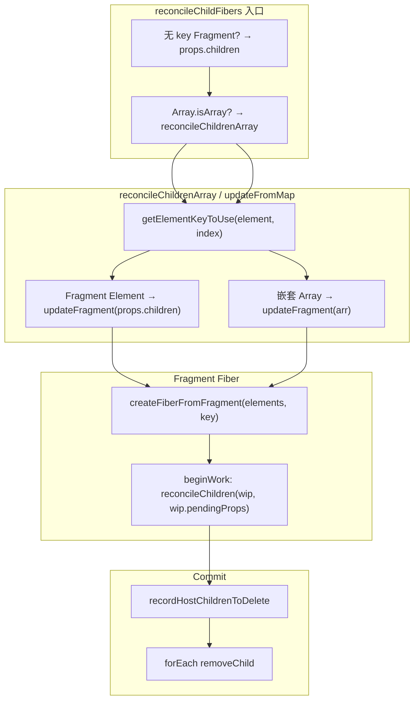

# Spec: Fragment 支持（big-react Reconciler 能力扩展）
type: utility

> **对齐参考**：[BetaSu/big-react@06f1b6b](https://github.com/BetaSu/big-react/commit/06f1b6b690dd4118a2e0a3a672a2da4cc692b7e2)（`feat: fragment`，2022-12-29）。本 spec 以该 commit 的实现语义为准，并补充课程「第十三课」中的 key 纠错说明。

## 1. 需求定义

### 1.1 背景与目标

- **解决什么问题**：当前 big-react 无法正确渲染 `<></>` / `<Fragment>`，数组 children 中的 Fragment、嵌套数组会导致 Diff 错误；删除 Fragment 子树时 DOM 残留。
- **使用方**：`packages/demos` 演示工程；后续所有依赖 JSX 多子节点、条件分组、列表展开的组件。
- **替代方案**：开发者用额外 `<div>` 包裹多子节点，会改变 DOM 结构、影响 CSS 布局与语义，不可接受。

### 1.2 能力范围（Capability Scope）

- **提供的能力：**
  - [ ] `shared` 导出 `REACT_FRAGMENT_TYPE`，`react` 导出 `Fragment = REACT_FRAGMENT_TYPE`
  - [ ] `createFiberFromFragment(elements, key)`：Fragment Fiber 的 `pendingProps` **直接存 children 数组**
  - [ ] `beginWork(Fragment)`：`reconcileChildren(wip, wip.pendingProps)`（非 `pendingProps.children`）
  - [ ] 无 key 顶层 Fragment 在 `reconcileChildFibers` 入口展开为 `props.children`
  - [ ] `updateFragment` 统一处理：数组项为 Fragment Element、数组项为嵌套数组
  - [ ] 场景 1~3 DOM 正确；删除 Fragment 时移除子树内全部 Host 节点（`recordHostChildrenToDelete`）
  - [ ] `getElementKeyToUse`：数组 / string / number 项使用 `index` 作 key（课程纠错，参考 commit 未显式命名该函数但需保证 key 不为 `undefined`）
- **明确不提供的能力：**
  - [ ] Fragment `key` 在复杂列表 Diff 中的完整优化语义
  - [ ] `React.Fragment` 静态属性、`ref` 转发
  - [ ] `StrictMode`、`Profiler` 等其他 Symbol type

### 1.3 待确认项

| 问题 | 当前假设 | 优先级 |
|------|----------|--------|
| Fragment Symbol 单一来源 | `packages/shared/ReactSymbols.js` → `REACT_FRAGMENT_TYPE` | 已确认（对齐 06f1b6b） |
| Fragment Fiber 的 pendingProps 形态 | **children 数组本身**，不是 `{ children: [...] }` | 已确认（对齐 06f1b6b） |
| `jsx-runtime.js` 中 Fragment | 从 `jsx.js` re-export，不在 jsx-runtime 单独 `Symbol.for` | 已确认 |
| 自动化单测 | 项目暂无 Vitest；第一版以 demo 手工验收 | 非阻塞 |

---

## 2. 项目资产对齐（Project Asset Alignment）

### 2.1 复用性审查（Reusability Audit）

| 检查项 | 现有资产 | 状态 | 本次策略 |
|--------|----------|------|----------|
| Fragment Symbol | `jsx-runtime.js` 单独定义 | ⚠️ 需迁移 | 迁入 `shared/ReactSymbols.js`，jsx 从 shared 引用 |
| Element 协议 | `REACT_ELEMENT_TYPE` | ✅ 已有 | 复用 |
| Diff 入口 | `childFiber.js` | ✅ 已有 | 增 `updateFragment`、无 key 顶层展开、数组项分支 |
| Fiber 创建 | `createFiberFromElement` | ✅ 已有 | **新增** `createFiberFromFragment`，Fragment 不走 `createFiberFromElement` |
| Commit 删除 | `commitWork.js` 只删首个 Host | ❌ 需改 | 对齐 `recordHostChildrenToDelete` |
| 参考实现 | BetaSu/big-react@06f1b6b | ✅ 外部 | 实现时逐文件对照 |

### 2.2 规范对齐（Standard Compliance）

| 规范类别 | 项目规范要求 | 本次应用方式 |
|----------|--------------|--------------|
| **代码规范** | ESLint + Prettier | 改动文件必须通过 lint |
| **目录规范** | reconciler 逻辑在 `packages/react-reconciler/src/` | 按参考 commit 文件分布改动 |
| **命名规范** | 与现有 reconciler 一致 | `updateFragment`、`createFiberFromFragment`、`recordHostChildrenToDelete` |
| **依赖方向** | reconciler 不依赖 react 包 | Symbol 仅经 `shared` 引用 |

---

## 3. API 设计（API Design）

### 3.1 公开 API（packages/react + shared）

#### shared：`REACT_FRAGMENT_TYPE`

```javascript
// packages/shared/ReactSymbols.js
export const REACT_FRAGMENT_TYPE = supportSymbol
  ? Symbol.for('react.fragment')
  : 0xeacb;
```

| 导出 | 类型 | 必填 | 默认值 | 说明 |
|------|------|------|--------|------|
| `REACT_FRAGMENT_TYPE` | `symbol \| number` | — | `Symbol.for('react.fragment')` | reconciler / react 内部判定 Fragment type |

#### react：`Fragment`

```javascript
// packages/react/src/jsx.js
import { REACT_FRAGMENT_TYPE } from 'shared/ReactSymbols';
export const Fragment = REACT_FRAGMENT_TYPE;

// packages/react/jsx-runtime.js
export { Fragment } from './src/jsx.js'; // 或 re-export jsx 中的 Fragment

// packages/react/index.js
export { Fragment } from './jsx-runtime.js';
```

**校验规则**：`Object.is(Fragment, REACT_FRAGMENT_TYPE) === true`。

### 3.2 内部 API（packages/react-reconciler）

#### 3.2.1 workTag

| 常量 | 类型 | 值 | 说明 |
|------|------|-----|------|
| `Fragment` | `number` | `7` | `workTags.js` |

#### 3.2.2 createFiberFromFragment（核心，对齐 06f1b6b）

```javascript
/**
 * 从 Fragment 的 children 数组创建 Fiber。
 * @param {any[]} elements - 子节点数组（即 pendingProps，非 { children } 包装）
 * @param {string|null|number} key - Fragment 的 key
 * @returns {FiberNode} tag=Fragment，type 不设置，pendingProps=elements
 */
function createFiberFromFragment(elements, key);
```

| 参数 | 类型 | 必填 | 默认值 | 说明 |
|------|------|------|--------|------|
| `elements` | `any[]` | 是 | — | Fragment 的子节点列表 |
| `key` | `Key` | 是 | — | Fiber 构造时 `this.key = key \|\| null` |

> **与旧 spec 差异**：Fragment **不**经 `createFiberFromElement`；`pendingProps` 不是 `{ children: [...] }`。

#### 3.2.3 updateFragment（childFiber.js 内部，对齐 06f1b6b）

```javascript
/**
 * 创建或复用 Fragment Fiber。
 * @param {FiberNode} returnFiber
 * @param {FiberNode|undefined} current - existingChildren 中 key 匹配的 fiber
 * @param {any[]} elements - children 数组（Fragment Element 时为 element.props.children）
 * @param {Key} key
 * @param {Map} existingChildren
 * @returns {FiberNode}
 */
function updateFragment(returnFiber, current, elements, key, existingChildren);
```

| 条件 | 行为 |
|------|------|
| `!current \|\| current.tag !== Fragment` | `createFiberFromFragment(elements, key)` |
| 否则 | `existingChildren.delete(key)` + `useFiber(current, elements)` |

**调用点（三处，对齐参考 commit）：**

| 调用位置 | `elements` 传入值 |
|----------|-------------------|
| `reconcileSingleElement` 新建 | `element.props.children` |
| `updateFromMap` + `REACT_FRAGMENT_TYPE` | `element.props.children` |
| `updateFromMap` + `Array.isArray(element)` | 嵌套数组本身 |

#### 3.2.4 reconcileSingleElement 中 Fragment 复用（对齐 06f1b6b）

| 步骤 | 行为 |
|------|------|
| type 相同且 key 相同 | `props = element.type === REACT_FRAGMENT_TYPE ? element.props.children : element.props` |
| 复用 | `useFiber(currentFiber, props)` — Fragment 时 pendingProps 为 **children 数组** |
| 新建 | `createFiberFromFragment(element.props.children, key)` |

#### 3.2.5 reconcileChildFibers 入口：无 key 顶层 Fragment 展开

```javascript
const isUnkeyedTopLevelFragment =
  typeof newChild === 'object' &&
  newChild !== null &&
  newChild.type === REACT_FRAGMENT_TYPE &&
  newChild.key === null;
if (isUnkeyedTopLevelFragment) {
  newChild = newChild.props.children;
}
```

| 参数 | 类型 | 必填 | 说明 |
|------|------|------|------|
| 展开条件 | — | — | Fragment Element 且 `key === null` |
| 展开结果 | `any` | — | 直接 reconcile `props.children`（可能是数组或单节点） |

> 场景 1（`<>...</>`）经此展开后，多数情况下 **不会** 多包一层 Fragment Fiber，子节点直接与父级 reconcile。

#### 3.2.6 getElementKeyToUse（课程纠错，补充于参考 commit）

```javascript
function getElementKeyToUse(element, index) {
  if (
    Array.isArray(element) ||
    typeof element === 'string' ||
    typeof element === 'number'
  ) {
    return index;
  }
  return element.key !== null ? element.key : index;
}
```

| `element` 形态 | 返回值 |
|----------------|--------|
| `Array` | `index` |
| `string` / `number` | `index` |
| ReactElement | `element.key !== null ? element.key : index` |

`updateFromMap` 建表与查表均使用此函数，避免数组项 `keyToUse === undefined` 导致 Fragment 无法复用。

#### 3.2.7 beginWork / completeWork（对齐 06f1b6b）

```javascript
function updateFragment(wip) {
  const nextChildren = wip.pendingProps; // 即 children 数组，非 .children
  reconcileChildren(wip, nextChildren);
  return wip.child;
}
```

| 函数 | Fragment 行为 |
|------|---------------|
| `beginWork` | `case Fragment: return updateFragment(wip)` |
| `completeWork` | `case HostRoot:` / `case FunctionComponent:` / `case Fragment:` fall-through → `bubbleProperties(wip); return null` |

#### 3.2.8 commitDeletion + recordHostChildrenToDelete（对齐 06f1b6b）

```javascript
function recordHostChildrenToDelete(childrenToDelete, unmountFiber) {
  const lastOne = childrenToDelete[childrenToDelete.length - 1];
  if (!lastOne) {
    childrenToDelete.push(unmountFiber);
  } else {
    let node = lastOne.sibling;
    while (node !== null) {
      if (unmountFiber === node) {
        childrenToDelete.push(unmountFiber);
      }
      node = node.sibling;
    }
  }
}

function commitDeletion(childToDelete) {
  const rootChildrenToDelete = [];
  commitNestedUnmount(childToDelete, (unmountFiber) => {
    if (unmountFiber.tag === HostComponent || unmountFiber.tag === HostText) {
      recordHostChildrenToDelete(rootChildrenToDelete, unmountFiber);
    }
  });
  if (rootChildrenToDelete.length) {
    const hostParent = getHostParent(childToDelete);
    rootChildrenToDelete.forEach((node) => {
      removeChild(node.stateNode, hostParent);
    });
  }
  childToDelete.return = null;
  childToDelete.child = null;
}
```

| 输入 | 行为 |
|------|------|
| 删除含多 Host 根的 Fragment | 收集 sibling 链上全部 Host fiber，逐个 `removeChild` |
| `getHostParent` | 从 `childToDelete` 向上找，穿透 Fragment |

> **与旧 spec 差异**：不是「DFS 每遇 Host 即删」，而是参考 commit 的 `recordHostChildrenToDelete` 收集后批量删除。实现以 06f1b6b 为准。

#### 3.2.9 其他 childFiber 调整（对齐 06f1b6b）

| 改动 | 说明 |
|------|------|
| `reconcileChildFibers` 内数组判断提前 | `Array.isArray(newChild)` 在 `switch ($$typeof)` 之前 |
| 兜底删除 | `deleteRemainingChildren(returnFiber, currentFiber)` 替代单次 `deleteChild` |

### 3.3 行为契约（三场景）

| 场景 | JSX / children | DOM 输出 | 核心路径 |
|------|----------------|----------|----------|
| 1 包裹 | `<> <div/><div/> </>` | 2 个 div，无 wrapper | 无 key 顶层展开 → 数组 reconcile |
| 2 同级 | `ul` 内 `<>li,li</>` + `li,li` | 4 个 li | 数组项 Fragment → `updateFragment` |
| 3 嵌套数组 | `ul` 内 `[li, li, arr]` | 4 个 li | 数组项为数组 → `updateFragment(arr)` |
| 删除 | `show && <> <p/><p/> </>` | toggle 后 p 全消失 | `recordHostChildrenToDelete` |

### 3.4 错误契约

| 错误类型 | 触发场景 | 调用方处理 |
|----------|----------|------------|
| `console.warn('未实现的reconcile类型')` | 非法 children | 修复 JSX |
| `console.log('beginWork未实现')` | 遗漏 Fragment 分支 | 补 beginWork |
| `console.warn('未找到hostParent')` | return 链断裂 | 排查 Fiber 树 |

---

## 4. 使用示例（Usage Examples）

### 4.1 场景 1：Fragment 包裹

```jsx
<>
  <div />
  <div />
</>
// jsxs(Fragment, { children: [jsx('div'), jsx('div')] })
// reconcileChildFibers 入口展开 props.children → 两 div 直接 reconcile
```

### 4.2 场景 2：同级 Fragment

```jsx
<ul>
  <>
    <li>1</li>
    <li>2</li>
  </>
  <li>3</li>
  <li>4</li>
</ul>
// children 数组含 Fragment Element → updateFragment → beginWork reconcile 两个 li
```

### 4.3 场景 3：嵌套数组（对齐 06f1b6b demo）

```jsx
const arr =
  num % 2 === 0
    ? [<li key="1">1</li>, <li key="2">2</li>, <li key="3">3</li>]
    : [<li key="3">3</li>, <li key="2">2</li>, <li key="1">1</li>];

return (
  <ul onClick={() => setNum(num + 1)}>
    <li>4</li>
    <li>5</li>
    {arr}
  </ul>
);
// updateFromMap 遇 Array → updateFragment(arr)；点击后 arr 顺序反转，Diff 正确复用
```

### 4.4 条件卸载

```jsx
{show && (
  <>
    <p>xxx</p>
    <p>yyy</p>
  </>
)}
// show=false → commitDeletion 移除两个 p
```

---

## 5. 技术方案（Technical Design）

### 5.1 交付物清单（文件级，对齐 06f1b6b）

| # | 文件 | 改动摘要 |
|---|------|----------|
| D1 | `packages/shared/ReactSymbols.js` | +`REACT_FRAGMENT_TYPE` |
| D2 | `packages/react/src/jsx.js` | +`Fragment = REACT_FRAGMENT_TYPE` |
| D3 | `packages/react/jsx-runtime.js` | re-export `Fragment`（删除独立 Symbol.for） |
| D4 | `packages/react/index.js` | export `Fragment` |
| D5 | `packages/react-reconciler/src/workTags.js` | +`Fragment = 7` |
| D6 | `packages/react-reconciler/src/fiber.js` | +`createFiberFromFragment`；`key \|\| null` |
| D7 | `packages/react-reconciler/src/beginWork.js` | +`updateFragment` / `case Fragment` |
| D8 | `packages/react-reconciler/src/completeWork.js` | +`case Fragment` fall-through |
| D9 | `packages/react-reconciler/src/childFiber.js` | 无 key 展开、`updateFragment`、数组/Fragment 分支、`getElementKeyToUse` |
| D10 | `packages/react-reconciler/src/commitWork.js` | `recordHostChildrenToDelete` + 批量 remove |
| D11 | `packages/demos/src/App.jsx` | 嵌套数组 + 顺序切换 demo |

### 5.2 数据流（对齐参考实现）



### 5.3 Fragment Fiber 内存模型

```
FiberNode {
  tag: Fragment (7)
  type: null          // 参考 commit 未设置 type
  pendingProps: any[] // 直接是 children 数组，例如 [liFiber元素, liFiber元素]
  stateNode: null
  key: null | string
}
```

### 5.4 Placement / getHostSibling

- `insertOrAppendPlacementNodeIntoContainer` 递归穿透非 Host Fiber，Fragment 无需额外逻辑。
- `getHostParent` / `getHostSibling` 穿透 Fragment（与 FunctionComponent 相同）。

### 5.5 异常兜底

| 异常输入 | 处理方式 |
|----------|----------|
| `pendingProps` 空数组 | Fragment Fiber 存在，`child === null` |
| 嵌套空数组 `[]` | `updateFragment([])`，无子 Fiber |
| `children` 为 `null` | 沿用现有 reconcile 行为 |

---

## 6. 非功能需求（Non-Functional）

| 指标 | 目标值 | 测试方法 |
|------|--------|----------|
| 构建 | `pnpm build:dev` 成功 | 本地构建 |
| Lint | `pnpm lint` 无新增 error | 本地 lint |
| 对齐度 | 与 06f1b6b 文件改动一一对应 | PR diff 对照 |
| 行为不退化 | 原列表 Diff demo 正常 | 手工回归 |
| 无循环依赖 | reconciler 仅依赖 shared | import 检查 |

---

## 7. 测试策略与覆盖率矩阵（Testing Strategy）

### 7.1 测试分层

| 测试类型 | 覆盖目标 | 工具 | 通过标准 |
|----------|----------|------|----------|
| Demo 手工验收 | 三场景 + 删除 + 嵌套数组顺序切换 | `packages/demos` | 全部 AC 通过 |
| 参考对照 | 与 06f1b6b 行为一致 | 逐文件 diff | 核心路径一致 |
| 静态检查 | lint + build | pnpm | 无 error |

### 7.2 功能覆盖率矩阵

| 功能点 | 测试用例 | 场景 | 状态 |
|--------|----------|------|------|
| REACT_FRAGMENT_TYPE | shared + react 同源 | 1/1 | ⬜ |
| createFiberFromFragment | pendingProps 为数组 | 1/1 | ⬜ |
| 无 key 顶层展开 | `<>...</>` | 1/1 | ⬜ |
| updateFragment 复用 | 场景 2 keyed Fragment | 1/1 | ⬜ |
| 嵌套数组 | 场景 3 + demo 点击反转 | 2/2 | ⬜ |
| getElementKeyToUse | arr 更新不错乱 | 1/1 | ⬜ |
| recordHostChildrenToDelete | 删两 p | 1/1 | ⬜ |
| deleteRemainingChildren | 兜底删除 sibling 链 | 1/1 | ⬜ |
| 列表 Diff 回归 | 原 App demo | 1/1 | ⬜ |

### 7.3 复杂场景拆解

| 编号 | 输入 | 预期 | 对齐参考 |
|------|------|------|----------|
| SC-01 | `<> <div/><div/> </>` | 2 div，无 wrapper | 06f1b6b 场景 1 |
| SC-02 | ul 内 Fragment + li | 4 li | 06f1b6b 场景 2 |
| SC-03 | ul + `{arr}` | 5 li（4+5+arr×3） | 06f1b6b demo |
| SC-04 | 点击切换 arr 顺序 | li 顺序反转，无重复 | 06f1b6b demo |
| SC-05 | show Fragment 两 p → false | 两 p 全删 | commitWork |
| SC-06 | 原 App 顺序/尾节点 | 不退化 | 回归 |

---

## 8. 任务拆分与并行计划（Task Breakdown）

### 8.1 拆分原则

按参考 commit 文件边界拆分，保证每步可对照 06f1b6b diff 验收。

### 8.2 任务卡片

#### 模块 A：Symbol + Fiber 基础（Agent-1）

| ID | 任务 | 输出 | 对齐 commit 文件 |
|----|------|------|------------------|
| T-A1 | `REACT_FRAGMENT_TYPE` + react 导出 | shared, jsx.js, jsx-runtime, index | ReactSymbols.ts, jsx.ts, jsx-dev-runtime.ts |
| T-A2 | workTag + createFiberFromFragment | workTags.js, fiber.js | workTags.ts, fiber.ts |
| T-A3 | beginWork + completeWork | beginWork.js, completeWork.js | beginWork.ts, completeWork.ts |

**CK-1 冻结**：`pendingProps = children 数组`；`Fragment = 7`。

#### 模块 B：Diff + Commit（Agent-2）

| ID | 任务 | 输出 | 对齐 commit 文件 |
|----|------|------|------------------|
| T-B1 | 无 key 展开 + reconcileSingleElement Fragment | childFiber.js | childFibers.ts 前半 |
| T-B2 | updateFragment + updateFromMap 数组/Fragment 分支 | childFiber.js | childFibers.ts 后半 |
| T-B3 | getElementKeyToUse | childFiber.js | 课程纠错补充 |
| T-B4 | recordHostChildrenToDelete + commitDeletion | commitWork.js | commitWork.ts |

**CK-2 冻结**：`updateFragment` 签名与三处调用点；**CK-3 冻结**：commitDeletion 批量删 Host。

#### 模块 C：Demo + 文档（Agent-3）

| ID | 任务 | 输出 |
|----|------|------|
| T-C1 | demo 嵌套数组 + 顺序切换 | App.jsx（对齐 06f1b6b main.tsx） |
| T-C2 | architecture.md 一句 + spec 链接 | `.ai/architecture.md` |
| T-C3 | lint + build | 全绿 |

### 8.3 并行时序

```
T-A1 → T-A2 → CK-1 → (T-A3 ∥ T-B1→T-B2→T-B3→T-B4) → T-C1→T-C2→T-C3
```

---

## 9. 验收标准（Given-When-Then）

| ID | Given | When | Then |
|----|-------|------|------|
| AC-01 | shared 与 react 已构建 | `Fragment === REACT_FRAGMENT_TYPE` | 引用相等 |
| AC-02 | Fragment Fiber 已创建 | 读 `wip.pendingProps` | 类型为数组，非 `{children}` 对象 |
| AC-03 | 渲染 `<> <div/><div/> </>` | mount | 2 div，无 wrapper DOM |
| AC-04 | 渲染场景 2 ul 结构 | mount | 4 个 li |
| AC-05 | 渲染 `<li>4</li><li>5</li>{arr}` | mount | 5 个 li |
| AC-06 | AC-05 已 mount | 点击切换 arr 顺序 | li 顺序更新，无重复/残留 |
| AC-07 | show=true 两 p Fragment | show=false | 两 p 均移除 |
| AC-08 | 原 App 列表 demo | 切换顺序/尾节点 | 行为不变 |
| AC-09 | 全部改动 | `pnpm lint` + `pnpm build:dev` | 无 error |

---

## 10. 验收注意点与重点场景

### 10.1 必验（P0）

| 场景 | 验证点 |
|------|--------|
| pendingProps 形态 | 必须是 children 数组（AC-02） |
| 无 key 展开 | 场景 1 不多包 Fragment Fiber |
| updateFragment 三入口 | Element / 嵌套数组 / reconcileSingleElement |
| 多 Host 删除 | SC-05 两个 p 都消失 |
| 嵌套数组 key | SC-04 点击后不错乱 |

### 10.2 易遗漏

| 风险 | 原因 | 验收 |
|------|------|------|
| beginWork 读 `.children` | 与参考 commit 不一致 | pendingProps 已是数组 |
| jsx-runtime 重复 Symbol | 本地现状 | 统一从 shared |
| 只删第一个 Host | 旧 commitWork | SC-05 |
| updateFromMap 传整个 element | 应传 `props.children` | AC-02 + 场景 2 |
| 数组 key undefined | 未用 getElementKeyToUse | SC-04 |

### 10.3 回归

原 `App.jsx` multi-children demo；FunctionComponent；HostComponent props 更新。

---

## 11. 风险与依赖

| 风险 | 缓解 |
|------|------|
| 本地 JS 与参考 TS 命名差异 | 逻辑对齐，文件名用本地 `.js` |
| recordHostChildrenToDelete 边界 | 以 06f1b6b 为准，SC-05 验收 |
| getElementKeyToUse 与 updateFragment 职责重叠 | 两者均保留：前者管 key，后者管 Fiber 创建/复用 |

---

## 12. 发布与版本

- 仓库内课程实现，合并条件：AC-01~AC-09 通过。
- 实现 PR 标题建议：`feat(reconciler): 实现 Fragment 支持`（中文 subject）。

---

**修订记录**

| 版本 | 日期 | 说明 |
|------|------|------|
| v1.0 | — | 初稿（课程三场景） |
| v2.0 | 2025-05-24 | SDD utility 模板 |
| v2.1 | 2025-05-24 | **对齐 BetaSu/big-react@06f1b6b**：createFiberFromFragment、pendingProps 数组、updateFragment、无 key 展开、recordHostChildrenToDelete |
