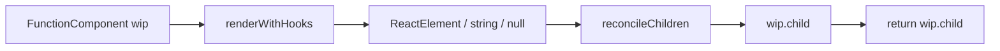
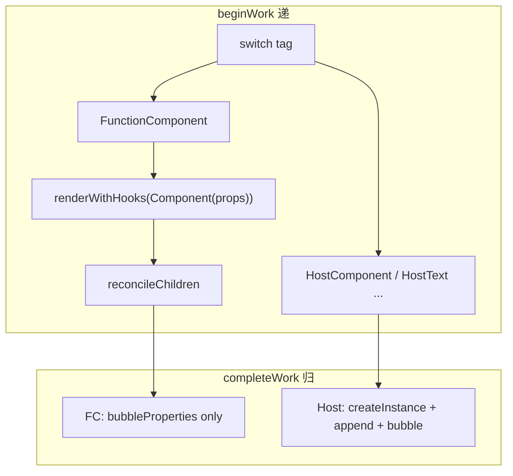

# Spec: FunctionComponent 与 renderWithHooks（big-react 第七课）
type: utility

> **对齐参考**：[BetaSu/big-react@ad6a6e52](https://github.com/BetaSu/big-react/commit/ad6a6e520e4cbf7ac694a33cc0ba5a4b1d444250)（`feat: 第七课`，2022-11-30）。本 spec 以该 commit 的实现语义为准，并补充与当前 JS 代码库的 API / 工程化差异适配说明。
>
> **前置依赖**：[`commit-phase.md`](./commit-phase.md)（第六课：`react-dom` Host Config、`commitRoot` / `commitPlacement`、浏览器可见 DOM）。第五课 Mount 路径见 [`mount-phase.md`](./mount-phase.md)；`createFiberFromElement` 对 function type 已映射为 `FunctionComponent` tag，但第五课 `beginWork` 未处理。
>
> **后续依赖**：`useState`、Hooks 链表、`currentDispatcher`、Lane 传参等均在后续课程 commit 中补齐（本地 `fiberHook.js` 已扩展）。

## 1. 需求定义

### 1.1 背景与目标

- **解决什么问题**：第六课已能在浏览器通过 `createRoot().render(<div/>)` 渲染 Host 树，但 **函数组件**（如 `function App() { return <div/> }`）在第五课 `createFiberFromElement` 中虽被标记为 `FunctionComponent`，`beginWork` 仍无对应分支，无法执行组件函数并 reconcile 其返回值。
- **使用方**：
  - 应用 / demos：`<App />` 嵌套 `<Child />` 等函数组件 JSX
  - `packages/react-reconciler`：`beginWork` / `completeWork` FC 分支
- **本课目标（FC 最小闭环）**：
  - 新增 `fiberHooks.ts`：`renderWithHooks(wip)` — 调用 `Component(props)` 得到 children
  - `beginWork` 增加 `FunctionComponent` 分支：`updateFunctionComponent` → reconcile → 返回 `wip.child`
  - `completeWork` 增加 `FunctionComponent` 分支：仅 `bubbleProperties`（无 Host 节点）
  - 修正 `fiberFlags`：`NoFlags = 0`，Placement / Update / ChildDeletion 位值对齐语义
  - 工程化：`react/jsx-dev-runtime.ts` 导出 `jsxDEV`；`react-dom/client.ts` 默认导出；Vite demo 配置 + `demos/test-fc`
- **明确不在本 spec 范围**：
  - `useState` / `useEffect` / Hooks 链表（后续课；本课 `renderWithHooks` 仅直调组件函数）
  - `currentDispatcher`、`currentlyRenderingFiber` 模块状态
  - FC props update 优化、memo、context
  - `renderWithHooks` 第二参数 `renderLane`
  - 删除 `fiberReconciler.updateContainer` 中的调试 `console.log(123213)`（参考 commit 误留，**不应**作为验收行为）

### 1.2 能力范围（Capability Scope）

- **提供的能力：**
  - [ ] `renderWithHooks(wip)`：`Component = wip.type`，`children = Component(wip.pendingProps)`
  - [ ] `beginWork` → `updateFunctionComponent`：`renderWithHooks` + `reconcileChildren` + 返回 `wip.child`
  - [ ] `completeWork` → `FunctionComponent`：`bubbleProperties(wip)`，不创建 DOM
  - [ ] `fiberFlags`：`NoFlags=0`，`Placement=0b1`，`Update=0b10`，`ChildDeletion=0b100`；保留 `MutationMask`
  - [ ] `react/jsx-dev-runtime.ts`：`export { jsxDEV } from './src/jsx'`
  - [ ] `react-dom/client.ts`：`import * as ReactDOM from './src/root'; export default ReactDOM`
  - [ ] `scripts/vite/vite.config.js`：alias `react` / `react-dom` / `hostConfig` + `__DEV__` replace
  - [ ] `pnpm demo`：`vite serve demos/test-fc`
  - [ ] `demos/test-fc`：`App` → `Child` → `<span>big-react</span>` 可在浏览器渲染
- **明确不提供的能力：**
  - [ ] Hooks 状态持久化（re-render 时 FC 内部 state）
  - [ ] FC unmount / ref / error boundary
  - [ ] 生产构建与 Vite demo 以外的 demos 工程统一（本课仅 `test-fc`）

### 1.3 待确认项

| 问题 | 当前假设 | 优先级 |
|------|----------|--------|
| 语言 | 参考 TS，本地 JS（`.js` + JSDoc） | 已确认 |
| 文件名 | 参考 `fiberHooks.ts`，本地演进为 `fiberHook.js` | 已确认（语义等价） |
| demo 入口 | 参考 `demos/test-fc/main.tsx` | 本地 demos 在 `packages/demos/src/main.jsx` |
| `NoFlags` 修正 | 本课从占位 `0b1` 改为 `0` | 本地已对齐 |
| 自动化单测 | `renderWithHooks`、FC beginWork 集成 | 已确认 |
| debug log | 参考 commit `updateContainer` 含 `console.log(123213)` | 实现时删除，不写入验收 |

---

## 2. 项目资产对齐（Project Asset Alignment）

### 2.1 复用性审查（Reusability Audit）

| 检查项 | 现有资产 | 状态 | 本次策略 |
|--------|----------|------|----------|
| createFiberFromElement FC tag | mount-phase | ✅ 已有 | 本课补 beginWork 消费 |
| reconcileChildren / childFibers | mount-phase | ✅ 复用 | FC 返回值走同一 reconcile |
| bubbleProperties | mount-phase | ✅ 复用 | completeWork FC 分支 |
| commitRoot + Placement | commit-phase | ✅ 复用 | FC 子 Host 节点仍走 commit |
| renderWithHooks | 无 | ❌ 新增 | 本课最小实现 |
| jsx-dev-runtime | jsx.md 可能部分覆盖 | ❌/扩展 | 独立 dev-runtime 入口 |
| react-dom/client | commit-phase 规划 | ❌ 新增 | default export 分包 |
| Vite demo | 无 | ❌ 新增 | test-fc + vite.config |
| 参考实现 | BetaSu/big-react@ad6a6e52 | ✅ 外部 | 逐文件对照 |
| 本地已扩展 | useState、Lane、Fragment、useEffect | ⚠️ 超范围 | 本 spec 以 ad6a6e52 核心为准 |

### 2.2 规范对齐（Standard Compliance）

| 规范类别 | 项目规范要求 | 本次应用方式 |
|----------|--------------|--------------|
| **代码规范** | ESLint + Prettier | 改动文件必须通过 lint |
| **目录规范** | reconciler 在 `packages/react-reconciler/src/` | 新增 `fiberHooks`（本地 `fiberHook.js`） |
| **ESM 导入** | 显式 `.js` 扩展名 | 本地 JS 实现遵循 |
| **demos 约定** | AGENTS.md：`packages/demos` + `.jsx` 入口 | 参考课用 `demos/test-fc`；本地可映射到 `packages/demos` |
| **Host Config 边界** | L4 属于 react-dom | Vite alias `hostConfig` → `react-dom/src/hostConfig` |

---

## 3. API 设计（API Design）

### 3.1 内部 API：`renderWithHooks`

```javascript
/**
 * @param {FiberNode} wip workInProgress Fiber（tag === FunctionComponent）
 * @returns {any} 组件 render 返回值，作为 reconcileChildren 的 children
 */
export function renderWithHooks(wip);
```

| 步骤 | 行为（ad6a6e52） |
|------|------------------|
| 1 | `Component = wip.type`（函数引用） |
| 2 | `props = wip.pendingProps` |
| 3 | `children = Component(props)` |
| 4 | `return children` |

> **本课限制**：无 Hooks 调度器；每次 render 纯函数调用；组件内 `useState` 等 API 尚未存在。

### 3.2 内部 API：`beginWork` FC 分支

#### `updateFunctionComponent(wip)`

```javascript
function updateFunctionComponent(wip) {
  const nextChildren = renderWithHooks(wip);
  reconcileChildren(wip, nextChildren);
  return wip.child;
}
```

| 输入 | 输出 |
|------|------|
| FC wip（`type` 为函数） | 第一个子 Fiber，或 reconcile 后 `wip.child` |



与 HostComponent 对比：

| tag | children 来源 | beginWork 返回 |
|-----|---------------|----------------|
| `HostComponent` | `pendingProps.children` | `wip.child` |
| `FunctionComponent` | `renderWithHooks(wip)` | `wip.child` |

### 3.3 内部 API：`completeWork` FC 分支

```javascript
case FunctionComponent:
  bubbleProperties(wip);
  return null;
```

| 行为 | 说明 |
|------|------|
| 不创建 `stateNode` | FC 无对应 DOM |
| `bubbleProperties` | 子 Host 节点的 `flags` / `subtreeFlags` 向上聚合 |
| 与 `HostRoot` 相同 | 仅 bubble，无 hostConfig 调用 |

### 3.4 变更：`fiberFlags`

| 常量 | 第五课占位 | 本课（ad6a6e52） |
|------|------------|------------------|
| `NoFlags` | `0b0000001` | `0b0000000` |
| `Placement` | `0b0000010` | `0b0000001` |
| `Update` | `0b0000100` | `0b0000010` |
| `ChildDeletion` | `0b0001000` | `0b0000100` |
| `MutationMask` | 已有 | `Placement \| Update \| ChildDeletion`（不变） |

> 位值修正后，`subtreeFlags & MutationMask` 与 commit 第六课语义一致。

### 3.5 对外 API：`react/jsx-dev-runtime`

```javascript
export { jsxDEV } from './src/jsx';
```

| 用途 | 说明 |
|------|------|
| Vite / Babel | `jsxDEV` 运行时入口，与 `react/jsx-runtime` 并列 |
| demos | `@vitejs/plugin-react` 编译 JSX 时解析 |

### 3.6 对外 API：`react-dom/client`

```javascript
import * as ReactDOM from './src/root';
export default ReactDOM;
```

| 导出 | 消费方 |
|------|--------|
| `default` → `{ createRoot, ... }` | `import ReactDOM from 'react-dom/client'` |

与第六课 `createRoot` 实现同源于 `./src/root`，本课仅增加 **client 分包 default export**。

### 3.7 工程化：Vite demo 配置

`scripts/vite/vite.config.js` 要点：

| 配置项 | 值 |
|--------|-----|
| `plugins` | `@vitejs/plugin-react` + `@rollup/plugin-replace({ __DEV__: true })` |
| alias `react` | `resolvePkgPath('react')` |
| alias `react-dom` | `resolvePkgPath('react-dom')` |
| alias `hostConfig` | `react-dom/src/hostConfig` |

根 `package.json` 脚本：

```json
"demo": "vite serve demos/test-fc --config scripts/vite/vite.config.js --force"
```

### 3.8 Demo：`demos/test-fc`

```tsx
function App() {
  return (
    <div>
      <Child />
    </div>
  );
}

function Child() {
  return <span>big-react</span>;
}

ReactDOM.createRoot(document.getElementById('root')).render(<App />);
```

| 验证点 | 预期 DOM |
|--------|----------|
| FC 嵌套 | `#root > div > span`，文本 `big-react` |
| FC → Host 树 | App(FC) → div(Host) → Child(FC) → span(Host) |

### 3.9 错误契约

| 场景 | 行为 | 调用方处理 |
|------|------|------------|
| `wip.type` 非函数 | `Component(props)` 抛错 | 保证 createFiberFromElement 映射正确 |
| FC 返回非法 reconcile 类型 | childFibers DEV warn | 返回 Element / 文本 |
| 未实现 tag | `__DEV__` warn | 本课仅补 FunctionComponent |
| 参考 commit debug log | `console.log(123213)` | **不复制** |

---

## 4. 使用示例（Usage Examples）

### 4.1 单层函数组件

```jsx
function Hello() {
  return <p>hello</p>;
}

createRoot(container).render(<Hello />);
```

```
beginWork(Hello FC)
  → renderWithHooks → jsx('p', { children: 'hello' })
  → reconcileChildren → p HostComponent + text HostText
completeWork(Hello FC) → bubbleProperties
completeWork(p) → createInstance + appendAllChildren
commitRoot → Placement → 浏览器可见 <p>hello</p>
```

### 4.2 嵌套 FC（对齐 test-fc）

```
HostRoot
  └─ App (FunctionComponent)
       └─ div (HostComponent)
            └─ Child (FunctionComponent)
                 └─ span (HostComponent)
                      └─ HostText 'big-react'
```

`renderWithHooks` 调用次序：**App** → **Child**（DFS 递阶段）。

### 4.3 FC 返回文本

```jsx
function TextOnly() {
  return 'raw text';
}
```

`reconcileChildren` 走 `reconcileSingleTextNode`（第五课 childFibers 能力）。

---

## 5. 技术方案（Technical Design）

### 5.1 交付物清单（文件级，对齐 ad6a6e52）

| # | 文件 | 改动摘要 |
|---|------|----------|
| D1 | `packages/react-reconciler/src/fiberHooks.ts` | 新增 `renderWithHooks` |
| D2 | `packages/react-reconciler/src/beginWork.ts` | +`FunctionComponent` / `updateFunctionComponent` |
| D3 | `packages/react-reconciler/src/completeWork.ts` | +`FunctionComponent` bubble |
| D4 | `packages/react-reconciler/src/fiberFlags.ts` | 修正 NoFlags 与位值 |
| D5 | `packages/react/jsx-dev-runtime.ts` | 导出 jsxDEV |
| D6 | `packages/react-dom/client.ts` | default export ReactDOM |
| D7 | `scripts/vite/vite.config.js` | 新增 Vite + alias |
| D8 | `demos/test-fc/index.html` + `main.tsx` | FC demo |
| D9 | 根 `package.json` | +`demo` script、vite 相关 devDependencies |

> D10：`fiberReconciler.ts` 中 debug log — 参考 commit 有改动但 **不应** 合入正式实现。

### 5.2 Render Phase 数据流（含 FC）



### 5.3 FC 与 Host 职责分界

| 阶段 | FunctionComponent | HostComponent |
|------|-------------------|---------------|
| beginWork | 执行函数，得到 VDOM | 读 props.children |
| completeWork | 仅 bubble flags | 创建 DOM、append 子节点 |
| commit | 无 Placement（自身） | 子树 Host 节点 Placement |
| stateNode | 始终 `null` | DOM 实例 |

### 5.4 异常兜底

| 输入 | 处理方式 |
|------|----------|
| FC 返回 `null` | reconcile 无子，`wip.child = null` |
| FC 返回数组 children | 第五课 childFibers TODO warn（本课 demo 不涉及） |
| FC 抛错 | workLoop catch + DEV warn |

---

## 6. 非功能需求（Non-Functional）

| 指标 | 目标值 | 测试方法 |
|------|--------|----------|
| 构建 | `pnpm build:dev` 成功 | 本地构建 |
| Demo | `pnpm demo` 可访问 test-fc | 浏览器 |
| Lint | `pnpm lint` 无新增 error | 本地 lint |
| 对齐度 | 与 ad6a6e52 核心 9 文件语义一致 | PR diff 对照 |
| DOM 验收 | `#root` 含 `span` 文本 `big-react` | 手工 / Playwright |

---

## 7. 测试策略与覆盖率矩阵（Testing Strategy）

### 7.1 测试分层

| 测试类型 | 覆盖目标 | 工具 | 通过标准 |
|----------|----------|------|----------|
| 单元测试 | renderWithHooks 返回值 | Vitest | AC-01 |
| 集成测试 | FC beginWork → child 链 | Vitest + mock | AC-02、AC-03 |
| Demo E2E | test-fc 浏览器 DOM | 手工 / Playwright | AC-08 |
| 参考对照 | 与 ad6a6e52 一致 | 逐文件 diff | 核心路径一致 |

### 7.2 功能覆盖率矩阵

| 功能点 | 测试用例 | 场景 | 状态 |
|--------|----------|------|------|
| renderWithHooks | mock FC 返回 element | 1/1 | ⬜ |
| beginWork FC | App wip | child 为 HostComponent | 1/1 | ⬜ |
| completeWork FC | FC wip 有 Host 子 | bubbleProperties 聚合 | 1/1 | ⬜ |
| fiberFlags NoFlags | import NoFlags | 值为 0 | 1/1 | ⬜ |
| 嵌套 FC | App>Child>span | DFS 两次 renderWithHooks | 1/1 | ⬜ |
| jsx-dev-runtime | import jsxDEV | 可创建 element | 1/1 | ⬜ |
| react-dom/client | import default createRoot | 可 render | 1/1 | ⬜ |

### 7.3 复杂场景拆解

| 编号 | 输入 | 预期 | 对齐参考 |
|------|------|------|----------|
| SC-01 | `function F(){ return <div/> }` | div Host fiber 挂于 F.child | ad6a6e52 |
| SC-02 | App>Child>span | 两次 renderWithHooks；span 文本正确 | test-fc |
| SC-03 | FC completeWork | 无 createInstance 调用 | completeWork |
| SC-04 | 修正后 Placement flag | commit MutationMask 仍匹配 | fiberFlags |
| SC-05 | FC 返回 null | child=null，不抛错 | 边界 |

### 7.4 建议单测（Vitest）

| 测试文件 | 覆盖点 |
|----------|--------|
| `packages/react-reconciler/src/__tests__/renderWithHooks.test.js` | 纯函数调用、返回值 |
| `packages/react-reconciler/src/__tests__/beginWork.fc.test.js` | FC 分支 + reconcile |

运行：`pnpm test`。

---

## 8. 任务拆分与并行计划（Task Breakdown）

### 8.1 拆分原则

**Reconciler FC 路径 → flags 修正 → 分包入口 → Vite demo**。

### 8.2 任务卡片

#### 模块 A：FC Render 路径（Agent-1）

| ID | 任务 | 输出 | 对齐 commit 文件 |
|----|------|------|------------------|
| T-A1 | `renderWithHooks` | `fiberHooks.ts` | fiberHooks.ts |
| T-A2 | beginWork FC 分支 | `beginWork.ts` | beginWork.ts |
| T-A3 | completeWork FC 分支 | `completeWork.ts` | completeWork.ts |

**CK-1 冻结**：`renderWithHooks(wip)` 签名；FC complete 仅 bubble。

#### 模块 B：Flags + 入口（Agent-2）

| ID | 任务 | 输出 | 对齐 commit 文件 |
|----|------|------|------------------|
| T-B1 | fiberFlags 位值修正 | `fiberFlags.ts` | fiberFlags.ts |
| T-B2 | jsx-dev-runtime | `jsx-dev-runtime.ts` | jsx-dev-runtime.ts |
| T-B3 | react-dom/client | `client.ts` | client.ts |

**CK-2 冻结**：`NoFlags === 0`；client default export 形态。

#### 模块 C：Demo 工程（Agent-3）

| ID | 任务 | 输出 | 对齐 commit 文件 |
|----|------|------|------------------|
| T-C1 | vite.config + alias | `scripts/vite/vite.config.js` | vite.config.js |
| T-C2 | test-fc demo | `demos/test-fc/*` | index.html + main.tsx |
| T-C3 | package.json demo script | 根 package.json | package.json |

### 8.3 并行时序

```
T-A1 → T-A2 → T-A3 → CK-1
         ↓
    T-B1 → T-B2 → T-B3 → CK-2
         ↓
    T-C1 → T-C2 → T-C3
```

---

## 9. 验收标准（Given-When-Then）

| ID | Given | When | Then |
|----|-------|------|------|
| AC-01 | FC wip，`type` 为返回 `<div/>` 的函数 | `renderWithHooks(wip)` | 返回等效 ReactElement |
| AC-02 | `<App/>` 首次 mount | `beginWork(App wip)` | `wip.child` 为 div HostComponent Fiber |
| AC-03 | App>Child 嵌套 mount | completeWork 结束 | Child 子树 flags 经 App bubble 到 root |
| AC-04 | `import { NoFlags } from fiberFlags` | 读值 | `NoFlags === 0` |
| AC-05 | `pnpm build:dev` | 构建 | 成功，含 react-dom client 产物 |
| AC-06 | `pnpm demo` + 打开 test-fc | 浏览器检查 `#root` | 存在 `span`，文本 `big-react` |
| AC-07 | `import ReactDOM from 'react-dom/client'` | `createRoot(...).render(...)` | 与第六课行为一致 |
| AC-08 | 全部改动 | `pnpm lint` + `pnpm test` | 无 error |
| AC-09 | updateContainer | 无多余 console.log | 参考 commit debug 未引入 |

---

## 10. 验收注意点与重点场景

### 10.1 必验（P0）

| 场景 | 验证点 |
|------|--------|
| FC 可渲染 | AC-06（浏览器 DOM） |
| renderWithHooks 调用组件 | AC-01 |
| FC complete 不建 DOM | SC-03 |
| flags 修正不破坏 commit | SC-04、AC-04 |
| 嵌套 FC | SC-02 |

### 10.2 易遗漏

| 风险 | 原因 | 验收 |
|------|------|------|
| beginWork 仍无 FC case | 未合入第七课 | AC-02 失败 |
| completeWork 漏 FC | 仅 Host 分支 | subtreeFlags 不完整 |
| NoFlags 仍为占位 1 | 未合入 flags 修正 | AC-04 |
| Vite 未 alias hostConfig | completeWork 找不到模块 | demo 白屏 |
| 复制 debug console.log | 参考 commit 误留 | AC-09 |
| 与 useState 课混淆 | 本课无 Hooks 链表 | renderWithHooks 仅 9 行语义 |

### 10.3 回归

第六课 `createRoot` + Host 单标签渲染不退化；第五课 HostComponent beginWork 仍正常。

---

## 11. 风险与依赖

| 风险 | 缓解 |
|------|------|
| FC 内尚不支持 Hooks，用户误用 useState | 文档边界；下一课再开 Hooks |
| flags 位变更影响已有 commit 测试 | 全量跑 commit 相关单测 |
| 参考 demo 为 TS，本地 demos 为 JSX | 验收语义等价即可 |
| Vite 与 Rollup 双构建链 | demo 仅 dev；build:dev 仍 Rollup |

---

## 12. 参考 commit 文件对照表

| 参考文件（ad6a6e52） | 本地目标文件 | 变更类型 |
|---------------------|--------------|----------|
| `packages/react-reconciler/src/fiberHooks.ts` | `fiberHook.js` | 新增（本地已扩展 useState） |
| `packages/react-reconciler/src/beginWork.ts` | `beginWork.js` | 扩展 |
| `packages/react-reconciler/src/completeWork.ts` | `completeWork.js` | 扩展 |
| `packages/react-reconciler/src/fiberFlags.ts` | `fiberFlags.js` | 修正 |
| `packages/react/jsx-dev-runtime.ts` | `jsx-dev-runtime.js` 或等价 | 新增 |
| `packages/react-dom/client.ts` | `client.js` | 新增 |
| `scripts/vite/vite.config.js` | `packages/demos/vite.config.js` | 新增/映射 |
| `demos/test-fc/main.tsx` | `packages/demos/src/*.jsx` | 新增/映射 |
| `packages/react-reconciler/src/fiberReconciler.ts` | `fiberReconciler.js` | ⚠️ 仅 debug log，勿合入 |

---

## 13. 与当前代码库差异摘要

| 维度 | ad6a6e52 | 当前 big-react |
|------|----------|----------------|
| renderWithHooks | 直调 `Component(props)` | +Hooks 调度、useState、Lane 参数 |
| 文件名 | `fiberHooks.ts` | `fiberHook.js` |
| beginWork 签名 | `(wip)` | `(workInProgress, renderLane)` |
| Fragment | 无 | 已实现 updateFragment |
| demos | `demos/test-fc` + TS | `packages/demos` + JSX |
| useState / useEffect | 无 | 已实现 |
| fiberFlags | 本课修正为 0 起 | 已对齐 + PassiveEffect 等扩展 |
| jsx-dev-runtime | 新增 | 需核对本地是否已有导出 |

实现或审查时：**FC beginWork/completeWork 路径、最小 renderWithHooks、fiberFlags 修正、client 分包以 ad6a6e52 为准**；本地 Hooks / Lane / Fragment 为后续课程叠加，不反向改变本课「纯函数组件 render」核心语义。

---

**修订记录**

| 版本 | 日期 | 说明 |
|------|------|------|
| v1.0 | 2026-05-31 | 初稿，对齐 BetaSu/big-react@ad6a6e52（第七课 FunctionComponent + renderWithHooks） |
