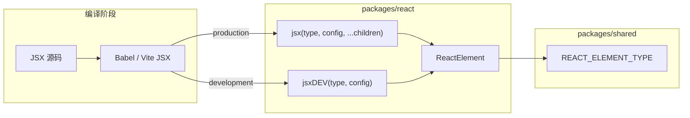
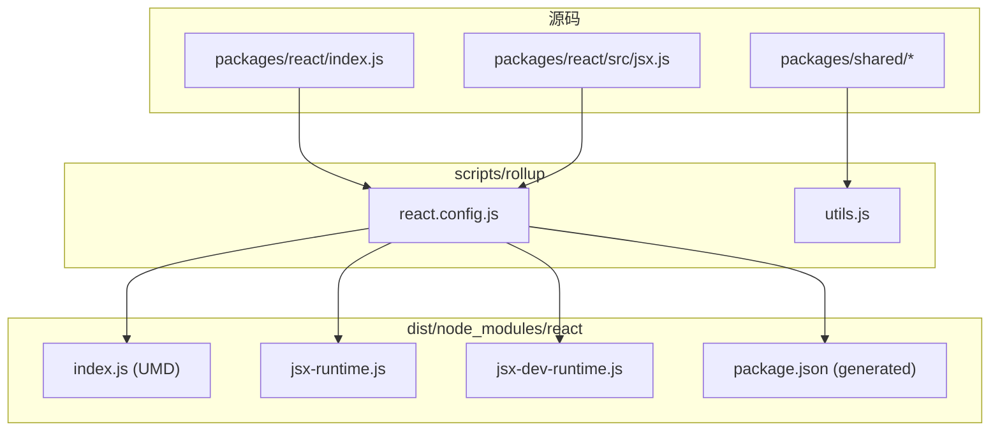

# Spec: JSX 转换与 ReactElement 模型（big-react L1 能力）
type: utility

> **对齐参考**：[BetaSu/big-react@cb7cc007](https://github.com/BetaSu/big-react/commit/cb7cc007c64cd696d7199020797ddf503e41841c)（`feat: 第二课 jsx转换`，2022-10-19）。本 spec 以该 commit 的实现语义为准，并补充与当前 JS 代码库的 API / 工程化差异适配说明。
>
> **后续依赖**：Fragment（[`fragment.md`](./fragment.md)）、Reconciler Diff、DOM 渲染均依赖本课产出的 ReactElement 结构与 `REACT_ELEMENT_TYPE` 协议。

## 1. 需求定义

### 1.1 背景与目标

- **解决什么问题**：在 reconciler 与 DOM 渲染之前，需要一层「JSX / `createElement` → 可遍历 UI 描述对象」的转换能力；没有 ReactElement，后续 Fiber 创建与 Diff 无从谈起。
- **使用方**：
  - Babel / Vite 编译后的 `jsx` / `jsxDEV` 调用（automatic runtime）
  - 开发者显式调用 `React.createElement`
  - `packages/react-reconciler` 通过 `$$typeof === REACT_ELEMENT_TYPE` 识别 Element
- **本课目标（最小闭环）**：
  - 在 `packages/shared` 定义 Element 协议常量与类型约定
  - 在 `packages/react` 实现 `ReactElement` 工厂、`jsx`、`jsxDEV`
  - 对外暴露 `createElement`（DEV 路径指向 `jsxDEV`）
  - 配置 Rollup 将 `react` 与 `jsx-runtime` / `jsx-dev-runtime` 打包到 `dist/node_modules`
- **明确不在本 spec 范围**：
  - `Fragment`、`isValidElement`（后续课 / 本地已扩展）
  - Hooks（`useState` 等，后续课）
  - Reconciler 消费 Element 的逻辑
  - `jsxs` 单独实现（参考 commit 未区分，production / dev runtime 同源 `jsx.ts`）

### 1.2 能力范围（Capability Scope）

- **提供的能力：**
  - [ ] `shared/ReactSymbols` 导出 `REACT_ELEMENT_TYPE`（`Symbol.for('react.element')` 或 fallback `0xeac7`）
  - [ ] `shared/ReactTypes` 导出 `Type` / `Key` / `Ref` / `Props` / `ElementType` / `ReactElementType` 约定
  - [ ] `ReactElement(type, key, ref, props)` 返回带 `$$typeof` 的 plain object
  - [ ] `jsx(type, config, ...maybeChildren)`：解析 `key` / `ref` / 其余 props；rest children 写入 `props.children`
  - [ ] `jsxDEV(type, config)`：DEV 路径，从 `config` 读取 props（含 `children`），不接收 rest children
  - [ ] `packages/react/index` 导出 `createElement: jsxDEV`（参考 commit 为 default export 对象）
  - [ ] `pnpm build:dev`：Rollup 产出 `dist/node_modules/react/index.js`、`jsx-runtime.js`、`jsx-dev-runtime.js`
  - [ ] workspace 依赖：`react` → `shared`
- **明确不提供的能力：**
  - [ ] `key` 的 `:` 前缀稳定化（React 17+ 完整 key 语义）
  - [ ] `ref` 字符串 ref 警告与 `React.createRef` 集成
  - [ ] `defaultProps` / `propTypes` 静态属性
  - [ ] 生产环境 `jsx` 与 `jsxs` 的性能差异优化
  - [ ] `__self` / `__source` DEV 专有 props 注入（Babel 插件侧，非本课 jsx 实现）

### 1.3 待确认项

| 问题 | 当前假设 | 优先级 |
|------|----------|--------|
| 语言 | 参考为 TS，本地实现为 JS（`.js`） | 已确认 |
| `__mark` 字段 | 参考 commit 为 `'KaSong'`，本地可为项目标识 | 非阻塞 |
| `createElement` 指向 | 参考 commit 指向 `jsxDEV`；本地可对齐或统一走 `jsx` | 已确认（对齐 cb7cc007 为 jsxDEV） |
| jsx-runtime 入口 | 参考 commit 从 `src/jsx.ts` 直接打包两份 UMD | 本地已有 `jsx-runtime.js` re-export，语义等价 |
| Rollup 插件 | 参考用 `rollup-plugin-typescript2`；本地用 workspace resolve + JS | 已确认（行为等价即可） |
| 自动化单测 | 优先 `ReactElement` 结构、`key` 字符串化、children 合并 | 已确认 |

---

## 2. 项目资产对齐（Project Asset Alignment）

### 2.1 复用性审查（Reusability Audit）

| 检查项 | 现有资产 | 状态 | 本次策略 |
|--------|----------|------|----------|
| Element Symbol | 无 / 散落 | ❌ 新增 | 收敛到 `shared/ReactSymbols` |
| Element 形状 | 无 | ❌ 新增 | `ReactElement` 工厂统一产出 |
| JSX 工厂 | 无 | ❌ 新增 | `packages/react/src/jsx` |
| 构建脚本 | 无 / 仅 lint | ❌ 新增 | `scripts/rollup/react.config.js` + `utils.js` |
| 参考实现 | BetaSu/big-react@cb7cc007 | ✅ 外部 | 逐文件对照 |
| 本地已扩展 | `Fragment`、`isValidElement`、`useState` | ⚠️ 超范围 | 本 spec 不删除，但验收以 cb7cc007 核心为准 |

### 2.2 规范对齐（Standard Compliance）

| 规范类别 | 项目规范要求 | 本次应用方式 |
|----------|--------------|--------------|
| **代码规范** | ESLint + Prettier | 改动文件必须通过 lint |
| **目录规范** | L1 在 `packages/react`，协议在 `packages/shared` | 按参考 commit 分布 |
| **ESM 导入** | 显式 `.js` 扩展名 | 本地 JS 实现遵循 |
| **依赖方向** | `react` → `shared`；reconciler 仅读 shared Symbol | 不引入 reconciler 依赖 |
| **构建产物** | `dist/` 写入 `.gitignore` | 对齐参考 commit |

---

## 3. API 设计（API Design）

### 3.1 共享协议（packages/shared）

#### 3.1.1 `REACT_ELEMENT_TYPE`

```javascript
// packages/shared/ReactSymbols.js
const supportSymbol = typeof Symbol === 'function' && Symbol.for;

export const REACT_ELEMENT_TYPE = supportSymbol
  ? Symbol.for('react.element')
  : 0xeac7;
```

| 导出 | 类型 | 必填 | 默认值 | 说明 |
|------|------|------|--------|------|
| `REACT_ELEMENT_TYPE` | `symbol \| number` | — | `Symbol.for('react.element')` | reconciler / jsx 判定 Element |

**校验规则**：`typeof Symbol === 'function'` 时为 Symbol；否则 fallback 为 `0xeac7`（与 React 16 一致）。

#### 3.1.2 `ReactTypes` 约定

| 导出 | 类型 | 说明 |
|------|------|------|
| `Type` | `any` | Element 的 `type`（字符串 tag 或函数组件） |
| `Key` | `any` | Fiber diff 用 key，jsx 侧会字符串化 |
| `Ref` | `any` | ref 对象或回调 |
| `Props` | `any` | 普通 props 对象 |
| `ElementType` | `any` | jsx 第一个参数 |
| `ReactElementType` | `object` | 见 3.2.1 |

### 3.2 核心 API（packages/react/src/jsx）

#### 3.2.1 `ReactElement` 结构

```javascript
/**
 * @returns {ReactElementType}
 */
function ReactElement(type, key, ref, props) {
  return {
    $$typeof: REACT_ELEMENT_TYPE,
    type,
    key,
    ref,
    props,
    __mark: 'KaSong', // 课程标识；本地可替换
  };
}
```

| 字段 | 类型 | 必填 | 说明 |
|------|------|------|------|
| `$$typeof` | `symbol \| number` | 是 | 必须为 `REACT_ELEMENT_TYPE` |
| `type` | `ElementType` | 是 | `'div'` / 函数 / 后续 Fragment Symbol |
| `key` | `string \| null` | 是 | 无 key 时为 `null` |
| `ref` | `Ref \| null` | 是 | 无 ref 时为 `null` |
| `props` | `Props` | 是 | 含 `children` 时放在 props 内 |
| `__mark` | `string` | 否 | 调试标识，非 React 官方字段 |

#### 3.2.2 `jsx(type, config, ...maybeChildren)`

| 参数 | 类型 | 必填 | 默认值 | 说明 |
|------|------|------|--------|------|
| `type` | `ElementType` | 是 | — | 元素类型 |
| `config` | `object` | 是 | — | 编译器传入的 props 对象（可含 key/ref） |
| `...maybeChildren` | `any[]` | 否 | — | automatic runtime 的 rest children |

**处理规则（对齐 cb7cc007）：**

| 步骤 | 行为 |
|------|------|
| 初始化 | `key = null`，`ref = null`，`props = {}` |
| 遍历 `config` | `key`：若 `val !== undefined` → `key = '' + val`，且不进入 props |
| | `ref`：若 `val !== undefined` → `ref = val`，且不进入 props |
| | 其他：仅 `{}.hasOwnProperty.call(config, prop)` 为真时写入 `props[prop]` |
| children | `maybeChildren.length === 0`：不设置 children |
| | `=== 1`：`props.children = maybeChildren[0]` |
| | `> 1`：`props.children = maybeChildren`（数组） |
| 返回 | `ReactElement(type, key, ref, props)` |

> **注意**：若 `config` 已含 `children` 且同时传入 rest children，参考 commit **未**做冲突合并；以编译器只走一种路径为准（通常 rest 与 config 互斥）。

#### 3.2.3 `jsxDEV(type, config)`

| 参数 | 类型 | 必填 | 说明 |
|------|------|------|------|
| `type` | `ElementType` | 是 | 同 jsx |
| `config` | `object` | 是 | 含 `children` / `key` / `ref` 的完整 props |

**与 `jsx` 的差异（对齐 cb7cc007）：**

| 维度 | `jsx` | `jsxDEV` |
|------|-------|----------|
| rest children | 支持 `...maybeChildren` | **不支持** |
| children 来源 | rest 或 config.children | 仅 config（含 Babel 注入的 `children`） |
| 典型调用方 | production jsx/jsxs | development jsxDEV |

key / ref / 普通 prop 的过滤逻辑与 `jsx` 相同。

#### 3.2.4 对外导出（packages/react/index）

参考 commit：

```javascript
import { jsxDEV } from './src/jsx.js';

export default {
  version: '0.0.0',
  createElement: jsxDEV,
};
```

| 导出 | 说明 |
|------|------|
| `createElement` | 指向 `jsxDEV`（DEV 课程默认路径） |
| `version` | 占位 `'0.0.0'` |

本地演进可改为 named export + `jsx-runtime.js` 导出 `jsx` / `jsxs` / `jsxDEV`，但本课验收以 Element 结构为准。

### 3.3 编译器 → 运行时的映射



**典型编译结果示例：**

```jsx
// 源码
<div className="app" key="a">hello</div>

// production（示意）
jsx('div', { className: 'app', key: 'a' }, 'hello');

// development（示意）
jsxDEV('div', { className: 'app', key: 'a', children: 'hello' });
```

### 3.4 错误契约

| 场景 | 行为 | 调用方处理 |
|------|------|------------|
| `config` 非对象 | 未在参考 commit 校验 | 实现时可 throw `TypeError`（本地可选增强） |
| `type` 为 `undefined` | 仍创建 Element | reconciler 后续报错 |
| 重复 key/ref 在 props 与专用字段 | key/ref 不进 props | 符合 React 约定 |
| Symbol 不可用 | fallback `0xeac7` | 环境需支持 object 比较 |

---

## 4. 使用示例（Usage Examples）

### 4.1 原生标签 + 单文本 child

```javascript
import { jsx } from 'react/src/jsx.js';

const el = jsx('p', { id: 'x' }, 'hi');
// {
//   $$typeof: REACT_ELEMENT_TYPE,
//   type: 'p',
//   key: null,
//   ref: null,
//   props: { id: 'x', children: 'hi' }
// }
```

### 4.2 多 children（数组）

```javascript
jsx('div', null, jsx('span', null, 'a'), jsx('span', null, 'b'));
// props.children 为 [elementA, elementB]
```

### 4.3 key 字符串化

```javascript
jsx('li', { key: 42 });
// key === '42'（字符串），不在 props 中
```

### 4.4 jsxDEV 路径

```javascript
import { jsxDEV } from 'react/src/jsx.js';

jsxDEV('button', { onClick: fn, children: 'click' });
// props 含 onClick、children；无 rest 参数
```

### 4.5 createElement 等价

```javascript
import React from 'react';
React.createElement('div', { className: 'box' }, 'content');
// 参考 commit 内部走 jsxDEV
```

---

## 5. 技术方案（Technical Design）

### 5.1 交付物清单（文件级，对齐 cb7cc007）

| # | 文件 | 改动摘要 |
|---|------|----------|
| D1 | `packages/shared/ReactSymbols.js` | +`REACT_ELEMENT_TYPE` |
| D2 | `packages/shared/ReactTypes.js` | Element 相关类型约定（本地 JSDoc typedef 亦可） |
| D3 | `packages/shared/package.json` | workspace 包 `shared` |
| D4 | `packages/react/src/jsx.js` | `ReactElement`、`jsx`、`jsxDEV` |
| D5 | `packages/react/index.js` | 导出 `createElement` / `version` |
| D6 | `packages/react/package.json` | 依赖 `shared: workspace:*` |
| D7 | `packages/react/node_modules/shared` | pnpm workspace 链接（或根 workspace 协议） |
| D8 | `scripts/rollup/utils.js` | `resolvePkgPath`、`getPackageJSON`、`getBaseRollupPlugins` |
| D9 | `scripts/rollup/react.config.js` | react UMD + jsx-runtime / jsx-dev-runtime 双输出 |
| D10 | 根 `package.json` | +`build:dev`、Rollup 相关 devDependencies |
| D11 | `.gitignore` | +`dist` |

### 5.2 构建拓扑



**参考 commit 构建要点：**

| 产物 | input | format | 说明 |
|------|-------|--------|------|
| `react/index.js` | `packages/react/index.ts` | UMD | 含 `generatePackageJson` |
| `jsx-runtime.js` | `packages/react/src/jsx.ts` | UMD | output[0] |
| `jsx-dev-runtime.js` | 同上 | UMD | output[1]，与 runtime 同源 |

**本地差异**：`jsx-runtime.js` 可作为 re-export 入口再打包；需在 `package.json` `exports` 中声明 `./jsx-runtime` 与 `./jsx-dev-runtime`（本地 rollup 已扩展）。

### 5.3 `getBaseRollupPlugins` 职责

| 插件 | 作用 |
|------|------|
| `@rollup/plugin-commonjs` | CJS 互操作 |
| `rollup-plugin-typescript2`（参考） / workspace resolve（本地） | 解析 `shared/ReactSymbols` 等子路径 |
| `rollup-plugin-generate-package-json` | 在 dist 写入可 `require` 的 package.json |

### 5.4 数据流：从 JSX 到 Reconciler（本课边界）

```
JSX 源码
  → 编译器调用 jsx/jsxDEV
  → ReactElement（$$typeof + type + key + ref + props）
  → [后续课] createFiberFromElement / reconcileChildFibers
  → [后续课] Host DOM
```

本课止于 **ReactElement 可被正确创建**；不要求 mount 到 DOM。

### 5.5 异常兜底

| 输入 | 处理方式 |
|------|----------|
| `config = null` | 建议 throw；参考 commit 未处理 |
| 空 props | `props = {}`，合法 Element |
| `key: undefined` | 保持 `key = null` |
| 无 Symbol 环境 | 使用 `0xeac7` |

---

## 6. 非功能需求（Non-Functional）

| 指标 | 目标值 | 测试方法 |
|------|--------|----------|
| 构建 | `pnpm build:dev` 成功 | 本地构建 |
| Lint | `pnpm lint` 无新增 error | 本地 lint |
| 产物 | `dist/node_modules/react/index.js` 可加载 | Node / 浏览器 script 试引 |
| 对齐度 | 与 cb7cc007 jsx 核心逻辑一致 | PR diff 对照 |
| 包体积 | 本课仅 react + shared 子集 | 不做 hard limit |

---

## 7. 测试策略与覆盖率矩阵（Testing Strategy）

### 7.1 测试分层

| 测试类型 | 覆盖目标 | 工具 | 通过标准 |
|----------|----------|------|----------|
| 单元测试 | `ReactElement` 结构、key/ref/children | Vitest | 全部 AC 通过 |
| 构建 smoke | rollup 产物存在 | `pnpm build:dev` | 三文件存在 |
| 参考对照 | 与 cb7cc007 jsx 语义一致 | 逐函数对照 | 核心路径一致 |

### 7.2 功能覆盖率矩阵

| 功能点 | 测试用例 | 场景 | 状态 |
|--------|----------|------|------|
| REACT_ELEMENT_TYPE | Symbol / fallback | 2/2 | ⬜ |
| ReactElement 字段 | $$typeof/type/key/ref/props | 1/1 | ⬜ |
| jsx 单 child | rest 长度为 1 | 1/1 | ⬜ |
| jsx 多 child | rest 长度 > 1 → 数组 | 1/1 | ⬜ |
| key 字符串化 | numeric key | 1/1 | ⬜ |
| ref 隔离 | ref 不在 props | 1/1 | ⬜ |
| key 隔离 | key 不在 props | 1/1 | ⬜ |
| hasOwnProperty | 跳过原型链属性 | 1/1 | ⬜ |
| jsxDEV | 仅从 config 读 children | 1/1 | ⬜ |
| createElement | 指向 jsxDEV | 1/1 | ⬜ |
| build:dev | dist 三产物 | 1/1 | ⬜ |

### 7.3 复杂场景拆解

| 编号 | 输入 | 预期 | 对齐参考 |
|------|------|------|----------|
| SC-01 | `jsx('div', null)` | key/ref null，props {} | cb7cc007 |
| SC-02 | `jsx('div', { key: 1, id: 'a' }, 'c')` | key `'1'`，props `{ id:'a', children:'c' }` | cb7cc007 |
| SC-03 | `jsx('div', null, 'a', 'b')` | props.children 为 `['a','b']` | cb7cc007 |
| SC-04 | `jsxDEV('span', { children: 'x' })` | props.children === 'x' | cb7cc007 |
| SC-05 | nested jsx 作 child | 子 Element 作为 props.children | reconciler 前置 |
| SC-06 | `pnpm build:dev` | dist 下 react 包可 import jsx | cb7cc007 |

### 7.4 建议单测（Vitest）

| 测试文件 | 覆盖点 |
|----------|--------|
| `packages/shared/__tests__/ReactSymbols.test.js` | `REACT_ELEMENT_TYPE` 导出 |
| `packages/react/src/__tests__/jsx.test.js` | jsx / jsxDEV / key / children |

运行：`pnpm test`。

---

## 8. 任务拆分与并行计划（Task Breakdown）

### 8.1 拆分原则

按参考 commit 文件边界：**shared 协议 → react jsx 实现 → rollup 工程化**。

### 8.2 任务卡片

#### 模块 A：Shared 协议（Agent-1）

| ID | 任务 | 输出 | 对齐 commit 文件 |
|----|------|------|------------------|
| T-A1 | `REACT_ELEMENT_TYPE` | `ReactSymbols.js` | ReactSymbols.ts |
| T-A2 | ReactTypes 约定 | `ReactTypes.js` | ReactTypes.ts |
| T-A3 | shared package.json | workspace 包 | package.json |

**CK-1 冻结**：`REACT_ELEMENT_TYPE` 值与 fallback；Element 六字段结构。

#### 模块 B：JSX 工厂（Agent-2）

| ID | 任务 | 输出 | 对齐 commit 文件 |
|----|------|------|------------------|
| T-B1 | `ReactElement` + `jsx` | `jsx.js` | jsx.ts 前半 |
| T-B2 | `jsxDEV` + index 导出 | `jsx.js` + `index.js` | jsx.ts 后半 + index.ts |
| T-B3 | react package.json + shared 依赖 | `package.json` | package.json |

**CK-2 冻结**：`jsx` / `jsxDEV` 签名与 key/ref/children 规则。

#### 模块 C：构建与验收（Agent-3）

| ID | 任务 | 输出 |
|----|------|------|
| T-C1 | rollup utils + react.config | `scripts/rollup/*` |
| T-C2 | 根 package.json `build:dev` | 根 package.json |
| T-C3 | Vitest + lint + build | 全绿 |

### 8.3 并行时序

```
T-A1 → T-A2 → CK-1 → (T-B1 → T-B2 → CK-2) ∥ (T-C1 可提前)
              ↓
         T-B3 → T-C2 → T-C3
```

---

## 9. 验收标准（Given-When-Then）

| ID | Given | When | Then |
|----|-------|------|------|
| AC-01 | shared 已构建 | 读取 `REACT_ELEMENT_TYPE` | 为 Symbol 或 `0xeac7` |
| AC-02 | 调用 `jsx('div', { id: '1' }, 'hi')` | 检查返回值 | `$$typeof` 正确；`props` 含 `id`、`children`；无 key/ref |
| AC-03 | 调用 `jsx('li', { key: 10 })` | 检查 key | `key === '10'` 且不在 props |
| AC-04 | 调用 `jsx('div', null, 'a', 'b')` | 检查 children | `props.children` 为长度 2 数组 |
| AC-05 | 调用 `jsxDEV('p', { ref: refObj, children: 'x' })` | 检查结构 | `ref === refObj`；children 在 props |
| AC-06 | `React.createElement` 已导出 | 调用 createElement | 行为同 jsxDEV |
| AC-07 | 执行 `pnpm build:dev` | 检查 dist | `react/index.js`、`jsx-runtime.js`、`jsx-dev-runtime.js` 存在 |
| AC-08 | 全部改动 | `pnpm lint` + `pnpm test` | 无 error |

---

## 10. 验收注意点与重点场景

### 10.1 必验（P0）

| 场景 | 验证点 |
|------|--------|
| Element 协议 | `$$typeof === REACT_ELEMENT_TYPE`（AC-02） |
| key 不进 props | AC-03 |
| jsx 多 children | AC-04 |
| jsxDEV 无 rest | AC-05 |
| 构建产物 | AC-07 |

### 10.2 易遗漏

| 风险 | 原因 | 验收 |
|------|------|------|
| key 未字符串化 | 直接赋值 number | AC-03 |
| ref/key 落入 props | 未 continue | AC-03、AC-05 |
| 原型链属性污染 | 未用 hasOwnProperty | 单测 SC |
| jsxDEV 误接 rest children | 与 jsx 混淆 | AC-05 |
| shared 未 workspace 链接 | react import 失败 | build:dev |
| dist 未 gitignore | 误提交产物 | .gitignore |

### 10.3 回归

本课为 L1 基础，无 prior demo；完成后应对照 reconciler 是否仍能识别 `REACT_ELEMENT_TYPE`（若已接 DOM 链）。

---

## 11. 风险与依赖

| 风险 | 缓解 |
|------|------|
| TS → JS 迁移 | 逻辑对齐 cb7cc007，类型用 JSDoc |
| jsx 与 jsxDEV 行为不一致 | 文档明确差异；单测分开覆盖 |
| Rollup 解析 shared 子路径 | 本地 `workspaceResolve` 或 TS 插件 |
| 本地已加 Fragment/useState | 本 spec 不 regress；合并时保留扩展 |
| 参考 commit jsx-dev-runtime output typo `formate` | 本地修正为 `format` |

---

## 12. 参考 commit 文件对照表

| 参考文件（cb7cc007） | 本地目标文件 | 变更类型 |
|---------------------|--------------|----------|
| `packages/shared/ReactSymbols.ts` | `ReactSymbols.js` | 新增 |
| `packages/shared/ReactTypes.ts` | `ReactTypes.js` | 新增 |
| `packages/shared/package.json` | `package.json` | 新增 |
| `packages/react/src/jsx.ts` | `src/jsx.js` | 新增 |
| `packages/react/index.ts` | `index.js` | 新增 |
| `packages/react/package.json` | `package.json` | 新增 |
| `scripts/rollup/utils.js` | `utils.js` | 新增 |
| `scripts/rollup/react.config.js` | `react.config.js` | 新增 |
| 根 `package.json` | 根 `package.json` | 扩展 build:dev |
| `.gitignore` | `.gitignore` | +dist |

---

## 13. 与当前代码库差异摘要

| 维度 | cb7cc007 | 当前 big-react |
|------|----------|----------------|
| 语言 | TypeScript | JavaScript + `.js` 扩展名 |
| index 导出 | default `{ version, createElement }` | named exports + Hooks |
| jsx-runtime | 直接打包 jsx.ts | `jsx-runtime.js` re-export |
| Fragment | 未实现 | 已实现（见 fragment.md） |
| isValidElement | 未实现 | 已实现（待完善 $$typeof 校验） |
| Rollup | TS2 + 仅 react 包 | workspace resolve + react-dom 等 |
| 调试 | 无 console | jsx/jsxDEV 含 debug log（可收敛） |

实现或审查时：**jsx 核心规则以 cb7cc007 为准**；本地扩展项单独回归，不反向改变 Element 协议。

---

**修订记录**

| 版本 | 日期 | 说明 |
|------|------|------|
| v1.0 | 2026-05-31 | 初稿，对齐 BetaSu/big-react@cb7cc007（第二课 jsx 转换） |
