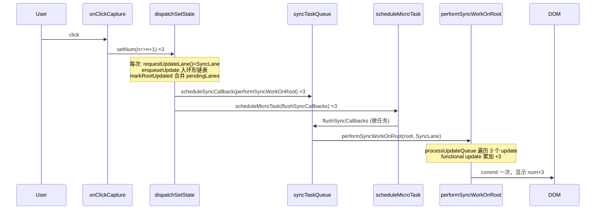
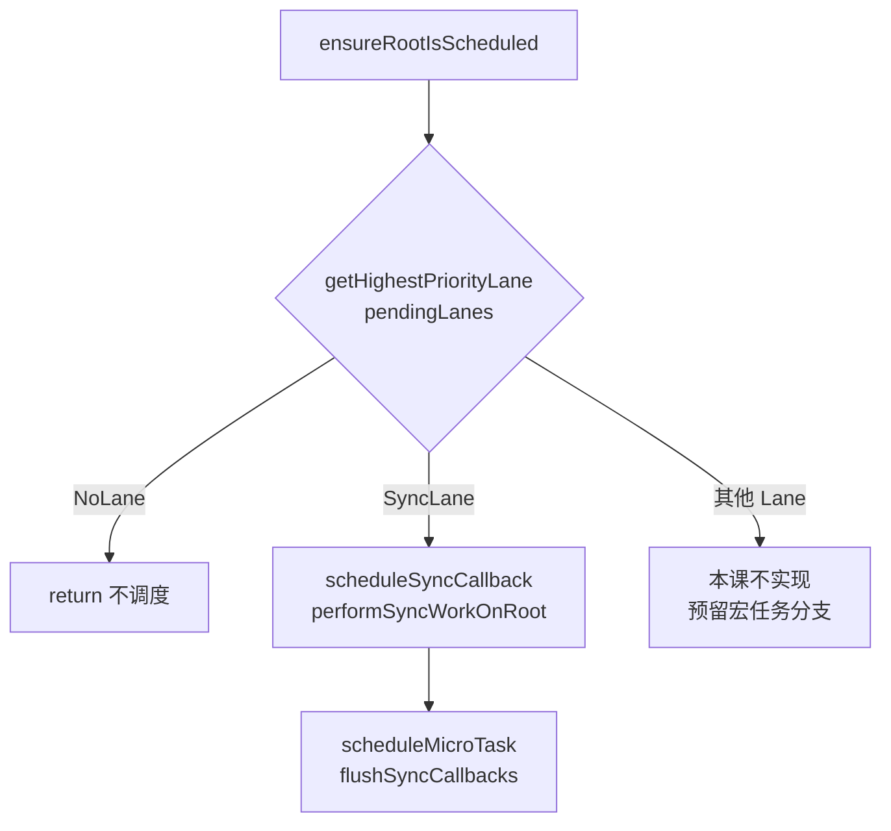

# Spec: Lane 模式（big-react Reconciler 调度能力扩展）
type: utility

> **对齐参考**：[BetaSu/big-react@b77e05c](https://github.com/BetaSu/big-react/commit/b77e05c54ff49039c9872971dfd10069c4f05730)（`feat: 14课`，2023-01-04）。本 spec 以该 commit 的实现语义为准，并补充与当前 JS 代码库的 API 差异适配说明。

## 1. 需求定义

### 1.1 背景与目标

- **解决什么问题**：当前 big-react 的更新调度是「一次 `setState` → 立即同步 render+commit」，同一事件回调内多次 `setState` 会触发多次完整渲染，无法批量合并；Update 队列是单节点覆盖式，无法保留同一次交互内的多个 update。
- **使用方**：`packages/react-reconciler` 内部调度链路；`packages/demos` 用于验证批量更新行为。
- **本课目标（Lane 基础设施）**：引入 Lane 模型骨架，当前仅实现 `SyncLane`，但通过 **Update 环形链表 + renderLane 过滤 + 微任务批调度**，使同一次事件中的多次 `setState` 合并为一次 render，且 state 累加正确（如连调 3 次 `setNum(n => n + 1)` → 最终 +3）。
- **明确不在本 spec 范围**：
  - 多 Lane 优先级（InputContinuousLane、DefaultLane 等）
  - 宏任务 / Scheduler 时间切片
  - `startTransition`、`useDeferredValue`
  - Lane 降级、饥饿、中断恢复

### 1.2 能力范围（Capability Scope）

- **提供的能力：**
  - [ ] `fiberLanes.js`：Lane 类型、`SyncLane` / `NoLane` / `NoLanes`、合并与最高优先级 Lane 计算
  - [ ] `Update` 携带 `lane` + `next`，`enqueueUpdate` 维护环形 pending 链表
  - [ ] `processUpdateQueue` 按 `renderLane` 遍历环形链表，批量消费同 Lane 的 update
  - [ ] `FiberRootNode` 增加 `pendingLanes`、`finishedLane`（及显式 `finishedWork` 字段）
  - [ ] `scheduleUpdateOnFiber(fiber, lane)` → `markRootUpdated` → `ensureRootIsScheduled`
  - [ ] `SyncLane` 走 `syncTaskQueue` + `hostConfig.scheduleMicroTask` 微任务批调度
  - [ ] `renderLane` 从 workLoop 经 `beginWork` 传入 `processUpdateQueue` / `renderWithHooks`
  - [ ] Demo：一次 click 内 3 次 functional `setState`，UI 显示 +3
- **明确不提供的能力：**
  - [ ] 非 SyncLane 的实际调度分支（保留 `ensureRootIsScheduled` 的 else 空壳或 TODO）
  - [ ] Update 优先级饥饿 / 跳过逻辑（`updateLane !== renderLane` 分支仅 DEV 报错）
  - [ ] 并发模式、`flushSync`

### 1.3 待确认项

| 问题 | 当前假设 | 优先级 |
|------|----------|--------|
| 语言 | 参考为 TS，本地实现为 JS（`.js`） | 已确认 |
| `processUpdateQueue` 签名迁移 | 从 `(baseState, queue, fiber)` 改为 `(baseState, pending, renderLane)`，与参考 commit 对齐 | 已确认 |
| Hook 文件命名 | 本地为 `fiberHook.js`（非 `fiberHooks.ts`） | 已确认 |
| `FiberRootNode.finishedWork` | 本地已在 workLoop 动态赋值，spec 要求在 constructor 显式初始化 | 已确认 |
| Demo 形态 | 在 `packages/demos/src/App.jsx` 新增 `LaneDemo` 区块，不替换现有 Fragment/MultiChildren demo | 已确认 |
| 自动化单测 | Vitest；测试放各包 `__tests__/`，Lane 实现时补充 fiberLanes / updateQueue 用例 | 已确认 |

---

## 2. 项目资产对齐（Project Asset Alignment）

### 2.1 复用性审查（Reusability Audit）

| 检查项 | 现有资产 | 状态 | 本次策略 |
|--------|----------|------|----------|
| 调度入口 | `workLoop.js` → `scheduleUpdateOnFiber(fiber)` 同步直跑 | ❌ 需改 | 对齐参考：lane 参数 + 微任务调度 |
| Update 队列 | `updateQueue.js` 单节点覆盖 | ❌ 需改 | 环形链表 + lane 字段 |
| `processUpdateQueue` | 只处理 1 个 update，内部清 pending | ❌ 需改 | 环形遍历 + renderLane 过滤；pending 清理由调用方负责 |
| FiberRoot 状态 | 无 `pendingLanes` / `finishedLane` | ❌ 需增 | 对齐 `fiber.js` |
| Hooks dispatch | `dispatchSetState` 无 lane | ❌ 需改 | `requestUpdateLane` + 传 lane |
| 微任务调度 | 无 | ❌ 新增 | `syncTaskQueue.js` + `hostConfig.scheduleMicroTask` |
| Lane 模块 | 无 | ❌ 新增 | `fiberLanes.js` |
| Fragment / Diff | 已实现 | ✅ 复用 | 回归验证，不改语义 |
| 参考实现 | BetaSu/big-react@b77e05c | ✅ 外部 | 逐文件对照 |

### 2.2 规范对齐（Standard Compliance）

| 规范类别 | 项目规范要求 | 本次应用方式 |
|----------|--------------|--------------|
| **代码规范** | ESLint + Prettier | 改动文件必须通过 lint |
| **目录规范** | reconciler 逻辑在 `packages/react-reconciler/src/` | 新增 `fiberLanes.js`、`syncTaskQueue.js` |
| **依赖方向** | reconciler 通过 `hostConfig` 别名引用 DOM 适配 | `scheduleMicroTask` 放 `react-dom/hostConfig.js` |
| **命名规范** | 本地已有 `fiberHook.js` | 不 rename，仅在原文件扩展 |

### 2.3 与当前代码的关键差异（迁移注意）

当前 `processUpdateQueue(baseState, queue, fiber)` 与参考 commit 不同：

```javascript
// 当前（需替换）
export function processUpdateQueue(baseState, queue, fiber) {
  if (queue !== null) {
    const pending = queue.shared.pending;
    if (pending !== null) {
      queue.shared.pending = null;  // 在函数内部清 pending
      // 只处理单个 update
    }
  }
  return baseState;  // 直接返回 state，非 { memoizedState }
}

// 目标（对齐 b77e05c）
export function processUpdateQueue(baseState, pendingUpdate, renderLane) {
  // 返回 { memoizedState }
  // 环形遍历 pendingUpdate.next
  // 不在此函数内清 pending（HostRoot 在 beginWork 清；Hook render 不清）
}
```

**调用方同步调整：**

| 调用点 | 当前 | 目标 |
|--------|------|------|
| `beginWork` → `updateHostRoot` | 传 `updateQueue`，返回值当 state | 取 `pending`，置 `null`，传 `renderLane`，解构 `{ memoizedState }` |
| `fiberHook` → `updateState` | 传 `queue`，返回值当 state | 取 `queue.shared.pending`，传 `renderLane`，解构 `{ memoizedState }` |

---

## 3. API 设计（API Design）

### 3.1 新增模块：`fiberLanes.js`

| 导出 | 类型 | 说明 |
|------|------|------|
| `Lane` | `number`（typedef 注释） | 单个优先级 lane，位掩码 |
| `Lanes` | `number` | 多个 lane 的集合 |
| `SyncLane` | `0b0001` | 同步优先级（本课唯一可用 lane） |
| `NoLane` | `0b0000` | 空 lane |
| `NoLanes` | `0b0000` | 空 lanes 集合 |
| `mergeLanes(a, b)` | `(Lane, Lane) => Lanes` | 位或合并 |
| `requestUpdateLane()` | `() => Lane` | 本课恒返回 `SyncLane` |
| `getHighestPriorityLane(lanes)` | `(Lanes) => Lane` | `lanes & -lanes` 取最高位 |
| `markRootFinished(root, lane)` | `(FiberRootNode, Lane) => void` | `root.pendingLanes &= ~lane` |

### 3.2 变更模块：`updateQueue.js`

#### `Update` 结构

| 字段 | 类型 | 必填 | 说明 |
|------|------|------|------|
| `action` | `Action<State>` | 是 | 原语义不变 |
| `lane` | `Lane` | 是 | 本次 update 优先级 |
| `next` | `Update \| null` | 是 | 环形链表指针 |

#### `createUpdate(action, lane)`

- 返回 `{ action, lane, next: null }`

#### `enqueueUpdate(updateQueue, update)`

环形链表入队规则（与参考 commit 一致）：

```
pending === null  →  update.next = update        // a → a
pending !== null  →  update.next = pending.next  // 插入环尾
                      pending.next = update
updateQueue.shared.pending = update              // pending 指向环尾
```

#### `processUpdateQueue(baseState, pendingUpdate, renderLane)`

| 参数 | 类型 | 说明 |
|------|------|------|
| `baseState` | `State` | 初始 state |
| `pendingUpdate` | `Update \| null` | 环尾节点；`null` 则跳过 |
| `renderLane` | `Lane` | 当前 render 消费的 lane |

| 返回值 | 说明 |
|--------|------|
| `{ memoizedState }` | 消费完匹配 lane 的 update 后的 state |

**消费算法（伪代码）：**

```
if pendingUpdate === null → return { memoizedState: baseState }

first = pendingUpdate.next
pending = pendingUpdate.next
do {
  if pending.lane === renderLane:
    baseState = apply(pending.action, baseState)
  else if __DEV__:
    console.error('不应该进入 updateLane !== renderLane 逻辑')
  pending = pending.next
} while pending !== first

return { memoizedState: baseState }
```

### 3.3 变更模块：`workLoop.js`

| 函数 | 变更 |
|------|------|
| `scheduleUpdateOnFiber(fiber, lane)` | 新增 `lane` 参数；`markRootUpdated` + `ensureRootIsScheduled` |
| `ensureRootIsScheduled(root)` | 取最高优先级 lane；`SyncLane` → 微任务调度 |
| `performSyncWorkOnRoot(root, lane)` | 替代原直接 `renderRoot`；含 lane 校验与 re-schedule |
| `prepareFreshStack(root, lane)` | 设置 `wipRootRenderLane` |
| `performUnitOfWork(fiber)` | `beginWork(fiber, wipRootRenderLane)` |
| `commitRoot(root)` | 读 `finishedLane`，`markRootFinished`，重置 |

**模块级状态：**

| 变量 | 类型 | 说明 |
|------|------|------|
| `wipRootRenderLane` | `Lane` | 当前 render 使用的 lane，commit 后重置为 `NoLane` |

### 3.4 变更模块：`fiber.js` — `FiberRootNode`

| 字段 | 类型 | 初始值 | 说明 |
|------|------|--------|------|
| `finishedWork` | `FiberNode \| null` | `null` | 显式初始化（本地已有动态赋值） |
| `pendingLanes` | `Lanes` | `NoLanes` | 待处理 update 的 lane 集合 |
| `finishedLane` | `Lane` | `NoLane` | 本次 commit 对应的 lane |

### 3.5 变更模块：`fiberHook.js`

| 变更点 | 说明 |
|--------|------|
| 模块变量 `renderLane` | render 期间记录当前 lane |
| `renderWithHooks(wip, lane)` | 设置/清理 `renderLane` |
| `updateState` | `processUpdateQueue(..., renderLane)` |
| `dispatchSetState` | `requestUpdateLane()` → `createUpdate(action, lane)` → `scheduleUpdateOnFiber(fiber, lane)` |

### 3.6 变更模块：`beginWork.js`

```javascript
export function beginWork(workInProgress, renderLane) {
  switch (workInProgress.tag) {
    case HostRoot:
      return updateHostRoot(workInProgress, renderLane);
    case FunctionComponent:
      return updateFunctionComponent(workInProgress, renderLane);
    // HostComponent / Fragment / HostText 不变
  }
}
```

### 3.7 新增模块：`syncTaskQueue.js`

| 导出 | 说明 |
|------|------|
| `scheduleSyncCallback(cb)` | 追加到同步回调队列 |
| `flushSyncCallbacks()` | 依次执行队列；防重入 `isFlushingSyncQueue` |

### 3.8 变更模块：`react-dom/hostConfig.js`

```javascript
export const scheduleMicroTask =
  typeof queueMicrotask === 'function'
    ? queueMicrotask
    : typeof Promise === 'function'
      ? (callback) => Promise.resolve(null).then(callback)
      : setTimeout;
```

| 环境 | 行为 |
|------|------|
| 现代浏览器 / Node 18+ | `queueMicrotask` |
| 旧环境有 Promise | `Promise.resolve().then` |
| 兜底 | `setTimeout` |

### 3.9 变更模块：`fiberReconciler.js`

`updateContainer` 与 `dispatchSetState` 对称：`requestUpdateLane()` → `createUpdate(element, lane)` → `scheduleUpdateOnFiber(hostRootFiber, lane)`。

---

## 4. 核心流程（Technical Design）

### 4.1 三次 setState 批量更新时序



### 4.2 调度决策（ensureRootIsScheduled）



### 4.3 performSyncWorkOnRoot _lane 校验_

```
nextLane = getHighestPriorityLane(root.pendingLanes)
if nextLane !== SyncLane:
  ensureRootIsScheduled(root)  // 可能有更高优先级插入
  return
// 否则 prepareFreshStack → workLoop → commitRoot → markRootFinished
```

### 4.4 Update 环形链表示意

一次 click 内连续 3 次 `setState` 后：

```
shared.pending = update3
update3.next → update1 → update2 → update3 (环)
每个 update.lane = SyncLane
```

render 时 `processUpdateQueue(baseState, update3, SyncLane)` 从 `update1` 起遍历整环，3 次 functional update 依次作用于 `baseState`。

### 4.5 交付物清单

| 文件 | 操作 |
|------|------|
| `packages/react-reconciler/src/fiberLanes.js` | **新增** |
| `packages/react-reconciler/src/syncTaskQueue.js` | **新增** |
| `packages/react-reconciler/src/updateQueue.js` | **修改** |
| `packages/react-reconciler/src/workLoop.js` | **修改** |
| `packages/react-reconciler/src/fiber.js` | **修改** |
| `packages/react-reconciler/src/fiberHook.js` | **修改** |
| `packages/react-reconciler/src/beginWork.js` | **修改** |
| `packages/react-reconciler/src/fiberReconciler.js` | **修改** |
| `packages/react-dom/src/hostConfig.js` | **修改** |
| `packages/demos/src/App.jsx` | **修改**（新增 LaneDemo） |
| `.ai/architecture.md` | **修改**（调度口径一句） |

---

## 5. 使用示例（Demo 验收场景）

### 5.1 LaneDemo（对齐参考 commit demos/test-fc/main.tsx）

```jsx
function LaneDemo() {
  const [num, setNum] = useState(0);

  return (
    <div>
      <h2>lane demo</h2>
      <ul
        onClickCapture={() => {
          setNum((n) => n + 1);
          setNum((n) => n + 1);
          setNum((n) => n + 1);
        }}
      >
        {num}
      </ul>
      <p>点击 ul：一次交互内 3 次 setState，期望 num +3（非 +1）</p>
    </div>
  );
}
```

### 5.2 预期行为

| 操作 | 改造前 | 改造后 |
|------|--------|--------|
| 初始 | num = 0 | num = 0 |
| 点击 ul 一次 | render 3 次，num = 1（最后一次覆盖前两次） | render 1 次，num = 3 |
| DEV 控制台 | 3 次 render 日志 | 1 次「render阶段开始」+ 1 次 commit |

---

## 6. 非功能需求（Non-Functional）

| 指标 | 目标值 | 测试方法 |
|------|--------|----------|
| 构建 | `pnpm build:dev` 成功 | 本地构建 |
| Lint | `pnpm lint` 无新增 error | 本地 lint |
| 对齐度 | 与 b77e05c 10 个文件语义一致 | PR diff 对照 |
| 行为不退化 | Fragment / MultiChildren demo 正常 | 手工回归 |
| 浏览器 | 支持 `queueMicrotask` 或 Promise 降级 | Chrome / Safari 最新 |

---

## 7. 测试策略与覆盖率矩阵（Testing Strategy）

### 7.1 测试分层

| 测试类型 | 覆盖目标 | 工具 | 通过标准 |
|----------|----------|------|----------|
| 单元测试 | updateQueue / fiberLanes / fiber 工具函数 | Vitest（`pnpm test`） | 全部通过 |
| Demo 手工验收 | 批量 setState + 回归 | `pnpm dev` | 全部 AC 通过 |
| DEV 日志 | 微任务调度、render 次数 | 浏览器控制台 | 符合预期 |
| 参考对照 | 与 b77e05c 行为一致 | 逐文件 diff | 核心路径一致 |
| 静态检查 | lint + build + test | pnpm | 无 error |

### 7.2 功能覆盖率矩阵

| 功能点 | 测试用例 | 场景 | 状态 |
|--------|----------|------|------|
| `createUpdate` 带 lane | 任意 setState | 1/1 | ⬜ |
| 环形 `enqueueUpdate` | 连续 3 次 setState | 1/1 | ⬜ |
| `processUpdateQueue` 批量消费 | functional update ×3 | 1/1 | ⬜ |
| `mergeLanes` + `pendingLanes` | 多次 schedule | 1/1 | ⬜ |
| 微任务批调度 | click 只 commit 1 次 | 1/1 | ⬜ |
| `renderLane` 传递 | HostRoot + FC 均正确 | 2/2 | ⬜ |
| `markRootFinished` | commit 后 pendingLanes 清除 | 1/1 | ⬜ |
| `updateContainer` 带 lane | 首次 render | 1/1 | ⬜ |
| Fragment 回归 | 现有 FragmentDemo | 1/1 | ⬜ |
| MultiChildren 回归 | 现有列表 demo | 1/1 | ⬜ |

### 7.3 复杂场景拆解

| 编号 | 输入 | 预期 | 对齐参考 |
|------|------|------|----------|
| SC-01 | 连续 3 次 `setNum(n=>n+1)` | num +3，render 1 次 | b77e05c demo |
| SC-02 | 单次 `setNum(5)` | num = 5 | 直赋 update |
| SC-03 | mount 后首次 `updateContainer` | 正常首屏 | fiberReconciler |
| SC-04 | Fragment 切换 arr 顺序 | li 顺序正确 | 回归 |
| SC-05 | MultiChildren 切换尾节点 | 无 DOM 残留 | 回归 |
| SC-06 | `performSyncWorkOnRoot` 内 pendingLanes 已变 | re-schedule 不崩溃 | workLoop 边界 |

### 7.4 Lane 实现时需补充的单测（Vitest）

| 测试文件 | 覆盖点 |
|----------|--------|
| `packages/react-reconciler/src/__tests__/fiberLanes.test.js` | `mergeLanes`、`getHighestPriorityLane`、`markRootFinished` |
| `packages/react-reconciler/src/__tests__/updateQueue.test.js` | 环形 `enqueueUpdate`、按 `renderLane` 批量消费、functional update ×3 |
| `packages/react-reconciler/src/__tests__/syncTaskQueue.test.js` | `scheduleSyncCallback` 批执行、防重入 |

运行：`pnpm test`（根目录）或 `pnpm --filter react-reconciler test`。

---

## 8. 任务拆分与并行计划（Task Breakdown）

### 8.1 拆分原则

按参考 commit 文件边界拆分；**模块 A（基础设施）必须先于模块 B（调度链路）**；模块 C 依赖 A+B。

### 8.2 任务卡片

#### 模块 A：Lane + UpdateQueue 基础（Agent-1）

| ID | 任务 | 输出 | 对齐 commit 文件 |
|----|------|------|------------------|
| T-A1 | 新增 `fiberLanes.js` | 全部 lane API | fiberLanes.ts |
| T-A2 | 重构 `updateQueue.js` | lane、环形链表、新 processUpdateQueue 签名 | updateQueue.ts |
| T-A3 | `fiber.js` FiberRootNode 字段 | pendingLanes / finishedLane / finishedWork | fiber.ts |

**CK-1 冻结**：`processUpdateQueue` 返回 `{ memoizedState }`；环形链表入队算法不变。

#### 模块 B：调度 + 传递链路（Agent-2）

| ID | 任务 | 输出 | 对齐 commit 文件 |
|----|------|------|------------------|
| T-B1 | 新增 `syncTaskQueue.js` | 同步回调队列 | syncTaskQueue.ts |
| T-B2 | `hostConfig.scheduleMicroTask` | react-dom 适配 | hostConfig.ts |
| T-B3 | 重构 `workLoop.js` | ensureRootIsScheduled / performSyncWorkOnRoot | workLoop.ts |
| T-B4 | `beginWork` + `fiberHook` + `fiberReconciler` 传 lane | renderLane 全链路 | beginWork.ts, fiberHooks.ts, fiberReconciler.ts |

**CK-2 冻结**：`scheduleUpdateOnFiber(fiber, lane)` 签名；`beginWork(wip, renderLane)` 签名。

#### 模块 C：Demo + 文档（Agent-3）

| ID | 任务 | 输出 |
|----|------|------|
| T-C1 | `App.jsx` 新增 LaneDemo | demos |
| T-C2 | `architecture.md` 更新调度描述 | `.ai/architecture.md` |
| T-C3 | lint + build + test + 全 demo 回归 | 全绿 |

### 8.3 并行时序

```
T-A1 → T-A2 → T-A3 → CK-1
         ↓
(T-B1 ∥ T-B2) → T-B3 → T-B4 → CK-2
         ↓
      T-C1 → T-C2 → T-C3
```

---

## 9. 验收标准（Given-When-Then）

| ID | Given | When | Then |
|----|-------|------|------|
| AC-01 | LaneDemo 已 mount，num=0 | 点击 ul 一次（3 次 functional setState） | num 变为 3 |
| AC-02 | AC-01 场景，DEV 模式 | 观察控制台 | 「render阶段开始」仅 1 次；commit 1 次 |
| AC-03 | AC-01 场景 | 观察控制台 | 出现「在微任务中调度，优先级：1」（SyncLane=0b0001） |
| AC-04 | 单次 `setNum(10)` | 点击触发 | num = 10 |
| AC-05 | FragmentDemo | 切换 arr / 隐藏 Fragment | 行为与改造前一致 |
| AC-06 | MultiChildrenDemo | 切换顺序 / 尾节点 | 行为与改造前一致 |
| AC-07 | commit 完成 | 读 root.pendingLanes | 对应 SyncLane 已清除 |
| AC-08 | 全部改动 | `pnpm lint` + `pnpm build:dev` + `pnpm test` | 无 error |
| AC-09 | 首次 createRoot().render() | 页面正常首屏 | 无报错 |

---

## 10. 验收注意点与重点场景

### 10.1 必验（P0）

| 场景 | 验证点 |
|------|--------|
| 批量 functional update | SC-01：+3 而非 +1 |
| render 次数 | 一次 click 仅 1 次 render+commit |
| 环形链表 | 3 个 update 都被 processUpdateQueue 消费 |
| processUpdateQueue 签名 | beginWork / fiberHook 调用方均已适配 |
| pending 清时机 | HostRoot 在 beginWork 清；Hook render 不清 pending |

### 10.2 易遗漏

| 风险 | 原因 | 验收 |
|------|------|------|
| 仍同步直跑 render | 未接 microtask | AC-02、AC-03 |
| processUpdateQueue 只消费 1 个 update | 未改环形遍历 | AC-01 |
| 返回值仍是 bare state | 未改 `{ memoizedState }` | mount 即报错 |
| `beginWork` 未传 renderLane | 漏改 performUnitOfWork | FC update 行为异常 |
| `enqueueUpdate` 覆盖式 | 未改环形 | AC-01 失败（num=1） |
| flushSyncCallbacks 未清空 syncQueue | 参考实现 omit | 多次 click 重复 render；实现时 flush 后 `syncQueue = null` |
| Fragment/MultiChildren 退化 | updateQueue 签名变更 | AC-05、AC-06 |

### 10.3 回归

- Fragment 三场景 + 删除
- MultiChildren 列表 Diff
- 首次 mount / HMR 热更新（如适用）

---

## 11. 风险与依赖

| 风险 | 缓解 |
|------|------|
| 本地 JS 与参考 TS 签名差异 | 严格按本 spec 迁移表改调用方 |
| `processUpdateQueue` 破坏性变更 | CK-1 后统一改 beginWork + fiberHook |
| 微任务时序与浏览器差异 | hostConfig 三级降级 |
| 后续课程扩展多 Lane | 本 spec 预留 `ensureRootIsScheduled` else 分支，不删 |
| syncQueue 未清空导致重复调度 | 实现时在 flush 后置 `syncQueue = null`（参考 commit 遗漏，本地补齐） |

---

## 12. 发布与版本

- 仓库内课程实现，合并条件：AC-01~AC-09 通过。
- 实现 PR 标题建议：`feat(reconciler): 实现 Lane 模式基础设施`（中文 subject）。

---

**修订记录**

| 版本 | 日期 | 说明 |
|------|------|------|
| v1.0 | 2026-05-24 | 初稿，对齐 BetaSu/big-react@b77e05c（14课 Lane 基础设施） |
