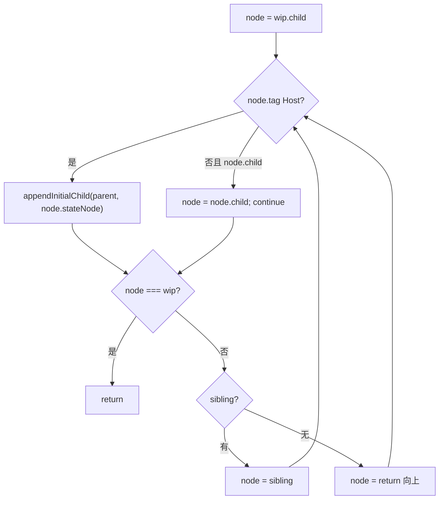
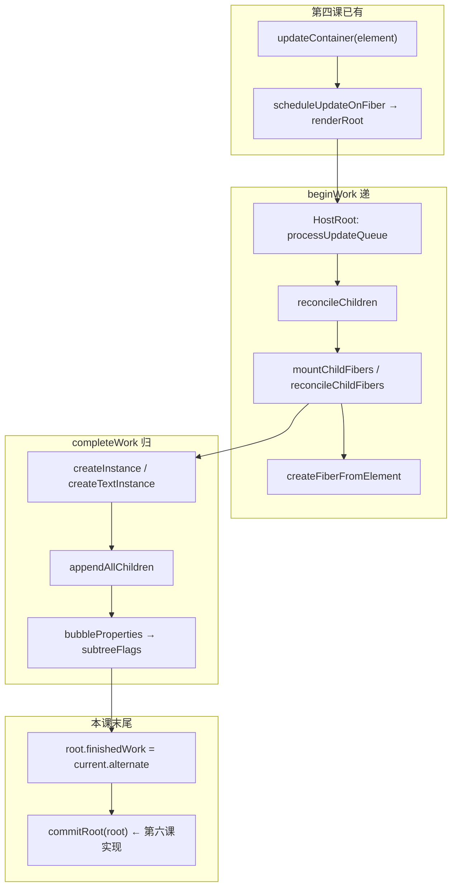

# Spec: BeginWork / ChildFibers / CompleteWork（big-react 第五课 Mount 路径）
type: utility

> **对齐参考**：[BetaSu/big-react@520d963](https://github.com/BetaSu/big-react/commit/520d963d19fbf3f9bada58d13a788e8f3e49667a)（`feat: 第五课`，2022-11-23）。本 spec 以该 commit 的实现语义为准，并补充与当前 JS 代码库的 API / 工程化差异适配说明。
>
> **前置依赖**：第四课（`FiberRootNode`、`createContainer` / `updateContainer`、`processUpdateQueue`、`createWorkInProgress`、Render Phase 双循环）。骨架课见 [`reconciler-scaffold.md`](./reconciler-scaffold.md)。
>
> **后续依赖**：[`commit-phase.md`](./commit-phase.md)（第六课 `commitRoot` / `commitWork` 与真实 `react-dom` Host Config）；多子节点 Diff、FunctionComponent、Props Update 等在后续课程 commit 中补齐。

## 1. 需求定义

### 1.1 背景与目标

- **解决什么问题**：第四课已能 `updateContainer(element)` 并跑完 Render Phase 空壳，但 `beginWork` / `completeWork` 无实质逻辑，Element 无法转成 Fiber 子树，也无法在 complete 阶段组装 Host 节点。本课打通 **「Update → Diff → Complete 建树 → 调用 commitRoot」** 的 Mount 最小路径。
- **使用方**：`packages/react-reconciler` 内部模块；第四课已有的 `fiberReconciler.updateContainer` 调用链。
- **本课目标（Mount 最小闭环）**：
  - `beginWork` 实现 `HostRoot` / `HostComponent` / `HostText` 分支
  - 新增 `childFibers`：`Element` / 文本单节点 Diff（Mount 不跟踪 Placement；Update 跟踪）
  - `createFiberFromElement`：字符串 tag → `HostComponent` Fiber
  - `completeWork`：Mount 时经 `hostConfig` 创建 Host DOM 节点并 `appendAllChildren` 组装子树
  - `subtreeFlags` + `bubbleProperties`：向父 Fiber 冒泡子树副作用标记
  - `renderRoot` 末尾设置 `finishedWork` 并调用 `commitRoot(root)`（**函数体在第六课实现**）
  - Rollup 注入 `__DEV__`（`@rollup/plugin-replace`）
- **明确不在本 spec 范围**：
  - `commitRoot` / `commitWork` 具体实现（第六课）
  - 真实 DOM 操作（本课 `hostConfig` 为 stub，返回空对象）
  - 多 children Diff（`childFibers` 内 TODO：`ul > li*3`）
  - FunctionComponent `beginWork` 分支
  - HostComponent / HostText **Update** 路径（completeWork 中 update 分支为空）
  - Fragment、Deletion、`deleteChild`、key 复用 Diff
  - Lane 调度、Hooks

### 1.2 能力范围（Capability Scope）

- **提供的能力：**
  - [ ] `beginWork(wip)`：`HostRoot` 消费 updateQueue → `reconcileChildren`；`HostComponent` 读 `pendingProps.children` → reconcile
  - [ ] `reconcileChildren(wip, children)`：有 `alternate` 走 `reconcileChildFibers`，否则 `mountChildFibers`
  - [ ] `childFibers.ts`：`REACT_ELEMENT_TYPE` 单 Element、`string | number` 单文本
  - [ ] `placeSingleChild`：仅 `shouldTrackEffects && alternate === null` 时 `flags |= Placement`
  - [ ] `createFiberFromElement(element)`：`type` 为 string → `HostComponent`，否则默认 `FunctionComponent` tag（函数组件尚未在 beginWork 处理）
  - [ ] `FiberNode.subtreeFlags`；`createWorkInProgress` update 时重置 `flags` / `subtreeFlags`
  - [ ] `completeWork`：`HostComponent` / `HostText` mount 分支调用 `createInstance` / `createTextInstance` + `appendAllChildren`
  - [ ] `bubbleProperties(wip)`：聚合子 Fiber 的 `flags | subtreeFlags` 到 `wip.subtreeFlags`
  - [ ] `hostConfig` stub：`createInstance` / `appendInitialChild` / `createTextInstance`
  - [ ] `reconciler.d.ts` 声明全局 `__DEV__`
  - [ ] `updateQueue` 泛型参数由 `Action` 修正为 `State`
  - [ ] `renderRoot` 末尾：`root.finishedWork = root.current.alternate` + `commitRoot(root)`
  - [ ] Rollup `getBaseRollupPlugins` 默认 `replace({ __DEV__: true })`
- **明确不提供的能力：**
  - [ ] 浏览器可见 DOM 更新（stub hostConfig）
  - [ ] Commit 阶段 Placement 落地（第六课）
  - [ ] 数组 children、Fragment Element
  - [ ] FC render、`useState`（后续课）
  - [ ] `subtreeFlags` 在 commit 中的消费（第六课起）

### 1.3 待确认项

| 问题 | 当前假设 | 优先级 |
|------|----------|--------|
| 语言 | 参考为 TS，本地实现为 JS（`.js`） | 已确认 |
| 文件名 | 参考 `childFibers.ts`，本地为 `childFiber.js` | 已确认（语义等价） |
| `commitRoot` 仅调用未定义 | 520d963 末尾已调用，实现属第六课；本课验收以 Render Phase 行为为准 | 已确认 |
| completeWork 在 Render 阶段创建 DOM | 课程渐进式实现，与官方 React 两阶段分离不同；第六课起 commit 接管 | 已确认 |
| Mount 不设 Placement | `mountChildFibers` 的 `shouldTrackEffects=false` | 已确认（对齐 520d963） |
| hostConfig 位置 | 本课在 reconciler 内 stub；第六课迁至 `react-dom` | 已确认 |
| 自动化单测 | Vitest；优先 `createFiberFromElement`、`processUpdateQueue`、`bubbleProperties` | 已确认 |

---

## 2. 项目资产对齐（Project Asset Alignment）

### 2.1 复用性审查（Reusability Audit）

| 检查项 | 现有资产 | 状态 | 本次策略 |
|--------|----------|------|----------|
| Render 双循环 | 第四课 `workLoop.ts` | ✅ 复用 | 扩展 `renderRoot` 末尾 commit 钩子 |
| UpdateQueue | 第四课单节点 pending | ✅ 复用 | 泛型命名修正；HostRoot 仍用 `processUpdateQueue` |
| Fiber 双缓冲 | `createWorkInProgress` | ✅ 扩展 | +`subtreeFlags` 重置 |
| beginWork / completeWork | 空壳 | ❌ 需实现 | 按 520d963 填充 |
| childFibers | 无 | ❌ 新增 | 单节点 Mount/Update |
| Element → Fiber | 无 | ❌ 新增 | `createFiberFromElement` |
| hostConfig | 仅 `Container` 类型 | ❌ 扩展 stub | 第六课替换为 react-dom |
| `__DEV__` | 无 | ❌ 新增 | rollup replace + reconciler.d.ts |
| 参考实现 | BetaSu/big-react@520d963 | ✅ 外部 | 逐文件对照 |
| 本地已扩展 | FC、Fragment、多子 Diff、真实 hostConfig、Lane | ⚠️ 超范围 | 本 spec 以 520d963 核心为准；本地保留扩展 |

### 2.2 规范对齐（Standard Compliance）

| 规范类别 | 项目规范要求 | 本次应用方式 |
|----------|--------------|--------------|
| **代码规范** | ESLint + Prettier | 改动文件必须通过 lint |
| **目录规范** | reconciler 在 `packages/react-reconciler/src/` | 新增 `childFibers`（本地 `childFiber.js`） |
| **ESM 导入** | 显式 `.js` 扩展名 | 本地 JS 实现遵循 |
| **依赖方向** | reconciler → shared；hostConfig 为 alias | 本课 stub 仍在 reconciler；第六课迁出 |
| **Host Config 边界** | L4 属于 react-dom（AGENTS.md） | 本课为过渡 stub，文档标注第六课迁移 |

---

## 3. API 设计（API Design）

### 3.1 内部 API：`beginWork`

```javascript
/**
 * @param {FiberNode} wip
 * @returns {FiberNode|null} 下一个 workInProgress；无子则 null 进入 complete
 */
export function beginWork(wip);
```

| tag | 行为 | 返回值 |
|-----|------|--------|
| `HostRoot` | `processUpdateQueue` → `memoizedState` 作为 children → `reconcileChildren` | `wip.child` |
| `HostComponent` | `pendingProps.children` → `reconcileChildren` | `wip.child` |
| `HostText` | 无子节点 | `null` |
| 其他 | `__DEV__` warn | `null` |

#### `updateHostRoot(wip)`

| 步骤 | 行为 |
|------|------|
| 1 | `baseState = wip.memoizedState` |
| 2 | 取出 `updateQueue.shared.pending`，置 `null` |
| 3 | `{ memoizedState } = processUpdateQueue(baseState, pending)` |
| 4 | `wip.memoizedState = memoizedState`（即 root 的 element 或 null） |
| 5 | `reconcileChildren(wip, memoizedState)` |

> 第四课 `updateContainer` 传入的 `action` 即为 `ReactElement`，故 `memoizedState` 为单次 update 的 element。

#### `reconcileChildren(wip, children?)`

```javascript
function reconcileChildren(wip, children) {
  const current = wip.alternate;
  if (current !== null) {
    wip.child = reconcileChildFibers(wip, current.child, children);
  } else {
    wip.child = mountChildFibers(wip, null, children);
  }
}
```

### 3.2 内部 API：`childFibers`

#### 工厂

```javascript
function ChildReconciler(shouldTrackEffects) { /* ... */ return reconcileChildFibers; }

export const reconcileChildFibers = ChildReconciler(true);  // update：跟踪 Placement
export const mountChildFibers = ChildReconciler(false);     // mount：不跟踪 Placement
```

#### `reconcileChildFibers(returnFiber, currentFiber, newChild?)`

| `newChild` 形态 | 行为 |
|-----------------|------|
| `object` 且 `$$typeof === REACT_ELEMENT_TYPE` | `reconcileSingleElement` → `placeSingleChild` |
| `string` / `number` | `reconcileSingleTextNode` → `placeSingleChild` |
| 其他 | `__DEV__` warn，`null` |

> **本课限制**：不处理数组 children；TODO 注释保留。

#### `reconcileSingleElement`

| 步骤 | 行为（520d963 简化版） |
|------|------------------------|
| 1 | `createFiberFromElement(element)` |
| 2 | `fiber.return = returnFiber` |
| 3 | 返回 fiber（**不**比较 current，不 key diff） |

#### `reconcileSingleTextNode`

| 步骤 | 行为 |
|------|------|
| 1 | `new FiberNode(HostText, { content }, null)` |
| 2 | `fiber.return = returnFiber` |

#### `placeSingleChild(fiber)`

```javascript
function placeSingleChild(fiber) {
  if (shouldTrackEffects && fiber.alternate === null) {
    fiber.flags |= Placement;
  }
  return fiber;
}
```

| 条件 | 结果 |
|------|------|
| mount 路径（`mountChildFibers`） | 永不设 Placement |
| update 路径 + 新 Fiber（无 alternate） | 设 Placement |

### 3.3 内部 API：`createFiberFromElement`

```javascript
/**
 * @param {ReactElementType} element
 * @returns {FiberNode}
 */
export function createFiberFromElement(element);
```

| `element.type` | `fiber.tag` | 说明 |
|----------------|-------------|------|
| `string`（如 `'div'`） | `HostComponent` | 设置 `fiber.type = type` |
| `function` | `FunctionComponent` | 本课 beginWork 未处理，DEV warn 仅非 function 非 string |
| 其他 | `FunctionComponent`（默认） | `__DEV__` warn `为定义的type类型` |

| 字段 | 来源 |
|------|------|
| `pendingProps` | `element.props` |
| `key` | `element.key` |
| `type` | `element.type` |

### 3.4 内部 API：`completeWork`

```javascript
export function completeWork(wip);
```

| tag | Mount（`current === null` 或 `!stateNode`） | Update |
|-----|---------------------------------------------|--------|
| `HostComponent` | `createInstance(type, props)` → `appendAllChildren` → `stateNode = instance` | 空分支（TODO） |
| `HostText` | `createTextInstance(content)` → `stateNode` | 空分支（TODO） |
| `HostRoot` | 仅 `bubbleProperties` | 同左 |

#### `appendAllChildren(parent, wip)`

自 `wip.child` 起深度优先遍历 Fiber 子树，遇到 `HostComponent` / `HostText` 将其 `stateNode` 挂到 `parent`（经 `appendInitialChild`）；穿透非 Host 节点；遇 `wip` 自身终止。



#### `bubbleProperties(wip)`

```javascript
function bubbleProperties(wip) {
  let subtreeFlags = NoFlags;
  let child = wip.child;
  while (child !== null) {
    subtreeFlags |= child.subtreeFlags;
    subtreeFlags |= child.flags;
    child.return = wip;
    child = child.sibling;
  }
  wip.subtreeFlags |= subtreeFlags;
}
```

| 输出 | 含义 |
|------|------|
| `wip.subtreeFlags` | 子树内所有 `flags` 的并集（含子节点的 `subtreeFlags`） |
| `child.return = wip` | 归阶段补全 return 指针 |

### 3.5 内部 API：`hostConfig`（本课 stub）

| 函数 | 签名 | 520d963 行为 |
|------|------|--------------|
| `createInstance` | `(...args) => any` | 返回 `{}` |
| `appendInitialChild` | `(...args) => any` | 返回 `{}` |
| `createTextInstance` | `(...args) => any` | 返回 `{}` |

第六课由 `packages/react-dom/src/hostConfig.ts` 提供真实实现，reconciler 内 stub 删除。

### 3.6 变更：`updateQueue` 泛型

| 变更 | 前 | 后 |
|------|-----|-----|
| `createUpdateQueue` | `<Action>()` | `<State>()` |
| `enqueueUpdate` | `<Action>(queue, update)` | `<State>(queue, update)` |

`processUpdateQueue` 签名不变：`(baseState, pendingUpdate) => { memoizedState }`。

### 3.7 变更：`workLoop.renderRoot`

520d963 在 `workLoop()` 成功后追加：

```javascript
const finishedWork = root.current.alternate;
root.finishedWork = finishedWork;
commitRoot(root);
```

| 字段 | 含义 |
|------|------|
| `finishedWork` | 本轮 Render 产出的 WIP 树（`current.alternate`） |
| `commitRoot` | **本 commit 仅调用**；实现在第六课 |

### 3.8 工程化：`__DEV__`

| 项 | 约定 |
|----|------|
| `reconciler.d.ts` | `declare let __DEV__: boolean;` |
| Rollup | `@rollup/plugin-replace`，默认 `{ __DEV__: true }` |
| 使用点 | `beginWork` / `childFibers` / `completeWork` / `workLoop` catch 内 DEV 分支 |

### 3.9 错误契约

| 场景 | 行为 | 调用方处理 |
|------|------|------------|
| 未实现 reconcile 类型 | `__DEV__` `console.warn` | 仅用 Element / 文本 |
| beginWork 未实现 tag | `__DEV__` warn | 本课仅 Host 三 tag |
| 未定义 element.type | `__DEV__` warn | 使用 string tag |
| workLoop 抛错 | `__DEV__` warn；`workInProgress = null` | 排查 reconcile/complete |
| `commitRoot` 未定义 | 520d963 运行时 ReferenceError | 第六课前无法完整跑通 commit |

---

## 4. 使用示例（Usage Examples）

### 4.1 单次 Mount：`<div>hello</div>`

```
updateContainer(jsx('div', { children: 'hello' }), root)
  → HostRoot updateHostRoot: memoizedState = element
  → reconcileChildren → mountChildFibers
  → childFibers: HostComponent fiber + HostText fiber（无 Placement flag）
  → completeWork HostComponent: createInstance('div') + appendAllChildren(挂载 text stateNode)
  → completeWork HostText: createTextInstance('hello')
  → bubbleProperties 向上聚合 subtreeFlags
  → renderRoot 末尾 commitRoot(root)  // 第六课起生效
```

### 4.2 Element 嵌套

```jsx
// jsx('div', { id: 'app' }, jsx('span', null, 'hi'))
// HostRoot → div Fiber → span Fiber → HostText 'hi'
// appendAllChildren 在 div complete 时收集 span/text 的 stateNode
```

### 4.3 Update 路径（第二 render 同结构）

```
reconcileChildren 走 reconcileChildFibers(shouldTrackEffects=true)
  → 新建 Fiber 无 alternate → flags |= Placement
  → completeWork update 分支仍为空（本课不更新 DOM props/text）
```

---

## 5. 技术方案（Technical Design）

### 5.1 交付物清单（文件级，对齐 520d963）

| # | 文件 | 改动摘要 |
|---|------|----------|
| D1 | `packages/react-reconciler/src/beginWork.ts` | HostRoot / HostComponent / reconcileChildren |
| D2 | `packages/react-reconciler/src/childFibers.ts` | 新增；单 Element / 单文本 Diff |
| D3 | `packages/react-reconciler/src/completeWork.ts` | Host mount + appendAllChildren + bubbleProperties |
| D4 | `packages/react-reconciler/src/fiber.ts` | +`subtreeFlags`；+`createFiberFromElement` |
| D5 | `packages/react-reconciler/src/hostConfig.ts` | stub 三个 Host API |
| D6 | `packages/react-reconciler/src/reconciler.d.ts` | 声明 `__DEV__` |
| D7 | `packages/react-reconciler/src/updateQueue.ts` | 泛型 `State` 命名修正 |
| D8 | `packages/react-reconciler/src/workLoop.ts` | finishedWork + commitRoot 调用；DEV catch |
| D9 | `scripts/rollup/utils.js` | +`@rollup/plugin-replace` |
| D10 | 根 `package.json` | dependencies 增加 `@rollup/plugin-replace` |

### 5.2 Render Phase 数据流



### 5.3 Fiber 字段扩展

```
FiberNode {
  flags: Flags           // 本 Fiber 副作用
  subtreeFlags: Flags    // 子树副作用并集（本课新增）
  // createWorkInProgress update 时 flags/subtreeFlags 重置为 NoFlags
}
```

### 5.4 与官方 React 的差异（课程刻意简化）

| 维度 | 官方 React | 本课 520d963 |
|------|------------|--------------|
| DOM 创建时机 | completeWork 准备 + commit 应用 | completeWork mount 直接调 hostConfig |
| 首次 Mount Placement | commit 插入 DOM | mountChildFibers 不设 Placement |
| commitRoot | 同文件完整实现 | 仅调用，第六课补全 |
| Diff | 完整 key/type 比较 | 单节点直接 create |

### 5.5 异常兜底

| 输入 | 处理方式 |
|------|----------|
| `newChild` 为 `undefined` | warn，返回 `null` |
| `children` 为数组 | warn（TODO），返回 `null` |
| `commitRoot` 未实现 | 运行时报错；Render Phase 单测仍可验 |

---

## 6. 非功能需求（Non-Functional）

| 指标 | 目标值 | 测试方法 |
|------|--------|----------|
| 构建 | `pnpm build:dev` 成功 | 本地构建 |
| Lint | `pnpm lint` 无新增 error | 本地 lint |
| 对齐度 | 与 520d963 核心 10 文件语义一致 | PR diff 对照 |
| `__DEV__` | Rollup 替换生效 | 构建产物无裸 `__DEV__` 引用报错 |
| 类型 | TS 参考编译通过 | 参考仓库 tsc |

---

## 7. 测试策略与覆盖率矩阵（Testing Strategy）

### 7.1 测试分层

| 测试类型 | 覆盖目标 | 工具 | 通过标准 |
|----------|----------|------|----------|
| 单元测试 | createFiberFromElement、bubbleProperties、childFibers 单节点 | Vitest | 全部 AC 通过 |
| Render 集成 | mock hostConfig 记录 create/append 调用次序 | Vitest | 建树顺序正确 |
| 参考对照 | 与 520d963 行为一致 | 逐函数对照 | 核心路径一致 |
| E2E | 需第六课 commit + react-dom | demos | 本课不强制 |

### 7.2 功能覆盖率矩阵

| 功能点 | 测试用例 | 场景 | 状态 |
|--------|----------|------|------|
| createFiberFromElement string tag | type='div' | 1/1 | ⬜ |
| createFiberFromElement 非 string | function type | 1/1 | ⬜ |
| mountChildFibers Element | 单 div | 1/1 | ⬜ |
| mountChildFibers Text | 'hello' | 1/1 | ⬜ |
| mount 无 Placement | alternate null + mountChildFibers | 1/1 | ⬜ |
| reconcileChildFibers Placement | update + 新 fiber | 1/1 | ⬜ |
| updateHostRoot | pending element | 1/1 | ⬜ |
| appendAllChildren | div>span>text | 1/1 | ⬜ |
| bubbleProperties | 两层 Host | 1/1 | ⬜ |
| subtreeFlags 重置 | createWorkInProgress update | 1/1 | ⬜ |
| finishedWork 赋值 | renderRoot 后 | 1/1 | ⬜ |
| updateQueue 泛型 | enqueue + process | 1/1 | ⬜ |

### 7.3 复杂场景拆解

| 编号 | 输入 | 预期 | 对齐参考 |
|------|------|------|----------|
| SC-01 | `jsx('div', null, 'a')` | HostText content='a'；div stateNode 经 append 含 text | 520d963 |
| SC-02 | `jsx('div', { id: '1' }, jsx('p', null, 'x'))` | 三层 Fiber；complete 时 append 顺序 p 再 text | 520d963 |
| SC-03 | 第二次相同 updateContainer | reconcileChildFibers；新 fiber 带 Placement | 520d963 |
| SC-04 | mock hostConfig | createInstance 调用 1 次/HostComponent | 520d963 |
| SC-05 | bubbleProperties | 父 subtreeFlags 含子 Placement | 520d963 |
| SC-06 | 数组 children | warn + child=null | TODO 边界 |

### 7.4 建议单测（Vitest）

| 测试文件 | 覆盖点 |
|----------|--------|
| `packages/react-reconciler/src/__tests__/createFiberFromElement.test.js` | tag/type/key/props |
| `packages/react-reconciler/src/__tests__/childFibers.mount.test.js` | 单 element/text、无 Placement |
| `packages/react-reconciler/src/__tests__/bubbleProperties.test.js` | flags 聚合 |
| `packages/react-reconciler/src/__tests__/appendAllChildren.test.js` | mock hostConfig 调用序 |

运行：`pnpm test`。

---

## 8. 任务拆分与并行计划（Task Breakdown）

### 8.1 拆分原则

按 520d963 文件边界：**Fiber 扩展 → Diff（childFibers）→ beginWork → completeWork → workLoop / 工程化**。

### 8.2 任务卡片

#### 模块 A：Fiber + Element（Agent-1）

| ID | 任务 | 输出 | 对齐 commit 文件 |
|----|------|------|------------------|
| T-A1 | `subtreeFlags` + WIP 重置 | `fiber.ts` | fiber.ts |
| T-A2 | `createFiberFromElement` | `fiber.ts` | fiber.ts |
| T-A3 | updateQueue 泛型修正 | `updateQueue.ts` | updateQueue.ts |

**CK-1 冻结**：`createFiberFromElement` 字段映射；`subtreeFlags` 初始 `NoFlags`。

#### 模块 B：Diff + BeginWork（Agent-2）

| ID | 任务 | 输出 | 对齐 commit 文件 |
|----|------|------|------------------|
| T-B1 | `childFibers` 全文件 | `childFibers.ts` | childFibers.ts |
| T-B2 | `beginWork` 三分支 + reconcileChildren | `beginWork.ts` | beginWork.ts |

**CK-2 冻结**：`mountChildFibers(false)` / `reconcileChildFibers(true)`；单节点 reconcile 语义。

#### 模块 C：Complete + 收尾（Agent-3）

| ID | 任务 | 输出 | 对齐 commit 文件 |
|----|------|------|------------------|
| T-C1 | completeWork + append + bubble | `completeWork.ts` | completeWork.ts |
| T-C2 | hostConfig stub + reconciler.d.ts | `hostConfig.ts` | hostConfig.ts |
| T-C3 | renderRoot finishedWork + commitRoot 调用 | `workLoop.ts` | workLoop.ts |
| T-C4 | rollup __DEV__ + 依赖 | `utils.js`, package.json | 同左 |

### 8.3 并行时序

```
T-A1 → T-A3 → CK-1 → (T-B1 → T-B2 → CK-2) ∥ (T-C2)
              ↓
         T-C1 → T-C3 → T-C4
```

---

## 9. 验收标准（Given-When-Then）

| ID | Given | When | Then |
|----|-------|------|------|
| AC-01 | `createFiberFromElement(jsx('div', { id: '1' }))` | 检查 Fiber | `tag=HostComponent`，`type='div'`，`pendingProps.id='1'` |
| AC-02 | HostRoot 有 pending element update | `beginWork(wip)` | `wip.child` 为 HostComponent Fiber |
| AC-03 | mount 路径 reconcile | 检查子 fiber.flags | **无** Placement |
| AC-04 | update 路径 reconcile 新 fiber | 检查 flags | 含 Placement |
| AC-05 | mock hostConfig | completeWork HostComponent mount | `createInstance` 与 `appendInitialChild` 被调用 |
| AC-06 | div>text 结构 complete 结束 | 读 bubble 后 root.subtreeFlags | 反映子树 flags 并集 |
| AC-07 | renderRoot 成功结束 | 读 root | `finishedWork === root.current.alternate` |
| AC-08 | `__DEV__` 为 true | 非法 reconcile 类型 | 输出 warn 而非 silent |
| AC-09 | 全部改动 | `pnpm lint` + `pnpm test` | 无 error |

> **说明**：AC-07 不要求 `commitRoot` 执行成功（520d963 无函数体）；完整端到端 DOM 验收在第六课。

---

## 10. 验收注意点与重点场景

### 10.1 必验（P0）

| 场景 | 验证点 |
|------|--------|
| HostRoot 消费 update | memoizedState 即 element（AC-02） |
| mount vs update Diff 工厂 | mount 无 Placement / update 有（AC-03、AC-04） |
| appendAllChildren | 子 Host stateNode 挂到父 instance（AC-05） |
| bubbleProperties | return 指针 + subtreeFlags（AC-06） |
| finishedWork | AC-07 |

### 10.2 易遗漏

| 风险 | 原因 | 验收 |
|------|------|------|
| beginWork 仍为空 | 未合入第五课 | AC-02 失败 |
| mount 误设 Placement | 误用 reconcileChildFibers 做 mount | AC-03 |
| completeWork 未 bubble | 漏 HostRoot 分支 | AC-06 |
| WIP 未重置 subtreeFlags | update 残留旧 flags | SC-05 |
| hostConfig 未 stub | completeWork 抛错 | AC-05 |
| 数组 children 未 warn | 超前实现多子 Diff | 应用 SC-06 边界 |
| commitRoot 期望 DOM | 520d963 无实现 | 文档边界，第六课再验 |

### 10.3 回归

第四课 `updateContainer` + `scheduleUpdateOnFiber` 仍可触发 render；骨架 workLoop 双循环不退化。

---

## 11. 风险与依赖

| 风险 | 缓解 |
|------|------|
| commitRoot 未定义导致运行时错误 | spec 标注边界；集成测试 mock commitRoot |
| completeWork 内建 DOM 与第六课 commit 冲突 | 第六课迁移 hostConfig 并调整 complete/commit 职责 |
| 本地 childFiber 已大幅扩展 | 对照 520d963 单节点语义，扩展项单独回归 |
| TS → JS 迁移 | 逻辑对齐；`childFibers.ts` → `childFiber.js` |
| `NoFlags = 0b0000001` 非 0 | 对齐参考 commit；后续课可修正 |

---

## 12. 参考 commit 文件对照表

| 参考文件（520d963） | 本地目标文件 | 变更类型 |
|---------------------|--------------|----------|
| `packages/react-reconciler/src/beginWork.ts` | `beginWork.js` | 扩展 |
| `packages/react-reconciler/src/childFibers.ts` | `childFiber.js` | 新增（本地已演进） |
| `packages/react-reconciler/src/completeWork.ts` | `completeWork.js` | 扩展 |
| `packages/react-reconciler/src/fiber.ts` | `fiber.js` | 扩展 |
| `packages/react-reconciler/src/hostConfig.ts` | 第六课迁到 `react-dom/src/hostConfig.js` | stub → 删除 |
| `packages/react-reconciler/src/reconciler.d.ts` | 可选保留或改用构建 define | 新增 |
| `packages/react-reconciler/src/updateQueue.ts` | `updateQueue.js` | 泛型修正 |
| `packages/react-reconciler/src/workLoop.ts` | `workLoop.js` | 扩展 |
| `scripts/rollup/utils.js` | `scripts/rollup/utils.js` | 扩展 |
| 根 `package.json` | 根 `package.json` | +replace 依赖 |

---

## 13. 与当前代码库差异摘要

| 维度 | 520d963 | 当前 big-react |
|------|---------|----------------|
| 语言 | TypeScript | JavaScript + `.js` 扩展名 |
| childFibers 文件名 | `childFibers.ts` | `childFiber.js` |
| Diff 能力 | 单 element / 单 text | 多子数组、Fragment、Deletion、key 复用 |
| beginWork | 仅 HostRoot/HostComponent/HostText | +FunctionComponent、Fragment、renderLane |
| completeWork | mount only | +FC/Fragment bubble、HostText Update flag |
| hostConfig | reconciler 内 stub | `react-dom/src/hostConfig.js` 真实 DOM |
| commitRoot | 仅调用 | 完整 mutation commit |
| processUpdateQueue | 单 pending | Lane 环形链表（lane-mode） |
| __DEV__ | Rollup replace | 本地 rollup 可能未注入，console 未分支 |
| Hooks | 无 | useState、useEffect 已实现 |

实现或审查时：**Mount 单节点 Diff、completeWork 建树、bubbleProperties 以 520d963 为准**；本地扩展项（Fragment、Lane、Hooks 等）单独回归，不反向改变本课核心语义。

---

**修订记录**

| 版本 | 日期 | 说明 |
|------|------|------|
| v1.0 | 2026-05-31 | 初稿，对齐 BetaSu/big-react@520d963（第五课 BeginWork / ChildFibers / CompleteWork） |
