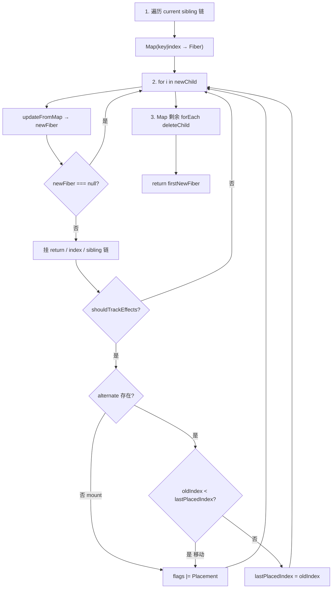
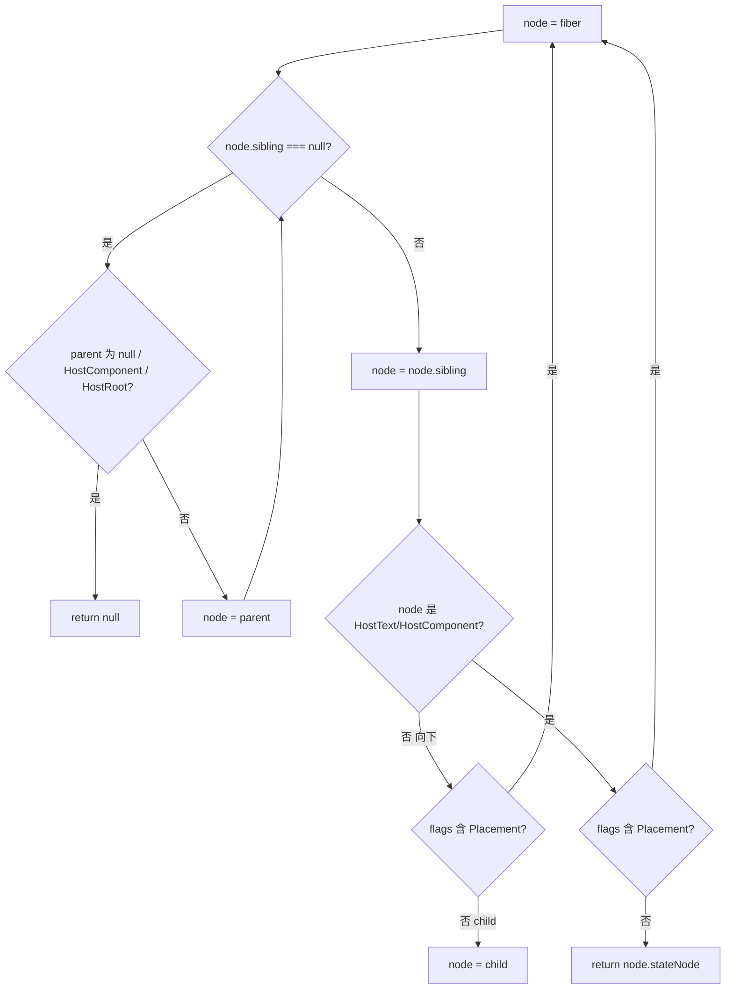

# Spec: 多子节点 Diff 与 Placement 移动（big-react 第十二课）
type: utility

> **对齐参考**：[BetaSu/big-react@8f38c73](https://github.com/BetaSu/big-react/commit/8f38c7357393fe6b645b44930a7e4ac4f921684e)（`feat: 12课`，2022-12-24）。本 spec 以该 commit 的实现语义为准，并补充与当前 JS 代码库的演进差异说明。
>
> **前置依赖**：[`update-reconcile-commit.md`](./update-reconcile-commit.md)（第十课：单节点 update reconcile、`deleteChild`、`useFiber`、`ChildDeletion`）。[`commit-phase.md`](./commit-phase.md)（第六课：`commitPlacement` / `appendChildToContainer` 基础）。
>
> **后续依赖**：[`fragment.md`](./fragment.md)（Fragment 与 key 纠错）；嵌套数组 children、HostComponent props Update 等在后续课程 commit 中补齐。

## 1. 需求定义

### 1.1 背景与目标

- **解决什么问题**：第十课 `childFibers` 仅支持 **单 Element / 单 Text** 的 update reconcile；当 JSX 返回 **数组 children**（如 `<ul>{[<li key="1"/>, ...]}</ul>`）时无法 Diff，且 reorder 时无法 **移动 DOM 节点**（只能 append）。本课实现 **多子节点 key/index Diff** 与 **Placement 移动**（`insertBefore`）。
- **使用方**：
  - 应用 / demos：带 key 的列表 reorder（如点击切换 `[1,2,3]` ↔ `[3,2,1]`）
  - `packages/react-reconciler`：`childFibers`、`commitWork`
  - `packages/react-dom`：`hostConfig.insertChildToContainer`
- **本课目标（多子 Diff + 移动 Placement 最小闭环）**：
  - `deleteRemainingChildren`：复用命中后删除 sibling 链剩余旧 fiber
  - `reconcileSingleElement` / `reconcileSingleTextNode`：由单 `currentFiber` 改为 **sibling 链 while 遍历**
  - `reconcileChildrenArray`：Map 存 current → 遍历 newChild → `lastPlacedIndex` 判定移动 → 剩余 Map 删除
  - `updateFromMap`：按 key/index 从 Map 取 fiber，HostText / ReactElement 复用或新建
  - `reconcileChildFibers`：`Array.isArray(newChild)` 分支调用 `reconcileChildrenArray`
  - `hostConfig.insertChildToContainer`：`container.insertBefore(child, before)`
  - `getHostSibling` + `insertOrAppendPlacementNodeIntoContainer`：Placement 时 insertBefore 而非仅 append
  - demo：`test-fc` 列表 key reorder 验证
- **明确不在本 spec 范围**：
  - Fragment Element 作为 reconcile 子类型（[`fragment.md`](./fragment.md)）
  - 嵌套数组 child（`updateFromMap` 内 TODO warn）
  - HostComponent props diff（仍无 Update flag）
  - `useEffect` unmount、Lane 传参
  - SyntheticEvent（第十一课独立；demo 使用 `onClickCapture` 仅为触发 setState）

### 1.2 能力范围（Capability Scope）

- **提供的能力：**
  - [ ] `deleteRemainingChildren(returnFiber, currentFirstChild)`：沿 sibling 链逐个 `deleteChild`
  - [ ] `reconcileSingleElement` update：while 遍历 sibling；key+type 命中 → `useFiber` + `deleteRemainingChildren(sibling)`；key 不同 → delete 并继续 sibling
  - [ ] `reconcileSingleTextNode` update：while 遍历；`HostText` 命中 → `useFiber` + `deleteRemainingChildren(sibling)`
  - [ ] `reconcileChildrenArray(returnFiber, currentFirstChild, newChild[])`：完整多子 Diff + sibling 链构建
  - [ ] `updateFromMap`：key 优先、否则 index；文本 / Element 复用逻辑
  - [ ] `lastPlacedIndex` 移动检测：`oldIndex < lastPlacedIndex` → `flags |= Placement`
  - [ ] Map 剩余 fiber → `deleteChild`（ChildDeletion）
  - [ ] `insertChildToContainer(child, container, before)` hostConfig API
  - [ ] `getHostSibling(fiber)`：找 Placement 目标的前一个 Host DOM 兄弟
  - [ ] `commitPlacement`：有 sibling 则 `insertBefore`，否则 `appendChild`
- **明确不提供的能力：**
  - [ ] Fragment、嵌套数组 reconcile
  - [ ] 无 key 列表的稳定 identity（仅 index fallback）
  - [ ] 双端 Diff、O(n) 以外优化
  - [ ] Placement 以外的移动策略（如 reorder 全量 remove+append）

### 1.3 待确认项

| 问题 | 当前假设 | 优先级 |
|------|----------|--------|
| 语言 | 参考 TS，本地 JS（`.js` + JSDoc） | 已确认 |
| 文件名 | 参考 `childFibers.ts` | 本地 `childFiber.js` | 已确认 |
| Map key | `current.key !== null ? key : index` | 与参考 commit 一致 | 已确认 |
| `getHostSibling` 终止条件 | 到达 `HostComponent` / `HostRoot` 且无 sibling 返回 null | 已确认 |
| 移动判定 | 仅 `oldIndex < lastPlacedIndex` 打 Placement | 已确认 |
| 自动化单测 | reconcileChildrenArray、lastPlacedIndex、getHostSibling | 已确认 |
| demo 验收 | ul>li reorder 点击后 DOM 顺序正确 | 推荐手工 |

---

## 2. 项目资产对齐（Project Asset Alignment）

### 2.1 复用性审查（Reusability Audit）

| 检查项 | 现有资产 | 状态 | 本次策略 |
|--------|----------|------|----------|
| deleteChild / useFiber | update-reconcile-commit | ✅ 复用 | 扩展调用场景 |
| reconcileChildFibers 单节点 | 第十课 | ✅ 扩展 | sibling while + 数组分支 |
| commitPlacement append | commit-phase | ✅ 扩展 | +insertBefore 路径 |
| hostConfig append/remove | 第十课 | ✅ 扩展 | +insertChildToContainer |
| Fragment reconcile | fragment.md | ⚠️ 后续课 | 本课不含 |
| 参考实现 | BetaSu/big-react@8f38c73 | ✅ 外部 | 逐文件对照 |
| 本地已扩展 | Fragment、Lane、props Update | ⚠️ 超范围 | 本 spec 以 8f38c73 核心为准 |

### 2.2 规范对齐（Standard Compliance）

| 规范类别 | 项目规范要求 | 本次应用方式 |
|----------|--------------|--------------|
| **代码规范** | ESLint + Prettier | 改动文件必须通过 lint |
| **Host Config 边界** | L4 属于 `react-dom` | `insertChildToContainer` 在 hostConfig |
| **ESM 导入** | 显式 `.js` 扩展名 | 本地 JS 遵循 |
| **fiberFlags** | Placement 用于移动/插入 | reconcile + commit 联动 |

---

## 3. API 设计（API Design）

### 3.1 `deleteRemainingChildren`

```javascript
function deleteRemainingChildren(returnFiber, currentFirstChild) {
  if (!shouldTrackEffects) return;
  let childToDelete = currentFirstChild;
  while (childToDelete !== null) {
    deleteChild(returnFiber, childToDelete);
    childToDelete = childToDelete.sibling;
  }
}
```

| 调用场景 | 说明 |
|----------|------|
| 单节点 reconcile 命中复用 | 删除 `currentFiber.sibling` 及之后所有旧 fiber |
| key 相同 type 不同 | 删除从 `currentFiber` 起的整条 sibling 链 |

### 3.2 单节点 reconcile 改为 sibling 链遍历

#### `reconcileSingleElement`（update 路径变化）

| 旧行为（第十课） | 新行为（本课） |
|------------------|----------------|
| 仅比较 `currentFiber` 一个节点 | `while (currentFiber !== null)` 遍历 sibling |
| key 不同 → delete 一个 → break | key 不同 → delete → `currentFiber = sibling` 继续 |
| 复用后无 sibling 清理 | 复用 → `deleteRemainingChildren(returnFiber, currentFiber.sibling)` |

#### `reconcileSingleTextNode`（同理）

| 条件 | 行为 |
|------|------|
| `currentFiber.tag === HostText` | `useFiber` + `deleteRemainingChildren(sibling)` |
| 否则 | `deleteChild` → `currentFiber = sibling` |

### 3.3 `reconcileChildrenArray`（核心算法）



#### 模块变量

| 变量 | 类型 | 说明 |
|------|------|------|
| `lastPlacedIndex` | `number` | 上一个 **未移动** 复用节点在 current 中的 index；初值 `0` |
| `firstNewFiber` / `lastNewFiber` | `FiberNode \| null` | 新 sibling 链头尾 |
| `existingChildren` | `Map<string \| number, FiberNode>` | current 子树索引 |

#### 构建 Map

```javascript
const existingChildren = new Map();
let current = currentFirstChild;
while (current !== null) {
  const keyToUse = current.key !== null ? current.key : current.index;
  existingChildren.set(keyToUse, current);
  current = current.sibling;
}
```

#### 移动 vs 不移动（Placement 判定）

| 条件 | `flags` | `lastPlacedIndex` |
|------|---------|-------------------|
| `newFiber.alternate === null`（mount） | `\|= Placement` | 不变 |
| `alternate.index < lastPlacedIndex` | `\|= Placement`（需 DOM 移动） | 不变 |
| `alternate.index >= lastPlacedIndex` | 不打 Placement | 更新为 `alternate.index` |

> **语义**：若复用节点在旧树中的 index **不小于** 已放置的最右 index，则相对顺序未变；否则需 insertBefore 调整 DOM 顺序。

#### 收尾删除

```javascript
existingChildren.forEach((fiber) => {
  deleteChild(returnFiber, fiber);
});
```

未在新 children 中出现的 old fiber 全部标记 `ChildDeletion`。

### 3.4 `updateFromMap`

```javascript
function updateFromMap(returnFiber, existingChildren, index, element) {
  const keyToUse = element.key !== null ? element.key : index;
  const before = existingChildren.get(keyToUse);
  // ...
}
```

| `element` 类型 | Map 命中且可复用 | 未命中 / 不可复用 |
|----------------|------------------|-------------------|
| `string \| number` | `before.tag === HostText` → `useFiber` + delete from Map | `new FiberNode(HostText, ...)` |
| `ReactElement` | `before.type === element.type` → `useFiber` + delete from Map | `createFiberFromElement` |
| 嵌套 `Array` | — | DEV warn「还未实现数组类型的child」 |
| 其他 | — | 返回 `null`（reconcile 循环 continue） |

### 3.5 `reconcileChildFibers` 入口扩展

```javascript
if (typeof newChild === 'object' && newChild !== null) {
  switch (newChild.$$typeof) {
    case REACT_ELEMENT_TYPE:
      // ...
  }
  if (Array.isArray(newChild)) {
    return reconcileChildrenArray(returnFiber, currentFiber, newChild);
  }
}
```

### 3.6 `hostConfig.insertChildToContainer`

```javascript
export function insertChildToContainer(child, container, before) {
  container.insertBefore(child, before);
}
```

| 参数 | 类型 | 说明 |
|------|------|------|
| `child` | `Instance` | 待插入 DOM 节点 |
| `container` | `Container` | 父容器 |
| `before` | `Instance` | 参考兄弟节点；insertBefore 第二个参数 |

### 3.7 `getHostSibling` 与 Placement 提交

#### `getHostSibling(fiber)` 算法概要



| 返回值 | commitPlacement 行为 |
|--------|-------------------|
| `null` | `appendChildToContainer` |
| Host DOM 节点 | `insertChildToContainer(stateNode, hostParent, sibling)` |

#### `insertOrAppendPlacementNodeIntoContainer`

替换原 `appendPlacementNodeIntoContainer`：

| `finishedWork.tag` | 行为 |
|--------------------|------|
| `HostComponent` / `HostText` | 有 `before` → insert；否则 append |
| 其他 | 递归 `child` / `sibling` 链（**注意**：递归子节点时不传 `before`，仅顶层 Placement fiber 使用 sibling） |

### 3.8 端到端数据流

```mermaid
sequenceDiagram
  participant App as setState reorder arr
  participant CF as reconcileChildrenArray
  participant CW as completeWork
  participant CR as commitRoot
  participant CP as commitPlacement
  participant HC as hostConfig

  App->>CF: newChild 数组 key 顺序变化
  CF->>CF: Map 复用 fiber; oldIndex < lastPlacedIndex
  CF->>CF: newFiber.flags |= Placement
  CF->>CF: Map 剩余 deleteChild
  CR->>CP: commitMutationEffects Placement
  CP->>CP: getHostSibling(finishedWork)
  CP->>HC: insertChildToContainer 或 appendChild
```

### 3.9 错误契约

| 场景 | 行为 | 调用方处理 |
|------|------|------------|
| 未实现 element 类型 | DEV warn + return null | 不使用该类型作 child |
| 嵌套数组 child | DEV warn | 扁平化后再 reconcile |
| `getHostSibling` 找不到 | 返回 null → append | 顺序仍正确但可能性能差 |
| 无 key 仅 index | index 作 Map key | reorder 时可能错误复用；应加 key |

---

## 4. 使用示例（Usage Examples）

### 4.1 列表 reorder（demo）

```javascript
function App() {
  const [num, setNum] = useState(100);
  const arr =
    num % 2 === 0
      ? [<li key="1">1</li>, <li key="2">2</li>, <li key="3">3</li>]
      : [<li key="3">3</li>, <li key="2">2</li>, <li key="1">1</li>];
  return <ul onClickCapture={() => setNum(num + 1)}>{arr}</ul>;
}
// 点击：复用 3 个 li fiber；移动项打 Placement；commit insertBefore 调整 DOM 顺序
// 不匹配的 key 会 deleteChild；本例 key 集合相同仅顺序变
```

### 4.2 新增列表项

```javascript
// [<li key="1"/>] → [<li key="1"/>, <li key="2"/>]
// key="2" 无 alternate → flags |= Placement → append 或 insert
```

### 4.3 删除列表项

```javascript
// Map 中 key="2" 未出现在 newChild → deleteChild → commit ChildDeletion
```

### 4.4 单节点 sibling 清理

```javascript
// return <div key="a"/>  更新为  <span key="a"/>
// while 找到 key 相同 type 不同 → deleteRemainingChildren 删除旧 sibling 链
```

---

## 5. 技术方案（Technical Design）

### 5.1 交付物清单（文件级，对齐 8f38c73）

| # | 文件 | 改动摘要 |
|---|------|----------|
| D1 | `packages/react-reconciler/src/childFibers.ts` | deleteRemainingChildren、数组 Diff、单节点 while、sibling 链 |
| D2 | `packages/react-reconciler/src/commitWork.ts` | getHostSibling、insertOrAppendPlacementNodeIntoContainer |
| D3 | `packages/react-dom/src/hostConfig.ts` | insertChildToContainer |
| D4 | `demos/test-fc/main.tsx` | ul + li 数组 reorder demo |

### 5.2 与第十课 Diff 对比

| 维度 | 第十课 | 本课 |
|------|--------|------|
| children 形态 | 单 Element / 单 Text | +数组 |
| current 比较 | 单个 currentFiber | sibling 链 / Map |
| 删除 | deleteChild 单个 | +deleteRemainingChildren、Map 批量 |
| Placement 含义 | 新 mount / update 新 fiber | +**移动**（reorder） |
| commit 插入 | 仅 appendChild | +insertBefore |

### 5.3 异常兜底

| 输入 | 处理方式 |
|------|----------|
| `newFiber === null` | reconcile 循环 continue |
| Map 为空、全新数组 | 全部 mount + Placement |
| 顺序不变 reorder | 不打 Placement，无多余 DOM 操作 |
| mount 路径 `shouldTrackEffects=false` | 不打 Placement / delete |

---

## 6. 非功能需求（Non-Functional）

| 指标 | 目标值 | 测试方法 |
|------|--------|----------|
| Lint | `pnpm lint` 无新增 error | 本地 lint |
| 测试 | `pnpm test` 相关用例通过 | Vitest |
| 对齐度 | 与 8f38c73 核心 4 文件语义一致 | diff 对照 |
| demo | test-fc 列表 reorder | 浏览器手工 |
| 构建 | `pnpm build:dev` 成功 | 本地构建 |

---

## 7. 测试策略与覆盖率矩阵（Testing Strategy）

### 7.1 测试分层

| 测试类型 | 覆盖目标 | 工具 | 通过标准 |
|----------|----------|------|----------|
| 单元测试 | reconcileChildrenArray、updateFromMap、lastPlacedIndex | Vitest | AC 通过 |
| 单元测试 | getHostSibling 各种 fiber 树形 | Vitest | 返回正确 Host 或 null |
| 集成 | commitPlacement mock insertBefore | Vitest | 调用参数正确 |
| demo | ul>li reorder | test-fc 手工 | DOM 顺序与 key 一致 |

### 7.2 功能覆盖率矩阵

| 功能点 | 测试用例 | 场景 | 状态 |
|--------|----------|------|------|
| existingChildren Map 构建 | 3 sibling current | 1/1 | ⬜ |
| key 复用 useFiber | 同 key 同 type | 1/1 | ⬜ |
| Map 剩余 deleteChild | 移除一项 | 1/1 | ⬜ |
| lastPlacedIndex 不移动 | [1,2,3]→[1,2,3] | 1/1 | ⬜ |
| lastPlacedIndex 移动 | [1,2,3]→[3,2,1] | 1/1 | ⬜ |
| mount 新项 Placement | 数组 append | 1/1 | ⬜ |
| updateFromMap HostText | 数组内字符串 | 1/1 | ⬜ |
| deleteRemainingChildren | 单 element 复用 | 1/1 | ⬜ |
| reconcileSingleElement while | key 在 sibling 上 | 1/1 | ⬜ |
| getHostSibling 有 Host 兄弟 | Placement fiber | 1/1 | ⬜ |
| getHostSibling 无兄弟 | 末尾节点 | 1/1 | ⬜ |
| insertChildToContainer | 有 before | 1/1 | ⬜ |
| append 回退 | sibling null | 1/1 | ⬜ |

### 7.3 复杂场景拆解

| 编号 | 输入 | 预期 | 对齐参考 |
|------|------|------|----------|
| SC-01 | demo 偶数→奇数 arr | ul 下 li 文本顺序 3,2,1 | main.tsx |
| SC-02 | 仅交换相邻 key | 仅移动项 Placement | lastPlacedIndex |
| SC-03 | 删除中间 key | Map 剩余 delete + removeChild | reconcileChildrenArray |
| SC-04 | 全新 mount 数组 | 每项 Placement | updateFromMap |
| SC-05 | 无 key 纯 index | index 作 Map key | 8f38c73 |
| SC-06 | getHostSibling 跨 FC 层 | 仍找到 Host sibling | commitWork |

### 7.4 建议单测（Vitest）

| 测试文件 | 覆盖点 |
|----------|--------|
| `packages/react-reconciler/src/__tests__/childFiber.array.test.js` | reconcileChildrenArray、updateFromMap |
| `packages/react-reconciler/src/__tests__/childFiber.singleSibling.test.js` | deleteRemainingChildren、while reconcile |
| `packages/react-reconciler/src/__tests__/commitWork.placementMove.test.js` | getHostSibling、insertOrAppend |
| `packages/react-dom/src/__tests__/hostConfig.insert.test.js` | insertChildToContainer |

运行：`pnpm test`。

---

## 8. 任务拆分与并行计划（Task Breakdown）

### 8.1 拆分原则

按 8f38c73 文件边界：**childFibers 数组 Diff → hostConfig insert → commitWork sibling → demo**。

### 8.2 任务卡片

#### 模块 A：Reconcile 数组 Diff（Agent-1）

| ID | 任务 | 输出 | 对齐 commit 文件 |
|----|------|------|------------------|
| T-A1 | deleteRemainingChildren + 单节点 while | `childFibers.ts` | childFibers.ts |
| T-A2 | reconcileChildrenArray + updateFromMap | `childFibers.ts` | childFibers.ts |
| T-A3 | reconcileChildFibers 数组入口 | `childFibers.ts` | childFibers.ts |

**CK-1 冻结**：Map key 规则；`lastPlacedIndex` 移动判定；sibling 链构建顺序。

#### 模块 B：Commit 移动 Placement（Agent-2）

| ID | 任务 | 输出 | 对齐 commit 文件 |
|----|------|------|------------------|
| T-B1 | insertChildToContainer | `hostConfig.ts` | hostConfig.ts |
| T-B2 | getHostSibling + insertOrAppend | `commitWork.ts` | commitWork.ts |

**CK-2 冻结**：`getHostSibling` 返回 Host `stateNode`；有 sibling 则 insertBefore。

#### 模块 C：Demo 验收（Agent-3）

| ID | 任务 | 输出 |
|----|------|------|
| T-C1 | test-fc ul>li reorder | `demos/test-fc/main.tsx` |
| T-C2 | lint + test | 全绿 |

### 8.3 并行时序

```
T-A1 → T-A2 → T-A3 → CK-1
         ↓
    T-B1 → T-B2 → CK-2
         ↓
       T-C1 → T-C2
```

---

## 9. 验收标准（Given-When-Then）

| ID | Given | When | Then |
|----|-------|------|------|
| AC-01 | `<ul>` 下 3 个带 key 的 `<li>` | setState 反转数组顺序 | DOM 中 li 顺序与新数组一致 |
| AC-02 | AC-01 reorder | 检查 fiber flags | 移动项含 `Placement` |
| AC-03 | 复用且 `oldIndex >= lastPlacedIndex` | reconcile | 该 fiber **不**含 Placement |
| AC-04 | 新数组少一项 | reconcile | 多余 old fiber 进 deletions |
| AC-05 | 单 element key 命中复用 | reconcileSingleElement | sibling 链上其余 fiber 被 delete |
| AC-06 | Placement + Host sibling 存在 | commitPlacement | `insertChildToContainer` 被调用 |
| AC-07 | Placement + sibling 为 null | commitPlacement | `appendChildToContainer` 被调用 |
| AC-08 | Map 构建 | 3 个 current sibling | key/index 均可 lookup |
| AC-09 | 数组内纯文本 child | updateFromMap | HostText useFiber 或新建 |
| AC-10 | 全部改动 | `pnpm lint` + `pnpm test` | 无 error |

---

## 10. 验收注意点与重点场景

### 10.1 必验（P0）

| 场景 | 验证点 |
|------|--------|
| demo 列表 reorder | AC-01、AC-02 |
| insertBefore 移动 | AC-06 |
| 删除多余项 | AC-04 |
| lastPlacedIndex | AC-03 |

### 10.2 易遗漏

| 风险 | 原因 | 验收 |
|------|------|------|
| 仍用单 currentFiber | 未改 while | 单节点 sibling 场景失败 |
| 复用未 deleteRemainingChildren | 旧 sibling 残留 | AC-05 |
| 移动未打 Placement | lastPlacedIndex 逻辑错 | AC-02 |
| commit 仍只 append | 未接 getHostSibling | reorder DOM 顺序错 |
| Map key 与 updateFromMap 不一致 | key/index 混用 | 错误复用或多余 delete |
| 递归 Placement 误传 before | 子 Host 应用 append | 嵌套列表顺序错 |
| mount 路径 deleteChild 生效 | 误用 reconcile 工厂 | shouldTrackEffects 检查 |

### 10.3 回归

[`update-reconcile-commit.md`](./update-reconcile-commit.md) 单节点 update、HostText Update、ChildDeletion 不退化；[`commit-phase.md`](./commit-phase.md) 纯 append Placement 仍可用。

---

## 11. 风险与依赖

| 风险 | 缓解 |
|------|------|
| 无 key 列表 reorder | demo 与文档强调必须 key |
| lastPlacedIndex 与 React 官方算法简化版 | 对齐 8f38c73，后续课可优化 |
| getHostSibling 与 Fragment 交互 | fragment 课单独验收 |
| complete 阶段已 append 的子树 + commit insert | 课程渐进；以最终 DOM 顺序为准 |
| TS → JS | 逻辑对齐；Map 类型 JSDoc 标注 |

---

## 12. 参考 commit 文件对照表

| 参考文件（8f38c73） | 本地目标文件 | 变更类型 |
|---------------------|--------------|----------|
| `packages/react-reconciler/src/childFibers.ts` | `childFiber.js` | 扩展 |
| `packages/react-reconciler/src/commitWork.ts` | `commitWork.js` | 扩展 |
| `packages/react-dom/src/hostConfig.ts` | `hostConfig.js` | 扩展 |
| `demos/test-fc/main.tsx` | `packages/demos` 等价入口 | demo |

---

## 13. 与当前代码库差异摘要

| 维度 | 8f38c73 | 当前 big-react |
|------|---------|----------------|
| 语言 | TypeScript | JavaScript + `.js` |
| Fragment | 未实现 | `updateFragment`、`REACT_FRAGMENT_TYPE` |
| updateFromMap | 简单 type 比较 | +Fragment、嵌套数组分支 |
| reconcileSingleElement | 无 Fragment | +Fragment props 展开 |
| getHostSibling 终止 | `HostComponent \| HostRoot` | 本地含 `HostText`；存在 `node.childe` 笔误需修 |
| commitDeletion | commitWork 第十课版 | 本地多 Host 批量删除策略 |
| hostConfig | insert + append + remove | +props update、SyntheticEvent |
| demo | `demos/test-fc` | `packages/demos/src/main.jsx` |

实现或审查时：**多子 Map Diff、lastPlacedIndex 移动 Placement、getHostSibling + insertBefore 以 8f38c73 为准**；本地 Fragment / Lane / 事件等扩展单独回归，不反向改变本课核心语义。

---

**修订记录**

| 版本 | 日期 | 说明 |
|------|------|------|
| v1.0 | 2026-05-31 | 初稿，对齐 BetaSu/big-react@8f38c73（第十二课 多子节点 Diff 与 Placement 移动） |
