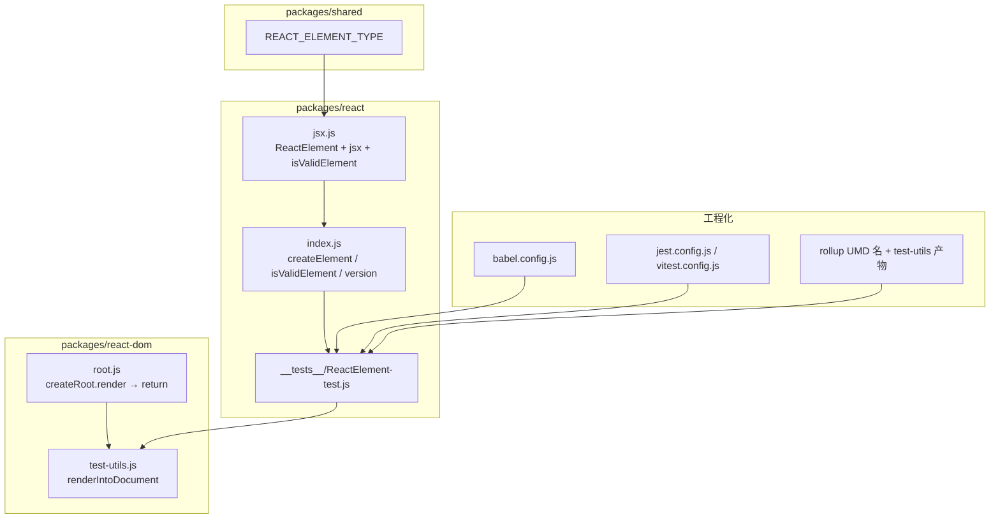
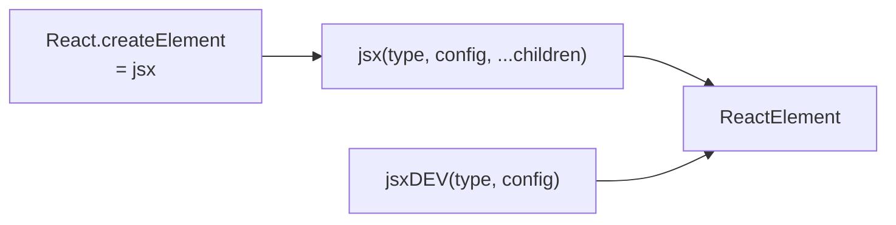

# Spec: ReactElement API 与测试基建（big-react L1 第九课）
type: utility

> **对齐参考**：[BetaSu/big-react@c542e19](https://github.com/BetaSu/big-react/commit/c542e19e1d53cc7d5de3a46fb61aeb556e366a41)（`feat: 第九课`，2022-12-07）。本 spec 以该 commit 的实现语义为准，并补充与当前 JS 代码库的 API / 工程化差异适配说明。
>
> **前置依赖**：[`jsx.md`](./jsx.md)（第二课：`ReactElement` 工厂、`jsx` / `jsxDEV`、`REACT_ELEMENT_TYPE`）。
>
> **后续依赖**：Reconciler Diff、DOM 渲染、Hooks 等后续课均依赖本课补齐的 `createElement` / `isValidElement` 对外 API 与 Element 行为单测保障。

## 1. 需求定义

### 1.1 背景与目标

- **解决什么问题**：第二课已实现 `jsx` / `jsxDEV` 产出 ReactElement，但缺少 **`isValidElement` 类型守卫**、**与官方一致的 `createElement` 导出策略**，以及 **可回归的 Element 行为单测**；`react-dom` 也缺少测试辅助 `renderIntoDocument`。本课补齐 L1 对外 API 闭环，并引入 Jest 测试基建。
- **使用方**：
  - 应用 / 库代码：`React.createElement`、`React.isValidElement`
  - 测试代码：`react-dom/test-utils` 的 `renderIntoDocument`
  - 内部模块：reconciler 通过 `$$typeof` 识别 Element（与 `isValidElement` 同源协议）
- **本课目标（最小闭环）**：
  - 实现 `isValidElement(object)`：基于 `$$typeof === REACT_ELEMENT_TYPE` 判定
  - `packages/react/index` 改为 **named export**：`version`、`createElement`（指向 `jsx`）、`isValidElement`
  - 新增 `packages/react/src/__tests__/ReactElement-test.js`（移植 Facebook 官方用例集）
  - 引入 Jest：`babel.config.js`、`scripts/jest/jest.config.js`、根 `package.json` 的 `test` 脚本
  - 新增 `packages/react-dom/test-utils`：`renderIntoDocument(element)`
  - `createRoot().render()` **返回** `updateContainer` 的返回值
  - Rollup UMD 全局名修正（`React`、`ReactDOM`、`client`、`jsx-runtime` 等）；新增 `test-utils.js` 产物
  - ESLint 增加 `jest` 环境；`tsconfig.json` 增加 `include: ["./packages/**/*"]`
- **明确不在本 spec 范围**：
  - `jsx` / `jsxDEV` 核心解析逻辑变更（仍属 jsx.md）
  - Reconciler / Commit 新能力
  - `act`、`fireEvent` 等完整 Testing Library 能力
  - 生产环境 `createElement` 与 `jsxDEV` 的分环境切换（commit 内 TODO 注释保留）
  - `renderIntoDocument` 返回 Fiber / DOM 实例的完整语义（本课仅调用 `createRoot().render`）

### 1.2 能力范围（Capability Scope）

- **提供的能力：**
  - [ ] `isValidElement(object)`：object 非 null 且 `$$typeof === REACT_ELEMENT_TYPE`
  - [ ] `export const createElement = jsx`（production 路径；非 jsxDEV）
  - [ ] `export const isValidElement = isValidElementFn`
  - [ ] `export const version = '0.0.0'`（named export，移除 default export 对象）
  - [ ] Jest 单测：`ReactElement-test.js` 覆盖 createElement 行为、key/ref/children、Symbol fallback
  - [ ] `babel.config.js`：`@babel/preset-env` + `@babel/plugin-transform-react-jsx`（`throwIfNamespace: false`）
  - [ ] `scripts/jest/jest.config.js`：`jsdom` 环境；`moduleDirectories` 含 `dist/node_modules`
  - [ ] `react-dom/test-utils`：`renderIntoDocument(element)` → `createRoot(div).render(element)`
  - [ ] `createRoot.render` 返回 `updateContainer(element, root)` 结果
  - [ ] Rollup：`react` UMD name `React`；`react-dom` UMD name `ReactDOM` / `client`；新增 `test-utils.js` bundle
- **明确不提供的能力：**
  - [ ] Element 可变性的严格冻结（参考测试「immutable」仅验证不 throw，非 `Object.freeze`）
  - [ ] `key: null` 与 `key: 'null'` 的完整 React 17+ 语义（参考测试有简化行为）
  - [ ] Vitest 迁移（参考 commit 为 Jest；本地可等价适配）
  - [ ] `renderIntoDocument` 清理 / unmount API

### 1.3 待确认项

| 问题 | 当前假设 | 优先级 |
|------|----------|--------|
| 语言 | 参考为 TS，本地实现为 JS（`.js`） | 已确认 |
| 测试框架 | 参考 Jest；本地 AGENTS.md 约定 Vitest | 已确认（语义等价，工具可不同） |
| `createElement` 指向 | c542e19 指向 `jsx`；第二课 jsx.md 为 `jsxDEV` | 本课以 c542e19 为准 |
| `isValidElement` 实现 | 必须校验 `$$typeof`，非仅 `'type' in object` | 已确认 |
| 单测 JSX | Jest + Babel 插件转换；Vitest 可用 `@vitejs/plugin-react` 或 esbuild jsx | 已确认 |
| `renderIntoDocument` 返回值 | 参考 commit 返回 `render()` 结果（即 updateContainer 返回值） | 已确认 |
| 构建前置 | Jest `moduleDirectories: ['dist/node_modules']` 需先 `pnpm build:dev` | 已确认 |

---

## 2. 项目资产对齐（Project Asset Alignment）

### 2.1 复用性审查（Reusability Audit）

| 检查项 | 现有资产 | 状态 | 本次策略 |
|--------|----------|------|----------|
| ReactElement 工厂 | jsx.md / `jsx.js` | ✅ 复用 | 不改动核心，仅新增 isValidElement |
| REACT_ELEMENT_TYPE | shared/ReactSymbols | ✅ 复用 | isValidElement 直接引用 |
| createElement | index 已 export jsx | ⚠️ 部分对齐 | 补齐 isValidElement；确认指向 jsx |
| isValidElement | 本地简化版（`'type' in element`） | ❌ 需修正 | 改为 `$$typeof` 校验 |
| 单测基建 | Vitest + vitest.config.js | ⚠️ 差异 | 移植用例到 Vitest 或引入 Jest |
| ReactElement 用例集 | 无 | ❌ 新增 | 移植 c542e19 的 ReactElement-test.js |
| react-dom test-utils | 无 | ❌ 新增 | renderIntoDocument |
| createRoot.render 返回值 | 无 return | ❌ 需补 | return updateContainer |
| Rollup UMD 名 | 可能仍为 index.js | ❌ 需修正 | 对齐 c542e19 全局名 |
| 参考实现 | BetaSu/big-react@c542e19 | ✅ 外部 | 逐文件对照 |

### 2.2 规范对齐（Standard Compliance）

| 规范类别 | 项目规范要求 | 本次应用方式 |
|----------|--------------|--------------|
| **代码规范** | ESLint + Prettier | 改动文件必须通过 lint |
| **目录规范** | L1 `packages/react`；L2 `packages/react-dom` | test-utils 属 react-dom |
| **ESM 导入** | 显式 `.js` 扩展名 | 本地 JS 实现遵循 |
| **测试约定** | `packages/**/__tests__/**/*.test.js` | 对齐 AGENTS.md |
| **依赖方向** | react → shared；react-dom → reconciler | test-utils 仅依赖 createRoot |

---

## 3. API 设计（API Design）

### 3.1 `isValidElement(object)`

```javascript
/**
 * @param {any} object
 * @returns {boolean}
 */
export function isValidElement(object) {
  return (
    typeof object === 'object' &&
    object !== null &&
    object.$$typeof === REACT_ELEMENT_TYPE
  );
}
```

| 参数 | 类型 | 必填 | 说明 |
|------|------|------|------|
| `object` | `any` | 是 | 待判定值 |

| 返回值 | 条件 |
|--------|------|
| `true` | 非 null object 且 `$$typeof === REACT_ELEMENT_TYPE` |
| `false` | 原始值、null、plain object、函数组件引用、缺 `$$typeof` 的 `{ type, props }` |

**与参考测试对齐的行为：**

| 输入 | 预期 |
|------|------|
| `React.createElement('div')` | `true` |
| `React.createElement(Component)` | `true` |
| `null` / `true` / `'string'` / `{}` / `Component`（函数本身） | `false` |
| `{ type: 'div', props: {} }`（无 $$typeof） | `false` |
| `JSON.parse(JSON.stringify(element))` | Symbol 环境：`false`；无 Symbol fallback 环境：`true` |

### 3.2 `packages/react/index` 导出变更

**c542e19 前（第二课）：**

```javascript
export default {
  version: '0.0.0',
  createElement: jsxDEV,
};
```

**c542e19 后：**

```javascript
import { jsx, jsxDEV, isValidElement as isValidElementFn } from './src/jsx.js';

export const version = '0.0.0';

// TODO 根据环境区分使用 jsx/jsxDEV
export const createElement = jsx;
export const isValidElement = isValidElementFn;
```

| 导出 | 类型 | 说明 |
|------|------|------|
| `version` | `string` | `'0.0.0'` 占位 |
| `createElement` | `typeof jsx` | production 工厂；与 automatic runtime 的 `jsx` 同源 |
| `isValidElement` | `(object) => boolean` | Element 类型守卫 |

> 本地若已有 Hooks、`Fragment` 等 named export，**保留扩展**；本课验收以 `createElement` / `isValidElement` / `version` 三者为核。

### 3.3 `react-dom/test-utils`

```javascript
import { createRoot } from 'react-dom';

/**
 * @param {import('shared/ReactTypes').ReactElementType} element
 * @returns {any} updateContainer 的返回值
 */
export function renderIntoDocument(element) {
  const div = document.createElement('div');
  return createRoot(div).render(element);
}
```

| 函数 | 参数 | 返回 | 说明 |
|------|------|------|------|
| `renderIntoDocument` | `element: ReactElement` | `updateContainer` 返回值 | 创建 detached `div` 作为 container |

**依赖链：**

```
renderIntoDocument(element)
  → createRoot(div)
  → render(element)
  → return updateContainer(element, root)
```

### 3.4 `createRoot.render` 返回值

```javascript
// packages/react-dom/src/root.js
return {
  render(element) {
    return updateContainer(element, root);
  },
};
```

| 变更 | 前 | 后 |
|------|-----|-----|
| `render` 返回值 | `undefined` | `updateContainer` 同步返回值 |

> 本课 `updateContainer` 多为 `undefined`；接口预留便于后续返回 lane / root 状态。

### 3.5 测试基建（参考 Jest）

#### 3.5.1 `babel.config.js`

```javascript
module.exports = {
  presets: ['@babel/preset-env'],
  plugins: [['@babel/plugin-transform-react-jsx', { throwIfNamespace: false }]],
};
```

| 项 | 值 | 说明 |
|----|-----|------|
| preset | `@babel/preset-env` | 转译测试文件中的现代语法 |
| jsx 插件 | `@babel/plugin-transform-react-jsx` | 单测文件内 JSX → jsx 调用 |
| throwIfNamespace | `false` | 允许非标准 JSX 命名空间（与课程一致） |

#### 3.5.2 `scripts/jest/jest.config.js`

```javascript
const { defaults } = require('jest-config');

module.exports = {
  ...defaults,
  rootDir: process.cwd(),
  modulePathIgnorePatterns: ['<rootDir>/.history'],
  moduleDirectories: ['dist/node_modules', ...defaults.moduleDirectories],
  testEnvironment: 'jsdom',
};
```

| 配置 | 说明 |
|------|------|
| `moduleDirectories` | 优先解析 `dist/node_modules` 下打包后的 `react` / `react-dom` |
| `testEnvironment` | `jsdom`，支持 `document.createElement` |
| `modulePathIgnorePatterns` | 忽略 `.history` 缓存 |

#### 3.5.3 根 `package.json` scripts

```json
"test": "jest --config scripts/jest/jest.config.js"
```

**本地 Vitest 等价策略：**

| Jest | Vitest 本地 |
|------|-------------|
| `jest.config.js` + jsdom | `vitest.config.js` + `environment: 'jsdom'` |
| `moduleDirectories: dist/node_modules` | `resolve.alias` 指向 workspace `packages/*`（已配置） |
| Babel JSX | Vite esbuild jsx 或 `@vitejs/plugin-react` |
| `jest.resetModules()` | `vi.resetModules()` |

### 3.6 Rollup UMD 全局名修正

| 包 | 文件 | c542e19 前 name | c542e19 后 name |
|----|------|-----------------|-----------------|
| react | index.js | `index.js` | `React` |
| react-dom | index.js | `index.js` | `ReactDOM` |
| react-dom | client.js | `client.js` | `client` |
| react | jsx-runtime.js | `jsx-runtime.js` | `jsx-runtime` |
| react | jsx-dev-runtime.js | `jsx-dev-runtime.js` | `jsx-dev-runtime` |
| react-dom | test-utils.js | —（新增） | `testUtils` |

**react-dom.config.js 新增 bundle：**

```javascript
{
  input: `${pkgPath}/test-utils.ts`,
  output: [{ file: `${pkgDistPath}/test-utils.js`, name: 'testUtils', format: 'umd' }],
  external: ['react-dom', 'react'],
  plugins: getBaseRollupPlugins(),
}
```

### 3.7 ReactElement 单测行为契约（摘自参考测试）

| 测试主题 | 预期行为 |
|----------|----------|
| 无 Symbol 环境 | JSX `<div />` 的 `$$typeof === 0xeac7` |
| createElement 完整结构 | `type` / `key` / `ref` / `props` 字段齐全 |
| string type | `type === 'div'`，props 默认 `{}` |
| config 隔离 | 修改原 config 不影响 element.props |
| 无 prototype config | `Object.create(null)` 作为 config 可用 |
| key/ref 提取 | key/ref 不进 props；其余进 props |
| key 字符串化 | `key: 12` → `'12'` |
| rest children | 单个覆盖 config.children；多个合并为数组 |
| null rest child | 覆盖 config.children 为 `null` |
| isValidElement | 见 3.1 |
| NaN props | `renderIntoDocument(<Test value={+undefined} />)` 不 warn；`value` 为 NaN |

### 3.8 错误契约

| 场景 | 行为 | 调用方处理 |
|------|------|------------|
| `isValidElement(undefined)` | `false` | 无需 try/catch |
| 非 Element 传入 reconciler | 后续课 warn / 忽略 | 先用 isValidElement 守卫 |
| Jest 未 build dist | module not found | 先 `pnpm build:dev` |
| Vitest environment node | `document` 不可用 | 改用 jsdom 环境 |

---

## 4. 使用示例（Usage Examples）

### 4.1 isValidElement 守卫

```javascript
import { createElement, isValidElement } from 'react';

const el = createElement('div', null, 'hi');
if (isValidElement(el)) {
  // el.type === 'div'
}
isValidElement({ type: 'div', props: {} }); // false
```

### 4.2 createElement 经典 API（无 JSX）

```javascript
import React from 'react';

function App() {
  return React.createElement('div', { id: 'app' }, 'hello');
}
// 内部走 jsx，支持 rest children
React.createElement('div', null, 1, 2, 3);
// props.children === [1, 2, 3]
```

### 4.3 renderIntoDocument

```javascript
import ReactTestUtils from 'react-dom/test-utils';
import { jsxDEV } from 'react/jsx-dev-runtime';

function Test() {
  return jsxDEV('div', { value: NaN }, undefined, false, undefined, undefined);
}

const instance = ReactTestUtils.renderIntoDocument(<Test />);
// instance 为 updateContainer 返回值；NaN prop 不触发 warn
```

### 4.4 运行单测

```bash
# 参考 commit（Jest）
pnpm build:dev && pnpm test

# 本地（Vitest）
pnpm test
```

---

## 5. 技术方案（Technical Design）

### 5.1 交付物清单（文件级，对齐 c542e19）

| # | 文件 | 改动摘要 |
|---|------|----------|
| D1 | `packages/react/src/jsx.js` | +`isValidElement` |
| D2 | `packages/react/index.js` | named export：`version`、`createElement`、`isValidElement` |
| D3 | `packages/react/src/__tests__/ReactElement-test.js` | 新增；Facebook 用例移植 |
| D4 | `packages/react-dom/test-utils.js` | +`renderIntoDocument` |
| D5 | `packages/react-dom/src/root.js` | `render` 返回 `updateContainer` |
| D6 | `babel.config.js` | 新增；Jest JSX 转换 |
| D7 | `scripts/jest/jest.config.js` | 新增；jsdom + dist 解析 |
| D8 | 根 `package.json` | +`test` script；+jest/babel devDependencies |
| D9 | `.eslintrc.json` | +`jest: true` env |
| D10 | `scripts/rollup/react.config.js` | UMD name 修正 |
| D11 | `scripts/rollup/react-dom.config.js` | UMD name 修正 + test-utils bundle |
| D12 | `tsconfig.json` | +`include: ["./packages/**/*"]` |
| D13 | `packages/test.js` | 删除（占位文件） |

### 5.2 模块关系



### 5.3 createElement vs jsx vs jsxDEV（本课定位）



| API | 本课角色 |
|-----|----------|
| `createElement` | 对外稳定入口，指向 `jsx` |
| `jsx` | automatic runtime production；支持 rest children |
| `jsxDEV` | development runtime；本课仍导出但不作为 createElement 默认 |

### 5.4 异常兜底

| 输入 | 处理方式 |
|------|----------|
| `isValidElement(42)` | 返回 `false` |
| JSON 序列化后的 Element | Symbol 环境返回 `false` |
| test-utils 无 jsdom | 抛 `document is not defined`；测试环境改用 jsdom |

---

## 6. 非功能需求（Non-Functional）

| 指标 | 目标值 | 测试方法 |
|------|--------|----------|
| Lint | `pnpm lint` 无新增 error | 本地 lint |
| 单测 | ReactElement 用例全绿 | `pnpm test` |
| 构建 | `pnpm build:dev` 含 test-utils.js | 检查 dist |
| UMD 名 | 浏览器全局 `React` / `ReactDOM` | script 标签 smoke |
| 对齐度 | 与 c542e19 核心 14 文件语义一致 | PR diff 对照 |

---

## 7. 测试策略与覆盖率矩阵（Testing Strategy）

### 7.1 测试分层

| 测试类型 | 覆盖目标 | 工具 | 通过标准 |
|----------|----------|------|----------|
| 单元测试 | isValidElement、createElement 结构 | Vitest / Jest | 全部 AC 通过 |
| 集成测试 | renderIntoDocument + NaN props | jsdom | 不 throw |
| 环境测试 | 无 Symbol / 有 Symbol fallback | vi.resetModules | $$typeof 行为正确 |
| 构建 smoke | test-utils UMD 产物 | build:dev | 文件存在 |

### 7.2 功能覆盖率矩阵

| 功能点 | 测试用例 | 场景 | 状态 |
|--------|----------|------|------|
| isValidElement true | createElement div/FC | 2/2 | ⬜ |
| isValidElement false | null/primitive/{} /fn | 5/5 | ⬜ |
| JSON round-trip | Symbol vs fallback | 2/2 | ⬜ |
| key 提取与字符串化 | key:12 / key:'12' | 2/2 | ⬜ |
| ref 提取 | ref in config | 1/1 | ⬜ |
| config 不可变 | 修改 config 后 props 不变 | 1/1 | ⬜ |
| rest children 合并 | 0/1/N 个 rest | 3/3 | ⬜ |
| null 覆盖 children | rest null | 1/1 | ⬜ |
| 无 Symbol JSX | $$typeof === 0xeac7 | 1/1 | ⬜ |
| renderIntoDocument | NaN value | 1/1 | ⬜ |
| createRoot.render return | 调用 render | 1/1 | ⬜ |

### 7.3 复杂场景拆解

| 编号 | 输入 | 预期 | 对齐参考 |
|------|------|------|----------|
| SC-01 | 删除 global.Symbol 后 `require('react')` | fallback $$typeof | c542e19 |
| SC-02 | `createElement(FC, { key:'12', ref:'34', foo:'56' })` | key/ref 不进 props | c542e19 |
| SC-03 | `createElement(FC, { children:'text' }, 1)` | children === 1 | c542e19 |
| SC-04 | `isValidElement(JSON.parse(JSON.stringify(el)))` | Symbol 环境 false | c542e19 |
| SC-05 | `<Test value={+undefined} />` via test-utils | props.value is NaN | c542e19 |
| SC-06 | `pnpm build:dev` | dist/react-dom/test-utils.js 存在 | c542e19 |

### 7.4 建议单测文件

| 测试文件 | 覆盖点 |
|----------|--------|
| `packages/react/src/__tests__/ReactElement.test.js` | 移植 c542e19 用例（Vitest 语法） |
| `packages/react/src/__tests__/isValidElement.test.js` | 可选：isValidElement 边界 |
| `packages/react-dom/src/__tests__/test-utils.test.js` | renderIntoDocument smoke |

运行：`pnpm test`（Vitest）或 `pnpm build:dev && jest`（严格对齐参考）。

---

## 8. 任务拆分与并行计划（Task Breakdown）

### 8.1 任务卡片

#### 模块 A：React API（Agent-1）

| ID | 任务 | 输出 | 对齐 commit 文件 |
|----|------|------|------------------|
| T-A1 | 实现 `isValidElement` | `jsx.js` | jsx.ts |
| T-A2 | index named export 调整 | `index.js` | index.ts |

**CK-1 冻结**：`isValidElement` 必须校验 `$$typeof`；`createElement = jsx`。

#### 模块 B：react-dom 测试辅助（Agent-2）

| ID | 任务 | 输出 | 对齐 commit 文件 |
|----|------|------|------------------|
| T-B1 | `renderIntoDocument` | `test-utils.js` | test-utils.ts |
| T-B2 | `render` 返回 updateContainer | `root.js` | root.ts |

**CK-2 冻结**：test-utils 仅依赖 createRoot；render 有 return。

#### 模块 C：测试与工程化（Agent-3）

| ID | 任务 | 输出 | 对齐 commit 文件 |
|----|------|------|------------------|
| T-C1 | ReactElement 用例移植 | `ReactElement-test.js` | 同左 |
| T-C2 | Jest / Vitest 配置 + Babel | babel.config.js、jest.config.js | 同左 |
| T-C3 | Rollup UMD + test-utils bundle | rollup configs | 同左 |
| T-C4 | ESLint jest env + tsconfig include | 根配置 | 同左 |

### 8.2 并行时序

```
T-A1 → T-A2 → CK-1
         ↓
    T-B1 → T-B2 → CK-2
         ↓
    T-C1 ∥ T-C2 → T-C3 → T-C4
```

---

## 9. 验收标准（Given-When-Then）

| ID | Given | When | Then |
|----|-------|------|------|
| AC-01 | 调用 `createElement('div')` | 检查返回值 | 含 `$$typeof`、`type='div'`、key/ref null、props `{}` |
| AC-02 | Element 对象 | `isValidElement(el)` | `true` |
| AC-03 | `{ type:'div', props:{} }` 无 $$typeof | `isValidElement` | `false` |
| AC-04 | `createElement(FC, { key: 12 })` | 读 key | `key === '12'` 且不在 props |
| AC-05 | `createElement(FC, null, 1, 2, 3)` | 读 children | `props.children === [1,2,3]` |
| AC-06 | 无 Symbol 环境 | JSX 或 createElement | `$$typeof === 0xeac7` |
| AC-07 | `renderIntoDocument(<div/>)` | 执行 | 不 throw；内部 createRoot 被调用 |
| AC-08 | `createRoot(container).render(el)` | 检查返回值 | 与 `updateContainer` 返回值一致 |
| AC-09 | `pnpm build:dev` | 检查 dist | `react-dom/test-utils.js` 存在；UMD 名为 React/ReactDOM |
| AC-10 | 全部改动 | `pnpm lint` + `pnpm test` | 无 error |

---

## 10. 验收注意点与重点场景

### 10.1 必验（P0）

| 场景 | 验证点 |
|------|--------|
| isValidElement 协议 | AC-02、AC-03 |
| createElement 指向 jsx | rest children 行为（AC-05） |
| ReactElement 单测 | AC-01、AC-04、AC-06 |
| test-utils | AC-07 |
| Rollup UMD | AC-09 |

### 10.2 易遗漏

| 风险 | 原因 | 验收 |
|------|------|------|
| isValidElement 仅检查 `type in object` | 本地简化实现 | AC-03 失败 |
| createElement 仍指向 jsxDEV | 未合入第九课 | rest children 与 jsx 不一致 |
| Vitest 用 node 环境 | 无 document | AC-07 失败；改 jsdom |
| Jest 未 build dist | moduleDirectories 指向 dist | 先 build:dev |
| 删除 default export 破坏 demos | index 导出方式变更 | demos 改用 named import |
| key:null 测例期望 `'null'` | 参考测试历史行为 | 移植时注明或对齐 jsx 实现 |

### 10.3 回归

[`jsx.md`](./jsx.md) 的 jsx / jsxDEV / REACT_ELEMENT_TYPE 行为不退化；已有 reconciler / react-dom 渲染链仍可 `createRoot().render()`。

---

## 11. 风险与依赖

| 风险 | 缓解 |
|------|------|
| Jest vs Vitest 双轨 | 优先 Vitest 移植用例；文档标注差异 |
| isValidElement 修正破坏现有代码 | 全仓 grep isValidElement 调用方 |
| default → named export | 更新 demos / 测试 import |
| dist 依赖 vs workspace alias | Vitest 用 alias；Jest 用 build:dev |
| 参考测试 key:null → `'null'` | 与 jsx 实现对齐或单测注明 |

---

## 12. 参考 commit 文件对照表

| 参考文件（c542e19） | 本地目标文件 | 变更类型 |
|---------------------|--------------|----------|
| `packages/react/src/jsx.ts` | `src/jsx.js` | +isValidElement |
| `packages/react/index.ts` | `index.js` | 导出方式变更 |
| `packages/react/src/__tests__/ReactElement-test.js` | `__tests__/ReactElement.test.js` | 新增 |
| `packages/react-dom/test-utils.ts` | `test-utils.js` | 新增 |
| `packages/react-dom/src/root.ts` | `src/root.js` | render return |
| `babel.config.js` | `babel.config.js` 或 Vitest 等价 | 新增 |
| `scripts/jest/jest.config.js` | Vitest 配置扩展 | 新增/适配 |
| `scripts/rollup/react.config.js` | `react.config.js` | UMD name |
| `scripts/rollup/react-dom.config.js` | `react-dom.config.js` | UMD + test-utils |
| `.eslintrc.json` | `.eslintrc.json` | +jest env |
| `tsconfig.json` | 可选（本地无 TS 可省略） | include |
| 根 `package.json` | 根 `package.json` | test script + deps |

---

## 13. 与当前代码库差异摘要

| 维度 | c542e19 | 当前 big-react |
|------|---------|----------------|
| 语言 | TypeScript | JavaScript + `.js` 扩展名 |
| 测试框架 | Jest + babel | Vitest（`environment: node`，需改 jsdom） |
| isValidElement | `$$typeof === REACT_ELEMENT_TYPE` | 简化为 `'type' in element`（**需修正**） |
| createElement | `jsx` | 已指向 `jsx` ✅ |
| index 导出 | version + createElement + isValidElement | +Hooks、Fragment、INTERNALS |
| ReactElement 单测 | 270 行 Jest 用例 | **未移植** |
| react-dom test-utils | 有 | **无** |
| createRoot.render | return updateContainer | 无 return（+initEvent 本地扩展） |
| Rollup UMD | React / ReactDOM | 待核对 |
| jsx.md 关系 | 第二课 createElement=jsxDEV | 第九课改为 jsx；以本 spec 为准 |

实现或审查时：**isValidElement 协议、createElement=jsx、ReactElement 单测、test-utils 以 c542e19 为准**；本地 Hooks / SyntheticEvent / Fragment 等扩展单独回归。

---

**修订记录**

| 版本 | 日期 | 说明 |
|------|------|------|
| v1.0 | 2026-05-31 | 初稿，对齐 BetaSu/big-react@c542e19（第九课 ReactElement API 与测试基建） |
