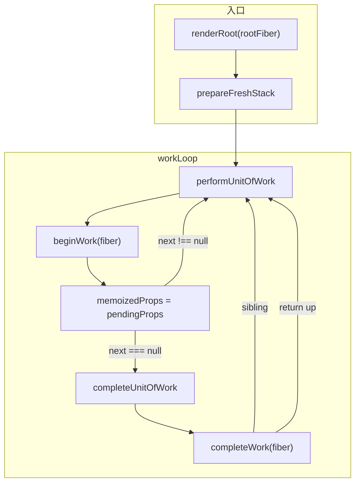

# Spec: Reconciler 骨架与 Work Loop（big-react L3 初探）
type: utility

> **对齐参考**：[BetaSu/big-react@2783c639](https://github.com/BetaSu/big-react/commit/2783c639dee37139eeff9d0d7ba6133df6db9a0e)（`feat: 初探reconciler`，2022-11-04）。本 spec 以该 commit 的实现语义为准，并补充与当前 JS 代码库的演进差异说明。
>
> **前置依赖**：[`jsx.md`](./jsx.md)（ReactElement / `REACT_ELEMENT_TYPE`）。本课只搭 Fiber 数据结构与 Render Phase 空壳，**不**实现 Diff、Host 创建、Commit。
>
> **后续依赖**：HostRoot / `createFiberFromElement`、beginWork 分支、completeWork DOM 创建、Commit 等均在后续课程 commit 中补齐。

## 1. 需求定义

### 1.1 背景与目标

- **解决什么问题**：JSX 已能产出 ReactElement，但 reconciler 层尚不存在。需要先把 **Fiber 节点模型** 与 **Render Phase 双阶段递归（beginWork → completeWork）** 的调度骨架搭起来，为后续 Diff 与 DOM 提交打底。
- **使用方**：`packages/react-reconciler` 内部模块；后续 `react-dom` 通过 `updateContainer` 接入。
- **本课目标（最小闭环）**：
  - 新建 `packages/react-reconciler` workspace 包，依赖 `shared`
  - 定义 `FiberNode` 类（树指针 + 工作单元字段 + `flags`）
  - 定义 `workTags`（FunctionComponent / HostRoot / HostComponent / HostText）
  - 定义 `fiberFlags` 占位常量（Placement / Update / ChildDeletion）
  - 实现 `workLoop`：`performUnitOfWork` + `completeUnitOfWork` 深度优先遍历
  - `beginWork` / `completeWork` **仅占位**，函数体为空
- **明确不在本 spec 范围**：
  - `FiberRootNode`、`updateContainer`、`createWorkInProgress`
  - Element → Fiber（`createFiberFromElement`）
  - `childFiber` Diff、`reconcileChildren`
  - Host Config 调用、`commitWork`、副作用提交
  - Hooks、`memoizedState`、`updateQueue`
  - Lane 调度、异步 `workLoop` 切片

### 1.2 能力范围（Capability Scope）

- **提供的能力：**
  - [ ] `packages/react-reconciler/package.json` workspace 包，依赖 `shared`
  - [ ] `FiberNode` 构造函数：`tag`、`pendingProps`、`key` 及树结构字段
  - [ ] `workTags.js` 导出 4 种 tag 常量
  - [ ] `fiberFlags.js` 导出 `Flags` 类型与 4 个 flag 常量
  - [ ] `workLoop.js`：`renderRoot` → `workLoop` → `performUnitOfWork` / `completeUnitOfWork`
  - [ ] `beginWork(fiber)` 签名占位（返回 `undefined`，触发 complete 路径）
  - [ ] `completeWork(fiber)` 签名占位（无 DOM 操作）
  - [ ] 模块级 `workInProgress` 指针驱动遍历
- **明确不提供的能力：**
  - [ ] 真实 UI 渲染到 DOM
  - [ ] `beginWork` 按 tag 分支处理
  - [ ] `flags` 语义正确的位掩码（本课为占位值，见 §3.3 说明）
  - [ ] 错误边界、Concurrent Mode、Suspense

### 1.3 待确认项

| 问题 | 当前假设 | 优先级 |
|------|----------|--------|
| 语言 | 参考为 TS，本地为 JS（`.js`） | 已确认 |
| `Noflags` 拼写 | 参考 commit `fiber.ts` import `Noflags`，`fiberFlags.ts` 导出 `NoFlags` — **不一致** | 本地实现统一为 `NoFlags` |
| `NoFlags` 数值 | 参考 commit 为 `0b0000001`（非 0） | 本课对齐参考；后续课修正为 `0` |
| `renderRoot` 入参 | 参考为 `FiberNode`，非 `FiberRootNode` | 已确认（骨架阶段） |
| 自动化单测 | Fiber 构造、workLoop 空树/单节点遍历 | 已确认 |

---

## 2. 项目资产对齐（Project Asset Alignment）

### 2.1 复用性审查（Reusability Audit）

| 检查项 | 现有资产 | 状态 | 本次策略 |
|--------|----------|------|----------|
| ReactTypes | `packages/shared/ReactTypes` | ✅ 已有（jsx 课） | Fiber 引用 `Props` / `Key` / `Ref` |
| ReactElement | `packages/react/src/jsx` | ✅ 已有 | 本课不消费，后续课接入 |
| Reconciler 包 | 无 | ❌ 新增 | 新建 `packages/react-reconciler` |
| Host Config | 无 | — | 后续课 |
| 参考实现 | BetaSu/big-react@2783c639 | ✅ 外部 | 逐文件对照 |
| 本地已扩展 | FiberRoot、Lanes、Commit、Hooks 等 | ⚠️ 超范围 | 本 spec 描述骨架；本地保留扩展 |

### 2.2 规范对齐（Standard Compliance）

| 规范类别 | 项目规范要求 | 本次应用方式 |
|----------|--------------|--------------|
| **代码规范** | ESLint + Prettier | 改动文件必须通过 lint |
| **目录规范** | reconciler 在 `packages/react-reconciler/src/` | 按参考 commit 分布 |
| **ESM 导入** | 显式 `.js` 扩展名 | 本地 JS 实现遵循 |
| **依赖方向** | reconciler → shared；不依赖 react-dom（本课） | 仅 import shared 类型 |
| **架构边界** | L3 不直接操作 DOM | beginWork/completeWork 为空 |

---

## 3. API 设计（API Design）

### 3.1 包结构（packages/react-reconciler）

```json
{
  "name": "react-reconciler",
  "version": "1.0.0",
  "description": "React协调器",
  "dependencies": {
    "shared": "workspace:*"
  }
}
```

| 字段 | 类型 | 必填 | 说明 |
|------|------|------|------|
| `name` | `string` | 是 | `react-reconciler` |
| `dependencies.shared` | workspace | 是 | 引用 `Props` / `Key` / `Ref` |

### 3.2 `FiberNode`（packages/react-reconciler/src/fiber）

```javascript
export class FiberNode {
  constructor(tag, pendingProps, key) {
    // 类型 / 标识
    this.tag = tag;
    this.key = key;
    this.type = null;       // Host: 'div'；FC: 函数
    this.stateNode = null;  // Host: DOM；Root: FiberRootNode（后续课）
    this.ref = null;

    // 树结构（Fiber 链表）
    this.return = null;   // 父 fiber
    this.sibling = null;  // 右兄弟
    this.child = null;    // 第一个子 fiber
    this.index = 0;

    // 工作单元
    this.pendingProps = pendingProps;
    this.memoizedProps = null;
    this.alternate = null; // 双缓冲 alternate（后续课使用）

    // 副作用标记
    this.flags = NoFlags;
  }
}
```

| 字段 | 类型 | 必填 | 初始值 | 说明 |
|------|------|------|--------|------|
| `tag` | `WorkTag` | 是 | 构造传入 | 节点种类 |
| `key` | `Key` | 是 | 构造传入 | Diff 用 |
| `type` | `any` | — | `null` | Element.type / 组件函数 |
| `stateNode` | `any` | — | `null` | 宿主实例或 Root |
| `return` / `child` / `sibling` | `FiberNode \| null` | — | `null` | 树链接 |
| `index` | `number` | — | `0` | 兄弟序号 |
| `pendingProps` | `Props` | 是 | 构造传入 | 本次 render props |
| `memoizedProps` | `Props \| null` | — | `null` | beginWork 后同步为 pendingProps |
| `alternate` | `FiberNode \| null` | — | `null` | current ↔ workInProgress |
| `flags` | `Flags` | — | `NoFlags` | 副作用位（本课仅占位） |
| `ref` | `Ref` | — | `null` | ref 对象 |

### 3.3 `workTags`（packages/react-reconciler/src/workTags）

| 常量 | 值 | 说明 |
|------|-----|------|
| `FunctionComponent` | `0` | 函数组件 |
| `HostRoot` | `3` | Fiber 树根 |
| `HostComponent` | `5` | 原生 DOM 标签 |
| `HostText` | `6` | 文本节点 |

```javascript
export const FunctionComponent = 0;
export const HostRoot = 3;
export const HostComponent = 5;
export const HostText = 6;
```

> 与 React 官方 work tag 数值对齐（FunctionComponent=0, HostRoot=3, HostComponent=5, HostText=6）。

### 3.4 `fiberFlags`（packages/react-reconciler/src/fiberFlags）

参考 commit 占位定义：

| 常量 | 参考 commit 值 | 说明 |
|------|----------------|------|
| `NoFlags` | `0b0000001` | ⚠️ 占位，非语义正确的「无 flag」；后续课改为 `0` |
| `Placement` | `0b0000010` | 插入 DOM |
| `Update` | `0b0000100` | 更新 DOM |
| `ChildDeletion` | `0b0001000` | 删除子树 |

```javascript
export const NoFlags = 0b0000001;
export const Placement = 0b0000010;
export const Update = 0b0000100;
export const ChildDeletion = 0b0001000;
```

**本地演进**（当前代码库已修正）：

```javascript
export const NoFlags = 0b00000000000000000000000000;
export const MutationMask = Placement | Update | ChildDeletion;
```

本课验收对齐 **2783c639 四常量存在**；Mask 与 `subtreeFlags` 为后续课内容。

**参考 commit 笔误**：`fiber.ts` import `Noflags`，`fiberFlags.ts` export `NoFlags` — 实现时须统一命名。

### 3.5 Work Loop 内部 API

#### 3.5.1 模块状态

| 变量 | 类型 | 说明 |
|------|------|------|
| `workInProgress` | `FiberNode \| null` | 当前处理中的 fiber |

#### 3.5.2 `renderRoot(root: FiberNode)`

| 步骤 | 行为 |
|------|------|
| 1 | `prepareFreshStack(root)` → `workInProgress = root` |
| 2 | `do { try { workLoop(); break } catch { warn; workInProgress = null } } while (true)` |

> 本课无 `commitRoot`；render 结束即停止。

#### 3.5.3 `performUnitOfWork(fiber)`

```
next = beginWork(fiber)
fiber.memoizedProps = fiber.pendingProps

if next === null:
  completeUnitOfWork(fiber)
else:
  workInProgress = next
```

| 返回值 | 含义 |
|--------|------|
| `beginWork` 返回子 fiber | 向下递归（递阶段） |
| `beginWork` 返回 `null` / `undefined` | 无子节点，进入 complete（归阶段） |

> 参考 commit 中 `beginWork` 空函数返回 `undefined`，等价于 `null`，始终走 complete 路径。

#### 3.5.4 `completeUnitOfWork(fiber)`

```
node = fiber
do:
  completeWork(node)
  if node.sibling !== null:
    workInProgress = node.sibling
    return
  node = node.return
  workInProgress = node
while node !== null
```

经典 **深度优先：先 child，再 sibling，再 return 向上** 的归阶段逻辑。

### 3.6 占位阶段函数

#### `beginWork(fiber)` — 递阶段

```javascript
// 递归中的递阶段
export function beginWork(fiber) {
  // 比较，返回子 fiberNode
  // 本课：空实现，返回 undefined
};
```

| 参数 | 类型 | 返回 | 本课行为 |
|------|------|------|----------|
| `fiber` | `FiberNode` | `FiberNode \| null \| undefined` | 不处理，返回 `undefined` |

#### `completeWork(fiber)` — 归阶段

```javascript
export function completeWork(fiber) {
  // 递归中的归
  // 本课：空实现
};
```

| 参数 | 类型 | 返回 | 本课行为 |
|------|------|------|----------|
| `fiber` | `FiberNode` | `void` | 无操作 |

### 3.7 遍历契约（本课可测）

给定一棵手动链接的 Fiber 树，调用 `renderRoot(root)` 后：

| 条件 | 预期 |
|------|------|
| 每个 fiber | `memoizedProps === pendingProps`（beginWork 后赋值） |
| `beginWork` / `completeWork` | 按 DFS 顺序各被调用一次 per fiber |
| 遍历结束 | `workInProgress === null` |
| DOM | **无变化**（completeWork 为空） |

### 3.8 错误契约

| 场景 | 行为 | 调用方处理 |
|------|------|------------|
| `workLoop` 抛错 | `console.warn('workLoop发生错误', e)`，`workInProgress = null` | 本课无恢复，后续课可重做栈 |
| `beginWork` 未实现 tag | 本课无分支 | 后续课补 switch |
| 循环依赖 | reconciler 仅依赖 shared | 保持 import 方向 |

---

## 4. 使用示例（Usage Examples）

### 4.1 构造单节点 Fiber

```javascript
import { FiberNode } from './fiber.js';
import { HostRoot } from './workTags.js';

const rootFiber = new FiberNode(HostRoot, {}, null);
// tag=3, pendingProps={}, key=null, flags=NoFlags
```

### 4.2 手动链接子树（用于 workLoop 测试）

```javascript
import { FiberNode } from './fiber.js';
import { HostRoot, HostComponent, HostText } from './workTags.js';

const root = new FiberNode(HostRoot, {}, null);
const div = new FiberNode(HostComponent, { children: 'hi' }, null);
div.type = 'div';
const text = new FiberNode(HostText, 'hi', null);

root.child = div;
div.return = root;
div.child = text;
text.return = div;

// renderRoot(root) 将 DFS 访问 root → div → text，无 DOM 副作用
```

### 4.3 DFS 访问顺序示意

```
       HostRoot
          |
    HostComponent ('div')
          |
      HostText ('hi')

递：root → (beginWork 无子) → complete root → sibling null → return
    实际因 beginWork 不返回 child，complete 顺序为 root → div → text（若手动 link 且 beginWork 仍不返回 child，则仅 complete 链上已 reachable 节点）

> 注：本课 beginWork 不设置 child 指针，测试 workLoop 须预链 child，且 beginWork 返回 null 时从当前节点 complete 再 sibling/return。
```

### 4.4 与后续课衔接点

```javascript
// 后续课 beginWork 典型形态（非本课范围）
function beginWork(wip) {
  switch (wip.tag) {
    case HostRoot:
      return updateHostRoot(wip);
    case HostComponent:
      return updateHostComponent(wip);
    // ...
  }
}
```

---

## 5. 技术方案（Technical Design）

### 5.1 交付物清单（文件级，对齐 2783c639）

| # | 文件 | 改动摘要 |
|---|------|----------|
| D1 | `packages/react-reconciler/package.json` | 新建 workspace 包 |
| D2 | `packages/react-reconciler/node_modules/shared` | workspace 链接 |
| D3 | `packages/react-reconciler/src/fiber.js` | `FiberNode` 类 |
| D4 | `packages/react-reconciler/src/workTags.js` | 4 种 tag |
| D5 | `packages/react-reconciler/src/fiberFlags.js` | 4 种 flag 占位 |
| D6 | `packages/react-reconciler/src/beginWork.js` | 空占位 |
| D7 | `packages/react-reconciler/src/completeWork.js` | 空占位 |
| D8 | `packages/react-reconciler/src/workLoop.js` | renderRoot + workLoop + 双阶段单元 |

### 5.2 Render Phase 数据流



### 5.3 Fiber 树内存模型

```
FiberNode {
  tag, key, type, stateNode, ref
  return ──► 父节点
  child  ──► 第一个子节点
  sibling ──► 下一个兄弟
  pendingProps / memoizedProps
  alternate（本课仅字段，无双缓冲逻辑）
  flags（本课仅占位）
}
```

### 5.4 双阶段递归原理（Onboarding）

| 阶段 | 函数 | 本课职责 | 完整 React 职责 |
|------|------|----------|-----------------|
| **递** | `beginWork` | 空 | Diff、创建子 Fiber、processUpdateQueue |
| **归** | `completeWork` | 空 | 创建 DOM、冒泡 flags、bubbleProperties |
| **调度** | `workLoop` | ✅ 完整 | 同上 + 时间切片 / Lane |

**设计精髓**：Render Phase 用 **单链表树（child/sibling/return）** + **`workInProgress` 指针** 实现非递归 DFS，避免 JS 调用栈溢出；本课先固化遍历骨架，再填 begin/complete 语义。

### 5.5 异常兜底

| 输入 | 处理方式 |
|------|----------|
| `root` 为 `null` | 未校验；调用方保证 |
| 空树（仅 root，无 child） | workLoop 一次 complete 后结束 |
| `workLoop` 异常 | catch 后 `workInProgress = null`，循环 break |

---

## 6. 非功能需求（Non-Functional）

| 指标 | 目标值 | 测试方法 |
|------|--------|----------|
| Lint | `pnpm lint` 无新增 error | 本地 lint |
| 包可解析 | `react-reconciler` 依赖 `shared` | pnpm install |
| 对齐度 | 与 2783c639 文件与遍历逻辑一致 | PR diff 对照 |
| 无副作用 | 不 import react-dom / hostConfig | import 检查 |

---

## 7. 测试策略与覆盖率矩阵（Testing Strategy）

### 7.1 测试分层

| 测试类型 | 覆盖目标 | 工具 | 通过标准 |
|----------|----------|------|----------|
| 单元测试 | FiberNode 字段、workLoop 遍历 | Vitest | 全部 AC 通过 |
| 静态检查 | lint | pnpm | 无 error |
| 参考对照 | 与 2783c639 结构一致 | 逐文件 diff | 核心路径一致 |

### 7.2 功能覆盖率矩阵

| 功能点 | 测试用例 | 场景 | 状态 |
|--------|----------|------|------|
| FiberNode 构造 | tag/key/props/flags 初始值 | 1/1 | ⬜ |
| workTags 常量 | 4 值与官方一致 | 1/1 | ⬜ |
| fiberFlags 导出 | 4 常量存在 | 1/1 | ⬜ |
| performUnitOfWork | memoizedProps 同步 | 1/1 | ⬜ |
| completeUnitOfWork sibling | 先兄弟后 return | 1/1 | ⬜ |
| renderRoot 异常 | catch 清空 wip | 1/1 | ⬜ |
| beginWork 占位 | 被调用但不抛错 | 1/1 | ⬜ |
| completeWork 占位 | 被调用但不操作 DOM | 1/1 | ⬜ |

### 7.3 复杂场景拆解

| 编号 | 输入 | 预期 | 对齐参考 |
|------|------|------|----------|
| SC-01 | 单 HostRoot fiber | complete 一次，wip 变 null | 2783c639 |
| SC-02 | root → div → text 预链接 | 三节点均 complete；memoizedProps 已同步 | workLoop |
| SC-03 | root → div + span 兄弟 | sibling 链先 div 后 span | completeUnitOfWork |
| SC-04 | beginWork 抛错 | warn + wip null | renderRoot catch |
| SC-05 | flags 初始值 | `flags === NoFlags` | fiber 构造 |

### 7.4 建议单测（Vitest）

| 测试文件 | 覆盖点 |
|----------|--------|
| `packages/react-reconciler/src/__tests__/fiber.test.js` | FiberNode 构造 |
| `packages/react-reconciler/src/__tests__/workLoop.test.js` | mock beginWork/completeWork 调用顺序 |

运行：`pnpm test`。

---

## 8. 任务拆分与并行计划（Task Breakdown）

### 8.1 拆分原则

按参考 commit：**数据模型 → 常量 → 空壳阶段函数 → workLoop**。

### 8.2 任务卡片

#### 模块 A：包与 Fiber 模型（Agent-1）

| ID | 任务 | 输出 | 对齐 commit 文件 |
|----|------|------|------------------|
| T-A1 | reconciler package.json + shared 依赖 | package.json | package.json |
| T-A2 | FiberNode 类 | fiber.js | fiber.ts |
| T-A3 | workTags | workTags.js | workTags.ts |

**CK-1 冻结**：FiberNode 字段集合；4 种 workTag 数值。

#### 模块 B：Flags 与阶段占位（Agent-2）

| ID | 任务 | 输出 | 对齐 commit 文件 |
|----|------|------|------------------|
| T-B1 | fiberFlags 占位 | fiberFlags.js | fiberFlags.ts |
| T-B2 | beginWork 空壳 | beginWork.js | beginWork.ts |
| T-B3 | completeWork 空壳 | completeWork.js | completeWork.ts |

**CK-2 冻结**：beginWork(fiber) / completeWork(fiber) 签名。

#### 模块 C：Work Loop（Agent-3）

| ID | 任务 | 输出 |
|----|------|------|
| T-C1 | workLoop + renderRoot | workLoop.js |
| T-C2 | Vitest + lint | 全绿 |

### 8.3 并行时序

```
T-A1 → T-A2 → T-A3 → CK-1
              ↓
         T-B1 ∥ T-B2 ∥ T-B3 → CK-2
              ↓
         T-C1 → T-C2
```

---

## 9. 验收标准（Given-When-Then）

| ID | Given | When | Then |
|----|-------|------|------|
| AC-01 | `new FiberNode(HostRoot, {}, null)` | 读字段 | `tag===3`，`child/sibling/return===null`，`flags===NoFlags` |
| AC-02 | workTags 模块 | import 常量 | FunctionComponent=0, HostRoot=3, HostComponent=5, HostText=6 |
| AC-03 | fiberFlags 模块 | import | NoFlags/Placement/Update/ChildDeletion 四常量存在 |
| AC-04 | 预链接 root→div→text | `renderRoot(root)` | 每节点 `memoizedProps === pendingProps` |
| AC-05 | mock beginWork/completeWork | renderRoot | 每 fiber 各调用一次，顺序为 DFS |
| AC-06 | workLoop 内抛错 | renderRoot | 打印 warn，`workInProgress === null` |
| AC-07 | 全部改动 | `pnpm lint` | 无 error |
| AC-08 | import 分析 | reconciler 源码 | 无 react-dom / hostConfig 依赖 |

---

## 10. 验收注意点与重点场景

### 10.1 必验（P0）

| 场景 | 验证点 |
|------|--------|
| Fiber 字段完整 | AC-01 |
| workLoop 骨架 | AC-04、AC-05 |
| 阶段分离 | beginWork 只递、completeWork 只归（本课均为空） |
| 无 DOM | completeWork 不调用 hostConfig |

### 10.2 易遗漏

| 风险 | 原因 | 验收 |
|------|------|------|
| `Noflags` / `NoFlags` 拼写不一致 | 参考 commit 笔误 | 本地统一 `NoFlags` |
| memoizedProps 赋值时机 | 在 beginWork **之后** | AC-04 |
| sibling 优先于 return | completeUnitOfWork 顺序 | SC-03 |
| 误以为本课能渲染 | 仅骨架 | AC-08 |
| NoFlags 非 0 | 占位值 | 对齐 2783c639 或文档注明 |

### 10.3 回归

本课为 reconciler 首包，无 prior demo；完成后不应破坏 [`jsx.md`](./jsx.md) 已有能力。

---

## 11. 风险与依赖

| 风险 | 缓解 |
|------|------|
| 参考 commit flag 值非最终语义 | spec 标注占位；后续课修正 |
| beginWork 签名后续扩展 renderLane | 本课单参数；本地已加第二参数 |
| 无 FiberRoot 导致与 react-dom 难接 | 下一课补 FiberRootNode + updateContainer |
| TS → JS | 逻辑对齐，JSDoc 补类型 |

---

## 12. 参考 commit 文件对照表

| 参考文件（2783c639） | 本地目标文件 | 变更类型 |
|---------------------|--------------|----------|
| `packages/react-reconciler/package.json` | `package.json` | 新增 |
| `packages/react-reconciler/src/fiber.ts` | `fiber.js` | 新增 |
| `packages/react-reconciler/src/workTags.ts` | `workTags.js` | 新增 |
| `packages/react-reconciler/src/fiberFlags.ts` | `fiberFlags.js` | 新增 |
| `packages/react-reconciler/src/beginWork.ts` | `beginWork.js` | 新增（空壳） |
| `packages/react-reconciler/src/completeWork.ts` | `completeWork.js` | 新增（空壳） |
| `packages/react-reconciler/src/workLoop.ts` | `workLoop.js` | 新增 |

---

## 13. 与当前代码库差异摘要

| 维度 | 2783c639 | 当前 big-react |
|------|----------|----------------|
| FiberRootNode | 无 | 有 `FiberRootNode` + container |
| createWorkInProgress | 无 | 有双缓冲 |
| beginWork / completeWork | 空函数 | 完整 HostRoot/Host/FC/Fragment 实现 |
| workLoop | 仅 renderRoot | + Lane、commitRoot、scheduleUpdateOnFiber |
| fiberFlags NoFlags | `0b1` 占位 | `0`，+ MutationMask / subtreeFlags |
| workTags | 4 种 | + Fragment=7 |
| fiber 字段 | 基础集 | + memoizedState、updateQueue、subtreeFlags、deletions |
| 测试 | 无 | fiber.test.js、workLoop 相关测试可扩展 |

实现或审查时：**Fiber 模型 + workLoop 遍历骨架以 2783c639 为准**；本地已实现的 Diff / Commit / Hooks 为后续课程叠加，不反向删改本课契约。

---

**修订记录**

| 版本 | 日期 | 说明 |
|------|------|------|
| v1.0 | 2026-05-31 | 初稿，对齐 BetaSu/big-react@2783c639（初探 reconciler） |
