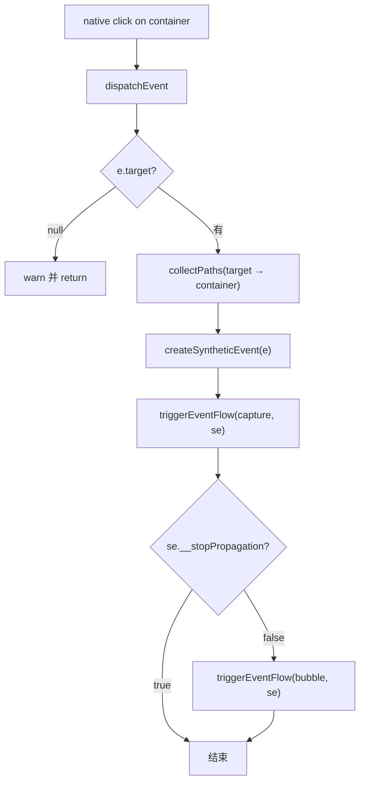
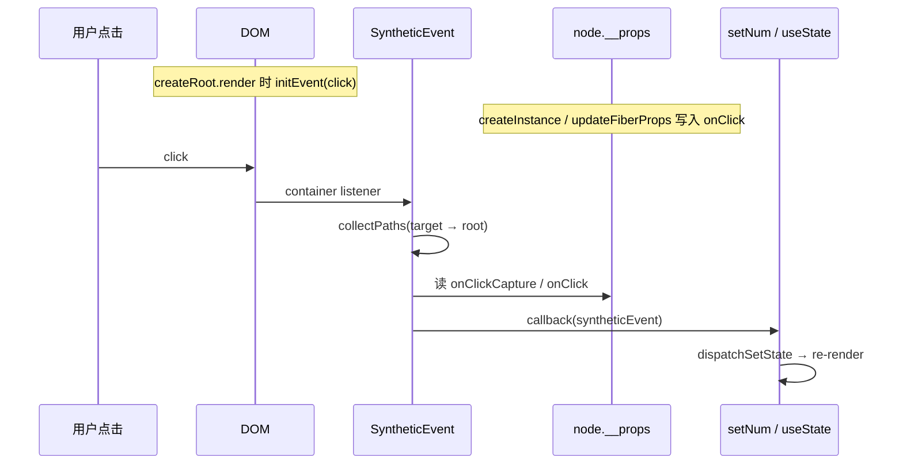

# Spec: SyntheticEvent 与 onClick 事件系统（big-react 第十一课）
type: utility

> **对齐参考**：[BetaSu/big-react@a043abec](https://github.com/BetaSu/big-react/commit/a043abecb7546eea5f678cf5f796e08c82ad2223)（`feat: 第11课`，2022-12-19）。本 spec 以该 commit 的实现语义为准，并补充与当前 JS 代码库的 API / 工程化差异适配说明。
>
> **前置依赖**：[`use-state.md`](./use-state.md)（第八课：`useState` Mount/Update、`dispatchSetState` 触发 re-render）。Host 建树与 `createInstance` 见 [`mount-phase.md`](./mount-phase.md)；`createRoot().render()` 见 [`commit-phase.md`](./commit-phase.md)。
>
> **后续依赖**：props diff（className / style）、更多事件类型（change / input）、事件池、Passive 事件等在后续课程 commit 中补齐。

## 1. 需求定义

### 1.1 背景与目标

- **解决什么问题**：第十课前后已能通过 `useState` 更新 UI，但 JSX 上的 `onClick` / `onClickCapture` 无法响应用户交互——DOM 节点未保存 React props，也没有在 container 上注册原生事件与冒泡/捕获分发。
- **使用方**：
  - 应用 / demos：`<div onClick={() => setNum(n + 1)}>{num}</div>`
  - `packages/react-dom`：`SyntheticEvent` 模块、`hostConfig.createInstance` 写 props
  - `packages/react-reconciler`：`completeWork` HostComponent update 同步 props 到 DOM
- **本课目标（click 合成事件最小闭环）**：
  - 新增 `SyntheticEvent.ts`：`initEvent`、`dispatchEvent`、`collectPaths`、`createSyntheticEvent`
  - DOM 节点通过 `elementPropsKey = '__props'` 挂载 React props（含 `onClick` / `onClickCapture`）
  - `createInstance(type, props)` 恢复 props 参数并调用 `updateFiberProps`
  - `createRoot().render()` 前对 container 调用 `initEvent(container, 'click')`
  - `completeWork` HostComponent **update** 分支：`updateFiberProps(stateNode, newProps)`（不设 Update flag）
  - demo：`useState` + 点击自增
- **明确不在本 spec 范围**：
  - props 变化检测与 `Update` flag（completeWork 内仅注释 TODO）
  - `className` / `style` 等非事件 props 的 DOM 同步
  - 除 `click` 外的事件类型（`validEventTypeList` 仅 `click`）
  - 事件委托到 document、React 17+ 根容器变更
  - 合成事件对象池、`persist()`、`nativeEvent`
  - `preventDefault` 包装、优先级 / Lane 与事件批处理

### 1.2 能力范围（Capability Scope）

- **提供的能力：**
  - [ ] `updateFiberProps(node, props)`：将完整 props 写入 `node[__props]`
  - [ ] `initEvent(container, 'click')`：container 注册原生 `click` listener → `dispatchEvent`
  - [ ] `collectPaths`：自 `event.target` 向上至 container，收集 `onClickCapture`（capture）与 `onClick`（bubble）
  - [ ] capture 阶段：`paths.capture` 用 `unshift` 保证从外到内执行顺序
  - [ ] bubble 阶段：`paths.bubble` 用 `push`，自内到外
  - [ ] `createSyntheticEvent`：包装 `stopPropagation`，支持 `__stopPropagation` 中断后续回调
  - [ ] `hostConfig.createInstance(type, props)`：创建 DOM 并 `updateFiberProps`
  - [ ] `completeWork` mount：`createInstance(wip.type, newProps)`
  - [ ] `completeWork` update：`updateFiberProps(wip.stateNode, newProps)`
  - [ ] `commitUpdate` HostText：`memoizedProps?.content` 可选链
  - [ ] demo：点击 `div` 触发 `setNum`，数字递增
- **明确不提供的能力：**
  - [ ] HostComponent props 变更打 `Update` flag
  - [ ] 非 click 事件
  - [ ] 移除旧 onClick 回调（update 时整包 props 覆盖）
  - [ ] 函数组件 props 上的事件（事件仅挂在 Host DOM）

### 1.3 待确认项

| 问题 | 当前假设 | 优先级 |
|------|----------|--------|
| 语言 | 参考 TS，本地 JS（`.js` + JSDoc） | 已确认 |
| 函数名 | 参考 `updateFiberProps` | 本地演进为 `updateEventProps`（仅写事件字段） |
| capture 顺序 | 参考 `capture.unshift` | 本地若用 `push` 则 capture 顺序错误，应对齐参考 |
| completeWork update | 参考直接调 `updateFiberProps` | 本地 update 分支可能仍为 TODO |
| reconciler → react-dom | 参考 `completeWork` import `react-dom/src/SyntheticEvent` | 架构上更优经 hostConfig 封装 |
| 自动化单测 | collectPaths、stopPropagation、点击触发 setState | 已确认 |
| demo 路径 | 参考 `demos/test-fc/main.tsx` | 本地 `packages/demos` |

---

## 2. 项目资产对齐（Project Asset Alignment）

### 2.1 复用性审查（Reusability Audit）

| 检查项 | 现有资产 | 状态 | 本次策略 |
|--------|----------|------|----------|
| createRoot + render | commit-phase | ✅ 复用 | render 前 +initEvent |
| createInstance | commit-phase / mount-phase | ✅ 扩展 | 恢复 props 参数 |
| completeWork Host mount | mount-phase | ✅ 复用 | 传 newProps |
| useState + re-render | use-state.md | ✅ 复用 | demo 点击更新 |
| SyntheticEvent | 无 / 本地部分实现 | ❌ 新增/对齐 | 以 a043abec 为准 |
| hostConfig commitUpdate | 本地可能有 commitUpdate | ⚠️ 对齐 | HostText optional chaining |
| 参考实现 | BetaSu/big-react@a043abec | ✅ 外部 | 逐文件对照 |
| 本地已扩展 | updateEventProps 仅事件字段、Lane、useEffect | ⚠️ 超范围 | 本 spec 描述第十一课核心 |

### 2.2 规范对齐（Standard Compliance）

| 规范类别 | 项目规范要求 | 本次应用方式 |
|----------|--------------|--------------|
| **代码规范** | ESLint + Prettier | 改动文件必须通过 lint |
| **目录规范** | 事件系统属 L4 `react-dom` | `packages/react-dom/src/SyntheticEvent` |
| **架构边界** | reconciler 不直接操作 DOM 事件 | props 同步优先经 hostConfig；参考 commit 有 reconciler 直 import |
| **ESM 导入** | 显式 `.js` 扩展名 | 本地 JS 遵循 |
| **Host Config 边界** | L4 属于 react-dom | createInstance / commitUpdate 写 props |
| **循环依赖** | react-dom ↔ reconciler | SyntheticEvent 不 import reconciler |

---

## 3. API 设计（API Design）

### 3.1 模块：`SyntheticEvent`

#### 3.1.1 常量与类型

```javascript
export const elementPropsKey = '__props';
const validEventTypeList = ['click'];
```

| 类型 | 说明 |
|------|------|
| `DOMElement` | `Element & { [elementPropsKey]: Props }` |
| `Paths` | `{ capture: EventCallback[]; bubble: EventCallback[] }` |
| `SyntheticEvent` | 原生 `Event` + `__stopPropagation: boolean` |

#### 3.1.2 `updateFiberProps(node, props)`

```javascript
export function updateFiberProps(node, props) {
  node[elementPropsKey] = props;
}
```

| 参数 | 类型 | 说明 |
|------|------|------|
| `node` | `DOMElement` | Host DOM 实例 |
| `props` | `Props` | 完整 React props（含 `onClick` 等） |

> 参考 commit **整包覆盖** props；本地 `updateEventProps` 若只合并事件字段，语义不同，审查时以 a043abec 为准。

#### 3.1.3 `initEvent(container, eventType)`

```javascript
export function initEvent(container, eventType);
```

| 步骤 | 行为 |
|------|------|
| 1 | `eventType` 不在 `validEventTypeList` → `console.warn('当前不支持', eventType, '事件')` 并 return |
| 2 | `__DEV__` 时 `console.log('初始化事件：', eventType)` |
| 3 | `container.addEventListener(eventType, (e) => dispatchEvent(container, eventType, e))` |

| 约束 | 说明 |
|------|------|
| 调用时机 | 每次 `render` 前（参考 root.ts）；重复 addListener 会重复注册（课程阶段可接受） |
| 委托根 | container（#root），非 document |

#### 3.1.4 `dispatchEvent(container, eventType, e)`



#### 3.1.5 `getEventCallbackNameFromEventType`

| `eventType` | 返回 `[captureName, bubbleName]` |
|-------------|----------------------------------|
| `click` | `['onClickCapture', 'onClick']` |
| 其他 | `undefined` |

#### 3.1.6 `collectPaths(targetElement, container, eventType)`

自 **target** 沿 `parentNode` 向上，直到 `targetElement === container`（不含 container 自身）：

| 索引 `i` | props 字段 | 收集方式 | 遍历顺序语义 |
|----------|------------|----------|--------------|
| `0` | `onClickCapture` | `paths.capture.unshift(callback)` | capture：外 → 内 |
| `1` | `onClick` | `paths.bubble.push(callback)` | bubble：内 → 外 |

```javascript
while (targetElement && targetElement !== container) {
  const elementProps = targetElement[elementPropsKey];
  // ... 读取 callbackNameList，按 i 分流 capture/bubble
  targetElement = targetElement.parentNode;
}
```

#### 3.1.7 `createSyntheticEvent(e)`

| 字段/方法 | 行为 |
|-----------|------|
| `__stopPropagation` | 初始 `false` |
| `stopPropagation()` | 设 `__stopPropagation = true`；调用原生 `originStopPropagation` |

#### 3.1.8 `triggerEventFlow(paths, se)`

顺序 `for` 调用 `callback.call(null, se)`；任一次后 `se.__stopPropagation === true` 则 break。

### 3.2 `hostConfig` 变更

#### 3.2.1 `createInstance(type, props)`

```javascript
export const createInstance = (type, props) => {
  const element = document.createElement(type);
  updateFiberProps(element, props);
  return element;
};
```

| 变更 | 第六课 | 本课 |
|------|--------|------|
| 签名 | `(type: string)` | `(type: string, props: Props)` |
| props | TODO 注释 | mount 时写入 DOM 供事件读取 |

#### 3.2.2 `commitUpdate(fiber)` HostText

```javascript
const text = fiber.memoizedProps?.content;
return commitTextUpdate(fiber.stateNode, text);
```

可选链避免 update 路径 `memoizedProps` 未就绪时抛错。

### 3.3 `createRoot` 变更

```javascript
render(element) {
  initEvent(container, 'click');
  return updateContainer(element, root);
}
```

### 3.4 `completeWork` 变更（HostComponent）

| 分支 | 行为（a043abec） |
|------|------------------|
| **update**（`current !== null && wip.stateNode`） | `updateFiberProps(wip.stateNode, newProps)`；**不**比较 props、**不**设 Update flag（TODO 注释保留） |
| **mount** | `createInstance(wip.type, newProps)` + `appendAllChildren` |

| 分支 | HostText update |
|------|-----------------|
| 文本 diff | `current.memoizedProps?.content` vs `newProps.content`；不等则 `markUpdate(wip)` |

> 参考 commit 在 reconciler 内 `import { updateFiberProps } from 'react-dom/src/SyntheticEvent'`。本地更推荐经 `hostConfig.commitUpdate(instance, props)` 封装，避免 reconciler 直依赖 react-dom 子路径。

### 3.5 端到端数据流



### 3.6 错误契约

| 场景 | 行为 | 调用方处理 |
|------|------|------------|
| 不支持的事件类型 | warn + return | 仅用 `click` |
| `e.target === null` | warn + return | 正常点击应有 target |
| HostComponent commitUpdate 非 HostText | DEV warn `未实现的Update类型` | 本课 Host 仅文本 Update |
| onClick 非函数 | 不收集 | 传合法函数 |
| stopPropagation | 跳过 bubble 阶段 | 与 DOM 语义一致 |

---

## 4. 使用示例（Usage Examples）

### 4.1 点击自增（对齐 test-fc demo）

```jsx
function App() {
  const [num, setNum] = useState(100);
  return <div onClick={() => setNum(num + 1)}>{num}</div>;
}

createRoot(document.getElementById('root')).render(<App />);
```

| 步骤 | 预期 |
|------|------|
| 首次 render | `#root > div`，文本 `100`；div 上 `__props.onClick` 存在 |
| 点击 div | `num` 变为 `101`，DOM 文本更新 |
| DEV | 控制台 `初始化事件： click`（每次 render 可能重复） |

### 4.2 capture + bubble 嵌套

```jsx
<div onClickCapture={() => console.log('cap outer')}
     onClick={() => console.log('bubble outer')}>
  <button onClick={() => console.log('bubble inner')}>click</button>
</div>
```

| 阶段 | 顺序（a043abec collectPaths 语义） |
|------|-------------------------------------|
| capture | `cap outer`（自外向内） |
| bubble | `bubble inner` → `bubble outer` |

### 4.3 stopPropagation

```jsx
<div onClick={() => console.log('parent')}>
  <span onClick={(e) => { e.stopPropagation(); console.log('child'); }}>x</span>
</div>
```

点击 `span`：仅 `child`；parent bubble 不触发。

---

## 5. 技术方案（Technical Design）

### 5.1 交付物清单（文件级，对齐 a043abec）

| # | 文件 | 改动摘要 |
|---|------|----------|
| D1 | `packages/react-dom/src/SyntheticEvent.ts` | **新增** 全文件 |
| D2 | `packages/react-dom/src/hostConfig.ts` | `createInstance(type, props)` + import SyntheticEvent |
| D3 | `packages/react-dom/src/root.ts` | render 前 `initEvent(container, 'click')` |
| D4 | `packages/react-reconciler/src/completeWork.ts` | mount 传 props；update `updateFiberProps`；HostText optional chaining |
| D5 | `demos/test-fc/main.tsx` | useState + onClick 自增 demo |

### 5.2 架构位置

```
用户交互
  ↓ native click（container 委托）
SyntheticEvent.dispatchEvent          ← L4 react-dom
  ↓ 读 DOM[__props].onClick
setNum → dispatchSetState             ← L3 reconciler + L1 react
  ↓ re-render
completeWork update → updateFiberProps ← 同步最新 onClick 到 DOM
```

### 5.3 props 存储策略

| 时机 | 写入方式 |
|------|----------|
| Mount | `createInstance` → `updateFiberProps` |
| Update | `completeWork` HostComponent → `updateFiberProps(stateNode, newProps)` |
| Commit Update（HostText） | `commitUpdate` 更新文本，与事件无关 |

本课 **不在 commit 阶段** 单独处理事件 props；依赖 completeWork 同步。

### 5.4 与官方 React 的差异（课程刻意简化）

| 维度 | 官方 React | 本课 a043abec |
|------|------------|---------------|
| 委托节点 | React 17+ root container | container |
| 支持事件 | 全量合成事件 map | 仅 `click` |
| props 存储 | Fiber ↔ DOM 映射 / props 系统 | `node.__props` 整包 |
| 合成事件对象 | 类实例 + 池化 | 原生 Event 扩展字段 |
| update 检测 | props diff + Update flag | 直接覆盖，无 diff |

### 5.5 异常兜底

| 输入 | 处理方式 |
|------|----------|
| 无 onClick | collectPaths 跳过，无回调 |
| 重复 initEvent | 多个 listener，多次 dispatch（课程可接受） |
| FC 上 onClick | 无效（无 DOM stateNode） |
| text 节点 click | target 为 Text，无 `__props`，仅祖先响应 |

---

## 6. 非功能需求（Non-Functional）

| 指标 | 目标值 | 测试方法 |
|------|--------|----------|
| Lint | `pnpm lint` 无新增 error | 本地 lint |
| Demo | 点击数字递增 | 浏览器 / Playwright |
| DEV 日志 | initEvent 打印 | 控制台 |
| 对齐度 | 与 a043abec 核心 5 文件一致 | PR diff 对照 |

---

## 7. 测试策略与覆盖率矩阵（Testing Strategy）

### 7.1 测试分层

| 测试类型 | 覆盖目标 | 工具 | 通过标准 |
|----------|----------|------|----------|
| 单元测试 | collectPaths capture/bubble 顺序 | Vitest + jsdom | AC-03、AC-04 |
| 单元测试 | stopPropagation | Vitest | AC-05 |
| 集成 | createInstance 写 __props | Vitest | AC-01 |
| E2E | click → useState 更新 | demos / Playwright | AC-06 |
| 参考对照 | 与 a043abec | 逐文件 diff | 核心一致 |

### 7.2 功能覆盖率矩阵

| 功能点 | 测试用例 | 场景 | 状态 |
|--------|----------|------|------|
| updateFiberProps | mount div + onClick | props 可读 | ⬜ |
| initEvent click | 非法 eventType | warn | ⬜ |
| collectPaths bubble | 嵌套 Host | 内→外顺序 | ⬜ |
| collectPaths capture | unshift 顺序 | 外→内 | ⬜ |
| createSyntheticEvent | stopPropagation | bubble 中断 | ⬜ |
| createInstance | 带 props | __props 存在 | ⬜ |
| completeWork update | 换 onClick | 新回调生效 | ⬜ |
| render initEvent | createRoot.render | listener 注册 | ⬜ |
| 点击自增 demo | useState | 数字 +1 | ⬜ |

### 7.3 复杂场景拆解

| 编号 | 输入 | 预期 | 对齐参考 |
|------|------|------|----------|
| SC-01 | 点击带 onClick 的 div | setState 触发，UI 更新 | test-fc |
| SC-02 | 父子均有 onClick | 先 capture 后 bubble 顺序正确 | a043abec |
| SC-03 | child stopPropagation | parent onClick 不执行 | SyntheticEvent |
| SC-04 | 二次 render 换新 onClick | 点击触发新函数 | updateFiberProps |
| SC-05 | 不支持 `mouseover` | warn，不注册 | initEvent |
| SC-06 | target 为 null | warn，不抛错 | dispatchEvent |

### 7.4 建议单测（Vitest）

| 测试文件 | 覆盖点 |
|----------|--------|
| `packages/react-dom/src/__tests__/SyntheticEvent.test.js` | collectPaths、stopPropagation、initEvent |
| `packages/react-dom/src/__tests__/hostConfig.props.test.js` | createInstance + __props |
| `packages/react-reconciler/src/__tests__/completeWork.hostUpdate.test.js` | updateFiberProps 调用 |

运行：`pnpm test`。

---

## 8. 任务拆分与并行计划（Task Breakdown）

### 8.1 任务卡片

#### 模块 A：SyntheticEvent 核心（Agent-1）

| ID | 任务 | 输出 | 对齐 commit |
|----|------|------|-------------|
| T-A1 | SyntheticEvent 全模块 | `SyntheticEvent.ts` | 新增 |
| T-A2 | root initEvent | `root.ts` | 修改 |

**CK-1 冻结**：`elementPropsKey`；`click` → `onClickCapture` / `onClick` 映射；capture `unshift` / bubble `push`。

#### 模块 B：Host Config + CompleteWork（Agent-2）

| ID | 任务 | 输出 | 对齐 commit |
|----|------|------|-------------|
| T-B1 | createInstance(type, props) | `hostConfig.ts` | 修改 |
| T-B2 | completeWork update + mount props | `completeWork.ts` | 修改 |
| T-B3 | commitUpdate optional chaining | `hostConfig.ts` | 修改 |

**CK-2 冻结**：mount/update 均同步 props 到 DOM；update 不打 Update flag。

#### 模块 C：Demo 验收（Agent-3）

| ID | 任务 | 输出 |
|----|------|------|
| T-C1 | test-fc 点击自增 demo | `demos/test-fc/main.tsx` |
| T-C2 | lint + test + 浏览器验证 | 全绿 |

### 8.2 并行时序

```
T-A1 → CK-1 → T-A2
         ↓
    T-B1 → T-B2 → T-B3 → CK-2
         ↓
    T-C1 → T-C2
```

---

## 9. 验收标准（Given-When-Then）

| ID | Given | When | Then |
|----|-------|------|------|
| AC-01 | `createInstance('div', { onClick: fn })` | 读 DOM | `dom[__props].onClick === fn` |
| AC-02 | `createRoot(container).render(<App/>)` | 首次 render | container 已注册 click listener |
| AC-03 | 嵌套 div > button，均绑 onClick | 点击 button | bubble 顺序：button → div |
| AC-04 | 外层 onClickCapture + 内层 onClick | 点击内层 | capture 先于 bubble；capture 外层先于内层 |
| AC-05 | 内层 onClick 内 `e.stopPropagation()` | 点击 | 外层 onClick 不执行 |
| AC-06 | demo `useState(100)` + div onClick | 点击 div | 显示数字递增 |
| AC-07 | HostComponent update 且 onClick 变更 | 点击 | 执行新 onClick（completeWork 已 sync） |
| AC-08 | `initEvent(container, 'mouseover')` | 调用 | warn，无 listener |
| AC-09 | 全部改动 | `pnpm lint` + `pnpm test` | 无 error |

---

## 10. 验收注意点与重点场景

### 10.1 必验（P0）

| 场景 | 验证点 |
|------|--------|
| 点击触发 setState | AC-06 |
| __props 挂载 | AC-01 |
| capture/bubble 顺序 | AC-03、AC-04 |
| stopPropagation | AC-05 |

### 10.2 易遗漏

| 风险 | 原因 | 验收 |
|------|------|------|
| capture 用 push 而非 unshift | 本地演进偏差 | AC-04 失败 |
| update 未 sync props | completeWork TODO 未补 | AC-07 |
| initEvent 未调用 | root 未改 | AC-02、AC-06 |
| createInstance 仍无 props | 第六课签名残留 | AC-01 |
| 重复 initEvent 多次 dispatch | 每次 render 注册 | 可接受，文档注明 |
| reconciler 直 import SyntheticEvent | 循环依赖风险 | 可经 hostConfig 封装 |
| 仅 merge 事件 props | updateEventProps 与参考不同 | 对齐 updateFiberProps 整包 |

### 10.3 回归

[`use-state.md`](./use-state.md) setState 更新不退化；[`commit-phase.md`](./commit-phase.md) Host 挂载仍可见；[`mount-phase.md`](./mount-phase.md) appendAllChildren 正常。

---

## 11. 风险与依赖

| 风险 | 缓解 |
|------|------|
| 依赖 useState Update 路径 | 确保第八/九课 updateState 已合入 |
| props 整包覆盖泄漏 | 课程阶段可接受；后续 props diff 课优化 |
| 每 render 重复 initEvent | 后续改为 createRoot 单次注册 |
| reconciler import react-dom 子模块 | 封装为 hostConfig.commitUpdate |
| TS → JS | 逻辑对齐 a043abec，JSDoc 补 Props |

---

## 12. 参考 commit 文件对照表

| 参考文件（a043abec） | 本地目标文件 | 变更类型 |
|---------------------|--------------|----------|
| `packages/react-dom/src/SyntheticEvent.ts` | `SyntheticEvent.js` | 新增 |
| `packages/react-dom/src/hostConfig.ts` | `hostConfig.js` | 修改 |
| `packages/react-dom/src/root.ts` | `root.js` | 修改 |
| `packages/react-reconciler/src/completeWork.ts` | `completeWork.js` | 修改 |
| `demos/test-fc/main.tsx` | `packages/demos/src/*.jsx` | 修改/映射 |

---

## 13. 与当前代码库差异摘要

| 维度 | a043abec | 当前 big-react |
|------|----------|----------------|
| props 写入 API | `updateFiberProps` 整包 | `updateEventProps` 仅事件字段 |
| capture 收集 | `unshift` | 可能为 `push`（需对齐） |
| completeWork Host update | `updateFiberProps` | 可能仍为 `// todo` |
| hostConfig commitUpdate | fiber 分支 HostText | 本地 `commitUpdate(instance, props)` 封装 |
| initEvent / dispatchEvent | 已实现 | 核心逻辑已有 |
| createRoot initEvent | 已实现 | 已对齐 |
| Lane / useEffect / Fragment | 无 | 本地已扩展 |

实现或审查时：**SyntheticEvent 分发链、__props 存储、createInstance(props)、initEvent(click)、completeWork update 同步 props 以 a043abec 为准**；本地 `updateEventProps` 增量合并、capture 顺序等偏差应单独对照修正。

---

**修订记录**

| 版本 | 日期 | 说明 |
|------|------|------|
| v1.0 | 2026-05-31 | 初稿，对齐 BetaSu/big-react@a043abec（第十一课 SyntheticEvent + onClick） |
