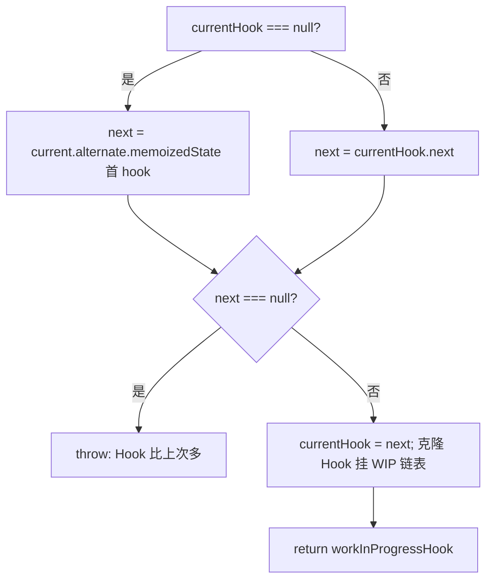
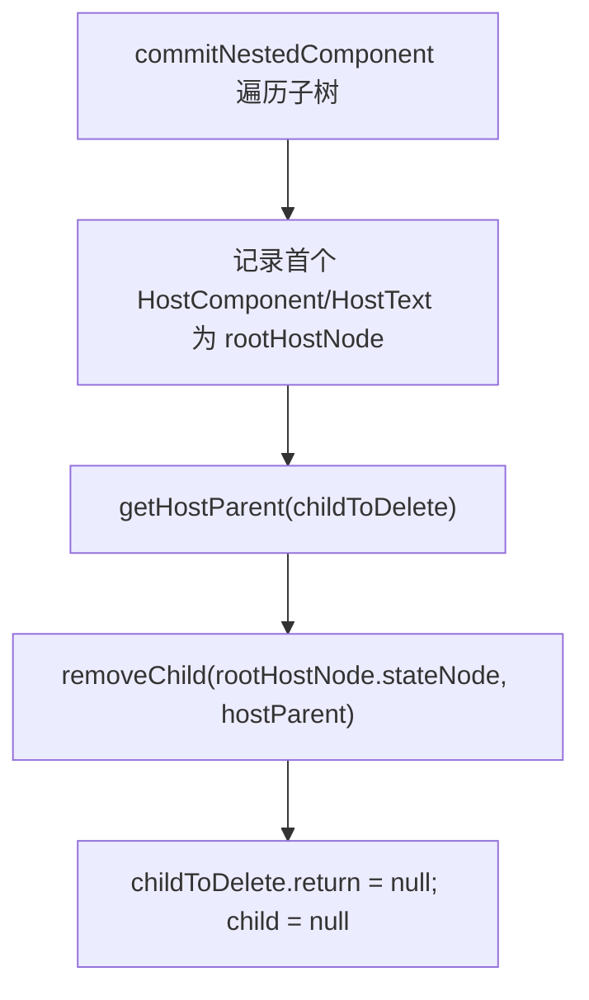
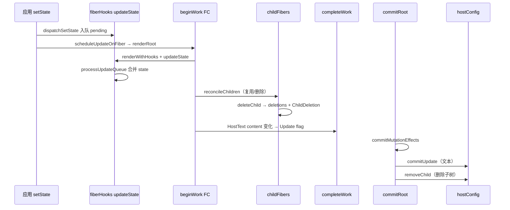

# Spec: Update 协调、useState Update 与 Commit Mutation 扩展（big-react 第十课）
type: utility

> **对齐参考**：[BetaSu/big-react@83a35fa](https://github.com/BetaSu/big-react/commit/83a35faeaf8ce1775e84466c750d81da3c4480f3)（`feat: 第10课`，2022-12-10）。本 spec 以该 commit 的实现语义为准，并补充与当前 JS 代码库的演进差异说明。
>
> **前置依赖**：[`use-state.md`](./use-state.md)（第八课：`useState` Mount、`HooksDispatcherOnMount`、`dispatchSetState` 入队）。[`function-component.md`](./function-component.md)（第七课 FC render）；[`commit-phase.md`](./commit-phase.md)（第六课 `commitRoot` / `commitPlacement`，Update / ChildDeletion 占位）；[`mount-phase.md`](./mount-phase.md)（第五课单节点 Diff 基础）。
>
> **后续依赖**：HostComponent props Update、`createInstance(type, props)`、多 children 数组 Diff、Lane 传参、`useEffect` unmount、ref 解绑等在后续课程 commit 中补齐。

## 1. 需求定义

### 1.1 背景与目标

- **解决什么问题**：第八课 `useState` 仅实现 Mount，`setState` 入队后第二次 render 无法读取 hook 状态；第六课 Commit 仅处理 `Placement`；第五课 `childFibers` 单节点 Diff 不比较 key/type，无法复用 Fiber 或标记删除。本课打通 **「setState → FC update render → reconcile 复用/删除 → completeWork 打 Update → commit Update/ChildDeletion」** 的 Update 最小闭环。
- **使用方**：
  - 应用 / demos：条件渲染切换子树（如 `num === 3 ? <Child /> : <div>{num}</div>`）
  - `packages/react-reconciler`：`fiberHooks`、`childFibers`、`completeWork`、`commitWork`
  - `packages/react-dom`：`hostConfig` 的 DOM 更新与删除 API
- **本课目标（Update 最小闭环）**：
  - `fiberHooks`：`HooksDispatcherOnUpdate`、`updateState`、`updateWorkInProgresHook`；`renderWithHooks` update 分支注入 Update Dispatcher 并重置 hook 模块变量
  - `childFibers`：单 Element / 单 Text 的 **key + type** 比较；`useFiber` 复用；`deleteChild` 收集 `deletions` 并打 `ChildDeletion`
  - `FiberNode.deletions` 字段；`createWorkInProgress` 重置
  - `completeWork`：`HostText` update 分支比较 `content`，变化时 `flags |= Update`
  - `commitWork`：实现 `Update` → `commitUpdate`；`ChildDeletion` → `commitDeletion` + `commitNestedComponent`
  - `hostConfig`：`commitUpdate` / `commitTextUpdate` / `removeChild`；导出 `TextInstance` 类型
  - demo：`test-fc` 条件渲染验证 state 更新与子树切换
- **明确不在本 spec 范围**：
  - HostComponent props diff 与 `commitUpdate` Host 分支（hostConfig DEV warn「未实现的Update类型」）
  - 数组 children 多节点 Diff（`reconcileChildFibers` 仍 warn 未实现类型）
  - `useEffect` / ref unmount（`commitDeletion` 内 TODO）
  - Lane 优先级、`processUpdateQueue` 传 `renderLane`
  - render 阶段触发的 hook 更新（`updateWorkInProgresHook` 内 TODO）
  - Fragment、FunctionComponent 作为 reconcile 子类型的完整 update

### 1.2 能力范围（Capability Scope）

- **提供的能力：**
  - [ ] `renderWithHooks` update：`currentDispatcher.current = HooksDispatcherOnUpdate`；结束后重置 `workInProgressHook` / `currentHook`
  - [ ] `updateState`：`updateWorkInProgresHook` → 若 `queue.shared.pending !== null` 则 `processUpdateQueue` → 返回 `[memoizedState, dispatch]`
  - [ ] `updateWorkInProgresHook`：从 `current.alternate.memoizedState` 链表同步 hook；hook 数量增多时 throw
  - [ ] `deleteChild(returnFiber, childToDelete)`：`deletions` 数组 + `returnFiber.flags |= ChildDeletion`
  - [ ] `reconcileSingleElement` update：key 相同且 type 相同 → `useFiber`；否则 `deleteChild` 后新建
  - [ ] `reconcileSingleTextNode` update：`HostText` tag 相同 → `useFiber`；否则 `deleteChild` 后新建
  - [ ] reconcile 兜底：`currentFiber !== null` 时 `deleteChild` 删除剩余旧 fiber
  - [ ] `useFiber(fiber, pendingProps)`：`createWorkInProgress` + `index=0` + `sibling=null`
  - [ ] `completeWork` HostText update：`oldText !== newText` → `markUpdate(wip)`
  - [ ] `commitMutationEffectsOnFiber`：`Update` → `commitUpdate`；`ChildDeletion` → 遍历 `deletions` 调 `commitDeletion`
  - [ ] `commitDeletion`：`commitNestedComponent` 找首个 Host 节点 → `removeChild` → 断开 fiber 指针
  - [ ] `hostConfig.commitTextUpdate`：`textInstance.textContent = content`
- **明确不提供的能力：**
  - [ ] Host DOM props 更新（className、style 等）
  - [ ] 多 sibling 数组 reconcile
  - [ ] FC unmount 时 effect / ref 清理
  - [ ] `commitUpdate` 对 `HostComponent` 的处理

### 1.3 待确认项

| 问题 | 当前假设 | 优先级 |
|------|----------|--------|
| 语言 | 参考 TS，本地 JS（`.js` + JSDoc） | 已确认 |
| 文件名 | 参考 `fiberHooks.ts` / `childFibers.ts` | 本地 `fiberHook.js` / `childFiber.js` | 已确认 |
| `updateWorkInProgresHook` 拼写 | 参考 commit 保留 Progres 笔误 | 本地可修正为 Progress |
| `fiberHooks` import `useState` | 参考 commit 顶部 import，未直接使用 | 可删除或保留（不对齐为 bug） |
| key 比较 | 单节点场景 `element.key === currentFiber.key`（含 null） | 已确认 |
| 自动化单测 | useFiber、deleteChild、updateState、commitDeletion | 已确认 |
| demo 验收 | `test-fc` 条件渲染 + setState 后 DOM 更新 | 推荐手工 |

---

## 2. 项目资产对齐（Project Asset Alignment）

### 2.1 复用性审查（Reusability Audit）

| 检查项 | 现有资产 | 状态 | 本次策略 |
|--------|----------|------|----------|
| useState Mount | use-state.md | ✅ 复用 | 扩展 Update Dispatcher |
| processUpdateQueue | fiber-root-update | ✅ 复用 | hook update 消费 pending |
| createWorkInProgress | mount-phase | ✅ 复用 | +deletions 重置；useFiber 依赖 |
| childFibers 单节点 | mount-phase | ✅ 扩展 | +key/type 复用与 delete |
| commitMutationEffects | commit-phase | ✅ 扩展 | +Update / ChildDeletion |
| commitPlacement | commit-phase | ✅ 复用 | 不变 |
| hostConfig DOM 创建 | commit-phase | ✅ 复用 | +update/remove |
| FiberNode | mount-phase | ✅ 扩展 | +deletions |
| 参考实现 | BetaSu/big-react@83a35fa | ✅ 外部 | 逐文件对照 |
| 本地已扩展 | Lane、多子 Diff、Fragment、useEffect commit | ⚠️ 超范围 | 本 spec 以 83a35fa 核心为准 |

### 2.2 规范对齐（Standard Compliance）

| 规范类别 | 项目规范要求 | 本次应用方式 |
|----------|--------------|--------------|
| **代码规范** | ESLint + Prettier | 改动文件必须通过 lint |
| **Host Config 边界** | L4 属于 `react-dom` | `commitUpdate` / `removeChild` 在 hostConfig |
| **ESM 导入** | 显式 `.js` 扩展名 | 本地 JS 遵循 |
| **依赖方向** | reconciler → hostConfig（react-dom） | commitWork import hostConfig |
| **fiberFlags** | MutationMask 含 Update / ChildDeletion | 本课消费两类 flag |

---

## 3. API 设计（API Design）

### 3.1 `renderWithHooks` Update 分支（fiberHooks）

```javascript
export function renderWithHooks(wip) {
  currentlyRenderingFiber = wip;
  wip.memoizedState = null; // update 课仍重置；hook 数据从 alternate 同步

  const current = wip.alternate;
  if (current !== null) {
    currentDispatcher.current = HooksDispatcherOnUpdate;
  } else {
    currentDispatcher.current = HooksDispatcherOnMount;
  }

  const Component = wip.type;
  const props = wip.pendingProps;
  const children = Component(props);

  currentlyRenderingFiber = null;
  workInProgressHook = null;
  currentHook = null;
  return children;
}
```

| 模块变量 | 作用 |
|----------|------|
| `currentlyRenderingFiber` | 当前正在 render 的 FC wip |
| `workInProgressHook` | 本轮 render 正在构建的 hook 链表尾 |
| `currentHook` | 对应 `current.alternate` 上正在同步的 hook 节点 |

#### `HooksDispatcherOnUpdate`

```javascript
const HooksDispatcherOnUpdate = {
  useState: updateState,
};
```

#### `updateState<State>()`

| 步骤 | 行为 |
|------|------|
| 1 | `hook = updateWorkInProgresHook()` |
| 2 | `pending = hook.updateQueue.shared.pending` |
| 3 | 若 `pending !== null`：`{ memoizedState } = processUpdateQueue(hook.memoizedState, pending)` → 写回 `hook.memoizedState` |
| 4 | 返回 `[hook.memoizedState, queue.dispatch]` |

> 与第八课差异：第八课 update 分支为空；本课在 **render 阶段** 消费 `dispatchSetState` 入队的 pending update。

#### `updateWorkInProgresHook()`



| 场景 | 行为 |
|------|------|
| FC 第一次 update 的第一个 hook | `currentHook=null` → 从 `alternate.memoizedState` 取首 hook |
| 同次 render 后续 hook | `currentHook.next` |
| hook 数量多于 alternate | throw `本次执行时的Hook比上次执行时多` |
| mount 误走 update | `alternate` 为 null 时 `nextCurrentHook=null` → throw |

### 3.2 `childFibers` Update 协调

#### `deleteChild(returnFiber, childToDelete)`

```javascript
function deleteChild(returnFiber, childToDelete) {
  if (!shouldTrackEffects) return;
  const deletions = returnFiber.deletions;
  if (deletions === null) {
    returnFiber.deletions = [childToDelete];
    returnFiber.flags |= ChildDeletion;
  } else {
    deletions.push(childToDelete);
  }
}
```

| 条件 | 结果 |
|------|------|
| `mountChildFibers`（`shouldTrackEffects=false`） | 不收集 deletion |
| 首次 deletion | 新建数组 + 父 fiber 打 `ChildDeletion` |
| 后续 deletion | 仅 push 到同一 `deletions` 数组 |

#### `useFiber(fiber, pendingProps)`

```javascript
function useFiber(fiber, pendingProps) {
  const clone = createWorkInProgress(fiber, pendingProps);
  clone.index = 0;
  clone.sibling = null;
  return clone;
}
```

| 字段 | 说明 |
|------|------|
| `clone` | 双缓冲 wip，保留 `alternate` 链 |
| `index` / `sibling` | 单节点场景重置 sibling 链 |

#### `reconcileSingleElement`（update 路径）

| 条件 | 行为 |
|------|------|
| `currentFiber.key === element.key` 且 `currentFiber.type === element.type` | `useFiber(currentFiber, element.props)`，**不设** Placement |
| key 相同 type 不同 | `deleteChild` → break → 下方 `createFiberFromElement` |
| key 不同 | `deleteChild` → 新建 fiber |
| 无 currentFiber | 直接 `createFiberFromElement`（mount 逻辑） |

#### `reconcileSingleTextNode`（update 路径）

| 条件 | 行为 |
|------|------|
| `currentFiber.tag === HostText` | `useFiber(currentFiber, { content })` |
| 否则 | `deleteChild` → 新建 `HostText` fiber |

#### `reconcileChildFibers` 兜底

当 `newChild` 无法识别且 `currentFiber !== null` 时，调用 `deleteChild(returnFiber, currentFiber)` 删除剩余旧节点。

### 3.3 `FiberNode.deletions`

```javascript
class FiberNode {
  deletions: FiberNode[] | null; // 本课新增
}

// createWorkInProgress update 分支
wip.deletions = null;
```

| 字段 | 写入方 | 消费方 |
|------|--------|--------|
| `returnFiber.deletions` | `deleteChild` | `commitMutationEffectsOnFiber` ChildDeletion 分支 |
| 被删 fiber 本身 | 不修改 flags | `commitDeletion` 递归 unmount |

### 3.4 `completeWork` HostText Update

```javascript
function markUpdate(fiber) {
  fiber.flags |= Update;
}

// HostText, current !== null && wip.stateNode 存在
const oldText = current.memoizedProps.content;
const newText = newProps.content;
if (oldText !== newText) {
  markUpdate(wip);
}
```

| 路径 | 行为 |
|------|------|
| mount | 仍 `createTextInstance` + 设 `stateNode` |
| update 且文本未变 | 不打 Update |
| update 且文本变化 | `flags |= Update`（不重建 Text 节点） |

### 3.5 `commitWork` Update / ChildDeletion

#### `commitMutationEffectsOnFiber` 扩展

| flags | 行为 | 清除 |
|-------|------|------|
| `Placement` | `commitPlacement`（第六课已有） | `&= ~Placement` |
| `Update` | `commitUpdate(finishedWork)` via hostConfig | `&= ~Update` |
| `ChildDeletion` | `deletions.forEach(commitDeletion)` | `&= ~ChildDeletion` |

#### `commitDeletion(childToDelete)`



| `commitNestedComponent` 节点 tag | onCommitUnmount 行为 |
|--------------------------------|----------------------|
| `HostComponent` / `HostText` | 记录第一个 Host 为 `rootHostNode` |
| `FunctionComponent` | TODO useEffect unmount |
| 其他 | DEV warn |

> 删除策略：只移除子树中 **第一个 Host DOM 节点**（单 Host 子树足够）；FC 中间层不创建 DOM，Host 子节点仍在 fiber.child 链上。

#### `getHostParent`

复用第六课实现：沿 `return` 找 `HostComponent.stateNode` 或 `HostRoot.container`。

### 3.6 `hostConfig` 扩展（react-dom）

| 导出 | 签名 | 行为 |
|------|------|------|
| `TextInstance` | `Text` | 类型别名 |
| `commitUpdate` | `(fiber: FiberNode) => void` | `HostText` → `commitTextUpdate(stateNode, memoizedProps.content)` |
| `commitTextUpdate` | `(textInstance, content: string) => void` | `textInstance.textContent = content` |
| `removeChild` | `(child, container) => void` | `container.removeChild(child)` |

| `fiber.tag` | `commitUpdate` |
|-------------|----------------|
| `HostText` | 更新 textContent |
| 其他 | DEV warn「未实现的Update类型」 |

### 3.7 端到端数据流



### 3.8 错误契约

| 场景 | 行为 | 调用方处理 |
|------|------|------------|
| update 时 hook 数量增多 | throw Error | 遵守 Hooks 规则，不在条件分支增删 hook |
| FC 外调用 hook | throw「请在函数组件内调用hook」 | 仅在 FC render 内调用 |
| `commitUpdate` 非 HostText | DEV warn | 本课仅文本 Update |
| `getHostParent` 失败 | 不 removeChild | 检查 Fiber return 链 |
| 未实现 reconcile 类型 | DEV warn + delete 剩余 current | 仅用 Element / 文本 / 条件切换 |

---

## 4. 使用示例（Usage Examples）

### 4.1 useState 二次 render

```javascript
function App() {
  const [num, setNum] = useState(100);
  return <div>{num}</div>;
}
// setNum(101) → updateState processUpdateQueue → div 内文本 101
// completeWork HostText markUpdate → commit commitTextUpdate
```

### 4.2 条件渲染触发 ChildDeletion

```javascript
function App() {
  const [num, setNum] = useState(100);
  return num === 3 ? <Child onClick={() => setNum(111)} /> : <div>{num}</div>;
}
// num: 100 → 3：旧 div Host 子树 deleteChild → commitDeletion removeChild
// num: 3 → 111：Child mount + useState update
```

### 4.3 Element type 变化（同 key）

```javascript
// reconcile: key 相同但 type 从 'div' 变为 'span'
// deleteChild(current div) → createFiberFromElement(span) → Placement（update 路径新 fiber）
```

### 4.4 HostText 复用

```javascript
// reconcileSingleTextNode: current HostText + 新 content
// useFiber 复用 alternate → completeWork 比较 content → 变化则 Update flag
// commit 阶段不 removeChild，仅 textContent 更新
```

---

## 5. 技术方案（Technical Design）

### 5.1 交付物清单（文件级，对齐 83a35fa）

| # | 文件 | 改动摘要 |
|---|------|----------|
| D1 | `packages/react-reconciler/src/fiberHooks.ts` | Update Dispatcher、updateState、updateWorkInProgresHook、模块变量重置 |
| D2 | `packages/react-reconciler/src/childFibers.ts` | deleteChild、useFiber、element/text update reconcile |
| D3 | `packages/react-reconciler/src/fiber.ts` | +deletions；WIP 重置 |
| D4 | `packages/react-reconciler/src/completeWork.ts` | HostText update + markUpdate |
| D5 | `packages/react-reconciler/src/commitWork.ts` | Update / ChildDeletion、commitDeletion、commitNestedComponent |
| D6 | `packages/react-dom/src/hostConfig.ts` | commitUpdate、commitTextUpdate、removeChild、TextInstance |
| D7 | `demos/test-fc/main.tsx` | 条件渲染 demo |

### 5.2 Update 与 Mount 路径对比

| 维度 | Mount（第五/八课） | Update（本课） |
|------|-------------------|----------------|
| childFibers 工厂 | `mountChildFibers(false)` | `reconcileChildFibers(true)` |
| 子 Fiber 创建 | 总是 create | key+type 相同则 useFiber |
| 旧节点 | 无 current | deleteChild + ChildDeletion |
| useState | mountState | updateState + processUpdateQueue |
| HostText DOM | createTextInstance | 复用 stateNode + Update flag |
| Commit | Placement（update 新节点） | +commitUpdate +removeChild |

### 5.3 异常兜底

| 输入 | 处理方式 |
|------|----------|
| 文本 content 不变 | 不打 Update，commit 跳过 |
| 条件渲染切换子树 | 旧子树 deletions + removeChild |
| hook pending 为空 | updateState 直接返回当前 memoizedState |
| 单节点 reconcile 失败 | delete 剩余 current + warn |

---

## 6. 非功能需求（Non-Functional）

| 指标 | 目标值 | 测试方法 |
|------|--------|----------|
| Lint | `pnpm lint` 无新增 error | 本地 lint |
| 测试 | `pnpm test` 相关用例通过 | Vitest |
| 对齐度 | 与 83a35fa 核心 7 文件语义一致 | PR diff 对照 |
| demo | test-fc 条件渲染 + setState | 浏览器手工 |
| 构建 | `pnpm build:dev` 成功 | 本地构建 |

---

## 7. 测试策略与覆盖率矩阵（Testing Strategy）

### 7.1 测试分层

| 测试类型 | 覆盖目标 | 工具 | 通过标准 |
|----------|----------|------|----------|
| 单元测试 | useFiber、deleteChild、updateState、markUpdate | Vitest | AC 通过 |
| 集成 | reconcile update + commit mock hostConfig | Vitest | flags 与 DOM 调用正确 |
| demo | 条件渲染 DOM 切换 | test-fc 手工 | 可见正确 UI |
| 参考对照 | 与 83a35fa | 逐文件 diff | 核心一致 |

### 7.2 功能覆盖率矩阵

| 功能点 | 测试用例 | 场景 | 状态 |
|--------|----------|------|------|
| updateState 消费 pending | setState 后 render | 1/1 | ⬜ |
| updateWorkInProgresHook 链表 | 单 useState 二次 render | 1/1 | ⬜ |
| hook 数量增多 throw | 条件分支多 hook | 1/1 | ⬜ |
| useFiber 复用 | 同 key+type element | 1/1 | ⬜ |
| deleteChild | reconcile type 变化 | 1/1 | ⬜ |
| HostText useFiber | 文本 content 变 | 1/1 | ⬜ |
| completeWork markUpdate | content 变化 | 1/1 | ⬜ |
| commitUpdate | HostText Update flag | 1/1 | ⬜ |
| commitDeletion | ChildDeletion + deletions | 1/1 | ⬜ |
| removeChild 调用 | 条件卸载子树 | 1/1 | ⬜ |
| reconcile 兜底 delete | 未识别 newChild | 1/1 | ⬜ |
| deletions 重置 | createWorkInProgress | 1/1 | ⬜ |

### 7.3 复杂场景拆解

| 编号 | 输入 | 预期 | 对齐参考 |
|------|------|------|----------|
| SC-01 | `useState(100)` → `setNum(101)` | 文本节点 content 更新，无整树重建 | 83a35fa |
| SC-02 | `<div>{num}</div>` → `num===3` 切 `<Child/>` | 旧 div 子树 DOM removeChild | demo main.tsx |
| SC-03 | 同 key 换 type `div`→`span` | deleteChild + 新 fiber Placement | childFibers |
| SC-04 | HostText content 不变 | 无 Update flag | completeWork |
| SC-05 | mountChildFibers 路径 | deleteChild 不生效 | shouldTrackEffects |
| SC-06 | commitDeletion FC 中间层 | 仍能定位 Host 子节点 remove | commitNestedComponent |

### 7.4 建议单测（Vitest）

| 测试文件 | 覆盖点 |
|----------|--------|
| `packages/react-reconciler/src/__tests__/fiberHook.updateState.test.js` | updateState、processUpdateQueue |
| `packages/react-reconciler/src/__tests__/childFibers.update.test.js` | useFiber、deleteChild、key/type |
| `packages/react-reconciler/src/__tests__/completeWork.hostTextUpdate.test.js` | markUpdate |
| `packages/react-reconciler/src/__tests__/commitWork.updateDeletion.test.js` | commitUpdate、commitDeletion |
| `packages/react-dom/src/__tests__/hostConfig.update.test.js` | commitTextUpdate、removeChild |

运行：`pnpm test`。

---

## 8. 任务拆分与并行计划（Task Breakdown）

### 8.1 拆分原则

按 83a35fa 文件边界：**Fiber 字段 → childFibers reconcile → fiberHooks update → completeWork → hostConfig → commitWork → demo**。

### 8.2 任务卡片

#### 模块 A：Reconcile Update（Agent-1）

| ID | 任务 | 输出 | 对齐 commit 文件 |
|----|------|------|------------------|
| T-A1 | `deletions` 字段 + WIP 重置 | `fiber.ts` | fiber.ts |
| T-A2 | deleteChild、useFiber、element/text update | `childFibers.ts` | childFibers.ts |

**CK-1 冻结**：`deleteChild` 语义；`useFiber` 复用条件（key+type / HostText tag）。

#### 模块 B：Hooks + Complete（Agent-2）

| ID | 任务 | 输出 | 对齐 commit 文件 |
|----|------|------|------------------|
| T-B1 | Update Dispatcher + updateState + updateWorkInProgresHook | `fiberHooks.ts` | fiberHooks.ts |
| T-B2 | HostText update + markUpdate | `completeWork.ts` | completeWork.ts |

**CK-2 冻结**：`updateState` 在 render 阶段 `processUpdateQueue`；hook 链表同步规则。

#### 模块 C：Commit + HostConfig + Demo（Agent-3）

| ID | 任务 | 输出 | 对齐 commit 文件 |
|----|------|------|------------------|
| T-C1 | commitUpdate / removeChild | `hostConfig.ts` | hostConfig.ts |
| T-C2 | Update / ChildDeletion commit | `commitWork.ts` | commitWork.ts |
| T-C3 | test-fc 条件渲染 demo | `demos/test-fc/main.tsx` | main.tsx |

### 8.3 并行时序

```
T-A1 → T-A2 → CK-1
         ↓
    T-B1 → T-B2 → CK-2
         ↓
    T-C1 → T-C2 → T-C3
```

---

## 9. 验收标准（Given-When-Then）

| ID | Given | When | Then |
|----|-------|------|------|
| AC-01 | FC 已 mount 且 `useState(100)` | `setState(101)` 触发二次 render | 界面显示 `101` |
| AC-02 | AC-01 render 过程中 | 检查 hook | `updateState` 调用 `processUpdateQueue` 更新 `memoizedState` |
| AC-03 | 同 key+type 的 element update | `reconcileSingleElement` | 返回 `useFiber` 产物，无多余 Placement（复用路径） |
| AC-04 | key 或 type 变化 | reconcile update | `deleteChild` 执行；父 fiber 含 `ChildDeletion` |
| AC-05 | HostText content 变化 | completeWork update | `wip.flags` 含 `Update` |
| AC-06 | HostText Update flag | commit | `hostConfig.commitTextUpdate` 被调用 |
| AC-07 | 父 fiber 有 deletions | commit ChildDeletion | `removeChild` 移除对应 DOM |
| AC-08 | 条件渲染 `<div>` → `<Child/>` | setState 切换 | 旧 DOM 节点从 container 移除 |
| AC-09 | update 时 hook 数量与 alternate 一致 | renderWithHooks | 不 throw |
| AC-10 | 全部改动 | `pnpm lint` + `pnpm test` | 无 error |

---

## 10. 验收注意点与重点场景

### 10.1 必验（P0）

| 场景 | 验证点 |
|------|--------|
| setState 后 UI 更新 | AC-01、AC-02 |
| 条件渲染卸载 | AC-07、AC-08 |
| HostText 增量更新 | AC-05、AC-06 |
| Fiber 复用 | AC-03 |

### 10.2 易遗漏

| 风险 | 原因 | 验收 |
|------|------|------|
| update 仍走 mountState | 未设 HooksDispatcherOnUpdate | AC-02 失败 |
| workInProgressHook 未重置 | 第八课遗漏，本课须修 | 多 hook update 错乱 |
| deleteChild 在 mount 路径生效 | 误用 reconcile 工厂 | SC-05 |
| completeWork 未 markUpdate | 文本变但 DOM 不变 | AC-05 |
| commit 仍仅 Placement | 第六课占位未补 | AC-06、AC-07 |
| deletions 未重置 | WIP 污染 | SC-12 矩阵 deletions 项 |
| removeChild 删错节点 | rootHostNode 非首个 Host | SC-06 |
| hostConfig 缺 commitUpdate | reconciler commit throw | AC-06 |

### 10.3 回归

[`use-state.md`](./use-state.md) Mount 路径仍可用；[`commit-phase.md`](./commit-phase.md) Placement 不退化；[`mount-phase.md`](./mount-phase.md) 首次 mount 仍不走 deleteChild。

---

## 11. 风险与依赖

| 风险 | 缓解 |
|------|------|
| complete 建树 + commit Update 职责重叠 | 本课 HostText 复用 stateNode，仅 commit 改 textContent |
| 单 Host rootHostNode 删除策略 | 对齐 83a35fa；多 Host sibling 后续课 |
| TS → JS | 逻辑对齐；JSDoc 补 deletions / TextInstance |
| 本地 childFiber 已有多子 Diff | 对照 83a35fa 单节点 update 语义，扩展项单独回归 |
| 本地 Lane 改 processUpdateQueue 签名 | 本课不传 lane；lane-mode 为后续叠加 |
| FC unmount 无 effect 清理 | 文档标注 TODO；use-effect 课补齐 |

---

## 12. 参考 commit 文件对照表

| 参考文件（83a35fa） | 本地目标文件 | 变更类型 |
|---------------------|--------------|----------|
| `packages/react-reconciler/src/fiberHooks.ts` | `fiberHook.js` | 扩展 |
| `packages/react-reconciler/src/childFibers.ts` | `childFiber.js` | 扩展 |
| `packages/react-reconciler/src/fiber.ts` | `fiber.js` | 扩展 |
| `packages/react-reconciler/src/completeWork.ts` | `completeWork.js` | 扩展 |
| `packages/react-reconciler/src/commitWork.ts` | `commitWork.js` | 扩展 |
| `packages/react-dom/src/hostConfig.ts` | `hostConfig.js` | 扩展 |
| `demos/test-fc/main.tsx` | `packages/demos` 等价入口 | demo |

---

## 13. 与当前代码库差异摘要

| 维度 | 83a35fa | 当前 big-react |
|------|---------|----------------|
| 语言 | TypeScript | JavaScript + `.js` 扩展名 |
| 文件名 | `fiberHooks.ts` / `childFibers.ts` | `fiberHook.js` / `childFiber.js` |
| childFibers | 单 element / 单 text update | +多子数组、Fragment、key 复用、sibling 链 |
| processUpdateQueue | 无 renderLane 参数 | Lane 版（lane-mode） |
| renderWithHooks | `(wip)` | `(wip, lane)` |
| commitWork | Update/Deletion 最小集 | +commitUpdate Host props、PassiveEffect 等 |
| hostConfig | commitUpdate 仅 HostText | 本地可能已支持 props diff |
| useEffect unmount | TODO | use-effect.md 已覆盖 |
| demo | `demos/test-fc` | `packages/demos/src/main.jsx` |

实现或审查时：**useState update、单节点 reconcile 复用/删除、HostText Update commit、ChildDeletion removeChild 以 83a35fa 为准**；本地 Lane / 多子 Diff / Effect 扩展单独回归，不反向改变本课核心语义。

---

**修订记录**

| 版本 | 日期 | 说明 |
|------|------|------|
| v1.0 | 2026-05-31 | 初稿，对齐 BetaSu/big-react@83a35fa（第十课 Update 协调 + Commit Mutation 扩展） |
