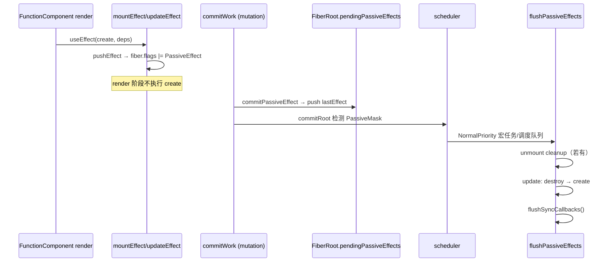

# Spec: useEffect 与 Passive Effect 提交（big-react Hooks 能力扩展）
type: utility

> **对齐参考**：[BetaSu/big-react@0de1b01](https://github.com/BetaSu/big-react/commit/0de1b018924086224c805edde649de6a9a786951)（`feat: 15课`，2023-01-04）。本 spec 以该 commit 的实现语义为准，并补充与当前 JS 代码库的 API 差异适配说明。
>
> **前置依赖**：[`lane-mode.md`](./lane-mode.md) 已实现（Lane 基础设施 + 微任务批调度）。本课在既有 render → commit 链路上扩展 Passive Effect 收集与异步 flush。

## 1. 需求定义

### 1.1 背景与目标

- **解决什么问题**：当前 big-react 仅有 `useState`，函数组件无法在 commit 后执行副作用（数据订阅、DOM 测量、日志等），也无法在依赖变化或卸载时执行 cleanup。
- **使用方**：`packages/react` 对外导出 `useEffect`；`packages/react-reconciler` 内部 Hooks / Commit 链路；`packages/demos` 用于验证 mount / update / unmount 行为。
- **本课目标（Passive Effect 最小闭环）**：
  - 实现 `useEffect(create, deps?)`：mount 时注册 effect，deps 浅比较决定 update 时是否重新执行。
  - render 阶段只**标记** `PassiveEffect` flag 并维护 effect 环形链表，**不执行** create / destroy。
  - commit 的 mutation 阶段**收集**待执行的 effect 到 `FiberRootNode.pendingPassiveEffects`。
  - 通过 `scheduler` 以 `NormalPriority` **异步 flush**：先 unmount cleanup，再 update 的 destroy → create。
- **原理导读**：
  - [§4.5 实现原理详解](#45-实现原理详解onboarding-导读) — 一句话心智模型、装修类比、三阶段职责
  - [§4.6 分模块改动讲解](#46-分模块改动讲解) — 逐文件：改什么、为什么、难点、设计精髓
  - [§4.7 Demo 分阶段对照](#47-demo-分阶段对照) — 用 EffectDemo 日志验证各阶段行为
  - [§4.8 五句话总结](#48-五句话总结)
- **明确不在本 spec 范围**：
  - `useLayoutEffect`（Layout Effect / 同步 flush）
  - `useInsertionEffect`
  - StrictMode 双调用 mount effect
  - effect 优先级、Lane 与 Passive 的精细调度
  - `useEffect` 在 render 阶段触发更新（参考 commit 中 `updateWorkInProgresHook` 的 TODO）

### 1.2 能力范围（Capability Scope）

- **提供的能力：**
  - [ ] `packages/react` 导出 `useEffect(create, deps?)`
  - [ ] `currentDispatcher` 扩展 `useEffect` 分发；`resolveDispatcher` 在非 FC render 时抛错（对齐参考语义）
  - [ ] `hookEffectTags.js`：`Passive`、`HookHasEffect`
  - [ ] `fiberFlags.js`：`PassiveEffect`、`PassiveMask`
  - [ ] `fiberHook.js`：`mountEffect` / `updateEffect` / `pushEffect` / `areHookInputsEqual`；FC 级 effect 环形链表挂在 `fiber.updateQueue.lastEffect`
  - [ ] `fiber.js`：`FiberRootNode.pendingPassiveEffects`（`unmount[]` + `update[]`）
  - [ ] `commitWork.js`：mutation 遍历纳入 `PassiveMask`；收集 passive effect；`commitHookEffectListUnmount/Destroy/Create`；`commitDeletion` 时收集 unmount effect
  - [ ] `workLoop.js`：`commitRoot` 检测 Passive flag → `scheduler.scheduleCallback(NormalPriority, flushPassiveEffects)`；flush 末尾调用 `flushSyncCallbacks`
  - [ ] 根目录依赖 `scheduler@^0.23.0`
  - [ ] Demo：`EffectDemo` 验证 mount、deps 变化 cleanup+create、条件卸载 Child
- **明确不提供的能力：**
  - [ ] Layout Effect（DOM 变更后同步执行）
  - [ ] deps 省略时的「每次 render 都执行」语义（本课 deps 省略等价于 `null`，mount 执行一次，update 不再执行）
  - [ ] `useEffect` 返回 Promise / async create
  - [ ] ref 解绑（`commitDeletion` 中 FC 分支仍保留 ref TODO）

### 1.3 待确认项

| 问题 | 当前假设 | 优先级 |
|------|----------|--------|
| 语言 | 参考为 TS，本地实现为 JS（`.js`） | 已确认 |
| Hook 文件命名 | 本地为 `fiberHook.js`（非 `fiberHooks.ts`） | 已确认 |
| `resolveDispatcher` | 当前 `console.warn`；本课对齐参考改为 `throw new Error('hook只能在函数组件中执行')` | 已确认 |
| Demo 形态 | 在 `packages/demos/src/App.jsx` 新增 `EffectDemo` 区块，不替换现有 demo | 已确认 |
| scheduler 依赖 | 根 `package.json` 新增 `scheduler`；reconciler 直接 import | 已确认 |
| deps 省略 | `deps === undefined` → 内部存 `null`；mount 带 `HookHasEffect`，update 不再触发 | 已确认（对齐 0de1b01） |
| 自动化单测 | Vitest；优先 `areHookInputsEqual`、effect 链表、`commitHookEffectList*` 纯逻辑 | 已确认 |

---

## 2. 项目资产对齐（Project Asset Alignment）

### 2.1 复用性审查（Reusability Audit）

| 检查项 | 现有资产 | 状态 | 本次策略 |
|--------|----------|------|----------|
| Lane + 微任务调度 | `lane-mode.md` 已实现 | ✅ 复用 | commit 后 `ensureRootIsScheduled` 保持不变 |
| `useState` / Hook 基础设施 | `fiberHook.js` | ✅ 扩展 | 同文件增 effect 逻辑；FC `updateQueue` 扩展 `lastEffect` |
| `bubbleProperties` | `completeWork.js` 已有 | ✅ 复用 | Passive flag 随 flags 冒泡到 subtreeFlags |
| Mutation commit 遍历 | `commitWork.js` | ❌ 需改 | 遍历条件加入 `PassiveMask`；传入 `root` |
| Passive flush | 无 | ❌ 新增 | `workLoop.js` + `scheduler` |
| `commitDeletion` FC 分支 | 空实现 | ❌ 需改 | 调用 `commitPassiveEffect(..., 'unmount')` |
| 参考实现 | BetaSu/big-react@0de1b01 | ✅ 外部 | 逐文件对照 |

### 2.2 规范对齐（Standard Compliance）

| 规范类别 | 项目规范要求 | 本次应用方式 |
|----------|--------------|--------------|
| **代码规范** | ESLint + Prettier | 改动文件必须通过 lint |
| **目录规范** | reconciler 逻辑在 `packages/react-reconciler/src/` | 新增 `hookEffectTags.js` |
| **依赖方向** | reconciler 通过 alias 引用 DOM / scheduler | `scheduler` 为 reconciler 运行时依赖 |
| **命名规范** | 本地已有 `fiberHook.js` | 不 rename，在原文件扩展 |
| **ESM 导入** | 显式 `.js` 扩展名 | 新增 import 遵循项目约定 |

### 2.3 与当前代码的关键差异（迁移注意）

#### `commitMutationEffects` 签名

```javascript
// 当前
export function commitMutationEffects(finishedWork) { ... }

// 目标（对齐 0de1b01）
export function commitMutationEffects(finishedWork, root) { ... }
```

`workLoop.commitRoot` 调用处需同步传入 `root`。

#### FC 的 `updateQueue` 形态

`useState` 与 `useEffect` 共用同一 FC 级 `updateQueue`（`createFCUpdateQueue` 包装 `createUpdateQueue` 并增加 `lastEffect`）。首个 hook 创建 queue，后续 hook 复用 `currentlyRenderingFiber.updateQueue`。

#### Effect 与 Update 共用 fiber.updateQueue

| 字段 | useState 使用 | useEffect 使用 |
|------|---------------|----------------|
| `shared.pending` | Update 环形链表 | 不使用 |
| `dispatch` | setState dispatch | 不使用 |
| `lastEffect` | 不使用 | Effect 环形链表尾指针 |

---

## 3. API 设计（API Design）

### 3.1 公开 API（packages/react）

#### `useEffect(create, deps?)`

| 参数 | 类型 | 必填 | 默认值 | 说明 |
|------|------|------|--------|------|
| `create` | `() => (void \| (() => void))` | 是 | — | 副作用函数；可返回 cleanup |
| `deps` | `any[] \| undefined` | 否 | `undefined` → 内部 `null` | 依赖数组；浅比较 |

| 返回值 | 说明 |
|--------|------|
| `void` | 无返回值 |

| 错误 | 触发场景 | 调用方处理 |
|------|----------|------------|
| `Error: hook只能在函数组件中执行` | 在 FC 外调用 | 仅能在函数组件 render 中调用 |

### 3.2 新增模块：`hookEffectTags.js`

| 导出 | 值 | 说明 |
|------|-----|------|
| `HookHasEffect` | `0b0001` | 本 commit 需要执行 create/destroy |
| `Passive` | `0b0010` | Passive effect 类型标记 |

Effect 节点的 `tag` 为 `HookHasEffect | Passive` 或仅 `Passive`（deps 未变时）。

### 3.3 变更模块：`fiberFlags.js`

| 导出 | 值 | 说明 |
|------|-----|------|
| `PassiveEffect` | `0b0001000` | FC 存在待 flush 的 passive effect |
| `PassiveMask` | `PassiveEffect \| ChildDeletion` | commit 遍历与 commitRoot 检测用 |

> `ChildDeletion` 纳入 `PassiveMask`：删除子树时需在 mutation 阶段收集被删 FC 的 unmount effect。

### 3.4 变更模块：`fiberHook.js`

#### `Effect` 结构

| 字段 | 类型 | 说明 |
|------|------|------|
| `tag` | `number` | `Passive` / `Passive \| HookHasEffect` |
| `create` | `function \| void` | 用户传入的 create |
| `destroy` | `function \| void` | 上次 create 的返回值 |
| `deps` | `any[] \| null` | 依赖快照 |
| `next` | `Effect \| null` | 环形链表 |

#### 核心函数

| 函数 | 说明 |
|------|------|
| `mountEffect(create, deps)` | `flags \|= PassiveEffect`；`pushEffect(Passive \| HookHasEffect, ...)` |
| `updateEffect(create, deps)` | deps 浅比较相等 → `pushEffect(Passive, create, prevDestroy, deps)` 且**不**设 flag；不等 → 设 flag + `HookHasEffect` |
| `areHookInputsEqual(next, prev)` | 逐项 `Object.is`；任一为 `null` 返回 `false` |
| `pushEffect(tag, create, destroy, deps)` | 插入 FC 级 effect 环；返回当前 Effect 节点 |
| `createFCUpdateQueue()` | `createUpdateQueue()` + `lastEffect: null` |

#### HooksDispatcher 扩展

```javascript
const HooksDispatcherOnMount = {
  useState: mountState,
  useEffect: mountEffect,
};
const HooksDispatcherOnUpdate = {
  useState: updateState,
  useEffect: updateEffect,
};
```

### 3.5 变更模块：`fiber.js` — `FiberRootNode`

```javascript
/** @typedef {{ tag: number, create: Function|void, destroy: Function|void, deps: any[]|null, next: object|null }} Effect */

/** @typedef {{ unmount: Effect[], update: Effect[] }} PendingPassiveEffects */
```

| 字段 | 类型 | 初始值 | 说明 |
|------|------|--------|------|
| `pendingPassiveEffects.unmount` | `Effect[]` | `[]` | 待执行 unmount cleanup 的环尾指针列表 |
| `pendingPassiveEffects.update` | `Effect[]` | `[]` | 待执行 destroy+create 的环尾指针列表 |

### 3.6 变更模块：`commitWork.js`

#### 签名与遍历

- `commitMutationEffects(finishedWork, root)`
- 向下遍历条件：`(subtreeFlags & (MutationMask | PassiveMask)) !== NoFlags`
- `commitMutaitonEffectsOnFiber(finishedWork, root)`（保留参考 commit 拼写）

#### `commitPassiveEffect(fiber, root, type)`

| 参数 `type` | 收集到 | 触发场景 |
|-------------|--------|----------|
| `'update'` | `pendingPassiveEffects.update` | fiber.flags 含 `PassiveEffect` |
| `'unmount'` | `pendingPassiveEffects.unmount` | `commitDeletion` 遍历 FC 子树 |

收集内容：`updateQueue.lastEffect`（环尾指针）。

#### `commitHookEffectList(flags, lastEffect, callback)`

遍历 effect 环：`effect = lastEffect.next`，do-while 直到回到 `lastEffect.next`；仅处理 `(effect.tag & flags) === flags` 的节点。

| 导出函数 | flags 过滤 | callback 行为 |
|----------|------------|---------------|
| `commitHookEffectListUnmount` | `Passive` | 调用 `destroy()`；`effect.tag &= ~HookHasEffect` |
| `commitHookEffectListDestroy` | `Passive \| HookHasEffect` | 调用 `destroy()` |
| `commitHookEffectListCreate` | `Passive \| HookHasEffect` | `effect.destroy = create()` |

### 3.7 变更模块：`workLoop.js`

#### `commitRoot` 扩展

```
if (finishedWork.flags & PassiveMask) || (finishedWork.subtreeFlags & PassiveMask):
  if !rootDoesHasPassiveEffects:
    rootDoesHasPassiveEffects = true
    scheduleCallback(NormalPriority, () => {
      flushPassiveEffects(root.pendingPassiveEffects)
    })

// mutation（现有逻辑，commitMutationEffects(finishedWork, root)）
// ...

rootDoesHasPassiveEffects = false
ensureRootIsScheduled(root)
```

#### `flushPassiveEffects(pendingPassiveEffects)`

```
1. pendingPassiveEffects.unmount.forEach(effect =>
     commitHookEffectListUnmount(Passive, effect))
   pendingPassiveEffects.unmount = []

2. pendingPassiveEffects.update.forEach(effect =>
     commitHookEffectListDestroy(Passive | HookHasEffect, effect))

3. pendingPassiveEffects.update.forEach(effect =>
     commitHookEffectListCreate(Passive | HookHasEffect, effect))
   pendingPassiveEffects.update = []

4. flushSyncCallbacks()
```

#### 模块级状态

| 变量 | 说明 |
|------|------|
| `rootDoesHasPassiveEffects` | 防止同一轮 commit 重复 schedule passive flush |

### 3.8 变更模块：`packages/react`

- `index.js`：导出 `useEffect`，经 `resolveDispatcher().useEffect` 转发
- `currentDispatcher.js`：JSDoc 描述 Dispatcher 含 `useEffect`

### 3.9 依赖：`scheduler`

根 `package.json`：

```json
"dependencies": {
  "scheduler": "^0.23.0"
}
```

reconciler 引用：

```javascript
import {
  unstable_scheduleCallback as scheduleCallback,
  unstable_NormalPriority as NormalPriority,
} from 'scheduler';
```

---

## 4. 核心流程（Technical Design）

### 4.1 useEffect 生命周期总览



### 4.2 deps 变化时的 update 路径

```mermaid
flowchart TD
  A[updateEffect] --> B{prevEffect 存在?}
  B -->|否| C[结束]
  B -->|是| D{areHookInputsEqual<br/>nextDeps, prevDeps?}
  D -->|相等| E[pushEffect Passive only<br/>不设 PassiveEffect flag]
  D -->|不等| F[flags |= PassiveEffect]
  F --> G[pushEffect Passive | HookHasEffect<br/>携带 prev destroy]
```

### 4.3 条件卸载 Child（Demo 核心场景）

```
初始 num=0 → 渲染 Child
  → mount: App effect ×2 + Child effect
  → flush: App mount 日志；Child mount 日志

点击 num=1 → Child 卸载
  → commitDeletion(Child FC)
  → commitPassiveEffect(..., 'unmount')
  → flush: Child unmount cleanup

再次点击 num=2 → 无 Child
  → num 变化触发 App 第二个 effect
  → flush: num change destroy(旧num) → create(新num)
```

### 4.4 commit 阶段子阶段（本课范围）

| 阶段 | 本课是否实现 | 说明 |
|------|--------------|------|
| beforeMutation | 否 | 预留 |
| mutation | 是 | Placement / Update / Deletion + **收集 Passive** |
| layout | 否 | `useLayoutEffect` 课 |
| passive | 是（异步） | scheduler flush |

### 4.5 实现原理详解（Onboarding 导读）

本节沉淀 useEffect 第一课的心智模型，便于后续维护者与 AI Agent 快速理解「为什么这样改」。更细的逐文件说明见 [§4.6](#46-分模块改动讲解)。

#### 4.5.1 一句话心智模型

> **useEffect 里的代码，不能在 render 里跑，要等 DOM 改完、再异步跑。**

整条实现流水线：

```
useEffect 被调用
  → Render：登记 effect（不执行）
  → Commit：收集 effect 到 root 篮子
  → Scheduler：异步跑 cleanup / create
```

#### 4.5.2 装修房子类比（三阶段职责）

| 阶段 | 在干什么 | useEffect 对应 | 禁止事项 |
|------|----------|----------------|----------|
| **Render** | 画设计图：房间怎么摆 | 只记「装修后要做什么」 | **不执行** create / destroy |
| **Commit** | 工人进场：搬家具、拆墙 | DOM 改完，把「待办清单」收进篮子 | **不执行** create / destroy |
| **Flush** | 装修完再通水电、装窗帘 | **这时才**跑 `useEffect` 里的函数 | — |

**为什么 render 不能跑 effect？** render 可能被打断或执行多次（Concurrent 模式下更明显）。副作用应发生在 DOM 已更新的 commit 之后，且与 paint 解耦，故本课用 Passive + scheduler 异步 flush。

#### 4.5.3 两套标记：fiber.flags vs effect.tag

实现里有两层「要不要执行」的判断，初学者容易混：

| 层级 | 字段 | 谁设置 | 谁消费 | 含义 |
|------|------|--------|--------|------|
| **Fiber 级** | `fiber.flags` 的 `PassiveEffect` | `mountEffect` / `updateEffect`（deps 变时） | commit 遍历与 `commitPassiveEffect` | 「这个 FC 本轮有待处理的 effect」 |
| **Effect 级** | `effect.tag` 的 `Passive` / `HookHasEffect` | `pushEffect` | `commitHookEffectList*`（flush 时） | 「这个 effect 本轮要不要跑 destroy/create」 |

**deps 未变时的完整跳过链路：**

1. `updateEffect` 不打 `PassiveEffect` → commit 不收集该 FC
2. `pushEffect` 只设 `Passive`、不设 `HookHasEffect` → flush 时 Destroy/Create 过滤 `(tag & flags) === flags` 匹配不上 → 跳过

#### 4.5.4 effect 为什么用环形链表？

同一 FC 可有多个 `useEffect`，挂在 FC 级 `updateQueue.lastEffect` 单环上，与 `useState` 的 Update 环独立字段共存。

```
effectA → effectB → effectA（绕一圈）
              ↑
         lastEffect 指 B（最后一个）
```

- **为什么用环**：多个 effect 顺序固定，只存一个尾指针 `lastEffect` 即可从 `lastEffect.next` 遍历整圈
- **为什么和 useState 共用 updateQueue**：FC 级一个 queue；`shared.pending` 给 state，`lastEffect` 给 effect，字段互不干扰

#### 4.5.5 `HookHasEffect` vs 仅 `Passive`

| effect.tag | 场景 | flush 行为 |
|------------|------|------------|
| `Passive \| HookHasEffect` | mount / deps 变化 | 走 Destroy + Create |
| 仅 `Passive` | deps 未变 | 不进入 Destroy/Create 过滤条件，跳过执行 |

类比：快递单上的「普通件」（Passive）与「今天要派送」（HookHasEffect）——只有贴了「今天要派送」，flush 才会执行。

#### 4.5.6 两个篮子与 flush 顺序

`FiberRootNode.pendingPassiveEffects`：

| 队列 | 生活比喻 | 收集时机 |
|------|----------|----------|
| `unmount[]` | 人搬走了，收钥匙、关水电 | `commitDeletion` 遇到被删 FC |
| `update[]` | 人还在，换家具前先清旧的再摆新的 | FC 带 `PassiveEffect` flag |

**flush 顺序（契约，不可乱）：**

```
① unmount 队列 → commitHookEffectListUnmount
② update 队列   → commitHookEffectListDestroy
③ update 队列   → commitHookEffectListCreate
④ flushSyncCallbacks()
```

**Passive flush 为什么在 mutation 同步段之后、又以 scheduler 异步执行？**

- cleanup 不应阻止 DOM mutation；unmount cleanup 收集于 mutation 的 deletion 路径，与 placement/update 同事务遍历
- `commitRoot` 在 mutation **之前** `scheduleCallback`（只是预约），mutation **同步完成**后，scheduler 回调才执行 flush——DOM 先变，effect 后跑，不阻塞绘制

#### 4.5.7 commit 与 flush 时间线

```
1. commitRoot 开始
2. 发现树上有 PassiveMask → scheduleCallback(NormalPriority, flushPassiveEffects)  ← 只是预约
3. commitMutationEffects(finishedWork, root)  ← 同步改 DOM + 收集 effect 到篮子
4. commitRoot 结束
5. （浏览器有机会绘制）
6. scheduler 回调 → flushPassiveEffects  ← 真正执行 effect
7. flushSyncCallbacks()  ← effect 内 setState 接上 lane-mode 微任务
```

---

### 4.6 分模块改动讲解

按实现顺序逐文件说明：**改什么 → 为什么 → 难点 / 设计精髓**。与 [§3 API 设计](#3-api-设计api-design) 对照阅读。

#### 4.6.1 `hookEffectTags.js`（新增）

| | |
|---|---|
| **改什么** | 导出 `HookHasEffect`、`Passive` 两个 effect 节点 tag |
| **为什么** | effect 上要存「类型」与「本轮要不要跑」；位标记可 `\|` 组合，flush 时用 `&` 精确过滤 |
| **精髓** | `HookHasEffect` 与 `Passive` 分离 → deps 没变时只留 `Passive`，实现跳过 |
| **难点** | 不是「有 useEffect 就要跑」，而是「本轮带 HookHasEffect 才跑 destroy/create」 |

#### 4.6.2 `fiberFlags.js`（扩展）

| | |
|---|---|
| **改什么** | 新增 `PassiveEffect`（FC 有待 flush 的 effect）、`PassiveMask = PassiveEffect \| ChildDeletion` |
| **为什么** | commit 从 root DFS 时需要知道子树里有没有 passive 待办；`ChildDeletion` 纳入 mask 才能在删子树时收集 unmount effect |
| **精髓** | flag 经 `completeWork` 的 `bubbleProperties` 冒泡到 `subtreeFlags`，root 可一次检测 |
| **难点** | 漏加 `PassiveMask` → FC 无 DOM mutation 时遍历不下探 → effect 永远收集不到（P0 踩坑） |

**当前代码（需扩展）：**

```javascript
// packages/react-reconciler/src/fiberFlags.js — 现有仅 MutationMask
export const MutationMask = Placement | Update | ChildDeletion;
// 目标：+ PassiveEffect、PassiveMask
```

#### 4.6.3 `fiber.js`（扩展 FiberRootNode）

| | |
|---|---|
| **改什么** | `pendingPassiveEffects: { unmount: [], update: [] }` |
| **为什么** | render 只登记、commit 只收集、flush 才执行，需要跨阶段暂存区 |
| **精髓** | 存的是 effect 环的**尾指针** `lastEffect`，不是 effect 数组——一圈多个 effect 一个指针遍历 |
| **难点** | unmount / update 必须分队列，否则 Child 卸载与父 deps 变化同时发生时顺序会乱 |

#### 4.6.4 `fiberHook.js`（核心扩展）

| | |
|---|---|
| **改什么** | `mountEffect` / `updateEffect` / `pushEffect` / `areHookInputsEqual` / `createFCUpdateQueue`；dispatcher 增 `useEffect` |
| **为什么** | 用户在 render 中调 `useEffect` 时，完成登记、deps 比较、环插入、打 fiber flag |

**mountEffect（首次渲染）：**

- `deps === undefined` → 内部存 `null`（本课：mount 跑一次，update 不再触发）
- `fiber.flags |= PassiveEffect`
- `pushEffect(Passive \| HookHasEffect, create, undefined, deps)`
- **不调用 create**

**updateEffect（再次渲染）：**

```
prevEffect = currentHook.memoizedState
if areHookInputsEqual(nextDeps, prevDeps):
  pushEffect(Passive, create, prevDestroy, deps)  // 不设 flag，不带 HookHasEffect
  return
flags |= PassiveEffect
pushEffect(Passive | HookHasEffect, create, prevDestroy, deps)  // 保留上次 cleanup
```

| | |
|---|---|
| **精髓** | cleanup 是上次 `create()` 的返回值，存在 `effect.destroy`；deps 变时 flush 先 destroy 再 create |
| **难点 1** | `areHookInputsEqual`：任一方为 `null` 返回 `false`；长度不同返回 `false`；逐项 `Object.is` |
| **难点 2** | `useState` 与 `useEffect` 共用 FC 级 `updateQueue`：首个 hook 创建的 queue 须能挂 `lastEffect`，不能各建各的导致链表丢失 |

**Effect 与 Update 共用 fiber.updateQueue：**

| 字段 | useState | useEffect |
|------|----------|-----------|
| `shared.pending` | Update 环 | 不使用 |
| `dispatch` | setState | 不使用 |
| `lastEffect` | 不使用 | Effect 环尾指针 |

#### 4.6.5 `commitWork.js`（Commit 收集）

| | |
|---|---|
| **改什么** | 签名加 `root`；遍历条件加 `PassiveMask`；`commitPassiveEffect`；`commitHookEffectList*`；`commitDeletion` FC 分支收集 unmount |
| **为什么** | commit 同步改 DOM 的同时，把待执行 effect 放进 root 篮子，仍不执行 |

**关键改动对照：**

```javascript
// 遍历：MutationMask → MutationMask | PassiveMask
// 签名：commitMutationEffects(finishedWork) → commitMutationEffects(finishedWork, root)

// FC 带 PassiveEffect → pendingPassiveEffects.update.push(lastEffect)
// commitDeletion 遇到 FunctionComponent → pendingPassiveEffects.unmount.push(lastEffect)
```

**commitHookEffectList 过滤规则：**

| 函数 | flags | 行为 |
|------|-------|------|
| `commitHookEffectListUnmount` | `Passive` | destroy；`tag &= ~HookHasEffect` |
| `commitHookEffectListDestroy` | `Passive \| HookHasEffect` | destroy |
| `commitHookEffectListCreate` | `Passive \| HookHasEffect` | `effect.destroy = create()` |

| | |
|---|---|
| **精髓** | `(effect.tag & flags) === flags` 是**全匹配**，不是 `!== 0`——仅 `Passive` 过不了 `Passive \| HookHasEffect` |
| **难点** | 未传 `root` → 收集为空；`commitDeletion` FC 分支空实现 → Child unmount 日志缺失 |

**当前代码（需改）：**

```javascript
// packages/react-reconciler/src/commitWork.js
// commitMutationEffects(finishedWork) — 无 root
// 遍历仅 MutationMask
// commitDeletion 中 FunctionComponent: return; — 空实现
```

#### 4.6.6 `workLoop.js` + `scheduler`（异步 Flush）

| | |
|---|---|
| **改什么** | `commitRoot` 检测 `PassiveMask` → `scheduleCallback(NormalPriority, flushPassiveEffects)`；实现 `flushPassiveEffects`；模块级 `rootDoesHasPassiveEffects` |
| **为什么** | passive effect 不阻塞 DOM 更新与绘制；与 lane-mode 末尾 `flushSyncCallbacks` 衔接 |

| | |
|---|---|
| **精髓** | mutation 与 passive **同一次 commit、不同时机**：收集在 mutation 同步流程，执行在 scheduler 回调 |
| **难点** | 只收集不 schedule → 控制台无任何 effect 日志；`rootDoesHasPassiveEffects` 防同一轮 commit 重复 schedule |

**当前代码（需改）：**

```javascript
// packages/react-reconciler/src/workLoop.js
// commitRoot 仅 commitMutationEffects(finishedWork)，无 passive 检测与 flush
```

#### 4.6.7 `packages/react`（对外 API）

| | |
|---|---|
| **改什么** | `index.js` 导出 `useEffect`；`resolveDispatcher` 在 FC 外调用时 `throw`（对齐参考，替换现有 `console.warn`） |
| **为什么** | 与 `useState` 相同转发模式；FC 外调 hook 是编程错误，应 fail fast |

#### 4.6.8 模块依赖关系

```
packages/react              packages/react-reconciler
─────────────────           ────────────────────────────
useEffect()          →      fiberHook: mount/updateEffect
                            fiberFlags: PassiveEffect
                            fiber: pendingPassiveEffects
                                  ↓
resolveDispatcher    ←      renderWithHooks 设置 dispatcher
                                  ↓
                            commitWork: 收集到 root
                                  ↓
                            workLoop: scheduler → flushPassiveEffects
                                  ↓
                            syncTaskQueue: flushSyncCallbacks
```

---

### 4.7 Demo 分阶段对照

以 [§5.1 EffectDemo](#51-effectdemo对齐参考-commit-demostest-fcmaintsx) 为例，按阶段对照「发生什么」与「控制台」。

#### 4.7.1 首屏 mount

| 阶段 | 发生什么 | 控制台 |
|------|----------|--------|
| Render | 登记 App effect ×2 + Child effect，均带 `HookHasEffect` | **无** |
| Commit | 3 个 `lastEffect` 进 `update[]` | **无** |
| Flush | 跑 3 个 create | `App mount` → `Child mount` |

#### 4.7.2 点击 num：0 → 1（Child 卸载 + App deps 变）

| 阶段 | 发生什么 |
|------|----------|
| Render | Child 不渲染；App 第二个 effect 发现 `[num]` 0→1，打 `PassiveEffect` |
| Commit | Child FC → `unmount[]`；App 第二个 effect → `update[]` |
| Flush | `Child unmount` → `num change destroy 0` → `num change create 1` |

#### 4.7.3 点击 num：1 → 2（无 Child）

| 阶段 | 发生什么 |
|------|----------|
| Render | 仅 App 第二个 effect deps 变 |
| Commit | 仅 `update[]` 收集 |
| Flush | `num change destroy 1` → `num change create 2` |

#### 4.7.4 日志异常 → 定位表

| 现象 | 常见原因 |
|------|----------|
| 完全没有 effect 日志 | 未 schedule / 未传 root / 遍历未含 PassiveMask |
| mount 日志出现在 render 区间 | render 误执行了 create |
| 缺少 Child unmount | `commitDeletion` FC 分支未收集 |
| deps 没变仍重跑 | update 仍打 PassiveEffect 或 tag 仍带 HookHasEffect |
| 顺序不对 | flush 三阶段顺序错，或 unmount/update 混在同一队列 |

---

### 4.8 五句话总结

1. **Render**：`useEffect` 只登记 effect、比 deps，**不执行**函数。
2. **fiber 上的 `PassiveEffect`**：告诉 commit「这个组件有待办」。
3. **Commit**：改 DOM + 把 effect 清单放进 root 的 **unmount / update 两个筐**。
4. **Flush**：scheduler 异步跑，顺序是 **unmount cleanup → update destroy → update create**。
5. **deps 没变**：不打 fiber flag、effect 不带 `HookHasEffect` → 整条链路跳过，不执行。

**设计精髓（实现时优先保证）：**

1. 三阶段职责分离：Render 登记、Commit 收集、Flush 执行
2. 双标记：`fiber.flags` 控制 commit 是否收集，`effect.tag` 控制 flush 是否执行
3. 环形链表 + 环尾指针：O(1) 插入、单指针遍历多 effect
4. 双队列 + 固定 flush 顺序：unmount 与 update 生命周期不同
5. Passive 异步、Layout 同步（本课只做 Passive，为后续 `useLayoutEffect` 留扩展位）

---

## 5. 使用示例（Demo 验收场景）

### 5.1 EffectDemo（对齐参考 commit demos/test-fc/main.tsx）

```jsx
import { useState, useEffect } from 'react';

function EffectDemo() {
  const [num, updateNum] = useState(0);

  useEffect(() => {
    console.log('App mount');
  }, []);

  useEffect(() => {
    console.log('num change create', num);
    return () => {
      console.log('num change destroy', num);
    };
  }, [num]);

  return (
    <div>
      <h2>effect demo</h2>
      <div onClick={() => updateNum(num + 1)}>
        {num === 0 ? <EffectChild /> : 'noop'}
      </div>
      <p>num: {num}。num=0 显示 Child；点击后 Child 卸载，num 变化触发 App effect cleanup/create</p>
    </div>
  );
}

function EffectChild() {
  useEffect(() => {
    console.log('Child mount');
    return () => console.log('Child unmount');
  }, []);

  return 'i am child';
}
```

### 5.2 预期控制台顺序

| 步骤 | 操作 | 预期日志（顺序） |
|------|------|------------------|
| 1 | 首屏 mount | `App mount` → `Child mount` |
| 2 | 点击一次（0→1） | `Child unmount` → `num change destroy 0` → `num change create 1` |
| 3 | 再点击（1→2） | `num change destroy 1` → `num change create 2` |

> Passive flush 晚于 mutation 同步完成，日志出现在 commit 日志之后。

---

## 6. 非功能需求（Non-Functional）

| 指标 | 目标值 | 测试方法 |
|------|--------|----------|
| 构建 | `pnpm build:dev` 成功 | 本地构建 |
| Lint | `pnpm lint` 无新增 error | 本地 lint |
| 对齐度 | 与 0de1b01 核心 12 文件语义一致 | PR diff 对照 |
| 行为不退化 | Lane / Fragment / MultiChildren demo 正常 | 手工回归 |
| 依赖 | `scheduler` 可正常 resolve | `pnpm install` + build |

---

## 7. 测试策略与覆盖率矩阵（Testing Strategy）

### 7.1 测试分层

| 测试类型 | 覆盖目标 | 工具 | 通过标准 |
|----------|----------|------|----------|
| 单元测试 | deps 比较、effect 环插入 | Vitest | 全部通过 |
| Demo 手工验收 | mount / update / unmount 日志顺序 | `pnpm dev` | 全部 AC 通过 |
| DEV 日志 | commit + passive flush | 浏览器控制台 | 符合 §5.2 |
| 参考对照 | 与 0de1b01 行为一致 | 逐文件 diff | 核心路径一致 |
| 静态检查 | lint + build + test | pnpm | 无 error |

### 7.2 功能覆盖率矩阵

| 功能点 | 测试用例 | 场景 | 状态 |
|--------|----------|------|------|
| `useEffect` mount | `[]` deps | 1/1 | ⬜ |
| `useEffect` deps 变化 | `[num]` 变化 | 1/1 | ⬜ |
| `useEffect` deps 不变 | 仅 `Passive` tag | 1/1 | ⬜ |
| cleanup 调用 | destroy 为 function | 1/1 | ⬜ |
| 条件卸载 FC | Child unmount | 1/1 | ⬜ |
| `commitPassiveEffect` 收集 | update + unmount 两队列 | 2/2 | ⬜ |
| scheduler flush | 异步于 mutation | 1/1 | ⬜ |
| `flushSyncCallbacks` 末尾调用 | passive flush 内 | 1/1 | ⬜ |
| Lane 回归 | LaneDemo +3 | 1/1 | ⬜ |
| Fragment 回归 | FragmentDemo | 1/1 | ⬜ |

### 7.3 复杂场景拆解

| 编号 | 输入 | 预期 | 对齐参考 |
|------|------|------|----------|
| SC-01 | mount `useEffect(fn, [])` | fn 在 flush 中执行 1 次 | 0de1b01 demo |
| SC-02 | deps 变化 | 先 destroy 再 create | 0de1b01 demo |
| SC-03 | num:0→1 卸载 Child | Child cleanup 执行 | 0de1b01 demo |
| SC-04 | deps 未变 re-render | effect 不重新执行 | updateEffect 浅比较 |
| SC-05 | 同 FC 多个 useEffect | 按声明顺序入环 | pushEffect |
| SC-06 | create 不返回 cleanup | destroy 为 undefined，不报错 | commitHookEffectList* |

### 7.4 建议补充的单测（Vitest）

| 测试文件 | 覆盖点 |
|----------|--------|
| `packages/react-reconciler/src/__tests__/hookEffectTags.test.js` | 常量导出 |
| `packages/react-reconciler/src/__tests__/effectDeps.test.js` | `areHookInputsEqual`：`Object.is`、长度不等、`null` |
| `packages/react-reconciler/src/__tests__/commitHookEffectList.test.js` | Unmount/Destroy/Create 过滤 flags |

运行：`pnpm test`。

---

## 8. 任务拆分与并行计划（Task Breakdown）

### 8.1 拆分原则

按参考 commit 文件边界拆分；**模块 A（Hooks + 标记）→ 模块 B（Commit 收集 + Flush）→ 模块 C（React 导出 + Demo）**。各模块「改什么 / 为什么」详见 [§4.6 分模块改动讲解](#46-分模块改动讲解)。

### 8.2 任务卡片

#### 模块 A：Hooks 与基础设施（Agent-1）

| ID | 任务 | 输出 | 对齐 commit 文件 |
|----|------|------|------------------|
| T-A1 | 新增 `hookEffectTags.js` | Passive / HookHasEffect | hookEffectTags.ts |
| T-A2 | 扩展 `fiberFlags.js` | PassiveEffect / PassiveMask | fiberFlags.ts |
| T-A3 | 扩展 `fiberHook.js` | Effect 环、mount/updateEffect | fiberHooks.ts |
| T-A4 | 扩展 `fiber.js` | pendingPassiveEffects | fiber.ts |

**CK-1 冻结**：`Effect` 结构；`pushEffect` 环插入算法；`areHookInputsEqual` 语义。

#### 模块 B：Commit 与调度（Agent-2）

| ID | 任务 | 输出 | 对齐 commit 文件 |
|----|------|------|------------------|
| T-B1 | 重构 `commitWork.js` | Passive 收集 + HookEffectList* | commitWork.ts |
| T-B2 | 扩展 `workLoop.js` | commitRoot Passive 检测 + flushPassiveEffects | workLoop.ts |
| T-B3 | 根目录添加 `scheduler` 依赖 | package.json | package.json |

**CK-2 冻结**：`commitMutationEffects(finishedWork, root)` 签名；`flushPassiveEffects` 三阶段顺序。

#### 模块 C：对外 API 与验收（Agent-3）

| ID | 任务 | 输出 | 对齐 commit 文件 |
|----|------|------|------------------|
| T-C1 | `react/index.js` + `currentDispatcher.js` | 导出 useEffect | index.ts, currentDispatcher.ts |
| T-C2 | `App.jsx` 新增 EffectDemo | demos | demos/test-fc/main.tsx |
| T-C3 | lint + build + test + 全 demo 回归 | 全绿 | — |

### 8.3 并行时序

```
T-A1 → T-A2 → T-A3 → T-A4 → CK-1
              ↓
         T-B3（可并行）
              ↓
         T-B1 → T-B2 → CK-2
              ↓
         T-C1 → T-C2 → T-C3
```

---

## 9. 验收标准（Given-When-Then）

| ID | Given | When | Then |
|----|-------|------|------|
| AC-01 | EffectDemo 首屏 | 等待 passive flush | 控制台依次 `App mount`、`Child mount` |
| AC-02 | num=0 | 点击一次 | `Child unmount` → `num change destroy 0` → `num change create 1` |
| AC-03 | num=1 | 再点击 | `num change destroy 1` → `num change create 2`；无 Child 日志 |
| AC-04 | FC 外调用 useEffect | 执行 | 抛出 `hook只能在函数组件中执行` |
| AC-05 | deps 未变的一次普通 re-render | commit + flush | 对应 effect 不重新 create |
| AC-06 | LaneDemo | 点击 ul | num +3，行为与改造前一致 |
| AC-07 | FragmentDemo / MultiChildrenDemo | 原有操作 | 行为与改造前一致 |
| AC-08 | 全部改动 | `pnpm lint` + `pnpm build:dev` + `pnpm test` | 无 error |

---

## 10. 验收注意点与重点场景

### 10.1 必验（P0）

| 场景 | 验证点 |
|------|--------|
| mount effect | SC-01：flush 后 create 执行 |
| deps cleanup | SC-02：destroy 先于 create |
| 卸载 FC | SC-03：Child unmount cleanup |
| 异步 flush | 日志晚于 sync mutation commit |
| unmount 先于 update destroy | flushPassiveEffects 顺序：unmount 队列 → update destroy → update create |

### 10.2 易遗漏

> 日志异常与根因对照见 [§4.7.4](#474-日志异常--定位表)。

| 风险 | 原因 | 验收 |
|------|------|------|
| render 阶段执行 create | 混淆 render/commit | AC-01 不应在 render 日志区间出现 |
| 未传 root 给 commitMutationEffects | 签名未改全 | passive 收集为空 |
| 遍历未含 PassiveMask | subtree 有 Passive 但未下探 | AC-01 失败 |
| deps 省略当作 `[]` | 误读 React 语义 | update 不应重复执行 |
| 未 schedule scheduler | 只收集不 flush | 无任何 effect 日志 |
| ChildDeletion 未纳入 PassiveMask | deletion 不收集 unmount | AC-02 缺 Child unmount |
| FC updateQueue 被 useState 覆盖 | 未复用 createFCUpdateQueue | effect 链表丢失 |

### 10.3 回归

- LaneDemo 批量 setState
- Fragment 三场景 + 删除
- MultiChildren 列表 Diff

---

## 11. 风险与依赖

| 风险 | 缓解 |
|------|------|
| lane-mode 未实现 | 先完成 lane-mode spec 再本课 |
| scheduler 与 Rollup 打包 | build:dev 验证 reconciler 对 scheduler 的 import |
| `Object.is` 环境 | 现代浏览器均支持；必要时 polyfill |
| effect 环与 update 环共存 | 严格区分 `shared.pending` 与 `lastEffect` |
| 循环依赖 react-dom ↔ reconciler | 保持现有 import 方向，scheduler 不经过 hostConfig |

---

## 12. 参考 commit 文件对照表

| 参考文件（0de1b01） | 本地目标文件 | 变更类型 |
|---------------------|--------------|----------|
| `hookEffectTags.ts` | `hookEffectTags.js` | 新增 |
| `fiberFlags.ts` | `fiberFlags.js` | 扩展 |
| `fiberHooks.ts` | `fiberHook.js` | 扩展 |
| `fiber.ts` | `fiber.js` | 扩展 |
| `commitWork.ts` | `commitWork.js` | 扩展 |
| `workLoop.ts` | `workLoop.js` | 扩展 |
| `syncTaskQueue.ts` | `syncTaskQueue.js` | 无变更（flush 调用点已在 workLoop） |
| `index.ts` | `index.js` | 扩展 |
| `currentDispatcher.ts` | `currentDispatcher.js` | 扩展 |
| `package.json` | 根 `package.json` | 添加 scheduler |
| `demos/test-fc/main.tsx` | `packages/demos/src/App.jsx` | EffectDemo 区块 |
