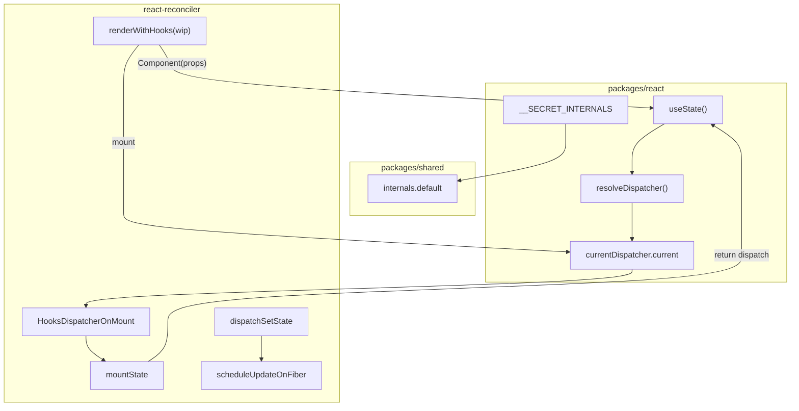

# Spec: useState Mount 与 Hooks 分发（big-react 第八课）
type: utility

> **对齐参考**：[BetaSu/big-react@c27fbaa](https://github.com/BetaSu/big-react/commit/c27fbabd780ba28e96adc77aacb79879a93e688b)（`feat: 第八课`，2022-12-03）。本 spec 以该 commit 的实现语义为准，并补充与当前 JS 代码库的 API / 工程化差异适配说明。
>
> **前置依赖**：[BetaSu/big-react@ad6a6e5](https://github.com/BetaSu/big-react/commit/ad6a6e520e4cbf7ac694a33cc0ba5a4b1d444250)（第七课：FunctionComponent `beginWork` / `completeWork`、`renderWithHooks` 空壳、Vite FC demo）。Render / Commit / UpdateQueue 基础见 [`mount-phase.md`](./mount-phase.md)、[`commit-phase.md`](./commit-phase.md)。
>
> **后续依赖**：`updateState` / `HooksDispatcherOnUpdate`（第九课及以后）、Lane 批调度（[`lane-mode.md`](./lane-mode.md)）、`useEffect`（[`use-effect.md`](./use-effect.md)）。

## 1. 需求定义

### 1.1 背景与目标

- **解决什么问题**：第七课已能执行函数组件 `Component(props)`，但 FC 无法持有组件级状态，也无法通过 `setState` 触发二次渲染。本课在 reconciler 与 react 包之间建立 **Hooks 分发通道**，并实现 **`useState` 的 Mount 路径**。
- **使用方**：
  - 应用 / demos：`import { useState } from 'react'`
  - `packages/react-reconciler`：`renderWithHooks` 在 FC render 期间注入 `HooksDispatcherOnMount`
  - `packages/shared/internals`：跨包读取 `__SECRET_INTERNALS_DO_NOT_USE_OR_YOU_WILL_BE_FIRED`
- **本课目标（Mount 最小闭环）**：
  - `currentDispatcher`：`Dispatcher` 接口、`resolveDispatcher`、模块级 `{ current: null }`
  - `react` 导出 `useState` 与 `__SECRET_INTERNALS_DO_NOT_USE_OR_YOU_WILL_BE_FIRED`
  - `shared/internals`：reconciler 侧读取 `currentDispatcher`
  - `fiberHooks`：`renderWithHooks` Mount 分支、`mountState`、`mountWorkInProgresHook`、`dispatchSetState`
  - `UpdateQueue` 增加 `dispatch` 字段
  - Rollup：`react-dom` 构建时将 `peerDependencies` 设为 `external`
  - demo：`test-fc` 使用 `useState(100)` 验证
- **明确不在本 spec 范围**：
  - `HooksDispatcherOnUpdate` / `updateState`（`renderWithHooks` 中 update 分支为空）
  - render 阶段 `processUpdateQueue` 消费 hook pending update
  - 多 hook update 时 `currentHook` / `updateWorkInProgressHook` 链表复用
  - Lane 优先级、`requestUpdateLane`
  - `useEffect` / `useReducer` / Context
  - FC 返回值必须为 ReactElement 的校验（demo 可返回 `{ num }` 作调试）

### 1.2 能力范围（Capability Scope）

- **提供的能力：**
  - [ ] `packages/react/src/currentDispatcher`：`Dispatcher`、`Dispatch`、`resolveDispatcher`、`currentDispatcher`
  - [ ] `packages/react/index` 导出 `useState(initialState) => [state, dispatch]`
  - [ ] `__SECRET_INTERNALS_DO_NOT_USE_OR_YOU_WILL_BE_FIRED.currentDispatcher` 可被 reconciler 读取
  - [ ] `packages/shared/internals` 默认导出 React internals 对象
  - [ ] `renderWithHooks(wip)`：Mount 时设置 `currentDispatcher.current = HooksDispatcherOnMount`；调用 `Component(props)`；清理 `currentlyRenderingFiber`
  - [ ] `Hook` 链表：`memoizedState`、`updateQueue`、`next`；首 hook 挂 `fiber.memoizedState`
  - [ ] `mountState`：支持 `initialState` 为值或惰性函数；创建 `UpdateQueue`；返回 `[memoizedState, dispatch]`
  - [ ] `dispatchSetState(fiber, queue, action)`：`createUpdate` → `enqueueUpdate` → `scheduleUpdateOnFiber(fiber)`
  - [ ] `UpdateQueue.dispatch` 字段存储 bound dispatch
  - [ ] `react-dom.config.js`：`external: Object.keys(peerDependencies)`
- **明确不提供的能力：**
  - [ ] 第二次 render 正确读取 hook 状态（update 未实现）
  - [ ] `setState` 后 render 阶段合并 pending update 得到新 state
  - [ ] 函数组件外调用 hook 的完整错误链（mount 路径部分 throw）
  - [ ] 生产环境 `resolveDispatcher` 与 DEV 分支差异

### 1.3 待确认项

| 问题 | 当前假设 | 优先级 |
|------|----------|--------|
| 语言 | 参考为 TS，本地为 JS（`.js`） | 已确认 |
| 文件名 | 参考 `fiberHooks.ts`，本地为 `fiberHook.js` | 已确认（语义等价） |
| `mountWorkInProgresHook` 拼写 | 参考 commit 保留 Progres 笔误 | 本地可修正为 Progress |
| `workInProgressHook` 模块变量 | 参考 commit **未**在 `renderWithHooks` 入口重置 | 本课仅 mount 可工作；update 课须重置 |
| `shared` ↔ `react` 循环依赖 | `internals` import `react`；`react` 不 import `shared/internals` | 构建期 alias / workspace 可解析 |
| `Action` 类型 | 参考 `shared/ReactTypes.Action` | 本地 JSDoc `@typedef {any}` 或补导出 |
| 自动化单测 | `mountState`、`mountWorkInProgressHook` 链表、`dispatchSetState` 调度 | 已确认 |

---

## 2. 项目资产对齐（Project Asset Alignment）

### 2.1 复用性审查（Reusability Audit）

| 检查项 | 现有资产 | 状态 | 本次策略 |
|--------|----------|------|----------|
| FC beginWork | 第七课 `updateFunctionComponent` | ✅ 复用 | 已调用 `renderWithHooks` |
| UpdateQueue | 第四课单 pending | ✅ 复用 | +`dispatch` 字段 |
| scheduleUpdateOnFiber | 第四课同步调度 | ✅ 复用 | hook dispatch 直接调用 |
| createUpdate / enqueueUpdate | fiber-root-update | ✅ 复用 | hook 与 HostRoot 共用 |
| currentDispatcher | 无 | ❌ 新增 | `packages/react/src/currentDispatcher` |
| shared internals 桥 | 无 | ❌ 新增 | `packages/shared/internals` |
| fiberHooks 实现 | 第七课空壳 | ❌ 扩展 | 本课核心 |
| 参考实现 | BetaSu/big-react@c27fbaa | ✅ 外部 | 逐文件对照 |
| 本地已扩展 | updateState、Lane、useEffect | ⚠️ 超范围 | 本 spec 以 c27fbaa Mount 核心为准 |

### 2.2 规范对齐（Standard Compliance）

| 规范类别 | 项目规范要求 | 本次应用方式 |
|----------|--------------|--------------|
| **代码规范** | ESLint + Prettier | 改动文件必须通过 lint |
| **目录规范** | Hooks 在 reconciler；对外 API 在 react | 按参考 commit 分布 |
| **ESM 导入** | 显式 `.js` 扩展名 | 本地 JS 实现遵循 |
| **依赖方向** | reconciler → shared/internals → react internals | 不反向让 react import reconciler |
| **循环依赖** | react-dom ↔ reconciler 已存在 | internals 增加 shared→react，Rollup external 缓解 |

---

## 3. API 设计（API Design）

### 3.1 对外 API（packages/react）

#### 3.1.1 `useState(initialState)`

```javascript
/**
 * @param {T | (() => T)} initialState
 * @returns {[T, Dispatch]}
 */
export function useState(initialState);
```

| 参数 | 类型 | 必填 | 说明 |
|------|------|------|------|
| `initialState` | `T \| (() => T)` | 是 | 初始 state；函数形式仅在 mount 时执行一次 |

| 返回值 | 类型 | 说明 |
|--------|------|------|
| `[0]` | `T` | 当前 memoizedState |
| `[1]` | `Dispatch` | `(action) => void`，绑定当前 FC fiber 与 hook queue |

**调用路径：**

```
useState(initialState)
  → resolveDispatcher()
  → dispatcher.useState(initialState)   // Mount: mountState
```

#### 3.1.2 `__SECRET_INTERNALS_DO_NOT_USE_OR_YOU_WILL_BE_FIRED`

```javascript
export const __SECRET_INTERNALS_DO_NOT_USE_OR_YOU_WILL_BE_FIRED = {
  currentDispatcher,
};
```

| 字段 | 类型 | 说明 |
|------|------|------|
| `currentDispatcher` | `{ current: Dispatcher \| null }` | reconciler 在 `renderWithHooks` 内赋值 |

> 与官方 React 同名约定一致；仅供 reconciler / shared 内部桥接，应用代码不得依赖。

### 3.2 `currentDispatcher`（packages/react/src/currentDispatcher）

```javascript
/** @typedef {(action: Action) => void} Dispatch */

/**
 * @typedef {Object} Dispatcher
 * @property {(initialState: any) => [any, Dispatch]} useState
 */

const currentDispatcher = { current: null };

export function resolveDispatcher() {
  const dispatcher = currentDispatcher.current;
  if (dispatcher === null) {
    throw new Error('hook只能在函数组件中执行');
  }
  return dispatcher;
}
```

| 导出 | 说明 |
|------|------|
| `Dispatcher` | 接口，本课仅含 `useState` |
| `Dispatch` | `(action: Action) => void` |
| `resolveDispatcher()` | dispatcher 为 null 时 **throw** |
| `default currentDispatcher` | 可变引用对象 |

**错误契约：**

| 场景 | 行为 | 调用方处理 |
|------|------|------------|
| FC 外调用 `useState` | `resolveDispatcher` throw | 仅在 FC render 内调用 |
| `mountWorkInProgresHook` 时 fiber 为 null | throw `'请在函数组件内调用hook'` | 保证 renderWithHooks 已设置 fiber |

### 3.3 跨包桥（packages/shared/internals）

```javascript
import * as React from 'react';

const internals = React.__SECRET_INTERNALS_DO_NOT_USE_OR_YOU_WILL_BE_FIRED;

export default internals;
```

| 项 | 说明 |
|----|------|
| 用途 | reconciler 读取 `internals.currentDispatcher` |
| 依赖 | `shared` workspace 依赖 `react`（或通过构建 alias） |

### 3.4 内部 API：`renderWithHooks`

```javascript
/**
 * @param {FiberNode} wip
 * @returns {any} Component(props) 返回值
 */
export function renderWithHooks(wip);
```

| 步骤 | Mount 行为（`wip.alternate === null`） |
|------|----------------------------------------|
| 1 | `currentlyRenderingFiber = wip` |
| 2 | `wip.memoizedState = null`（清空 hook 链表头） |
| 3 | `currentDispatcher.current = HooksDispatcherOnMount` |
| 4 | `children = wip.type(wip.pendingProps)` |
| 5 | `currentlyRenderingFiber = null` |
| 6 | `return children` |

| Update 行为（`alternate !== null`） | c27fbaa |
|-------------------------------------|---------|
| update 分支 | **空实现**（注释 `// update`） |
| dispatcher | **不设置** |
| 结论 | 第二次 render **不可用** |

> **本课边界**：仅验收 **首次 Mount** 下 `useState` 初始化与 `dispatch` 入队调度。

### 3.5 内部 API：`Hook` 链表

```javascript
/**
 * @typedef {Object} Hook
 * @property {any} memoizedState
 * @property {UpdateQueue|null} updateQueue
 * @property {Hook|null} next
 */
```

| 字段 | 说明 |
|------|------|
| `memoizedState` | hook 当前 state |
| `updateQueue` | 该 hook 的 update 环（本课单 pending） |
| `next` | 同 FC 内下一个 hook |

**链表挂载规则（`mountWorkInProgresHook`）：**

```
第一个 hook:
  fiber.memoizedState = workInProgressHook = hook

后续 hook:
  workInProgressHook.next = hook
  workInProgressHook = hook
```

### 3.6 内部 API：`mountState`

```javascript
function mountState(initialState) {
  const hook = mountWorkInProgresHook();
  let memoizedState =
    initialState instanceof Function ? initialState() : initialState;
  const queue = createUpdateQueue();
  hook.updateQueue = queue;
  hook.memoizedState = memoizedState;
  const dispatch = dispatchSetState.bind(null, currentlyRenderingFiber, queue);
  queue.dispatch = dispatch;
  return [memoizedState, dispatch];
}
```

| 输入 | memoizedState 计算 |
|------|-------------------|
| `initialState` 为函数 | `initialState()` |
| 否则 | 直接使用 `initialState` |

### 3.7 内部 API：`dispatchSetState`

```javascript
function dispatchSetState(fiber, updateQueue, action) {
  const update = createUpdate(action);
  enqueueUpdate(updateQueue, update);
  scheduleUpdateOnFiber(fiber);
}
```

| 参数 | 说明 |
|------|------|
| `fiber` | mount 时 bind 的 `currentlyRenderingFiber`（当前 FC wip） |
| `updateQueue` | 该 hook 的 queue |
| `action` | 新 state 值或 `(prevState) => nextState`（本课入队，render 不消费） |

> c27fbaa 中 `setState` 会触发 `scheduleUpdateOnFiber`，但因 update 路径未实现，**二次 render 无法反映新 state**。

### 3.8 `UpdateQueue` 扩展

```javascript
/** @typedef {Object} UpdateQueue
 *  @property {{ pending: Update|null }} shared
 *  @property {Dispatch|null} dispatch
 */
```

| 变更 | 说明 |
|------|------|
| `createUpdateQueue()` | 增加 `dispatch: null` |
| `mountState` | 设置 `queue.dispatch = bound dispatch` |

### 3.9 `HooksDispatcherOnMount`

```javascript
const HooksDispatcherOnMount = {
  useState: mountState,
};
```

本课无 `HooksDispatcherOnUpdate`。

### 3.10 工程化：Rollup react-dom external

```javascript
const { peerDependencies } = getPackageJSON('react-dom');
// ...
external: [...Object.keys(peerDependencies)],
```

| 目的 | 避免 react-dom UMD 重复打包 react，保证 `__SECRET_INTERNALS` 单例 |

---

## 4. 使用示例（Usage Examples）

### 4.1 FC 内单次 useState（Mount）

```javascript
import { useState } from 'react';

function Counter() {
  const [count, setCount] = useState(0);
  return jsx('button', { onClick: () => setCount(count + 1), children: count });
}
```

Mount 时：
- `renderWithHooks` 注入 `HooksDispatcherOnMount`
- 首次 `useState(0)` 创建 Hook + Queue，`memoizedState === 0`
- `setCount` 即 `queue.dispatch`

### 4.2 惰性初始 state

```javascript
useState(() => expensiveComputation());
// mount 时执行一次函数，结果写入 hook.memoizedState
```

### 4.3 多 hook 链表

```javascript
function App() {
  const [a, setA] = useState(1);
  const [b, setB] = useState(2);
  return jsx('div', { children: `${a}-${b}` });
}
```

Fiber 上：
```
fiber.memoizedState → Hook(a) → Hook(b) → null
```

### 4.4 demo 调试写法（c27fbaa test-fc）

```javascript
function App() {
  const [num, setNum] = useState(100);
  window.setNum = setNum;
  return { num }; // 非合法 ReactElement，仅调试 FC 返回值
}
```

### 4.5 dispatch 触发调度（本课边界）

```javascript
setNum(200);
// → createUpdate(200) → enqueueUpdate → scheduleUpdateOnFiber(fiber)
// render 阶段 update 未消费 pending，UI 可能不更新（预期，等后续课）
```

---

## 5. 技术方案（Technical Design）

### 5.1 交付物清单（文件级，对齐 c27fbaa）

| # | 文件 | 改动摘要 |
|---|------|----------|
| D1 | `packages/react/src/currentDispatcher.ts` | 新增 Dispatcher / resolveDispatcher |
| D2 | `packages/react/index.ts` | +`useState`、`__SECRET_INTERNALS` |
| D3 | `packages/shared/internals.ts` | 新增 internals 桥 |
| D4 | `packages/react-reconciler/src/fiberHooks.ts` | renderWithHooks Mount + mountState + dispatch |
| D5 | `packages/react-reconciler/src/updateQueue.ts` | UpdateQueue +dispatch |
| D6 | `packages/react-reconciler/src/fiberReconciler.ts` | 删除调试 `console.log` |
| D7 | `scripts/rollup/react-dom.config.js` | peerDependencies external |
| D8 | `demos/test-fc/main.tsx` | useState demo |

### 5.2 Hooks 数据流



### 5.3 模块级状态（fiberHooks）

| 变量 | 生命周期 | 说明 |
|------|----------|------|
| `currentlyRenderingFiber` | renderWithHooks 内赋值/清空 | 当前 FC wip |
| `workInProgressHook` | mount 构建链表时递增 | c27fbaa **未**在入口重置 |
| `currentDispatcher.current` | FC render 期间 | Mount 设为 OnMount |

### 5.4 与官方 React 的差异（课程刻意简化）

| 维度 | 官方 React | 本课 c27fbaa |
|------|------------|--------------|
| update 路径 | HooksDispatcherOnUpdate + processUpdateQueue | 未实现 |
| render 内 setState | 合并 pending 计算 memoizedState | 仅入队 |
| hook 顺序校验 | update 时比对 hook 数量 | 无 |
| FC 外 hook | Invariant 报错 | resolveDispatcher throw |
| Lane | requestUpdateLane | 无，scheduleUpdateOnFiber(fiber) 单参 |

### 5.5 异常兜底

| 输入 | 处理方式 |
|------|----------|
| `resolveDispatcher` 且 current 为 null | throw Error |
| `mountWorkInProgresHook` 且 fiber 为 null | throw Error |
| `initialState` 为函数且抛错 | 向上传播 |
| 第二次 render FC | update 分支空，dispatcher 未设置 → useState throw |

---

## 6. 非功能需求（Non-Functional）

| 指标 | 目标值 | 测试方法 |
|------|--------|----------|
| 构建 | `pnpm build:dev` 成功 | 本地构建 |
| Lint | `pnpm lint` 无新增 error | 本地 lint |
| react-dom external | UMD 不内联 react | 检查 rollup config |
| 对齐度 | 与 c27fbaa 8 文件语义一致 | PR diff 对照 |
| FC demo | test-fc 可加载 useState | Vite dev |

---

## 7. 测试策略与覆盖率矩阵（Testing Strategy）

### 7.1 测试分层

| 测试类型 | 覆盖目标 | 工具 | 通过标准 |
|----------|----------|------|----------|
| 单元测试 | mountState、hook 链表、resolveDispatcher | Vitest | 全部 AC 通过 |
| 集成测试 | mock renderWithHooks + useState | Vitest | Mount 返回初值 |
| dispatch 测试 | mock scheduleUpdateOnFiber | Vitest | setState 触发调度 |
| 参考对照 | 与 c27fbaa 行为一致 | 逐函数对照 | Mount 核心一致 |

### 7.2 功能覆盖率矩阵

| 功能点 | 测试用例 | 场景 | 状态 |
|--------|----------|------|------|
| resolveDispatcher null | FC 外调用 | 1/1 | ⬜ |
| mountState 值初始 | useState(100) | 1/1 | ⬜ |
| mountState 惰性初始 | useState(() => 1) | 1/1 | ⬜ |
| 首 hook 挂 fiber | 单 useState | 1/1 | ⬜ |
| 多 hook next 链 | 双 useState | 1/1 | ⬜ |
| dispatch bind | queue.dispatch 可调用 | 1/1 | ⬜ |
| dispatchSetState | enqueue + schedule | 1/1 | ⬜ |
| UpdateQueue.dispatch | createUpdateQueue | 1/1 | ⬜ |
| renderWithHooks mount | alternate null | 1/1 | ⬜ |
| internals 桥 | reconciler 读 dispatcher | 1/1 | ⬜ |
| react-dom external | rollup config | 1/1 | ⬜ |

### 7.3 复杂场景拆解

| 编号 | 输入 | 预期 | 对齐参考 |
|------|------|------|----------|
| SC-01 | 首次 render `useState(0)` | 返回 `[0, fn]`，fiber.memoizedState 为 Hook | c27fbaa |
| SC-02 | 两个 useState | 链表长度 2，顺序与调用一致 | c27fbaa |
| SC-03 | `useState(() => 42)` | memoizedState=42，函数仅调用一次 | c27fbaa |
| SC-04 | `setNum(1)` | update 入队 + scheduleUpdateOnFiber 被调 | c27fbaa |
| SC-05 | 第二次 render 同 FC | **本课不保证** state 更新（update 未实现） | 边界 |
| SC-06 | 模块外 `useState(0)` | throw | c27fbaa |

### 7.4 建议单测（Vitest）

| 测试文件 | 覆盖点 |
|----------|--------|
| `packages/react/src/__tests__/currentDispatcher.test.js` | resolveDispatcher throw |
| `packages/react-reconciler/src/__tests__/fiberHook.mount.test.js` | mountState、链表、dispatch |

运行：`pnpm test`。

---

## 8. 任务拆分与并行计划（Task Breakdown）

### 8.1 拆分原则

按 c27fbaa 文件边界：**react 对外 API + dispatcher → shared 桥 → reconciler mount hooks → 构建 external**。

### 8.2 任务卡片

#### 模块 A：React 对外层（Agent-1）

| ID | 任务 | 输出 | 对齐 commit 文件 |
|----|------|------|------------------|
| T-A1 | currentDispatcher | `currentDispatcher.ts` | currentDispatcher.ts |
| T-A2 | useState + SECRET_INTERNALS | `index.ts` | index.ts |

**CK-1 冻结**：`useState` 签名；`resolveDispatcher` throw 语义；internals 对象形状。

#### 模块 B：Reconciler Hooks Mount（Agent-2）

| ID | 任务 | 输出 | 对齐 commit 文件 |
|----|------|------|------------------|
| T-B1 | shared/internals | `internals.ts` | internals.ts |
| T-B2 | renderWithHooks + mountState | `fiberHooks.ts` | fiberHooks.ts |
| T-B3 | UpdateQueue.dispatch | `updateQueue.ts` | updateQueue.ts |

**CK-2 冻结**：Hook 三字段；mountWorkInProgresHook 链表规则；dispatchSetState 三步骤。

#### 模块 C：工程化与验收（Agent-3）

| ID | 任务 | 输出 |
|----|------|------|
| T-C1 | react-dom rollup external | `react-dom.config.js` |
| T-C2 | 清理 fiberReconciler debug log | `fiberReconciler.ts` |
| T-C3 | test-fc demo + Vitest + lint | demos / tests |

### 8.3 并行时序

```
T-A1 → CK-1 → (T-A2 ∥ T-B1)
              ↓
         T-B2 → T-B3 → CK-2
              ↓
         T-C1 → T-C2 → T-C3
```

---

## 9. 验收标准（Given-When-Then）

| ID | Given | When | Then |
|----|-------|------|------|
| AC-01 | FC 首次 render | 调用 `useState(100)` | 返回 `[100, function]` |
| AC-02 | AC-01 后 | 读 `fiber.memoizedState` | 为 Hook，`memoizedState===100` |
| AC-03 | FC 内连续两次 useState | 检查链表 | `hook1.next === hook2` |
| AC-04 | `useState(() => 7)` | mount 一次 | `memoizedState===7` |
| AC-05 | 取得 setNum | `setNum(200)` | update 入队且 `scheduleUpdateOnFiber` 被调用 |
| AC-06 | 模块顶层 | `useState(0)` | throw（hook 只能在 FC 中） |
| AC-07 | reconciler import internals | 读 `currentDispatcher` | 与 react 导出同一引用 |
| AC-08 | `createUpdateQueue()` | 读字段 | 含 `dispatch: null` |
| AC-09 | `pnpm build:dev` | 检查 react-dom 配置 | peerDependencies 为 external |
| AC-10 | 全部改动 | `pnpm lint` + `pnpm test` | 无 error |

> **说明**：AC-05 不要求 UI 显示 200（update 路径属后续课）；仅验证 dispatch 调度链。

---

## 10. 验收注意点与重点场景

### 10.1 必验（P0）

| 场景 | 验证点 |
|------|--------|
| Dispatcher 注入 | renderWithHooks mount 期间 useState 可用（AC-01） |
| Hook 链表 | 多 hook 顺序（AC-03） |
| dispatch 调度 | setState 触发 scheduleUpdateOnFiber（AC-05） |
| FC 外 hook | throw（AC-06） |
| internals 单例 | AC-07 |

### 10.2 易遗漏

| 风险 | 原因 | 验收 |
|------|------|------|
| 第二次 render 期望 state 更新 | update 未实现 | 文档边界 SC-05 |
| workInProgressHook 未重置 | c27fbaa 遗漏 | update 课再验 |
| react-dom 内联 react | 未 external | internals 双份 | AC-09 |
| key/ref 与 hook 混淆 | 不同链表 | hook 挂 memoizedState |
| dispatch 未 bind fiber | setState 调度目标错误 | AC-05 |
| 惰性 initialState 每次执行 | 未 instanceof Function 分支 | AC-04 |

### 10.3 回归

第七课 FC render 仍可用；Host 组件 mount/commit 不受本课影响（无 hook 的 Host 路径不变）。

---

## 11. 风险与依赖

| 风险 | 缓解 |
|------|------|
| shared → react 循环依赖 | workspace + Rollup alias；external react-dom |
| 仅 Mount 可用导致 demo 困惑 | spec 与 AC 明确 update 后续课 |
| c27fbaa update 分支为空 | 不对齐为 bug；标注课程进度 |
| TS → JS | 逻辑对齐；JSDoc 补 Dispatcher |
| 本地已实现 updateState / Lane | 对照 c27fbaa Mount 语义，扩展项单独回归 |

---

## 12. 参考 commit 文件对照表

| 参考文件（c27fbaa） | 本地目标文件 | 变更类型 |
|---------------------|--------------|----------|
| `packages/react/src/currentDispatcher.ts` | `currentDispatcher.js` | 新增 |
| `packages/react/index.ts` | `index.js` | 扩展 |
| `packages/shared/internals.ts` | `internals.js` | 新增 |
| `packages/react-reconciler/src/fiberHooks.ts` | `fiberHook.js` | 扩展 |
| `packages/react-reconciler/src/updateQueue.ts` | `updateQueue.js` | 扩展 |
| `packages/react-reconciler/src/fiberReconciler.ts` | `fiberReconciler.js` | 删 debug log |
| `scripts/rollup/react-dom.config.js` | `react-dom.config.js` | external |
| `demos/test-fc/main.tsx` | demos 等价入口 | demo |

---

## 13. 与当前代码库差异摘要

| 维度 | c27fbaa | 当前 big-react |
|------|---------|----------------|
| 语言 | TypeScript | JavaScript + `.js` 扩展名 |
| 文件名 | `fiberHooks.ts` | `fiberHook.js` |
| update 路径 | 空 | `HooksDispatcherOnUpdate` + `updateState` |
| renderWithHooks 签名 | `(wip)` | `(wip, lane)` + renderLane |
| workInProgressHook 重置 | 未重置 | mount/update 入口重置 |
| dispatchSetState | 无 Lane | `requestUpdateLane` + lane 入 update |
| resolveDispatcher | throw Error | 本地 warn（可对齐 throw） |
| processUpdateQueue | hook render 未调用 | updateState 内调用 |
| useEffect | 无 | 已实现（见 use-effect.md） |
| Lane 调度 | 无 | lane-mode 已接入 |

实现或审查时：**useState Mount、Dispatcher 分发、Hook 链表、dispatchSetState 入队以 c27fbaa 为准**；本地 update / Lane / Effect 扩展单独回归，不反向改变 Mount 核心语义。

---

**修订记录**

| 版本 | 日期 | 说明 |
|------|------|------|
| v1.0 | 2026-05-31 | 初稿，对齐 BetaSu/big-react@c27fbaa（第八课 useState Mount） |
