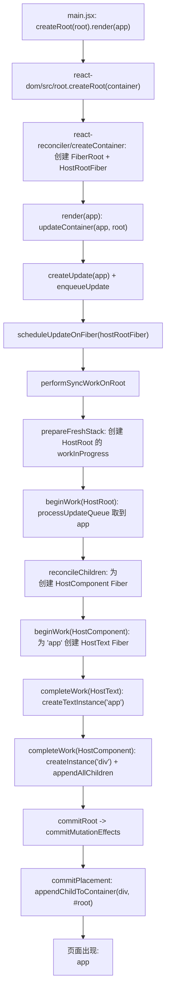

# 一阶段

本文档用于说明当前 `big-react` 项目在第一阶段的实现现状，重点包含：架构、设计与已具备功能。

## 一、项目架构

当前项目采用 Monorepo 结构，核心代码位于 `packages` 目录，按职责拆分为以下模块：

- `packages/react-reconciler`：渲染核心，负责 Fiber 构建、diff（当前为简化版）、提交副作用。
- `packages/react-dom`：宿主环境适配层，负责 DOM 节点创建与挂载。
- `packages/react`：React 入口与 JSX 运行时代码（当前实现较简化）。
- `packages/shared`：共享常量与符号（如 `REACT_ELEMENT_TYPE`）。
- `packages/demos`：Vite 驱动的调试与演示工程。

整体调用关系可概括为：

1. 业务代码通过 `react-dom` 暴露的 `createRoot(...).render(...)` 发起渲染。
2. `react-dom` 调用 `react-reconciler` 的容器创建与更新能力。
3. `react-reconciler` 执行 render 阶段（构建/遍历 Fiber）与 commit 阶段（执行 DOM 变更）。
4. `react-dom/hostConfig` 提供具体 DOM API，把抽象操作落到浏览器环境。

## 二、核心设计

### 1. Fiber 数据结构

项目已实现 `FiberNode` 与 `FiberRootNode`，并支持 current/workInProgress（`alternate`）双缓存模型：

- `FiberNode` 维护树关系（`child/sibling/return`）、状态（`pendingProps/memoizedState`）和副作用标记（`flags/subtreeFlags`）。
- `createWorkInProgress` 会基于当前树复用或创建对应的 WIP Fiber。
- 通过 `workTags` 区分节点类型：`HostRoot`、`HostComponent`、`HostText` 等。

### 2. 渲染流程（Render + Commit）

当前渲染流程为同步执行：

- 调度入口：`scheduleUpdateOnFiber`。
- 向上找到根节点：`markUpdateFromFiberToRoot`。
- 同步执行根任务：`performSyncWorkOnRoot`。

Render 阶段：

- `beginWork`：根据不同 Fiber 类型计算下一层子节点。
- `completeWork`：创建 DOM 实例、拼接子树并冒泡副作用标记。
- 遍历方式采用深度优先，`performUnitOfWork + completeUnitOfWork` 串联。

Commit 阶段：

- `commitRoot` 判断根或子树是否包含 `MutationMask`。
- `commitMutationEffects` 深度遍历 effect 树。
- 当前主要处理 `Placement`，将节点插入到正确的 Host 父节点中。

### 3. 更新队列设计

在根节点上实现了简化版 UpdateQueue：

- `createUpdate` 创建更新对象。
- `enqueueUpdate` 将更新挂到 `updateQueue.shared.pending`。
- `processUpdateQueue` 在 `beginWork(HostRoot)` 时消费更新并写入 `memoizedState`。

目前是单 pending 更新、同步消费的轻量模型。

### 4. 宿主环境抽象（HostConfig）

`react-dom/src/hostConfig.js` 已抽象以下能力：

- `createInstance`：创建元素节点。
- `createTextInstance`：创建文本节点。
- `appendInitialChild` / `appendChildToContainer`：执行挂载。

这使 reconciler 与 DOM 具体 API 解耦，后续可替换为其他宿主环境实现。

## 三、当前已具备功能

截至第一阶段，项目已具备以下能力：

1. **基础渲染闭环**
   - 支持 `createRoot(container).render(element)` 调用链路。
   - 能从根节点发起更新并完成一次同步渲染与提交。

2. **基础 Fiber 树构建**
   - 支持根据 React Element 创建 Fiber。
   - 支持 HostComponent（字符串 type）与 HostText 节点类型。

3. **简化版子节点协调**
   - 支持单个 React Element 子节点。
   - 支持文本子节点（string/number）。
   - 初次挂载与更新路径已区分（`mountChildFibers` / `reconcileChildFibers`）。

4. **DOM 挂载能力**
   - 能在 complete 阶段创建真实 DOM。
   - 能在 commit 阶段执行插入（Placement）并挂载到容器。

5. **JSX 元素基础表示**
   - `jsx` 运行时可产出带 `$$typeof` 标记的 React Element 对象。
   - 共享符号 `REACT_ELEMENT_TYPE` 已接通到协调流程。

## 四、当前边界与阶段性限制

第一阶段实现以“跑通最小主链路”为目标，当前仍有以下限制（属预期范围）：

- 暂未实现复杂 diff（如多子节点数组重排、删除等完整策略）。
- commit 阶段主要实现 `Placement`，`Update`/`Deletion` 未完整落地。
- FunctionComponent 的执行与 Hooks 能力尚未接通。
- 调度模型为同步执行，未引入优先级与并发调度。
- `react` 包入口当前为占位实现，重点能力集中在 reconciler 与 react-dom。

## 五、结论

当前项目已完成一个可运行的“迷你 React 渲染器”雏形：具备 Fiber 结构、同步 render/commit 主流程、基础 DOM 宿主适配与最小更新机制。该阶段可作为后续迭代（完善 diff、补齐更新类型、接入函数组件与 Hooks、引入调度优先级）的稳定基础。

## 六、结合 Demo 的首屏渲染说明

以 `packages/demos/src/main.jsx` 为例：

```jsx
const root = document.getElementById("root");
const app = <div key="1">app</div>;
createRoot(root).render(app);
```

这段代码最终会把一个文本为 `app` 的 `div` 挂到页面中的 `#root` 容器里。下面按真实调用链路说明。



### 关键点（和 Demo 一一对应）

1. `app = <div key="1">app</div>` 先被编译为 ReactElement 对象（带 `$$typeof`、`type`、`props`）。
2. `render(app)` 并不是立即操作 DOM，而是先创建 update，进入 reconciler 的 render 阶段。
3. render 阶段会构建两层关键 Fiber：  
   - `HostComponent`（对应 `div`）  
   - `HostText`（对应文本 `app`）
4. `completeWork` 中先创建文本节点，再创建 `div`，并把文本节点 append 到 `div`。
5. commit 阶段处理 `Placement`，把这个 `div` 一次性插入 `#root`，首屏完成。

### 首屏结果

- 容器：`index.html` 里的 `#root`
- 挂载结果：`#root` 下新增一个 `div`，文本内容为 `app`
- 当前阶段的行为特征：同步渲染、同步提交、以插入（Placement）为主
