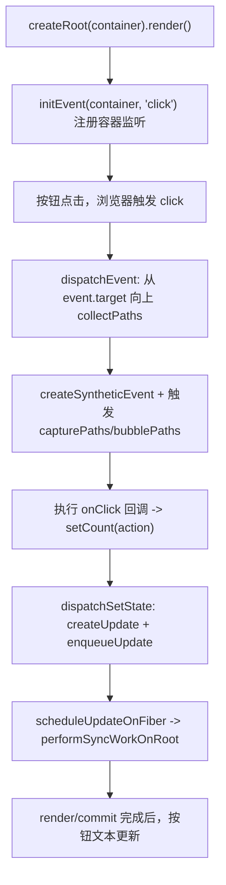
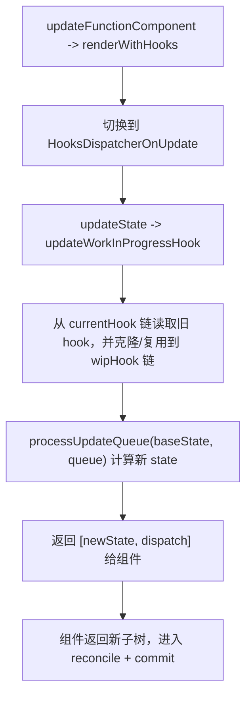

# 三阶段

本文档说明当前 `big-react` 项目在第三阶段的实现现状，并对比第二阶段，明确新增能力与设计变化。

---

## 一、当前功能（第三阶段）

在第二阶段“函数组件 + useState + 基础更新”能力基础上，当前项目已经具备以下功能：

1. **基础合成事件系统（点击事件）**
   - 在 root 容器上完成 `click` 事件注册（事件委托）。
   - 支持从触发节点向上收集回调路径并执行分发。

2. **捕获/冒泡双阶段事件触发**
   - 支持 `onClickCapture` 与 `onClick` 两类回调收集。
   - 先执行捕获队列，再执行冒泡队列，符合常见事件语义。

3. **`stopPropagation` 行为接通**
   - 合成事件对象覆写 `stopPropagation`，在内部设置中断标记。
   - 当事件被中断时，后续路径回调停止执行。

4. **DOM 与事件回调关联能力**
   - 宿主节点创建时会将支持的事件回调挂载到 DOM 私有字段（`__props`）。
   - 事件分发阶段可从事件目标节点直接读取回调并执行。

5. **交互更新链路更完整**
   - Demo 已形成“点击按钮 -> 触发事件 -> `setState` -> render/commit -> 视图更新”的稳定闭环。
   - `setCount((c) => c + 1)` 的函数式更新在当前模型下可正确计算新状态。

---

## 二、架构（第三阶段）

### 1) 模块分层

- `packages/react`  
  - 继续提供 `useState` API 与 dispatcher 入口。
- `packages/react-reconciler`  
  - 继续负责 Fiber 渲染、Hook 执行与提交副作用。
- `packages/react-dom`  
  - 在宿主层新增事件系统：事件初始化、路径收集、合成事件与触发分发。
- `packages/shared`  
  - 维持共享符号与 internals 通道，支撑包间协作。

### 2) 事件系统数据模型

- **容器委托**：通过 `initEvent(container, "click")` 将原生监听绑定在根容器。
- **节点回调存储**：通过 `updateFiberProps(element, props)` 将 `onClickCapture/onClick` 缓存到 DOM。
- **路径收集结果**：`collectPaths` 返回 `capturePaths` 与 `bubblePaths` 两组回调队列。
- **合成事件对象**：`createSyntheticEvent` 在原生事件上补充传播中断控制位。

### 3) 与 Fiber 提交阶段的协作

- 节点在 `completeWork` 创建 DOM 时即写入事件回调缓存。
- 事件系统不直接操作 Fiber 树，而是以 DOM 事件目标为起点执行分发。
- 分发出的回调最终通过 `dispatchSetState` 进入 reconciler 调度流程，形成“事件驱动更新”闭环。

---

## 三、核心流程（第三阶段）

### 1) 点击事件触发状态更新

### 2) `useState` 更新时 Hook 复用流程

---

## 四、对比二阶段：新增功能

相对 `specs/二阶段.md`，三阶段新增了以下“可感知能力”：

1. **新增 DOM 事件委托能力**
   - 二阶段：更新主要依赖直接调用 `setState` 验证链路。
   - 三阶段：可通过真实点击事件驱动状态更新。

2. **新增捕获/冒泡事件分发机制**
   - 二阶段：未形成统一事件分发模型。
   - 三阶段：已实现路径收集与分阶段触发。

3. **新增传播中断语义**
   - 二阶段：无统一 `stopPropagation` 支持。
   - 三阶段：合成事件层可中断后续回调执行。

4. **新增“DOM 节点回调缓存”机制**
   - 二阶段：DOM 节点与事件回调关联较弱。
   - 三阶段：节点创建时即可写入事件回调，分发阶段可直接读取。

5. **Demo 从“可更新”升级为“可交互驱动更新”**
   - 二阶段：以状态机制本身为重点。
   - 三阶段：交互入口（点击）与状态更新、视图更新形成完整联动。

---

## 五、对比二阶段：设计改变

除了新增功能，三阶段在设计上有这些关键变化：

1. **更新触发入口从“状态 API 主导”扩展到“事件系统驱动”**
   - 渲染内核不再只关注更新如何执行，也开始覆盖更新“如何被触发”。

2. **react-dom 从“宿主节点操作层”扩展到“交互运行时层”**
   - 除创建/插入/删除 DOM 外，开始承担事件初始化与分发职责。

3. **DOM 成为事件回调存储载体**
   - 通过节点私有属性缓存回调，降低事件分发与 Fiber 内部结构的耦合。

4. **Hook 更新路径强调 current/wip 链路一致性**
   - 更新阶段通过 `currentHook` 与 `workInProgressHook` 的配合，维持 Hook 顺序与状态复用。

5. **系统边界更清晰**
   - reconciler 负责调度与渲染；
   - react-dom 负责浏览器交互入口；
   - 二者通过回调触发与更新调度串联。

---

## 六、当前边界与后续方向

虽然三阶段已具备基础事件驱动更新能力，但仍存在阶段性边界：

- 事件类型目前仅覆盖 `click`，更多事件（输入、键盘等）尚未接通。
- 容器事件初始化尚未做幂等保护，重复 render 可能重复注册监听。
- HostComponent 的通用 props patch（属性更新）仍未在 `completeWork/commit` 完整落地。
- 子节点协调仍以简化路径为主，数组多子节点与重排策略未完善。
- 调度模型仍为同步执行，优先级与并发能力尚未引入。

结论：三阶段已从“具备状态更新能力的渲染内核”升级到“具备基础交互入口的可运行内核”，让更新链路从用户点击事件开始贯通至 Fiber 调度与 DOM 提交，为后续完善事件系统、属性更新与复杂协调策略打下了工程基础。
