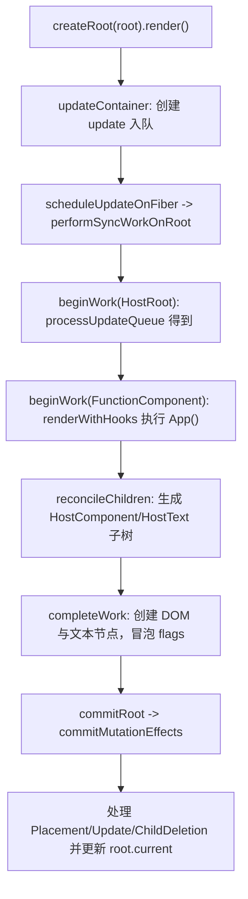
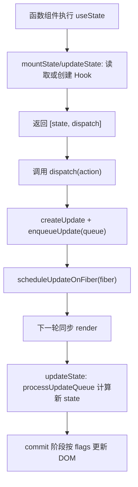

# 二阶段

本文档说明当前 `big-react` 项目在第二阶段的实现现状，并对比第一阶段，明确新增能力与设计变化。

---

## 一、当前功能（第二阶段）

在第一阶段“最小渲染闭环”基础上，当前项目已经具备以下功能：

1. **FunctionComponent 渲染**
   - 支持函数组件进入 Fiber 流程（`FunctionComponent` tag）。
   - 在 render 阶段执行函数组件，拿到返回的子树并参与协调。

2. **基础 Hooks：`useState`**
   - `react` 包已暴露 `useState`。
   - 支持 mount/update 两套 dispatcher（首次渲染与更新渲染）。
   - `setState` 可触发从对应 Fiber 向根节点调度更新。

3. **更新能力增强**
   - 支持文本节点内容更新（`Update` flag + `commitTextUpdate`）。
   - 支持子节点删除（`ChildDeletion` flag + commit 删除流程）。
   - 保留并继续支持节点插入（`Placement`）。

4. **端到端交互更新**
   - Demo 已可运行“函数组件 + useState + 重渲染”的链路：
     - `createRoot(root).render(<App />)`
     - `useState(0)`
     - 调用 `setCount` 后同步触发新一轮 render/commit。

---

## 二、架构（第二阶段）

### 1) 模块分层

- `packages/react`  
  - 提供 `useState` 对外 API。
  - 通过 `currentDispatcher` 与 reconciler 建立运行时桥接。
- `packages/react-reconciler`  
  - 核心执行层：Fiber 构建、协调、Hooks 渲染、提交副作用。
- `packages/react-dom`  
  - 宿主实现：DOM 创建、插入、删除、文本更新。
- `packages/shared`  
  - 共享符号与内部通道（`internals`）等。

### 2) Fiber 与 Hook 数据模型

- Fiber 仍采用 `current / workInProgress(alternate)` 双缓存。
- `FiberNode` 在二阶段承载更多运行信息：
  - `deletions`：记录待删除子节点列表；
  - `memoizedState`：在函数组件场景下作为 Hook 链表头；
  - `updateQueue`：根更新与 Hook 更新都可复用该模型。
- Hook 采用单向链表结构，挂在函数组件 Fiber 的 `memoizedState` 上：
  - 每个 Hook 节点包含 `memoizedState / updateQueue / next`。

### 3) Effect 标记体系扩展

提交相关标记从“主要 Placement”扩展为三类 Mutation：

- `Placement`：插入
- `Update`：更新（当前已落地文本更新）
- `ChildDeletion`：删除子节点

并通过 `MutationMask` 统一在 commit 前做子树快速剪枝判断。

---

## 三、核心流程（第二阶段）

### 1) 首次渲染（含函数组件）

### 2) `useState` 更新流程

---

## 四、对比一阶段：新增功能

相对 `specs/一阶段.md`，二阶段新增了以下“可感知能力”：

1. **新增函数组件支持**
   - 一阶段：仅 HostRoot / HostComponent / HostText 主链路。
   - 二阶段：`beginWork` 新增 `FunctionComponent` 分支，函数组件可参与渲染。

2. **新增 Hooks（useState）**
   - 一阶段：无 Hook 运行时。
   - 二阶段：具备 mount/update dispatcher、Hook 链表、`dispatchSetState` 调度。

3. **新增文本更新能力**
   - 一阶段：提交阶段主要是 Placement。
   - 二阶段：`completeWork` 能在文本变化时打 `Update` 标记，`commitWork` 落地 `commitTextUpdate`。

4. **新增删除能力**
   - 一阶段：删除路径未完整落地。
   - 二阶段：`childFiber` 可打 `ChildDeletion`，`commitWork` 可执行子树卸载与 DOM 删除。

5. **Demo 从“静态挂载”升级为“可交互更新”**
   - 一阶段示例偏首屏挂载闭环。
   - 二阶段示例可通过 `setCount` 触发状态更新并反映到视图。

---

## 五、对比一阶段：设计改变

除了新增功能，二阶段在设计上有这些关键变化：

1. **渲染对象从“宿主节点主导”扩展到“组件 + 宿主混合树”**
   - Fiber 树不再只服务 DOM 节点，还承担函数组件执行与状态承载。

2. **状态管理从“根更新队列”扩展到“Fiber/Hook 局部更新队列”**
   - 根节点 updateQueue 仍在，但 Hook 级 updateQueue 已加入并可独立驱动重渲染。

3. **副作用模型从“单一插入”扩展到“插入 + 更新 + 删除”**
   - commit 阶段对 Mutation 的覆盖面更接近真实 React 的基本形态。

4. **内部解耦进一步增强**
   - `react` 通过 dispatcher 间接调用 hooks 实现；
   - reconciler 通过 `shared/internals` 接入 dispatcher，维持包间边界。

5. **协调器职责更完整**
   - `childFiber` 除了创建/复用，还开始承担删除标记收集（`deletions`），为 commit 精准执行提供输入。

---

## 六、当前边界与后续方向

虽然二阶段能力明显增强，但仍存在阶段性边界：

- 调度仍是同步模型，未引入优先级/并发调度。
- DOM 属性更新（HostComponent props patch）尚未完整实现。
- 子节点协调仍偏简化，数组场景与复杂重排策略未完善。
- Hook 能力目前以 `useState` 为主，effect 类 hook 尚未接通。

结论：二阶段已从“最小可渲染内核”升级到“支持函数组件与基础状态更新的可交互内核”，并在副作用模型上补齐了更新与删除路径，为后续更完整的 diff、调度与 hooks 体系打下了结构基础。
