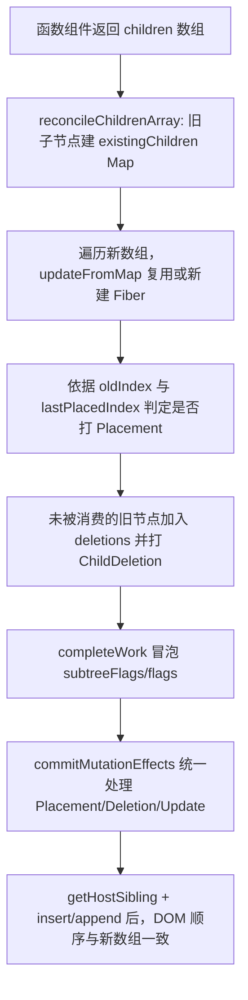
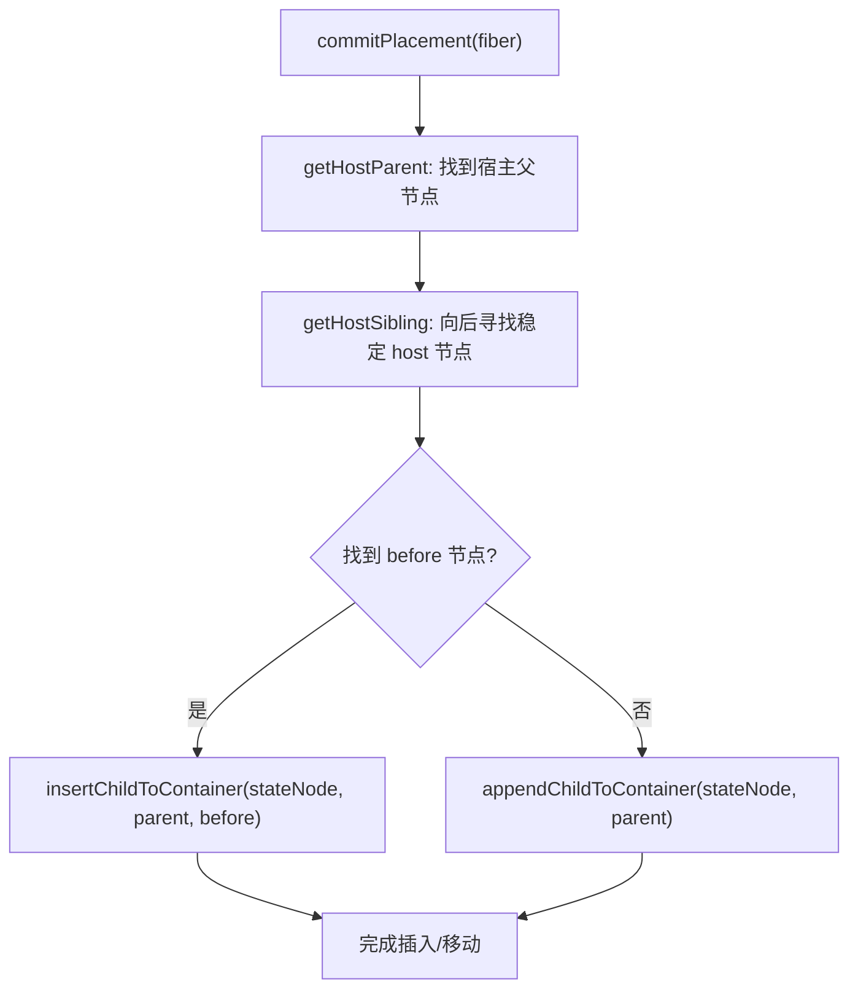

# 四阶段

本文档说明当前 `big-react` 项目在第四阶段的实现现状，并对比第三阶段，明确新增能力与设计变化。

---

## 一、当前功能（第四阶段）

在第三阶段“基础事件系统 + 交互驱动更新”能力基础上，当前项目已经具备以下功能：

1. **数组子节点协调能力（多子节点 diff）**
   - `childFiber` 已支持 `Array` 类型子节点进入协调流程。
   - 可基于 `key`（无 key 时退化为 index）匹配旧 Fiber，完成复用或新建。

2. **插入 / 移动 / 删除的统一标记与提交**
   - 协调阶段可为新节点与需要移动的节点打 `Placement` 标记。
   - 未被复用的旧节点会进入 `deletions`，并在提交阶段执行删除。

3. **更接近真实顺序语义的 DOM 插入**
   - commit 阶段通过 `getHostSibling` 寻找稳定锚点节点。
   - `commitPlacement` 支持“插入到指定位置”或“追加到末尾”，覆盖重排场景。

4. **文本节点更新路径持续可用**
   - `HostText` 仍会在内容变化时打 `Update` 标记。
   - `commitTextUpdate` 在提交阶段应用文本变更，保障基础更新能力不回退。

5. **事件驱动更新链路保持贯通**
   - 第三阶段引入的 `click` 委托、捕获/冒泡、`stopPropagation` 能力继续生效。
   - Demo 仍可通过点击回调触发 `setState`，并驱动多子节点场景的重渲染与提交。

---

## 二、架构（第四阶段）

### 1) 模块分层

- `packages/react`
  - 持续提供 `useState` 运行时入口（mount/update dispatcher）。
- `packages/react-reconciler`
  - 在原有 Fiber 协调/提交基础上，扩展数组子节点协调、移动判定与锚点插入逻辑。
- `packages/react-dom`
  - 继续提供宿主操作（append/insert/remove/text update）与事件系统接入。
- `packages/shared`
  - 维持共享符号和内部通道，支撑包间协作。

### 2) 多子节点协调数据模型

- **existingChildren Map**：将旧子节点按 `key/index` 建表，支撑 O(1) 级查找与复用判定。
- **lastPlacedIndex**：用于判定“旧索引是否倒退”，从而识别移动并打 `Placement`。
- **newFiber.alternate**：复用时保留旧 Fiber 关联，新建时 `alternate` 为空。
- **deletions 列表**：Map 中未消费完的旧节点会被收集到父 Fiber 的删除列表。

### 3) 与 commit 阶段的协作

- render 阶段只负责产出副作用标记（`Placement` / `ChildDeletion` / `Update`）。
- commit 阶段统一执行副作用：
  - `commitPlacement` 负责插入/移动；
  - `commitDeletion` 负责卸载并删除 host 节点；
  - `commitUpdate` 负责文本更新。
- `getHostSibling` 会跳过不稳定（带 `Placement`）节点，确保插入锚点稳定。

---

## 三、核心流程（第四阶段）

### 1) 多子节点更新（含移动）流程

### 2) 提交阶段插入锚点查找流程

---

## 四、对比三阶段：新增功能

相对 `specs/三阶段.md`，四阶段新增了以下“可感知能力”：

1. **新增数组子节点协调能力**
   - 三阶段：子节点协调以单节点场景为主。
   - 四阶段：可直接处理 `children` 数组并逐项协调。

2. **新增“移动”语义支持**
   - 三阶段：以插入/删除链路为主，重排语义不完整。
   - 四阶段：通过 `lastPlacedIndex` 识别移动并在 commit 阶段落地。

3. **新增基于宿主锚点的有序插入**
   - 三阶段：Placement 主要是追加思路。
   - 四阶段：可在提交时查找稳定 sibling 作为锚点，提升重排正确性。

4. **删除路径与数组 diff 深度联动**
   - 三阶段：删除能力已具备，但与多子节点场景耦合较弱。
   - 四阶段：可在数组协调中精确回收未复用旧节点。

5. **Demo 从“可交互更新”升级为“可交互 + 可重排更新”**
   - 三阶段：重点是事件触发更新闭环。
   - 四阶段：在同一闭环内可承载列表插入/删除/移动类更新。

---

## 五、对比三阶段：设计改变

除了新增功能，四阶段在设计上有这些关键变化：

1. **协调粒度从“单节点优先”扩展到“节点序列”**
   - `reconcileChildrenArray` 引入后，协调器开始围绕“序列关系”而非“单点替换”工作。

2. **副作用语义从“是否新增”扩展到“是否需要移动”**
   - `Placement` 不再只表示新建插入，也用于标记重排导致的节点移动。

3. **提交阶段从“直接挂载”升级到“锚点驱动插入”**
   - 插入位置不再仅依赖父节点末尾，而是通过 host sibling 计算保证顺序。

4. **render 与 commit 的职责边界更清晰**
   - render 负责结构判定与标记；
   - commit 负责真实 DOM 变更执行（插入/删除/更新）。

5. **事件系统与协调系统解耦继续保持**
   - 事件仍通过 DOM 私有字段读取回调，不依赖 Fiber 细节；
   - 协调器可独立演进列表 diff 与重排算法。

---

## 六、当前边界与后续方向

虽然四阶段已具备基础列表重排能力，但仍存在阶段性边界：

- `HostComponent` 的通用属性 patch 仍未在 `completeWork/commit` 形成完整“比较 + 打标 + 提交”链路。
- 事件系统当前仍以 `click` 为主，更多事件类型尚未接通。
- root 容器事件初始化暂未做幂等保护，重复 render 可能重复注册监听。
- `useState` 更新队列仍是简化模型（仅 `pending` 单更新），批量更新与更复杂队列结构尚未引入。
- 调度模型依旧为同步执行，优先级与并发能力尚未接入。

结论：四阶段已从“具备基础交互入口的可运行内核”升级到“具备多子节点协调与基础重排提交能力的可运行内核”，让系统在列表类 UI 更新场景下更接近真实 React 的最小可用形态，为后续属性更新、事件扩展与调度演进打下了更稳固的实现基础。
